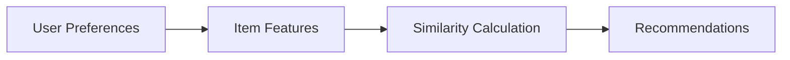
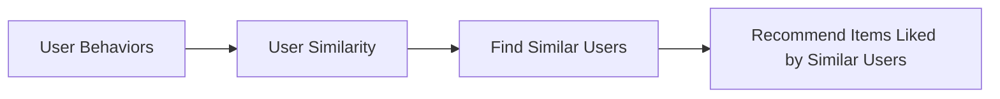

# Redis Recommendation Systems

## Introduction

Recommendation systems are powerful tools that help users discover relevant products, content, or services based on their preferences and behaviors. In today's data-driven applications, personalized recommendations have become essential for enhancing user experience and driving engagement.

Redis, with its high-performance in-memory data structure store, offers unique capabilities for building real-time recommendation systems. Unlike traditional database systems that might take seconds to process complex queries, Redis can deliver personalized recommendations in milliseconds, making it an excellent choice for applications where speed matters.

In this guide, we'll explore how to leverage Redis to build efficient recommendation systems, from basic concepts to practical implementations.

## Why Redis for Recommendation Systems?

Redis brings several advantages to recommendation system implementations:

1. **Speed**: In-memory operations provide sub-millisecond response times
2. **Data structures**: Specialized structures like Sorted Sets are perfect for recommendation algorithms
3. **Real-time processing**: Instantly incorporate user actions into recommendations
4. **Scalability**: Can handle millions of users and items
5. **Persistence options**: Balance between performance and data durability

## Core Concepts in Redis Recommendation Systems

Before diving into implementation, let's understand the basic recommendation approaches we can build with Redis:

### Content-Based Filtering

Content-based filtering recommends items similar to what a user has liked before. It focuses on item attributes and user preferences.



### Collaborative Filtering

Collaborative filtering recommends items based on the preferences of similar users.



### Hybrid Approaches

Hybrid systems combine multiple techniques to improve recommendation quality.

## Redis Data Structures for Recommendations

Redis provides several data structures that are particularly useful for building recommendation systems:

### Sorted Sets

Sorted Sets are perfect for ranking items and maintaining scores:

```redis
ZADD user:1001:likes 5.0 "product:1234"
ZADD user:1001:likes 4.2 "product:5678"
```

### Hashes

Hashes store object attributes efficiently:

```redis
HSET product:1234 name "Wireless Headphones" category "Electronics" price "89.99"
```

### Sets

Sets track relationships between entities:

```redis
SADD user:1001:viewed "product:1234" "product:5678" "product:9012"
```

## Building a Basic Content-Based Recommendation System

Let's implement a simple content-based recommendation system using Redis:

### 1. Storing Item Features

First, we'll store product features using hashes:

```js
// Store product features
await redis.hset('product:1001', {
  name: 'Wireless Headphones',
  category: 'Electronics',
  brand: 'AudioTech',
  price: 89.99,
  tags: 'wireless,bluetooth,audio,headphones'
});

await redis.hset('product:1002', {
  name: 'Bluetooth Speaker',
  category: 'Electronics',
  brand: 'SoundWave',
  price: 129.99,
  tags: 'wireless,bluetooth,audio,speaker'
});
```

### 2. Creating Feature Indices

We'll use sets to create inverted indices for features:

```js
// Create feature indices
await redis.sadd('tag:bluetooth', 'product:1001', 'product:1002');
await redis.sadd('tag:audio', 'product:1001', 'product:1002');
await redis.sadd('tag:wireless', 'product:1001', 'product:1002');
await redis.sadd('tag:headphones', 'product:1001');
await redis.sadd('tag:speaker', 'product:1002');

await redis.sadd('brand:AudioTech', 'product:1001');
await redis.sadd('brand:SoundWave', 'product:1002');
```

### 3. Tracking User Interactions

We'll track user preferences using sorted sets:

```js
// User liked product 1001 with a score of 5
await redis.zadd('user:3001:likes', 5, 'product:1001');
```

### 4. Generating Recommendations

Now, let's generate recommendations based on user preferences:

```js
async function generateRecommendations(userId) {
  // Get user likes
  const likedProducts = await redis.zrange('user:' + userId + ':likes', 0, -1);
  
  // Extract product features
  let candidateProducts = new Set();
  for (const product of likedProducts) {
    const tags = (await redis.hget(product, 'tags')).split(',');
    
    for (const tag of tags) {
      // Find products with similar tags
      const similarProducts = await redis.smembers('tag:' + tag);
      similarProducts.forEach(p => candidateProducts.add(p));
    }
  }
  
  // Remove products user already liked
  for (const product of likedProducts) {
    candidateProducts.delete(product);
  }
  
  // Score candidate products
  const recommendations = [];
  for (const product of candidateProducts) {
    const score = await calculateSimilarityScore(userId, product);
    recommendations.push({ product, score });
  }
  
  // Sort by score and return top recommendations
  return recommendations
    .sort((a, b) => b.score - a.score)
    .slice(0, 5);
}
```

This function:
1. Fetches products the user likes
2. Extracts features from those products
3. Finds similar products based on shared features
4. Calculates similarity scores
5. Returns top recommendations

## Building a Collaborative Filtering System

Let's implement a simple user-based collaborative filtering system:

### 1. Storing User Preferences

We'll use sorted sets to store user ratings:

```js
// User 1001 rates products
await redis.zadd('user:1001:ratings', 5, 'product:1001');
await redis.zadd('user:1001:ratings', 4, 'product:1002');
await redis.zadd('user:1001:ratings', 3, 'product:1003');

// User 1002 rates products
await redis.zadd('user:1002:ratings', 4, 'product:1001');
await redis.zadd('user:1002:ratings', 5, 'product:1003');
await redis.zadd('user:1002:ratings', 5, 'product:1004');
```

### 2. Finding Similar Users

We can use set operations to find users with similar tastes:

```js
async function findSimilarUsers(userId, minSimilarity = 0.3) {
  // Get all users
  const allUserKeys = await redis.keys('user:*:ratings');
  const userIds = allUserKeys
    .map(key => key.split(':')[1])
    .filter(id => id !== userId);
  
  const similarUsers = [];
  
  for (const otherId of userIds) {
    // Calculate Jaccard similarity between user ratings
    const userRatedProducts = await redis.zrange('user:' + userId + ':ratings', 0, -1);
    const otherRatedProducts = await redis.zrange('user:' + otherId + ':ratings', 0, -1);
    
    // Use Redis to calculate intersection and union
    const intersection = await redis.sinter(
      'user:' + userId + ':rated_products_set',
      'user:' + otherId + ':rated_products_set'
    );
    
    const union = await redis.sunion(
      'user:' + userId + ':rated_products_set',
      'user:' + otherId + ':rated_products_set'
    );
    
    const similarity = intersection.length / union.length;
    
    if (similarity >= minSimilarity) {
      similarUsers.push({ userId: otherId, similarity });
    }
  }
  
  return similarUsers.sort((a, b) => b.similarity - a.similarity);
}
```

### 3. Generating Recommendations

Now we can recommend products liked by similar users:

```js
async function recommendFromSimilarUsers(userId) {
  // Find similar users
  const similarUsers = await findSimilarUsers(userId);
  
  // Get products user has already rated
  const userRatedProducts = await redis.zrange('user:' + userId + ':ratings', 0, -1);
  const userRatedSet = new Set(userRatedProducts);
  
  // Collect candidate products from similar users
  const candidateProducts = new Map();
  
  for (const { userId: similarUserId, similarity } of similarUsers) {
    // Get highly rated products (score >= 4) from similar user
    const highlyRated = await redis.zrangebyscore(
      'user:' + similarUserId + ':ratings',
      4,
      '+inf'
    );
    
    // Add to candidate products with weighted score
    for (const product of highlyRated) {
      if (!userRatedSet.has(product)) {
        const rating = await redis.zscore('user:' + similarUserId + ':ratings', product);
        
        if (candidateProducts.has(product)) {
          candidateProducts.set(
            product,
            candidateProducts.get(product) + parseFloat(rating) * similarity
          );
        } else {
          candidateProducts.set(product, parseFloat(rating) * similarity);
        }
      }
    }
  }
  
  // Convert to array and sort by score
  const recommendations = Array.from(candidateProducts.entries())
    .map(([product, score]) => ({ product, score }))
    .sort((a, b) => b.score - a.score)
    .slice(0, 5);
  
  return recommendations;
}
```

## Implementing a Real-Time Recommendation System

Let's build a practical example: a real-time movie recommendation system.

### Setting Up the Data Model

```js
// Store movie details
async function addMovie(movieId, title, genres) {
  await redis.hset(`movie:${movieId}`, {
    title,
    genres: genres.join(',')
  });
  
  // Add to genre indices
  for (const genre of genres) {
    await redis.sadd(`genre:${genre}`, `movie:${movieId}`);
  }
}

// Example: Add movies
await addMovie(101, "The Matrix", ["Sci-Fi", "Action"]);
await addMovie(102, "Inception", ["Sci-Fi", "Thriller"]);
await addMovie(103, "The Shawshank Redemption", ["Drama"]);
```

### Tracking User Ratings

```js
async function rateMovie(userId, movieId, rating) {
  // Store the rating (1-5 scale)
  await redis.zadd(`user:${userId}:ratings`, rating, `movie:${movieId}`);
  
  // Update user's genre preferences
  const genres = (await redis.hget(`movie:${movieId}`, 'genres')).split(',');
  
  for (const genre of genres) {
    // Increment genre preference by rating
    await redis.zincrby(`user:${userId}:genre_preferences`, rating, genre);
  }
}

// Example: User rates movies
await rateMovie(1001, 101, 5);  // User 1001 loves The Matrix
await rateMovie(1001, 102, 4);  // User 1001 likes Inception
```

### Generating Real-Time Recommendations

```js
async function getRecommendations(userId, count = 5) {
  // Strategy 1: Content-based - recommend by favorite genres
  const favoriteGenres = await redis.zrevrange(
    `user:${userId}:genre_preferences`,
    0,
    2
  );
  
  // Get movies from favorite genres
  let genreBasedRecommendations = new Set();
  for (const genre of favoriteGenres) {
    const moviesInGenre = await redis.smembers(`genre:${genre}`);
    moviesInGenre.forEach(movie => genreBasedRecommendations.add(movie));
  }
  
  // Strategy 2: Collaborative filtering
  const similarUsers = await findSimilarUsers(userId);
  let userBasedRecommendations = new Set();
  
  for (const { userId: similarUserId } of similarUsers.slice(0, 3)) {
    const topRatedMovies = await redis.zrevrange(
      `user:${similarUserId}:ratings`,
      0,
      4
    );
    topRatedMovies.forEach(movie => userBasedRecommendations.add(movie));
  }
  
  // Combine recommendations
  const allRecommendations = new Set([
    ...genreBasedRecommendations,
    ...userBasedRecommendations
  ]);
  
  // Remove movies user has already rated
  const userRatedMovies = await redis.zrange(`user:${userId}:ratings`, 0, -1);
  userRatedMovies.forEach(movie => allRecommendations.delete(movie));
  
  // Get movie details and return
  const result = [];
  for (const movieKey of Array.from(allRecommendations).slice(0, count)) {
    const movieId = movieKey.split(':')[1];
    const details = await redis.hgetall(movieKey);
    result.push({
      id: movieId,
      title: details.title,
      genres: details.genres.split(',')
    });
  }
  
  return result;
}
```

## Optimizing Redis Recommendation Systems

For production-grade recommendation systems, consider these optimizations:

### 1. Using Redis Modules

Redis Modules like RedisGraph and RediSearch can significantly enhance recommendation capabilities:

```js
// Using RediSearch for advanced text search
await redis.call('FT.CREATE', 'movieIdx', 'ON', 'HASH', 'PREFIX', '1', 'movie:', 'SCHEMA', 
  'title', 'TEXT', 'WEIGHT', '5.0',
  'genres', 'TAG'
);

// Find movies by genre and title similarity
const results = await redis.call(
  'FT.SEARCH', 'movieIdx', '@genres:{Action} @title:(thriller adventure)'
);
```

### 2. Implementing Caching Strategies

Cache recommendations to avoid recalculating for frequent requests:

```js
async function getCachedRecommendations(userId) {
  // Check if we have cached recommendations
  const cachedRecommendations = await redis.get(`user:${userId}:recommendations_cache`);
  
  if (cachedRecommendations) {
    return JSON.parse(cachedRecommendations);
  }
  
  // Calculate new recommendations
  const recommendations = await getRecommendations(userId);
  
  // Cache the results (expire after 1 hour)
  await redis.set(
    `user:${userId}:recommendations_cache`,
    JSON.stringify(recommendations),
    'EX',
    3600
  );
  
  return recommendations;
}
```

### 3. Batch Processing with Pipelines

Use Redis pipelines for batch operations:

```js
async function batchUpdateUserPreferences(userId, interactions) {
  const pipeline = redis.pipeline();
  
  for (const { itemId, score } of interactions) {
    pipeline.zadd(`user:${userId}:interactions`, score, `item:${itemId}`);
    // Add other related operations
  }
  
  return pipeline.exec();
}
```

## Real-World Application: E-commerce Recommendation Engine

Let's build a complete e-commerce recommendation system with different strategies:

```js
// Initialize our e-commerce recommendation system
class RedisRecommendationEngine {
  constructor(redisClient) {
    this.redis = redisClient;
  }
  
  // Track product view
  async trackProductView(userId, productId) {
    // Increment view count
    await this.redis.zincrby(`user:${userId}:views`, 1, `product:${productId}`);
    
    // Add to recently viewed
    await this.redis.zadd(
      `user:${userId}:recently_viewed`,
      Date.now(),
      `product:${productId}`
    );
    
    // Trim recently viewed to 50 items
    await this.redis.zremrangebyrank(`user:${userId}:recently_viewed`, 0, -51);
  }
  
  // Track product purchase
  async trackPurchase(userId, productId) {
    // Add to purchases with timestamp
    await this.redis.zadd(
      `user:${userId}:purchases`,
      Date.now(),
      `product:${productId}`
    );
    
    // Add to popular items global counter
    await this.redis.zincrby('global:popular_products', 1, `product:${productId}`);
  }
  
  // Get recently viewed products
  async getRecentlyViewed(userId, count = 5) {
    const productIds = await this.redis.zrevrange(
      `user:${userId}:recently_viewed`,
      0,
      count - 1
    );
    
    return this.getProductDetails(productIds);
  }
  
  // Get popular products
  async getPopularProducts(count = 5) {
    const productIds = await this.redis.zrevrange(
      'global:popular_products',
      0,
      count - 1
    );
    
    return this.getProductDetails(productIds);
  }
  
  // Get personalized recommendations
  async getPersonalizedRecommendations(userId, count = 5) {
    // Combine different recommendation strategies
    const strategies = [
      { name: 'viewed_also_viewed', weight: 3 },
      { name: 'purchased_also_purchased', weight: 4 },
      { name: 'similar_items', weight: 2 }
    ];
    
    const candidateProducts = new Map();
    
    for (const { name, weight } of strategies) {
      const recommendations = await this.getRecommendationsByStrategy(
        userId,
        name,
        count * 2
      );
      
      for (const { productId, score } of recommendations) {
        const productKey = `product:${productId}`;
        const currentScore = candidateProducts.get(productKey) || 0;
        candidateProducts.set(productKey, currentScore + score * weight);
      }
    }
    
    // Remove products user has already purchased
    const purchasedProducts = await this.redis.zrange(
      `user:${userId}:purchases`,
      0,
      -1
    );
    
    for (const product of purchasedProducts) {
      candidateProducts.delete(product);
    }
    
    // Sort and return top recommendations
    const topRecommendations = Array.from(candidateProducts.entries())
      .sort((a, b) => b[1] - a[1])
      .slice(0, count)
      .map(([productKey]) => productKey.split(':')[1]);
    
    return this.getProductDetails(topRecommendations);
  }
  
  // Helper method to get product details
  async getProductDetails(productIds) {
    const result = [];
    
    for (const productId of productIds) {
      const id = typeof productId === 'string' && productId.includes(':') 
        ? productId.split(':')[1] 
        : productId;
      
      const details = await this.redis.hgetall(`product:${id}`);
      if (Object.keys(details).length > 0) {
        result.push({
          id,
          ...details,
          price: parseFloat(details.price)
        });
      }
    }
    
    return result;
  }
  
  // Get recommendations by specific strategy
  async getRecommendationsByStrategy(userId, strategy, count) {
    switch (strategy) {
      case 'viewed_also_viewed':
        return this.getViewedAlsoViewedRecommendations(userId, count);
      case 'purchased_also_purchased':
        return this.getPurchasedAlsoPurchasedRecommendations(userId, count);
      case 'similar_items':
        return this.getSimilarItemsRecommendations(userId, count);
      default:
        return [];
    }
  }
  
  // Implementation of a "Viewed Also Viewed" strategy
  async getViewedAlsoViewedRecommendations(userId, count) {
    // Get user's most viewed products
    const viewedProducts = await this.redis.zrevrange(
      `user:${userId}:views`,
      0,
      4
    );
    
    const recommendations = [];
    
    for (const productKey of viewedProducts) {
      const productId = productKey.split(':')[1];
      
      // Get other users who viewed this product
      const viewers = await this.redis.smembers(`product:${productId}:viewers`);
      
      for (const viewerId of viewers) {
        if (viewerId === userId) continue;
        
        // Get products viewed by this viewer
        const viewerProducts = await this.redis.zrevrange(
          `user:${viewerId}:views`,
          0,
          9
        );
        
        for (const viewerProductKey of viewerProducts) {
          const viewerProductId = viewerProductKey.split(':')[1];
          
          if (!viewedProducts.includes(`product:${viewerProductId}`)) {
            recommendations.push({
              productId: viewerProductId,
              score: 1
            });
          }
        }
      }
    }
    
    return recommendations
      .slice(0, count);
  }
  
  // Implementation details for other strategies would follow similar patterns
  // ...
}
```

Usage example:

```js
// Initialize the recommendation engine
const recommendationEngine = new RedisRecommendationEngine(redisClient);

// Track user interactions
await recommendationEngine.trackProductView(user.id, product.id);
await recommendationEngine.trackPurchase(user.id, product.id);

// Get recommendations
const personalizedRecommendations = await recommendationEngine.getPersonalizedRecommendations(user.id);
const popularProducts = await recommendationEngine.getPopularProducts();
const recentlyViewed = await recommendationEngine.getRecentlyViewed(user.id);

// Display recommendations to the user
return {
  personalizedForYou: personalizedRecommendations,
  trending: popularProducts,
  recentlyViewed: recentlyViewed
};
```

## Performance Considerations

To ensure your Redis recommendation system performs well at scale:

1. **Use Redis Pipelines**: Batch multiple operations to reduce network overhead
2. **Set Appropriate TTLs**: Expire old data to manage memory usage
3. **Use Redis Cluster**: Distribute data across multiple Redis instances
4. **Monitor Memory Usage**: Redis is memory-bound, so track usage carefully
5. **Implement Background Processing**: Calculate recommendations asynchronously

## Summary

Redis provides a powerful foundation for building real-time recommendation systems thanks to its speed, versatile data structures, and scalability. In this guide, we've covered:

- Why Redis is ideal for recommendation systems
- Core recommendation strategies (content-based, collaborative filtering)
- Essential Redis data structures for recommendations
- Implementing basic recommendation algorithms
- Building a complete e-commerce recommendation engine
- Optimizing performance for production use

By leveraging Redis effectively, you can create recommendation systems that provide personalized experiences for your users with millisecond response times.

## Additional Resources

To further enhance your Redis recommendation system skills:

1. **RedisLabs Documentation**: Explore specialized Redis modules like RedisGraph and RediSearch
2. **Redis University**: Free online courses on Redis data structures and patterns
3. **GitHub Redis Stream**: Examples of stream processing for real-time analytics

## Exercises

1. Implement a simple content-based recommendation system for a movie database
2. Build a "customers who viewed this also viewed" feature
3. Create a real-time trending items functionality using Redis sorted sets
4. Implement A/B testing for different recommendation algorithms
5. Develop a hybrid recommendation system combining multiple strategies