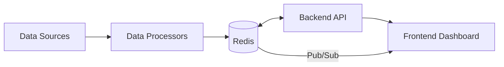

# Redis Realtime Dashboards

## Introduction

Real-time dashboards have become essential tools for modern applications, providing immediate insights into system performance, user activity, and business metrics. Unlike traditional dashboards that display static or periodically refreshed data, real-time dashboards update continuously as new information becomes available, enabling faster decision-making and response to emerging trends or issues.

Redis, an in-memory data structure store, is particularly well-suited for powering real-time dashboards due to its exceptional speed, versatile data structures, and built-in publish/subscribe capabilities. In this guide, we'll explore how to leverage Redis to create responsive, real-time dashboards that can handle high-velocity data with minimal latency.

## Why Use Redis for Real-time Dashboards?

Redis offers several advantages that make it an excellent choice for real-time dashboard applications:

1. **In-memory processing**: Redis stores data in memory, allowing for sub-millisecond data operations that are crucial for real-time applications.

2. **Versatile data structures**: Redis provides specialized data structures (Sorted Sets, Hashes, Lists, etc.) that simplify tracking metrics like leaderboards, counters, and time-series data.

3. **Pub/Sub mechanism**: The built-in publish/subscribe functionality enables instant propagation of updates to all connected clients.

4. **Redis Streams**: A dedicated data structure for handling time-ordered data, perfect for event sourcing and activity feeds.

5. **Low latency**: With proper implementation, Redis can handle millions of operations per second with consistent low latency.

Let's dive into the practical aspects of building real-time dashboards with Redis.

## Architecture Overview

A typical Redis-based real-time dashboard consists of these components:



1. **Data Sources**: Systems generating events (application logs, IoT devices, user interactions)
2. **Data Processors**: Services that transform raw data into metrics and store them in Redis
3. **Redis**: The central data store and message broker
4. **Backend API**: REST/GraphQL endpoints for initial data loading and configuration
5. **Frontend Dashboard**: The UI displaying visualizations, updated in real-time

## Basic Implementation: Counter Dashboard

Let's start with a simple example: a dashboard showing real-time counters for website activities such as page views, sign-ups, and purchases.

### Setting Up Redis

First, ensure Redis is installed and running. For development purposes, you can use Docker:

```bash
docker run --name redis-dashboard -p 6379:6379 -d redis
```

### Backend Implementation (Node.js)

Here's a basic Express.js server that tracks events and exposes both REST endpoints and WebSocket connections:

```javascript
const express = require('express');
const Redis = require('ioredis');
const http = require('http');
const WebSocket = require('ws');

const app = express();
const server = http.createServer(app);
const wss = new WebSocket.Server({ server });

// Redis client setup
const redis = new Redis();
const redisSub = new Redis();

// Subscribe to counter updates
redisSub.subscribe('counter-updates');
redisSub.on('message', (channel, message) => {
  // Broadcast updates to all connected WebSocket clients
  wss.clients.forEach(client => {
    if (client.readyState === WebSocket.OPEN) {
      client.send(message);
    }
  });
});

// API endpoints for recording events
app.post('/events/:type', express.json(), async (req, res) => {
  const { type } = req.params;
  
  try {
    // Increment the counter for this event type
    await redis.incr(`counter:${type}`);
    
    // Get the new count
    const count = await redis.get(`counter:${type}`);
    
    // Publish the update
    await redis.publish('counter-updates', JSON.stringify({
      type,
      count: parseInt(count, 10),
      timestamp: Date.now()
    }));
    
    res.status(200).json({ success: true });
  } catch (error) {
    console.error('Error recording event:', error);
    res.status(500).json({ error: 'Failed to record event' });
  }
});

// API endpoint to get current counts
app.get('/counters', async (req, res) => {
  try {
    const counters = {};
    const types = ['pageview', 'signup', 'purchase'];
    
    for (const type of types) {
      const count = await redis.get(`counter:${type}`) || '0';
      counters[type] = parseInt(count, 10);
    }
    
    res.json(counters);
  } catch (error) {
    console.error('Error fetching counters:', error);
    res.status(500).json({ error: 'Failed to fetch counters' });
  }
});

// Start the server
const PORT = process.env.PORT || 3000;
server.listen(PORT, () => {
  console.log(`Server running on port ${PORT}`);
});
```

### Frontend Implementation

Here's a simple HTML/JavaScript implementation for the dashboard:

```html
<!DOCTYPE html>
<html lang="en">
<head>
  <meta charset="UTF-8">
  <meta name="viewport" content="width=device-width, initial-scale=1.0">
  <title>Real-time Dashboard</title>
  <script src="https://cdn.jsdelivr.net/npm/chart.js"></script>
  <style>
    body { font-family: Arial, sans-serif; margin: 20px; }
    .dashboard { display: flex; flex-wrap: wrap; }
    .counter-card {
      box-shadow: 0 4px 8px rgba(0,0,0,0.1);
      margin: 10px;
      padding: 20px;
      border-radius: 4px;
      width: 200px;
      text-align: center;
    }
    .counter-value {
      font-size: 32px;
      font-weight: bold;
      margin: 10px 0;
    }
    .chart-container {
      width: 100%;
      max-width: 800px;
      margin: 20px auto;
    }
  </style>
</head>
<body>
  <h1>Real-time Activity Dashboard</h1>
  
  <div class="dashboard">
    <div class="counter-card">
      <h2>Page Views</h2>
      <div id="pageview-counter" class="counter-value">0</div>
    </div>
    <div class="counter-card">
      <h2>Sign Ups</h2>
      <div id="signup-counter" class="counter-value">0</div>
    </div>
    <div class="counter-card">
      <h2>Purchases</h2>
      <div id="purchase-counter" class="counter-value">0</div>
    </div>
  </div>
  
  <div class="chart-container">
    <canvas id="activity-chart"></canvas>
  </div>
  
  <script>
    // Initialize counters
    let counters = {
      pageview: 0,
      signup: 0,
      purchase: 0
    };
    
    // Initialize chart data
    const ctx = document.getElementById('activity-chart').getContext('2d');
    const chart = new Chart(ctx, {
      type: 'line',
      data: {
        labels: [],
        datasets: [
          {
            label: 'Page Views',
            borderColor: 'rgba(75, 192, 192, 1)',
            data: []
          },
          {
            label: 'Sign Ups',
            borderColor: 'rgba(153, 102, 255, 1)',
            data: []
          },
          {
            label: 'Purchases',
            borderColor: 'rgba(255, 159, 64, 1)',
            data: []
          }
        ]
      },
      options: {
        scales: {
          y: {
            beginAtZero: true
          }
        },
        animation: {
          duration: 0 // Disable animation for real-time updates
        }
      }
    });
    
    // Function to update counter UI
    function updateCounters() {
      document.getElementById('pageview-counter').textContent = counters.pageview;
      document.getElementById('signup-counter').textContent = counters.signup;
      document.getElementById('purchase-counter').textContent = counters.purchase;
    }
    
    // Function to add data to chart
    function addData(timestamp, type, count) {
      const time = new Date(timestamp).toLocaleTimeString();
      
      // Only add new timestamp if it's different from the last one
      if (chart.data.labels.length === 0 || chart.data.labels[chart.data.labels.length - 1] !== time) {
        chart.data.labels.push(time);
        
        // Add current counts for all types
        chart.data.datasets[0].data.push(counters.pageview);
        chart.data.datasets[1].data.push(counters.signup);
        chart.data.datasets[2].data.push(counters.purchase);
        
        // Keep only last 10 data points
        if (chart.data.labels.length > 10) {
          chart.data.labels.shift();
          chart.data.datasets.forEach(dataset => dataset.data.shift());
        }
        
        chart.update();
      }
    }
    
    // Fetch initial counters
    fetch('/counters')
      .then(response => response.json())
      .then(data => {
        counters = data;
        updateCounters();
      })
      .catch(error => console.error('Error fetching counters:', error));
    
    // Connect to WebSocket for real-time updates
    const ws = new WebSocket(`ws://${window.location.host}`);
    
    ws.onmessage = function(event) {
      const update = JSON.parse(event.data);
      counters[update.type] = update.count;
      updateCounters();
      addData(update.timestamp, update.type, update.count);
    };
    
    // Simulate events for testing (remove in production)
    function simulateEvent(type) {
      fetch(`/events/${type}`, {
        method: 'POST',
        headers: {
          'Content-Type': 'application/json'
        },
        body: JSON.stringify({})
      });
    }
    
    // Simulate random events every few seconds
    setInterval(() => {
      const types = ['pageview', 'signup', 'purchase'];
      const randomType = types[Math.floor(Math.random() * types.length)];
      simulateEvent(randomType);
    }, 2000);
  </script>
</body>
</html>
```

In this example:
1. We use Redis to store simple counters for each event type
2. The backend increments these counters and publishes updates via Redis Pub/Sub
3. WebSockets deliver these updates to the browser in real-time
4. The frontend displays both current counter values and a time-series chart

## Advanced Implementation: Using Redis Streams

For more complex dashboards that need to track historical data or handle high-throughput event streams, Redis Streams provide an ideal solution. Streams are append-only collections that work like a log, making them perfect for time-series data.

Let's enhance our example to track detailed user activity data using Redis Streams:

```javascript
// Stream event recording
app.post('/activity', express.json(), async (req, res) => {
  const { userId, action, metadata } = req.body;
  
  try {
    // Add event to activity stream
    const eventId = await redis.xadd(
      'activity:stream',
      '*', // Auto-generate ID based on timestamp
      'userId', userId,
      'action', action,
      'timestamp', Date.now(),
      'metadata', JSON.stringify(metadata || {})
    );
    
    // Increment counter for this action type
    await redis.hincrby('activity:counts', action, 1);
    
    // Get updated counts
    const counts = await redis.hgetall('activity:counts');
    
    // Publish update
    await redis.publish('activity-updates', JSON.stringify({
      eventId,
      counts,
      latestAction: {
        userId,
        action,
        timestamp: Date.now(),
        metadata
      }
    }));
    
    res.status(200).json({ success: true, eventId });
  } catch (error) {
    console.error('Error recording activity:', error);
    res.status(500).json({ error: 'Failed to record activity' });
  }
});

// Get historical activity (last 100 events)
app.get('/activity/history', async (req, res) => {
  try {
    const result = await redis.xrevrange('activity:stream', '+', '-', 'COUNT', 100);
    
    // Transform Redis stream format to a more friendly JSON structure
    const activities = result.map(item => {
      const [id, fields] = item;
      const data = {};
      
      for (let i = 0; i < fields.length; i += 2) {
        const key = fields[i];
        const value = fields[i + 1];
        data[key] = key === 'metadata' ? JSON.parse(value) : value;
      }
      
      return {
        id,
        ...data
      };
    });
    
    res.json(activities);
  } catch (error) {
    console.error('Error fetching activity history:', error);
    res.status(500).json({ error: 'Failed to fetch activity history' });
  }
});
```

### Using Redis Time Series

For numerical metrics that change over time, the RedisTimeSeries module provides specialized functionality for storing and querying time-series data efficiently.

First, install the RedisTimeSeries module. If using Docker:

```bash
docker run -p 6379:6379 redislabs/redistimeseries
```

Then, you can track metrics like this:

```javascript
// Add timestamp and value to a time series
async function recordMetric(metric, value) {
  try {
    // Create time series if it doesn't exist (will do nothing if it exists)
    await redis.call('TS.CREATE', `metrics:${metric}`, 'RETENTION', 86400000, 'LABELS', 'type', metric);
    
    // Add the data point
    await redis.call('TS.ADD', `metrics:${metric}`, '*', value);
    
    return true;
  } catch (error) {
    console.error(`Error recording metric ${metric}:`, error);
    return false;
  }
}

// Get time series data for a specific metric with aggregation
async function getMetricHistory(metric, fromTime, toTime, aggregation = 'avg', bucketSizeMs = 60000) {
  try {
    const result = await redis.call(
      'TS.RANGE', 
      `metrics:${metric}`, 
      fromTime || '-', 
      toTime || '+', 
      'AGGREGATION', 
      aggregation, 
      bucketSizeMs
    );
    
    return result.map(([timestamp, value]) => ({ timestamp, value }));
  } catch (error) {
    console.error(`Error fetching metric history for ${metric}:`, error);
    return [];
  }
}

// API endpoint to record a metric
app.post('/metrics/:name', express.json(), async (req, res) => {
  const { name } = req.params;
  const { value } = req.body;
  
  if (value === undefined || isNaN(parseFloat(value))) {
    return res.status(400).json({ error: 'Invalid metric value' });
  }
  
  const success = await recordMetric(name, parseFloat(value));
  
  if (success) {
    res.status(200).json({ success: true });
  } else {
    res.status(500).json({ error: 'Failed to record metric' });
  }
});

// API endpoint to get metric history
app.get('/metrics/:name/history', async (req, res) => {
  const { name } = req.params;
  const { from, to, aggregation, bucketSize } = req.query;
  
  const data = await getMetricHistory(
    name,
    from ? parseInt(from, 10) : undefined,
    to ? parseInt(to, 10) : undefined,
    aggregation || 'avg',
    bucketSize ? parseInt(bucketSize, 10) : 60000
  );
  
  res.json(data);
});
```

## Real-world Application: System Monitoring Dashboard

Let's apply what we've learned to build a system monitoring dashboard that tracks CPU usage, memory usage, request rates, and error rates across multiple servers.

Here's how we can structure the Redis data:

1. **Time-series data for metrics**: Each server reports its metrics, which are stored in Redis TimeSeries
2. **Current status information**: Stored in Redis Hashes for quick access
3. **Alert history**: Recent alerts stored in Redis Lists
4. **Configuration**: Dashboard settings stored in Redis Hashes

The backend would have these components:

1. **Data collector**: Services running on each server sending metrics to Redis
2. **Alert processor**: Service checking thresholds and generating alerts
3. **API server**: REST endpoints for dashboard configuration and data access
4. **WebSocket server**: Real-time updates to connected dashboards

### Sample Data Collection Script

This script could run on each server to collect and send metrics:

```python
import time
import psutil
import redis
import socket
import json

# Connect to Redis
r = redis.Redis(host='redis-server', port=6379, decode_responses=True)

# Server identification
SERVER_ID = socket.gethostname()

def collect_metrics():
    # CPU usage (percent)
    cpu_percent = psutil.cpu_percent(interval=1)
    
    # Memory usage (percent)
    memory = psutil.virtual_memory()
    memory_percent = memory.percent
    
    # Disk usage (percent)
    disk = psutil.disk_usage('/')
    disk_percent = disk.percent
    
    # Network stats (bytes sent/received since last check)
    net = psutil.net_io_counters()
    
    return {
        'cpu_percent': cpu_percent,
        'memory_percent': memory_percent,
        'disk_percent': disk_percent,
        'net_sent': net.bytes_sent,
        'net_recv': net.bytes_recv
    }

def send_metrics_to_redis(metrics):
    timestamp = int(time.time() * 1000)  # Current time in milliseconds
    
    pipeline = r.pipeline()
    
    # Store current status in a hash
    pipeline.hset(f'server:status:{SERVER_ID}', mapping={
        'last_update': timestamp,
        'cpu_percent': metrics['cpu_percent'],
        'memory_percent': metrics['memory_percent'],
        'disk_percent': metrics['disk_percent']
    })
    
    # Add metrics to time series (assuming RedisTimeSeries module is installed)
    for metric_name, value in metrics.items():
        # Create the time series if it doesn't exist
        try:
            r.execute_command(
                'TS.CREATE', 
                f'server:{SERVER_ID}:{metric_name}', 
                'RETENTION', 
                86400000,  # 24 hours in milliseconds
                'LABELS', 
                'server', SERVER_ID, 
                'metric', metric_name
            )
        except redis.exceptions.ResponseError:
            # Time series already exists, ignore the error
            pass
        
        # Add the data point
        pipeline.execute_command(
            'TS.ADD', 
            f'server:{SERVER_ID}:{metric_name}', 
            '*',  # Auto-timestamp
            value
        )
    
    # Execute all commands
    pipeline.execute()
    
    # Publish update notification
    r.publish('server-metrics', json.dumps({
        'server_id': SERVER_ID,
        'timestamp': timestamp,
        'metrics': metrics
    }))

def main():
    print(f"Starting metrics collection for server {SERVER_ID}")
    
    while True:
        try:
            metrics = collect_metrics()
            send_metrics_to_redis(metrics)
        except Exception as e:
            print(f"Error: {e}")
        
        # Wait before the next collection
        time.sleep(5)

if __name__ == "__main__":
    main()
```

## Performance Considerations

When building real-time dashboards with Redis, consider these performance tips:

1. **Use pipelining**: Batch multiple Redis commands together to reduce network roundtrips.

2. **Consider expiration policies**: Set TTL (Time To Live) for data that doesn't need to be stored permanently.

3. **Use appropriate data structures**:
   - Counters: Simple Redis strings with INCR/DECR
   - Most recent N events: Redis Lists with LPUSH + LTRIM
   - Time-ordered metrics: Redis Streams or RedisTimeSeries
   - Leaderboards and rankings: Redis Sorted Sets

4. **Optimize data transfer**: Send only the data that has changed rather than full dataset refreshes.

5. **Client-side caching**: Implement caching on the client side to reduce unnecessary data fetching.

## Examples of Redis Dashboard Use Cases

### 1. E-commerce Analytics Dashboard

Track in real-time:
- Current active users and their session information
- Product page views and conversions
- Shopping cart additions and checkouts
- Revenue by product category
- Order fulfillment status

### 2. IoT Monitoring Dashboard

Monitor devices with:
- Device status (online/offline)
- Sensor readings over time
- Geospatial visualization of device locations
- Alert history and status
- Battery levels and maintenance requirements

### 3. Social Media Activity Dashboard

Visualize platform engagement:
- Content uploads per minute
- Comment and reaction rates
- Trending hashtags or topics
- User registrations and active users
- Content moderation queue status

## Summary

Redis provides a powerful foundation for building real-time dashboards due to its speed, flexibility, and built-in features like Pub/Sub and Streams. By leveraging these capabilities, you can create responsive dashboards that display live data with minimal latency.

Key concepts covered in this guide:
- Using Redis Pub/Sub for real-time updates
- Storing and retrieving time-series data with Redis Streams and RedisTimeSeries
- Processing and aggregating metrics
- Implementing WebSockets for browser updates
- Structuring Redis data for efficient dashboard operations

## Additional Resources and Exercises

### Resources
- [Redis Documentation](https://redis.io/documentation)
- [RedisTimeSeries Module](https://redis.io/docs/stack/timeseries/)
- [Redis Streams Introduction](https://redis.io/docs/data-types/streams/)

### Exercises

1. **Basic Counter Dashboard**:
   Build a dashboard that counts page views by URL path, showing the top 10 most visited pages in real-time.

2. **User Activity Tracker**:
   Create a dashboard that shows user logins, actions, and sessions over time with filtering capabilities.

3. **Multi-server Monitoring**:
   Extend the system monitoring example to track metrics across multiple servers, with alerting for threshold violations.

4. **Caching Layer**:
   Add a client-side caching mechanism to your dashboard to reduce the load on Redis and improve performance.

5. **Advanced Visualization**:
   Implement more sophisticated visualizations like heatmaps, geographic maps, or network graphs using Redis data.