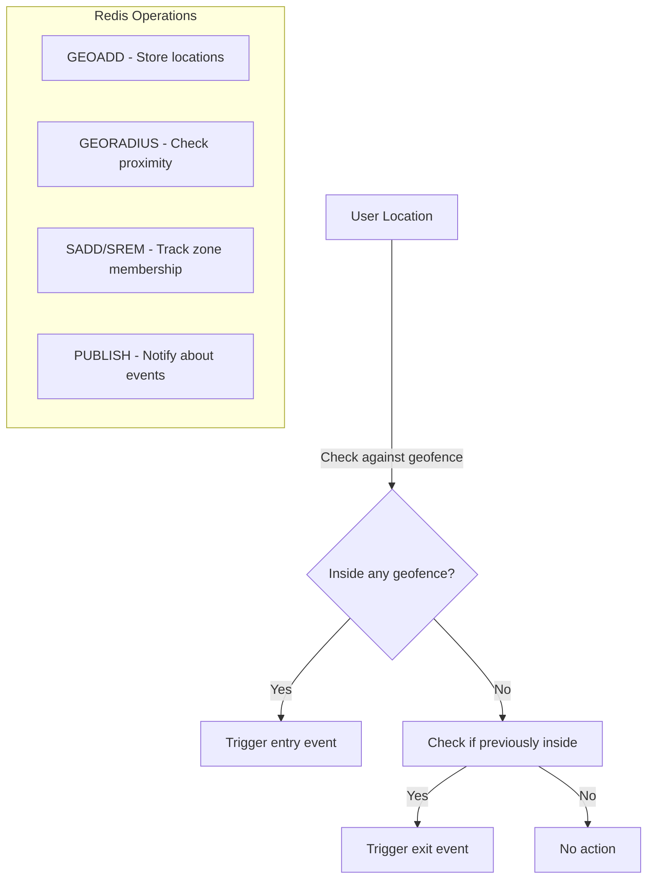

# Redis Geofencing

## Introduction

Geofencing is a location-based service that defines virtual boundaries around physical locations. When a device enters or exits these boundaries, specific actions can be triggered. In this tutorial, we'll explore how Redis—a powerful in-memory data structure store—can be leveraged to implement efficient geofencing solutions.

Redis introduced geospatial data structures in version 3.2, making it an excellent choice for location-based applications that require real-time processing. The combination of Redis's speed and its specialized geo commands makes it particularly well-suited for geofencing implementations.

## Prerequisites

Before diving into Redis geofencing, you should have:

- Basic knowledge of Redis
- Redis server installed (version 3.2 or higher)
- A Redis client library in your preferred programming language
- Understanding of basic geospatial concepts

## Understanding Geospatial Data in Redis

Redis stores geospatial data using a data structure called a **sorted set**. Each member in this set represents a location with associated coordinates (longitude and latitude). Redis internally converts these coordinates into a geohash, which enables efficient proximity queries.

### Key Geo Commands in Redis

Redis provides several commands for working with geospatial data:

- `GEOADD`: Add locations with their coordinates
- `GEODIST`: Calculate the distance between two locations
- `GEOHASH`: Get the geohash string representation
- `GEOPOS`: Get the coordinates of locations
- `GEORADIUS`: Find locations within a specified radius
- `GEORADIUSBYMEMBER`: Similar to GEORADIUS but uses a member as the center point

## Basic Geofencing Implementation

Let's start with a simple example of adding locations to Redis and querying them:

```bash
# Add some locations to a geo set named 'locations'
GEOADD locations -73.9857 40.7484 "Empire State Building" -122.4194 37.7749 "San Francisco" -0.1278 51.5074 "London"

# Find locations within 2000 km of London
GEORADIUS locations -0.1278 51.5074 2000 km
```

Output:
```
1) "London"
2) "Empire State Building"
```

This shows that London and the Empire State Building are within 2000 km of the specified coordinates (London's location).

## Creating a Geofence with Redis

A geofence is essentially a predefined area. With Redis, we can implement geofencing by:

1. Storing location points (e.g., stores, landmarks, etc.) in a geo set
2. Using the `GEORADIUS` command to check if a user's location falls within the fence

Let's create a practical example of a notification system that alerts users when they're near a store:

```javascript
// Example using Node.js with the redis client

const redis = require('redis');
const client = redis.createClient();

// Add store locations
async function addStores() {
  await client.connect();
  
  // Add store locations
  await client.geoAdd('stores', [
    { longitude: -73.9857, latitude: 40.7484, member: 'Store A' },
    { longitude: -73.9843, latitude: 40.7485, member: 'Store B' },
    { longitude: -73.9832, latitude: 40.7458, member: 'Store C' }
  ]);
  
  console.log('Stores added successfully');
}

// Check if user is near any store
async function checkNearbyStores(userLong, userLat, radiusKm) {
  await client.connect();
  
  const nearbyStores = await client.geoRadius(
    'stores', 
    userLong, 
    userLat, 
    radiusKm, 
    'km',
    { WITHDIST: true }
  );
  
  if (nearbyStores.length > 0) {
    console.log('Nearby stores found:');
    nearbyStores.forEach(store => {
      console.log(`${store.member} is ${store.distance.toFixed(2)} km away`);
    });
  } else {
    console.log('No stores nearby');
  }
}

// Example usage
addStores()
  .then(() => checkNearbyStores(-73.9850, 40.7480, 0.2))
  .catch(err => console.error(err));
```

Output:
```
Stores added successfully
Nearby stores found:
Store A is 0.06 km away
Store B is 0.12 km away
```

## Building a Real-time Location Tracking System

Now let's build a more comprehensive example: a real-time taxi tracking system with geofence alerts.

```python
import redis
import time
import json

# Connect to Redis
r = redis.Redis(host='localhost', port=6379, db=0)

# Define some zones (geofences)
zones = {
    "airport": {"long": -73.7781, "lat": 40.6413, "radius": 2},
    "downtown": {"long": -73.9857, "lat": 40.7484, "radius": 3},
    "suburb": {"long": -74.0431, "lat": 40.6892, "radius": 5}
}

# Add zones to Redis
for zone_name, zone_data in zones.items():
    r.geoadd('zones', zone_data["long"], zone_data["lat"], zone_name)

# Function to update taxi location
def update_taxi_location(taxi_id, longitude, latitude):
    # Store current location
    r.geoadd('taxis', longitude, latitude, taxi_id)
    
    # Check if taxi is in any zone
    for zone_name, zone_data in zones.items():
        results = r.georadius('zones', longitude, latitude, 
                             zone_data["radius"], 'km')
        
        # If taxi is in this zone
        if zone_name.encode() in results:
            # Check if we've already recorded this taxi in this zone
            already_in_zone = r.sismember(f'zone:{zone_name}:taxis', taxi_id)
            
            if not already_in_zone:
                print(f"ALERT: Taxi {taxi_id} has entered {zone_name} zone!")
                r.sadd(f'zone:{zone_name}:taxis', taxi_id)
                
                # You could trigger a notification here
                event = {
                    "type": "zone_entry",
                    "taxi_id": taxi_id,
                    "zone": zone_name,
                    "timestamp": time.time()
                }
                r.publish('geofence_events', json.dumps(event))
        else:
            # Check if taxi was previously in this zone
            was_in_zone = r.sismember(f'zone:{zone_name}:taxis', taxi_id)
            
            if was_in_zone:
                print(f"ALERT: Taxi {taxi_id} has left {zone_name} zone!")
                r.srem(f'zone:{zone_name}:taxis', taxi_id)
                
                # You could trigger a notification here
                event = {
                    "type": "zone_exit",
                    "taxi_id": taxi_id,
                    "zone": zone_name,
                    "timestamp": time.time()
                }
                r.publish('geofence_events', json.dumps(event))

# Simulate a taxi moving around
def simulate_taxi_journey():
    # Starting near the airport
    positions = [
        {"long": -73.7781, "lat": 40.6413},  # At airport
        {"long": -73.8091, "lat": 40.6612},  # Moving away
        {"long": -73.8691, "lat": 40.6912},  # Further away
        {"long": -73.9359, "lat": 40.7273},  # Approaching downtown
        {"long": -73.9857, "lat": 40.7484},  # Downtown
        {"long": -74.0431, "lat": 40.6892}   # Suburb
    ]
    
    taxi_id = "taxi:1234"
    
    for i, pos in enumerate(positions):
        print(f"
Update {i+1}: Moving taxi to {pos['long']}, {pos['lat']}")
        update_taxi_location(taxi_id, pos["long"], pos["lat"])
        time.sleep(1)  # Simulate time passing between updates

# Run the simulation
simulate_taxi_journey()
```

Output:
```
Update 1: Moving taxi to -73.7781, 40.6413
ALERT: Taxi taxi:1234 has entered airport zone!

Update 2: Moving taxi to -73.8091, 40.6612
ALERT: Taxi taxi:1234 has left airport zone!

Update 3: Moving taxi to -73.8691, 40.6912

Update 4: Moving taxi to -73.9359, 40.7273

Update 5: Moving taxi to -73.9857, 40.7484
ALERT: Taxi taxi:1234 has entered downtown zone!

Update 6: Moving taxi to -74.0431, 40.6892
ALERT: Taxi taxi:1234 has left downtown zone!
ALERT: Taxi taxi:1234 has entered suburb zone!
```

## Visualizing Geofences with Mermaid

Here's a simple visualization of how geofencing works:



## Performance Considerations

When implementing geofencing with Redis, consider the following:

1. **Memory Usage**: Each stored location uses approximately 130 bytes.
2. **Query Performance**: Radius queries are generally efficient with O(log(N) + M) time complexity, where N is the number of elements in the geo set and M is the number of returned elements.
3. **Precision**: Redis geospatial indexing has some limitations in precision. For extremely precise applications, you might need additional verification.

## Scaling Geofencing Applications

For large-scale applications with millions of locations:

1. **Sharding**: Distribute geospatial data across multiple Redis instances based on geographic regions.
2. **Redis Cluster**: Use Redis Cluster to automatically distribute data across multiple nodes.
3. **Caching**: Cache frequent geofence checks to reduce load on Redis.

## Example: Customer Geofencing for Retail

Here's a practical scenario: sending offers to customers when they enter a shopping mall.

```javascript
// Example using Node.js

const redis = require('redis');
const client = redis.createClient();

async function setupMallGeofence() {
  await client.connect();
  
  // Add mall location
  await client.geoAdd('malls', [
    { longitude: -73.9857, latitude: 40.7484, member: 'Central Mall' }
  ]);
  
  // Add stores within the mall
  await client.geoAdd('stores:Central Mall', [
    { longitude: -73.9857, latitude: 40.7484, member: 'Food Court' },
    { longitude: -73.9855, latitude: 40.7483, member: 'Electronics Store' },
    { longitude: -73.9860, latitude: 40.7485, member: 'Clothing Shop' }
  ]);
  
  console.log('Mall geofence setup complete');
}

async function checkCustomerLocation(customerId, longitude, latitude) {
  await client.connect();
  
  // Store customer's current location
  await client.geoAdd('customer:locations', [
    { longitude, latitude, member: customerId }
  ]);
  
  // Check if customer is near any mall
  const nearbyMalls = await client.geoRadius(
    'malls', 
    longitude, 
    latitude, 
    0.2, // 200 meters radius
    'km',
    { WITHDIST: true }
  );
  
  if (nearbyMalls.length > 0) {
    const mall = nearbyMalls[0];
    console.log(`Customer ${customerId} has entered ${mall.member}`);
    
    // Check if we've already sent a welcome message
    const alreadyWelcomed = await client.sIsMember(`mall:${mall.member}:welcomed`, customerId);
    
    if (!alreadyWelcomed) {
      console.log(`Sending welcome offer to customer ${customerId}`);
      await client.sAdd(`mall:${mall.member}:welcomed`, customerId);
      
      // Now check which stores they're closest to for personalized offers
      const nearbyStores = await client.geoRadius(
        `stores:${mall.member}`, 
        longitude, 
        latitude, 
        0.05, // 50 meters radius
        'km',
        { WITHDIST: true }
      );
      
      if (nearbyStores.length > 0) {
        console.log(`Customer ${customerId} is near these stores:`);
        nearbyStores.forEach(store => {
          console.log(`- ${store.member} (${store.distance.toFixed(2)} km away)`);
          console.log(`  Sending targeted offer for ${store.member}`);
        });
      }
    }
  } else {
    // Check if customer was previously in any mall
    const malls = await client.keys('mall:*:welcomed');
    
    for (const mallKey of malls) {
      const mallName = mallKey.split(':')[1];
      const wasInMall = await client.sIsMember(mallKey, customerId);
      
      if (wasInMall) {
        console.log(`Customer ${customerId} has left ${mallName}`);
        await client.sRem(mallKey, customerId);
        console.log(`Sending "Hope to see you again soon!" message`);
      }
    }
  }
}

// Example usage
async function runDemo() {
  await setupMallGeofence();
  
  // Customer approaches the mall
  console.log("
--- Customer approaching mall ---");
  await checkCustomerLocation('customer:5678', -73.9867, 40.7494);
  
  // Customer enters the mall
  console.log("
--- Customer enters mall ---");
  await checkCustomerLocation('customer:5678', -73.9858, 40.7485);
  
  // Customer moves to a different store in the mall
  console.log("
--- Customer moves within mall ---");
  await checkCustomerLocation('customer:5678', -73.9855, 40.7483);
  
  // Customer leaves the mall
  console.log("
--- Customer leaves mall ---");
  await checkCustomerLocation('customer:5678', -73.9897, 40.7514);
}

runDemo().catch(console.error);
```

Output:
```
Mall geofence setup complete

--- Customer approaching mall ---

--- Customer enters mall ---
Customer customer:5678 has entered Central Mall
Sending welcome offer to customer customer:5678
Customer customer:5678 is near these stores:
- Clothing Shop (0.01 km away)
  Sending targeted offer for Clothing Shop

--- Customer moves within mall ---
Customer customer:5678 has entered Central Mall
Customer customer:5678 is near these stores:
- Electronics Store (0.00 km away)
  Sending targeted offer for Electronics Store

--- Customer leaves mall ---
Customer customer:5678 has left Central Mall
Sending "Hope to see you again soon!" message
```

## Advanced Techniques

### Time-based Geofencing

Add a time dimension to your geofences by combining Redis geospatial features with expiration:

```javascript
// Set a temporary geofence (e.g., for a pop-up event)
async function setTemporaryGeofence(eventId, longitude, latitude, radiusKm, durationHours) {
  await client.connect();
  
  // Add event location
  await client.geoAdd('events', [
    { longitude, latitude, member: eventId }
  ]);
  
  // Set expiration for this event
  const expirationSeconds = durationHours * 3600;
  await client.expire(`events:${eventId}:visitors`, expirationSeconds);
  
  console.log(`Temporary geofence for ${eventId} set for ${durationHours} hours`);
}
```

### Dynamic Geofences

Create geofences that change size based on conditions like time of day or crowd density:

```javascript
// Adjust geofence radius based on time of day
function getRadiusBasedOnTime() {
  const hour = new Date().getHours();
  
  // Wider radius during peak hours
  if (hour >= 8 && hour <= 9 || hour >= 17 && hour <= 18) {
    return 0.5; // 500 meters during rush hour
  } else {
    return 0.2; // 200 meters during normal hours
  }
}

async function checkDynamicGeofence(userId, longitude, latitude) {
  const radius = getRadiusBasedOnTime();
  console.log(`Using dynamic radius of ${radius} km based on current time`);
  
  // Now check geofences with this dynamic radius
  // ... implementation similar to previous examples
}
```

## Summary

Redis geofencing provides a powerful and efficient way to implement location-based services. With its in-memory data storage and specialized geospatial commands, Redis offers real-time processing capabilities essential for geofencing applications.

In this tutorial, we've covered:

1. Basic geospatial operations in Redis
2. Implementing simple geofences
3. Building a real-time location tracking system with zone entry/exit notifications
4. Creating a practical retail application with proximity-based offers
5. Advanced techniques like temporary and dynamic geofences

By leveraging these concepts, you can build sophisticated location-aware applications that provide contextually relevant experiences to users based on their physical location.

## Exercises

1. Modify the taxi tracking system to track multiple taxis simultaneously.
2. Implement a "safe zone" application that alerts when a tracked device (like a child's phone) leaves a designated area.
3. Create a delivery tracking system that notifies customers when their delivery is within 1km of their address.
4. Build a social app feature that allows users to discover other users within a specified radius.
5. Extend the mall example to include personalized recommendations based on the customer's shopping history and current location.

## Additional Resources

- [Redis Geospatial Commands Documentation](https://redis.io/commands#geo)
- [Redis Geospatial Specification](https://redis.io/topics/geospatial)
- [GeoHash Explanation](https://en.wikipedia.org/wiki/Geohash)
- [Redis Geospatial Index Internals](https://redis.io/topics/indexes)