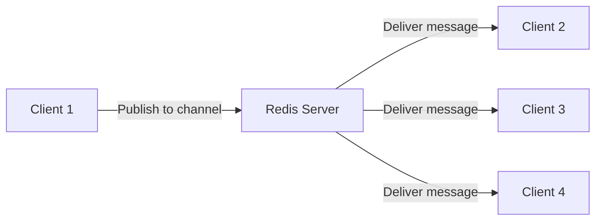
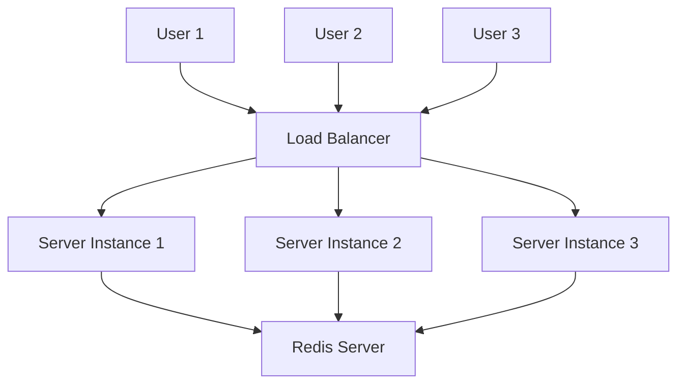

# Redis Chat Application

## Introduction

Building real-time applications is one of the most exciting aspects of modern web development. In this tutorial, we'll explore how to create a real-time chat application using Redis as the backbone. Redis excels at this kind of application thanks to its Pub/Sub (Publish/Subscribe) messaging paradigm, which allows for efficient real-time communication between users.

By the end of this tutorial, you'll understand:
- How Redis Pub/Sub works
- How to integrate Redis with Node.js
- How to build a simple but functional chat application
- How to scale your chat application for multiple users

## What is Redis Pub/Sub?

Redis Pub/Sub (Publish/Subscribe) is a messaging pattern where senders (publishers) send messages to specific channels without knowing who will receive them. Subscribers express interest in one or more channels and only receive messages from those channels.



This pattern is perfect for real-time chat applications as it allows for:
- One-to-many message broadcasting
- Decoupling of publishers and subscribers
- Efficient message routing
- Scalability across multiple servers

## Prerequisites

Before we begin, make sure you have:

- Basic knowledge of JavaScript and Node.js
- Redis installed on your system
- Node.js installed on your system
- npm or yarn for package management

## Setting Up Our Project

Let's start by creating a new Node.js project:

```bash
mkdir redis-chat-app
cd redis-chat-app
npm init -y
```

Next, we'll install the necessary dependencies:

```bash
npm install express socket.io redis
```

## Creating the Basic Server

First, let's create a basic Express server that will serve our chat application:

```javascript
// server.js
const express = require('express');
const http = require('http');
const path = require('path');

// Create Express app
const app = express();
const server = http.createServer(app);

// Serve static files
app.use(express.static(path.join(__dirname, 'public')));

// Serve the HTML file
app.get('/', (req, res) => {
  res.sendFile(path.join(__dirname, 'public', 'index.html'));
});

// Start the server
const PORT = process.env.PORT || 3000;
server.listen(PORT, () => {
  console.log(`Server running on port ${PORT}`);
});
```

## Adding Socket.IO

Now, let's integrate Socket.IO to handle real-time communication:

```javascript
// server.js - with Socket.IO
const express = require('express');
const http = require('http');
const path = require('path');
const socketIO = require('socket.io');

// Create Express app
const app = express();
const server = http.createServer(app);
const io = socketIO(server);

// Serve static files
app.use(express.static(path.join(__dirname, 'public')));

// Socket.IO connection handler
io.on('connection', (socket) => {
  console.log('New user connected');
  
  socket.on('disconnect', () => {
    console.log('User disconnected');
  });
});

// Serve the HTML file
app.get('/', (req, res) => {
  res.sendFile(path.join(__dirname, 'public', 'index.html'));
});

// Start the server
const PORT = process.env.PORT || 3000;
server.listen(PORT, () => {
  console.log(`Server running on port ${PORT}`);
});
```

## Integrating Redis

Now, let's integrate Redis to handle message publishing and subscribing:

```javascript
// server.js - with Redis
const express = require('express');
const http = require('http');
const path = require('path');
const socketIO = require('socket.io');
const redis = require('redis');

// Create Express app
const app = express();
const server = http.createServer(app);
const io = socketIO(server);

// Create Redis clients
const redisClient = redis.createClient();
const redisSubscriber = redis.createClient();

// Handle Redis errors
redisClient.on('error', (err) => {
  console.error('Redis Client Error:', err);
});

redisSubscriber.on('error', (err) => {
  console.error('Redis Subscriber Error:', err);
});

// Subscribe to the chat channel
redisSubscriber.subscribe('chat');

// When a message is received from Redis, emit it to all connected clients
redisSubscriber.on('message', (channel, message) => {
  if (channel === 'chat') {
    io.emit('message', JSON.parse(message));
  }
});

// Socket.IO connection handler
io.on('connection', (socket) => {
  console.log('New user connected');
  
  // When a client sends a message
  socket.on('sendMessage', (data) => {
    const message = {
      user: data.user,
      text: data.text,
      time: new Date().toLocaleTimeString()
    };
    
    // Publish the message to Redis
    redisClient.publish('chat', JSON.stringify(message));
  });
  
  socket.on('disconnect', () => {
    console.log('User disconnected');
  });
});

// Serve the HTML file
app.get('/', (req, res) => {
  res.sendFile(path.join(__dirname, 'public', 'index.html'));
});

// Start the server
const PORT = process.env.PORT || 3000;
server.listen(PORT, () => {
  console.log(`Server running on port ${PORT}`);
});
```

## Creating the Frontend

Let's create the HTML and JavaScript for our frontend. First, create a `public` folder in your project:

```bash
mkdir public
```

Now, create a basic HTML file:

```html
<!-- public/index.html -->
<!DOCTYPE html>
<html lang="en">
<head>
  <meta charset="UTF-8">
  <meta name="viewport" content="width=device-width, initial-scale=1.0">
  <title>Redis Chat App</title>
  <style>
    body {
      font-family: Arial, sans-serif;
      max-width: 800px;
      margin: 0 auto;
      padding: 20px;
    }
    #chat-container {
      border: 1px solid #ccc;
      border-radius: 5px;
      padding: 20px;
      height: 400px;
      overflow-y: auto;
      margin-bottom: 20px;
    }
    .message {
      margin-bottom: 10px;
      padding: 10px;
      border-radius: 5px;
      background-color: #f1f1f1;
    }
    .message .user {
      font-weight: bold;
      margin-right: 10px;
    }
    .message .time {
      color: #999;
      font-size: 0.8em;
    }
    #message-form {
      display: flex;
    }
    #message-input {
      flex-grow: 1;
      padding: 10px;
      border: 1px solid #ccc;
      border-radius: 5px;
      margin-right: 10px;
    }
    button {
      padding: 10px 20px;
      background-color: #4CAF50;
      color: white;
      border: none;
      border-radius: 5px;
      cursor: pointer;
    }
  </style>
</head>
<body>
  <h1>Redis Chat App</h1>
  
  <div id="user-form">
    <h2>Enter Your Name</h2>
    <input type="text" id="username-input" placeholder="Your name...">
    <button id="join-btn">Join Chat</button>
  </div>
  
  <div id="chat-section" style="display: none;">
    <div id="chat-container"></div>
    
    <form id="message-form">
      <input type="text" id="message-input" placeholder="Type a message...">
      <button type="submit">Send</button>
    </form>
  </div>
  
  <script src="/socket.io/socket.io.js"></script>
  <script>
    const socket = io();
    let username = '';
    
    // DOM elements
    const userForm = document.getElementById('user-form');
    const chatSection = document.getElementById('chat-section');
    const usernameInput = document.getElementById('username-input');
    const joinBtn = document.getElementById('join-btn');
    const chatContainer = document.getElementById('chat-container');
    const messageForm = document.getElementById('message-form');
    const messageInput = document.getElementById('message-input');
    
    // Join chat button click handler
    joinBtn.addEventListener('click', () => {
      username = usernameInput.value.trim();
      if (username) {
        userForm.style.display = 'none';
        chatSection.style.display = 'block';
        
        // Add system message
        addMessage({
          user: 'System',
          text: `${username} has joined the chat`,
          time: new Date().toLocaleTimeString()
        });
      }
    });
    
    // Send message form submit handler
    messageForm.addEventListener('submit', (e) => {
      e.preventDefault();
      const text = messageInput.value.trim();
      if (text) {
        socket.emit('sendMessage', { user: username, text });
        messageInput.value = '';
      }
    });
    
    // Listen for messages from the server
    socket.on('message', (message) => {
      addMessage(message);
    });
    
    // Function to add a message to the chat container
    function addMessage(message) {
      const messageElement = document.createElement('div');
      messageElement.classList.add('message');
      
      const userElement = document.createElement('span');
      userElement.classList.add('user');
      userElement.textContent = message.user;
      
      const textElement = document.createElement('span');
      textElement.classList.add('text');
      textElement.textContent = message.text;
      
      const timeElement = document.createElement('span');
      timeElement.classList.add('time');
      timeElement.textContent = message.time;
      
      messageElement.appendChild(userElement);
      messageElement.appendChild(textElement);
      messageElement.appendChild(document.createElement('br'));
      messageElement.appendChild(timeElement);
      
      chatContainer.appendChild(messageElement);
      
      // Scroll to the bottom
      chatContainer.scrollTop = chatContainer.scrollHeight;
    }
  </script>
</body>
</html>
```

## Scaling with Redis

One of the key advantages of using Redis for our chat application is scalability. Let's see how we can scale our application to handle more users across multiple server instances.



Here's how this architecture works:

1. Multiple server instances (Node.js applications) can be run behind a load balancer
2. Each server instance connects to the same Redis server
3. When a user sends a message:
   - It's received by one of the server instances
   - That instance publishes the message to Redis
   - Redis broadcasts the message to all subscribers (all server instances)
   - Each server instance then broadcasts the message to its connected users

This allows for horizontal scaling - you can add more server instances to handle more users without changing the application logic.

## Advanced Features

Now that we have a basic chat application, let's add some advanced features:

### User Typing Indicator

Let's add a "user is typing" indicator to make our chat more interactive:

```javascript
// Add to client-side JavaScript
messageInput.addEventListener('input', () => {
  socket.emit('typing', { user: username });
});

// Stop typing after 2 seconds of inactivity
let typingTimeout;
messageInput.addEventListener('input', () => {
  clearTimeout(typingTimeout);
  socket.emit('typing', { user: username });
  
  typingTimeout = setTimeout(() => {
    socket.emit('stopTyping');
  }, 2000);
});

// Listen for typing events
const typingIndicator = document.createElement('div');
typingIndicator.id = 'typing-indicator';
typingIndicator.style.fontStyle = 'italic';
typingIndicator.style.color = '#888';
chatContainer.after(typingIndicator);

socket.on('userTyping', (data) => {
  typingIndicator.textContent = `${data.user} is typing...`;
});

socket.on('userStoppedTyping', () => {
  typingIndicator.textContent = '';
});
```

Then, add to server-side:

```javascript
// Add to server.js
socket.on('typing', (data) => {
  socket.broadcast.emit('userTyping', data);
});

socket.on('stopTyping', () => {
  socket.broadcast.emit('userStoppedTyping');
});
```

### Chat Rooms

We can also add support for different chat rooms:

```javascript
// Modified server.js for rooms
socket.on('joinRoom', (room) => {
  // Join a specific room
  socket.join(room);
  
  // Subscribe to the room channel in Redis
  redisSubscriber.subscribe(`chat:${room}`);
  
  // Let everyone in the room know
  io.to(room).emit('message', {
    user: 'System',
    text: `A new user has joined ${room}`,
    time: new Date().toLocaleTimeString()
  });
});

socket.on('sendMessage', (data) => {
  const message = {
    user: data.user,
    text: data.text,
    room: data.room,
    time: new Date().toLocaleTimeString()
  };
  
  // Publish the message to the specific room channel
  redisClient.publish(`chat:${data.room}`, JSON.stringify(message));
});

redisSubscriber.on('message', (channel, message) => {
  if (channel.startsWith('chat:')) {
    const parsedMessage = JSON.parse(message);
    const room = channel.split(':')[1];
    
    // Send the message only to clients in that room
    io.to(room).emit('message', parsedMessage);
  }
});
```

## Performance Considerations

When building a Redis-based chat application, keep these performance considerations in mind:

1. **Message Persistence**: By default, Redis Pub/Sub doesn't persist messages. If you need message history, consider using Redis Lists or Streams alongside Pub/Sub.

2. **Connection Pooling**: For high-load applications, use connection pooling to manage Redis connections efficiently.

3. **Redis Clustering**: For very large applications, consider using Redis Clustering to distribute your data across multiple Redis nodes.

4. **Message Size**: Keep messages small to minimize bandwidth usage and improve performance.

5. **Monitoring**: Implement monitoring to track Redis performance and identify bottlenecks.

## Complete Solution

Let's put everything together into a complete solution:

```javascript
// Complete server.js
const express = require('express');
const http = require('http');
const path = require('path');
const socketIO = require('socket.io');
const redis = require('redis');

// Create Express app
const app = express();
const server = http.createServer(app);
const io = socketIO(server);

// Create Redis clients
const redisClient = redis.createClient();
const redisSubscriber = redis.createClient();

// Track active rooms
const activeRooms = new Set(['general']);

// Handle Redis errors
redisClient.on('error', (err) => {
  console.error('Redis Client Error:', err);
});

redisSubscriber.on('error', (err) => {
  console.error('Redis Subscriber Error:', err);
});

// Subscribe to the general chat channel
redisSubscriber.subscribe('chat:general');

// When a message is received from Redis, emit it to all connected clients in the room
redisSubscriber.on('message', (channel, message) => {
  if (channel.startsWith('chat:')) {
    const parsedMessage = JSON.parse(message);
    const room = channel.split(':')[1];
    
    io.to(room).emit('message', parsedMessage);
  }
});

// Socket.IO connection handler
io.on('connection', (socket) => {
  console.log('New user connected');
  
  // Send active rooms to the client
  socket.emit('roomList', Array.from(activeRooms));
  
  // When a client joins a room
  socket.on('joinRoom', (data) => {
    // Leave previous rooms
    socket.rooms.forEach(room => {
      if (room !== socket.id) {
        socket.leave(room);
      }
    });
    
    // Join the new room
    socket.join(data.room);
    
    // Subscribe to the room channel if not already subscribed
    if (!activeRooms.has(data.room)) {
      redisSubscriber.subscribe(`chat:${data.room}`);
      activeRooms.add(data.room);
      io.emit('roomList', Array.from(activeRooms));
    }
    
    // Announce the user's arrival
    const joinMessage = {
      user: 'System',
      text: `${data.user} has joined the room`,
      time: new Date().toLocaleTimeString()
    };
    
    redisClient.publish(`chat:${data.room}`, JSON.stringify(joinMessage));
  });
  
  // When a client creates a new room
  socket.on('createRoom', (roomName) => {
    if (!activeRooms.has(roomName) && roomName.trim() !== '') {
      activeRooms.add(roomName);
      redisSubscriber.subscribe(`chat:${roomName}`);
      io.emit('roomList', Array.from(activeRooms));
    }
  });
  
  // When a client sends a message
  socket.on('sendMessage', (data) => {
    const message = {
      user: data.user,
      text: data.text,
      time: new Date().toLocaleTimeString()
    };
    
    // Publish the message to Redis
    redisClient.publish(`chat:${data.room}`, JSON.stringify(message));
  });
  
  // When a client is typing
  socket.on('typing', (data) => {
    socket.to(data.room).emit('userTyping', { user: data.user });
  });
  
  // When a client stops typing
  socket.on('stopTyping', (data) => {
    socket.to(data.room).emit('userStoppedTyping');
  });
  
  socket.on('disconnect', () => {
    console.log('User disconnected');
  });
});

// Serve static files
app.use(express.static(path.join(__dirname, 'public')));

// Serve the HTML file
app.get('/', (req, res) => {
  res.sendFile(path.join(__dirname, 'public', 'index.html'));
});

// Start the server
const PORT = process.env.PORT || 3000;
server.listen(PORT, () => {
  console.log(`Server running on port ${PORT}`);
});
```

And here's the updated frontend:

```html
<!-- public/index.html - Complete version -->
<!DOCTYPE html>
<html lang="en">
<head>
  <meta charset="UTF-8">
  <meta name="viewport" content="width=device-width, initial-scale=1.0">
  <title>Redis Chat App</title>
  <style>
    body {
      font-family: Arial, sans-serif;
      max-width: 1000px;
      margin: 0 auto;
      padding: 20px;
    }
    .container {
      display: flex;
      height: 500px;
    }
    .sidebar {
      width: 200px;
      border: 1px solid #ccc;
      border-radius: 5px;
      padding: 10px;
      margin-right: 20px;
    }
    .room-list {
      margin-bottom: 20px;
    }
    .room-item {
      padding: 8px;
      margin-bottom: 5px;
      cursor: pointer;
      border-radius: 3px;
    }
    .room-item:hover {
      background-color: #f1f1f1;
    }
    .room-item.active {
      background-color: #e0e0e0;
      font-weight: bold;
    }
    .main {
      flex-grow: 1;
    }
    #chat-container {
      border: 1px solid #ccc;
      border-radius: 5px;
      padding: 20px;
      height: 400px;
      overflow-y: auto;
      margin-bottom: 10px;
    }
    .message {
      margin-bottom: 10px;
      padding: 10px;
      border-radius: 5px;
      background-color: #f1f1f1;
    }
    .message .user {
      font-weight: bold;
      margin-right: 10px;
    }
    .message .time {
      color: #999;
      font-size: 0.8em;
    }
    #message-form {
      display: flex;
    }
    #message-input {
      flex-grow: 1;
      padding: 10px;
      border: 1px solid #ccc;
      border-radius: 5px;
      margin-right: 10px;
    }
    button {
      padding: 10px 20px;
      background-color: #4CAF50;
      color: white;
      border: none;
      border-radius: 5px;
      cursor: pointer;
    }
    #create-room-form {
      margin-top: 10px;
      display: flex;
      flex-direction: column;
    }
    #create-room-form input {
      margin-bottom: 5px;
      padding: 8px;
      border: 1px solid #ccc;
      border-radius: 3px;
    }
    #typing-indicator {
      height: 20px;
      margin-bottom: 10px;
      font-style: italic;
      color: #888;
    }
  </style>
</head>
<body>
  <h1>Redis Chat App</h1>
  
  <div id="user-form">
    <h2>Enter Your Name</h2>
    <input type="text" id="username-input" placeholder="Your name...">
    <button id="join-btn">Join Chat</button>
  </div>
  
  <div id="chat-section" style="display: none;">
    <div class="container">
      <div class="sidebar">
        <h3>Chat Rooms</h3>
        <div class="room-list" id="room-list"></div>
        
        <form id="create-room-form">
          <input type="text" id="room-input" placeholder="New room name...">
          <button type="submit">Create Room</button>
        </form>
      </div>
      
      <div class="main">
        <h2 id="current-room">General</h2>
        <div id="chat-container"></div>
        <div id="typing-indicator"></div>
        
        <form id="message-form">
          <input type="text" id="message-input" placeholder="Type a message...">
          <button type="submit">Send</button>
        </form>
      </div>
    </div>
  </div>
  
  <script src="/socket.io/socket.io.js"></script>
  <script>
    const socket = io();
    let username = '';
    let currentRoom = 'general';
    
    // DOM elements
    const userForm = document.getElementById('user-form');
    const chatSection = document.getElementById('chat-section');
    const usernameInput = document.getElementById('username-input');
    const joinBtn = document.getElementById('join-btn');
    const chatContainer = document.getElementById('chat-container');
    const messageForm = document.getElementById('message-form');
    const messageInput = document.getElementById('message-input');
    const roomList = document.getElementById('room-list');
    const currentRoomHeader = document.getElementById('current-room');
    const createRoomForm = document.getElementById('create-room-form');
    const roomInput = document.getElementById('room-input');
    const typingIndicator = document.getElementById('typing-indicator');
    
    // Join chat button click handler
    joinBtn.addEventListener('click', () => {
      username = usernameInput.value.trim();
      if (username) {
        userForm.style.display = 'none';
        chatSection.style.display = 'block';
        
        // Join the general room
        joinRoom('general');
      }
    });
    
    // Function to join a room
    function joinRoom(room) {
      // Clear previous messages
      chatContainer.innerHTML = '';
      
      // Update current room
      currentRoom = room;
      currentRoomHeader.textContent = room.charAt(0).toUpperCase() + room.slice(1);
      
      // Update active room in the list
      updateActiveRoom(room);
      
      // Join the room via Socket.IO
      socket.emit('joinRoom', { room, user: username });
    }
    
    // Function to update the active room in the list
    function updateActiveRoom(activeRoom) {
      const roomItems = document.querySelectorAll('.room-item');
      roomItems.forEach(item => {
        if (item.getAttribute('data-room') === activeRoom) {
          item.classList.add('active');
        } else {
          item.classList.remove('active');
        }
      });
    }
    
    // Send message form submit handler
    messageForm.addEventListener('submit', (e) => {
      e.preventDefault();
      const text = messageInput.value.trim();
      if (text) {
        socket.emit('sendMessage', { user: username, text, room: currentRoom });
        messageInput.value = '';
      }
    });
    
    // Create room form submit handler
    createRoomForm.addEventListener('submit', (e) => {
      e.preventDefault();
      const roomName = roomInput.value.trim().toLowerCase();
      if (roomName) {
        socket.emit('createRoom', roomName);
        roomInput.value = '';
      }
    });
    
    // Typing indicator
    let typingTimeout;
    messageInput.addEventListener('input', () => {
      clearTimeout(typingTimeout);
      socket.emit('typing', { user: username, room: currentRoom });
      
      typingTimeout = setTimeout(() => {
        socket.emit('stopTyping', { room: currentRoom });
      }, 2000);
    });
    
    // Listen for messages from the server
    socket.on('message', (message) => {
      addMessage(message);
    });
    
    // Listen for room list updates
    socket.on('roomList', (rooms) => {
      roomList.innerHTML = '';
      rooms.forEach(room => {
        const roomElement = document.createElement('div');
        roomElement.classList.add('room-item');
        roomElement.setAttribute('data-room', room);
        if (room === currentRoom) {
          roomElement.classList.add('active');
        }
        roomElement.textContent = room.charAt(0).toUpperCase() + room.slice(1);
        
        roomElement.addEventListener('click', () => {
          joinRoom(room);
        });
        
        roomList.appendChild(roomElement);
      });
    });
    
    // Listen for typing events
    socket.on('userTyping', (data) => {
      typingIndicator.textContent = `${data.user} is typing...`;
    });
    
    socket.on('userStoppedTyping', () => {
      typingIndicator.textContent = '';
    });
    
    // Function to add a message to the chat container
    function addMessage(message) {
      const messageElement = document.createElement('div');
      messageElement.classList.add('message');
      
      const userElement = document.createElement('span');
      userElement.classList.add('user');
      userElement.textContent = message.user;
      
      const textElement = document.createElement('span');
      textElement.classList.add('text');
      textElement.textContent = message.text;
      
      const timeElement = document.createElement('span');
      timeElement.classList.add('time');
      timeElement.textContent = message.time;
      
      messageElement.appendChild(userElement);
      messageElement.appendChild(textElement);
      messageElement.appendChild(document.createElement('br'));
      messageElement.appendChild(timeElement);
      
      chatContainer.appendChild(messageElement);
      
      // Scroll to the bottom
      chatContainer.scrollTop = chatContainer.scrollHeight;
    }
  </script>
</body>
</html>
```

## Storing Chat History

To add persistence to our chat application, we can store messages in Redis Lists:

```javascript
// Add to server.js
socket.on('sendMessage', (data) => {
  const message = {
    user: data.user,
    text: data.text,
    time: new Date().toLocaleTimeString()
  };
  
  // Store message in a Redis list (limited to last 100 messages)
  const messageString = JSON.stringify(message);
  redisClient.lpush(`messages:${data.room}`, messageString);
  redisClient.ltrim(`messages:${data.room}`, 0, 99);
  
  // Publish the message to Redis
  redisClient.publish(`chat:${data.room}`, messageString);
});

// Retrieve chat history when joining a room
socket.on('joinRoom', (data) => {
  // ... existing joinRoom code ...
  
  // Get chat history
  redisClient.lrange(`messages:${data.room}`, 0, 49, (err, messages) => {
    if (err) {
      console.error('Error retrieving chat history:', err);
      return;
    }
    
    // Send chat history to the client (newest messages first)
    const history = messages.map(msg => JSON.parse(msg));
    socket.emit('chatHistory', history.reverse());
  });
});
```

Then add to client-side:

```javascript
// Client-side
socket.on('chatHistory', (history) => {
  // Clear chat container first
  chatContainer.innerHTML = '';
  
  // Add history messages
  history.forEach(message => {
    addMessage(message);
  });
});
```

## Summary

In this tutorial, we've learned how to build a real-time chat application using Redis Pub/Sub with Node.js and Socket.IO. We've covered:

1. Setting up a basic Express server
2. Integrating Socket.IO for real-time communication
3. Using Redis Pub/Sub for message broadcasting
4. Creating a responsive frontend
5. Adding advanced features like typing indicators and chat rooms
6. Implementing message persistence
7. Scaling considerations for larger applications

Redis is an excellent choice for real-time applications like chat systems due to its speed, simplicity, and powerful Pub/Sub mechanism. By following this tutorial, you've not only built a functional chat application but also gained valuable insights into real-time application architecture.

## Additional Resources

- [Redis Documentation](https://redis.io/documentation)
- [Node.js Redis Client](https://github.com/redis/node-redis)
- [Socket.IO Documentation](https://socket.io/docs/v4/)
- [Express.js Guide](https://expressjs.com/en/guide/routing.html)

## Exercises

1. **Add User Authentication**: Implement a login system using Redis to store user credentials.