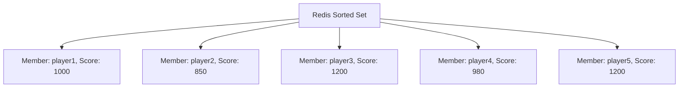

# Redis Leaderboard Implementation

## Introduction

Leaderboards are a fundamental component in many applications, from gaming platforms to fitness apps and educational systems. They display users ranked by their scores, encouraging healthy competition and user engagement. However, implementing an efficient leaderboard system that can handle frequent updates and queries can be challenging with traditional databases.

This is where Redis shines! With its in-memory data structure store and powerful sorted sets, Redis provides an ideal solution for building real-time leaderboards that can handle millions of users with minimal latency.

In this tutorial, we'll learn how to implement a fully functional leaderboard system using Redis sorted sets, complete with rankings, score updates, and range queries.

## Prerequisites

Before getting started, you should have:

- Basic knowledge of Redis concepts
- Redis installed locally or access to a Redis instance
- A programming language with a Redis client (we'll use Node.js with `redis` package in our examples)

## Understanding Redis Sorted Sets

At the heart of our leaderboard implementation is the Redis Sorted Set data structure. Sorted sets are collections where each element has:

1. A member (string) - in our case, this will be the player/user ID
2. A score (floating-point number) - the player's score

What makes sorted sets perfect for leaderboards:

- Elements are automatically ordered by score
- Scores can be updated in O(log(N)) time
- Range queries (like "get top 10 players") are extremely efficient
- Tied scores are handled by lexicographical ordering of the members



## Setting Up Our Project

Let's set up a basic Node.js project to implement our leaderboard:

```bash
mkdir redis-leaderboard
cd redis-leaderboard
npm init -y
npm install redis
```

Now, let's create an `index.js` file with our Redis connection:

```javascript
const redis = require('redis');
const client = redis.createClient({
  url: 'redis://localhost:6379'
});

// Handle connection events
client.on('error', (err) => console.log('Redis Client Error', err));

async function main() {
  await client.connect();
  
  // Our leaderboard code will go here
  
  await client.disconnect();
}

main().catch(console.error);
```

## Building the Leaderboard

Let's create a `Leaderboard` class to encapsulate our leaderboard operations:

```javascript
class Leaderboard {
  constructor(redisClient, leaderboardName) {
    this.client = redisClient;
    this.leaderboardKey = `leaderboard:${leaderboardName}`;
  }
  
  // Add a score for a player or update existing score
  async addScore(playerId, score) {
    // ZADD command adds member to sorted set with given score
    return await this.client.zAdd(this.leaderboardKey, { score, value: playerId });
  }
  
  // Get rank of a player (0-based)
  async getRank(playerId) {
    // ZREVRANK gives rank in descending order (highest score first)
    const rank = await this.client.zRevRank(this.leaderboardKey, playerId);
    return rank !== null ? rank : -1;
  }
  
  // Get score of a player
  async getScore(playerId) {
    const score = await this.client.zScore(this.leaderboardKey, playerId);
    return score !== null ? score : 0;
  }
  
  // Get top N players
  async getTopPlayers(count = 10) {
    // ZREVRANGE gets range of members by score (highest first)
    // WITHSCORES returns scores alongside members
    return await this.client.zRevRangeWithScores(
      this.leaderboardKey,
      0,
      count - 1
    );
  }
  
  // Get players around a specific player
  async getPlayerNeighbors(playerId, neighborsCount = 2) {
    const rank = await this.getRank(playerId);
    if (rank === -1) return [];
    
    const start = Math.max(0, rank - neighborsCount);
    const end = rank + neighborsCount;
    
    return await this.client.zRevRangeWithScores(
      this.leaderboardKey,
      start,
      end
    );
  }
  
  // Increment a player's score
  async incrementScore(playerId, increment) {
    // ZINCRBY increments score of member by increment amount
    return await this.client.zIncrBy(this.leaderboardKey, increment, playerId);
  }
  
  // Get total number of players
  async getTotalPlayers() {
    // ZCARD returns number of members in sorted set
    return await this.client.zCard(this.leaderboardKey);
  }
  
  // Remove a player from leaderboard
  async removePlayer(playerId) {
    // ZREM removes members from sorted set
    return await this.client.zRem(this.leaderboardKey, playerId);
  }
}
```

## Practical Example: Gaming Leaderboard

Let's implement a practical example of a gaming leaderboard:

```javascript
async function runGamingLeaderboardExample() {
  const client = redis.createClient({ url: 'redis://localhost:6379' });
  await client.connect();
  
  try {
    // Create a leaderboard for our game
    const gameLeaderboard = new Leaderboard(client, 'spaceshooter');
    
    // Add players with initial scores
    console.log('Adding players to leaderboard...');
    await gameLeaderboard.addScore('player:1', 1200);
    await gameLeaderboard.addScore('player:2', 3500);
    await gameLeaderboard.addScore('player:3', 2700);
    await gameLeaderboard.addScore('player:4', 9200);
    await gameLeaderboard.addScore('player:5', 4100);
    await gameLeaderboard.addScore('player:6', 5400);
    
    // Get top 5 players
    console.log('
Top 5 Players:');
    const topPlayers = await gameLeaderboard.getTopPlayers(5);
    topPlayers.forEach((player, index) => {
      console.log(`#${index + 1}: ${player.value} - Score: ${player.score}`);
    });
    
    // Get player:3's rank and score
    const player3Rank = await gameLeaderboard.getRank('player:3');
    const player3Score = await gameLeaderboard.getScore('player:3');
    console.log(`
player:3's rank: #${player3Rank + 1}, Score: ${player3Score}`);
    
    // Player:3 plays again and scores more points
    console.log('
Incrementing player:3 score by 3000...');
    await gameLeaderboard.incrementScore('player:3', 3000);
    
    // Check player:3's new rank
    const player3NewRank = await gameLeaderboard.getRank('player:3');
    const player3NewScore = await gameLeaderboard.getScore('player:3');
    console.log(`player:3's new rank: #${player3NewRank + 1}, New Score: ${player3NewScore}`);
    
    // Get players around player:3
    console.log('
Players around player:3:');
    const neighbors = await gameLeaderboard.getPlayerNeighbors('player:3', 1);
    neighbors.forEach((player, index) => {
      const adjustedRank = player3NewRank - 1 + index;
      console.log(`#${adjustedRank + 1}: ${player.value} - Score: ${player.score}`);
    });
    
    // Get total players
    const totalPlayers = await gameLeaderboard.getTotalPlayers();
    console.log(`
Total players in leaderboard: ${totalPlayers}`);
    
  } finally {
    // Clean up connection
    await client.disconnect();
  }
}

runGamingLeaderboardExample().catch(console.error);
```

**Example Output:**

```
Adding players to leaderboard...

Top 5 Players:
#1: player:4 - Score: 9200
#2: player:6 - Score: 5400
#3: player:5 - Score: 4100
#4: player:2 - Score: 3500
#5: player:3 - Score: 2700

player:3's rank: #5, Score: 2700

Incrementing player:3 score by 3000...
player:3's new rank: #2, New Score: 5700

Players around player:3:
#1: player:4 - Score: 9200
#2: player:3 - Score: 5700
#3: player:6 - Score: 5400

Total players in leaderboard: 6
```

## Advanced Leaderboard Features

### Time-Based Leaderboards

Implementing daily, weekly, or monthly leaderboards is easy with Redis key expiration:

```javascript
class TimeBasedLeaderboard extends Leaderboard {
  constructor(redisClient, leaderboardName, expirationInSeconds) {
    super(redisClient, leaderboardName);
    this.expirationInSeconds = expirationInSeconds;
  }
  
  async addScore(playerId, score) {
    const result = await super.addScore(playerId, score);
    // Set expiration for the leaderboard key
    await this.client.expire(this.leaderboardKey, this.expirationInSeconds);
    return result;
  }
}

// Usage: Create a daily leaderboard that expires after 24 hours
const dailyLeaderboard = new TimeBasedLeaderboard(client, 'daily', 86400); // 86400 seconds = 24 hours
```

### Leaderboard with Member Data

To store additional player data alongside their scores:

```javascript
async function addPlayerWithData(redisClient, leaderboardKey, playerId, score, playerData) {
  // Add player to leaderboard
  await redisClient.zAdd(leaderboardKey, { score, value: playerId });
  
  // Store player data in a hash
  const playerDataKey = `player:${playerId}:data`;
  for (const [key, value] of Object.entries(playerData)) {
    await redisClient.hSet(playerDataKey, key, value);
  }
}

// Usage example
await addPlayerWithData(
  client,
  'leaderboard:gameX',
  'player:7',
  8500,
  {
    username: 'SuperGamer123',
    avatar: 'avatar2.png',
    level: 42,
    lastActive: new Date().toISOString()
  }
);
```

## Performance Considerations

Redis leaderboards scale exceptionally well, but here are some tips for optimizing performance:

1. **Key Naming Strategy**: Use a consistent naming convention for your leaderboard keys to make management easier.

2. **Pagination**: When displaying large leaderboards, always paginate results to avoid retrieving unnecessary data.

3. **Batching**: Use multi/exec (Redis transactions) to batch multiple operations:

```javascript
async function batchUpdateScores(redisClient, leaderboardKey, playerScores) {
  const multi = redisClient.multi();
  
  for (const [playerId, score] of Object.entries(playerScores)) {
    multi.zAdd(leaderboardKey, { score, value: playerId });
  }
  
  return await multi.exec();
}
```

4. **Memory Usage**: For very large leaderboards (millions of users), consider using:
   - Separate leaderboards for different time periods
   - Regular cleanup of old or inactive users

## Real-World Applications

Redis leaderboards can be used in various scenarios:

1. **Gaming Applications**: Track player scores in real-time games
2. **Fitness Apps**: Rank users by workout achievements
3. **E-learning Platforms**: Score students in course completion or quiz performance
4. **E-commerce Sites**: Show trending products based on views or purchases
5. **Social Media**: Rank content by engagement metrics

For example, a fitness app might implement multiple leaderboards:

```javascript
// Create various fitness leaderboards
const stepsLeaderboard = new Leaderboard(client, 'fitness:steps');
const workoutsLeaderboard = new Leaderboard(client, 'fitness:workouts');
const caloriesLeaderboard = new Leaderboard(client, 'fitness:calories');

// When a user completes a workout
async function recordWorkout(userId, steps, workoutPoints, caloriesBurned) {
  await stepsLeaderboard.incrementScore(userId, steps);
  await workoutsLeaderboard.incrementScore(userId, workoutPoints);
  await caloriesLeaderboard.incrementScore(userId, caloriesBurned);
  
  // Get user's new ranks
  const stepsRank = await stepsLeaderboard.getRank(userId);
  const workoutsRank = await workoutsLeaderboard.getRank(userId);
  const caloriesRank = await caloriesLeaderboard.getRank(userId);
  
  return {
    steps: { count: steps, rank: stepsRank + 1 },
    workout: { points: workoutPoints, rank: workoutsRank + 1 },
    calories: { burned: caloriesBurned, rank: caloriesRank + 1 }
  };
}
```

## Summary

Redis sorted sets provide an elegant and high-performance solution for implementing leaderboards. In this tutorial, we've covered:

- Using Redis sorted sets for ranking users by score
- Implementing core leaderboard functionality (adding scores, getting ranks, retrieving top players)
- Advanced features like time-based leaderboards and storing player data
- Performance considerations for scaling your leaderboard system
- Real-world applications across different domains

Redis leaderboards offer sub-millisecond operations even with millions of users, making them suitable for applications of any scale. The combination of speed, simplicity, and versatility makes Redis an excellent choice for real-time ranking systems.

## Exercises

1. Extend the `Leaderboard` class to implement a paged leaderboard function that returns a specific page of results.
2. Create a system that maintains separate daily, weekly, and all-time leaderboards.
3. Implement a function to retrieve a player's percentile rank (what percentage of players they're better than).
4. Build a simple web server that exposes leaderboard data through a REST API.
5. Add a feature to track player rank history over time using additional Redis data structures.

## Additional Resources

- [Redis Sorted Sets Documentation](https://redis.io/docs/data-types/sorted-sets/)
- [Redis Node.js Client](https://github.com/redis/node-redis)
- [Redis Command Reference for Sorted Sets](https://redis.io/commands/?group=sorted-set)
- [Redis University](https://university.redis.com/) - Free courses on Redis