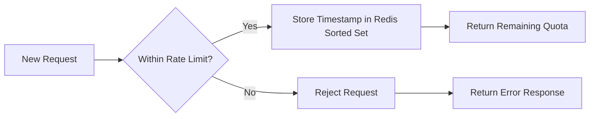

# Redis Rate Limiter

## Introduction

Rate limiting is an essential technique in modern application development that controls how many requests a user or client can make to an API within a specific time window. It helps protect your services from abuse, prevents resource exhaustion, and ensures fair usage across all clients.

Redis, an in-memory data store, offers an excellent solution for implementing rate limiting due to its speed, atomic operations, and built-in time-based key expiration. In this tutorial, we'll explore how to build an effective rate limiter using Redis.

## Why Use Redis for Rate Limiting?

Redis provides several advantages for implementing rate limiters:

- **Performance**: Redis operations are extremely fast (sub-millisecond)
- **Distributed**: Works across multiple application servers
- **Atomic operations**: Redis commands are executed atomically
- **Built-in expiration**: TTL (Time-To-Live) functionality simplifies time window management
- **Minimal overhead**: Lightweight impact on your application

## Understanding Rate Limiting Concepts

Before diving into code, let's understand the core concepts:

### Rate Limiting Algorithms

There are several common rate limiting algorithms:

1. **Fixed Window**: Count requests in fixed time intervals (e.g., 100 requests per minute)
2. **Sliding Window**: Count requests over a rolling time window
3. **Token Bucket**: Uses a bucket of tokens that refills at a defined rate
4. **Leaky Bucket**: Processes requests at a constant rate, queuing or discarding excess requests

In this tutorial, we'll implement both a fixed window and sliding window rate limiter using Redis.

## Prerequisites

- Basic knowledge of Redis
- Redis server installed locally or accessible remotely
- Node.js environment (for our examples)
- `redis` npm package installed

```bash
npm install redis
```

## Fixed Window Rate Limiter

The fixed window algorithm counts requests in predefined time intervals. For example, allowing 10 requests per minute means dividing time into 1-minute windows and tracking requests within each window.

### Implementation

Here's how to implement a fixed window rate limiter with Redis and Node.js:

```javascript
const redis = require('redis');
const util = require('util');

// Create Redis client
const client = redis.createClient({
  url: 'redis://localhost:6379'
});

// Convert Redis commands to promises
const incrAsync = util.promisify(client.incr).bind(client);
const expireAsync = util.promisify(client.expire).bind(client);
const ttlAsync = util.promisify(client.ttl).bind(client);

async function fixedWindowRateLimiter(userId, maxRequests, windowSizeInSeconds) {
  try {
    // Create a key that includes the user ID and the current time window
    const currentWindow = Math.floor(Date.now() / 1000 / windowSizeInSeconds);
    const key = `ratelimit:fixed:${userId}:${currentWindow}`;
    
    // Increment the counter for the current window
    const count = await incrAsync(key);
    
    // Set the expiration for the key if it's new
    if (count === 1) {
      await expireAsync(key, windowSizeInSeconds);
    }
    
    // Get remaining time on the key
    const ttl = await ttlAsync(key);
    
    // Check if the request is allowed
    const isAllowed = count <= maxRequests;
    
    return {
      isAllowed,
      currentCount: count,
      maxRequests,
      remainingRequests: Math.max(0, maxRequests - count),
      ttl: ttl
    };
  } catch (error) {
    console.error('Rate limiting error:', error);
    // In case of error, allow the request (fail open)
    return { isAllowed: true, error: error.message };
  }
}

// Example usage
async function handleRequest(userId) {
  const result = await fixedWindowRateLimiter(userId, 10, 60); // 10 requests per minute
  
  if (result.isAllowed) {
    console.log(`Request allowed for user ${userId}. ${result.remainingRequests} requests remaining.`);
    // Process the request
    return { status: 'success', data: 'Your requested data' };
  } else {
    console.log(`Request blocked for user ${userId}. Limit exceeded. Try again in ${result.ttl} seconds.`);
    return { status: 'error', message: 'Rate limit exceeded. Please try again later.' };
  }
}

// Test the rate limiter
async function test() {
  await client.connect();
  
  // Simulate 15 requests from the same user
  for (let i = 1; i <= 15; i++) {
    const response = await handleRequest('user123');
    console.log(`Request ${i}: ${response.status}`);
  }
  
  await client.quit();
}

test();
```

### Sample Output

```
Request allowed for user user123. 9 requests remaining.
Request 1: success
Request allowed for user user123. 8 requests remaining.
Request 2: success
...
Request allowed for user user123. 0 requests remaining.
Request 10: success
Request blocked for user user123. Limit exceeded. Try again in 45 seconds.
Request 11: error
...
Request blocked for user user123. Limit exceeded. Try again in 43 seconds.
Request 15: error
```

### How It Works

1. We create a unique key for each user and time window by combining the user ID and the current time divided by the window size.
2. We use Redis's `INCR` command to atomically increment the counter for the current window.
3. If this is the first request in the window, we set an expiration time on the key.
4. We determine if the request should be allowed based on whether the counter exceeds the limit.

## Sliding Window Rate Limiter

The fixed window algorithm has a drawback: it can allow twice the rate limit at the window boundaries. The sliding window approach provides more accurate rate limiting by considering a moving time window.

### Implementation

Here's how to implement a sliding window rate limiter:

```javascript
const redis = require('redis');
const util = require('util');

// Create Redis client
const client = redis.createClient({
  url: 'redis://localhost:6379'
});

// Convert Redis commands to promises for easier async/await usage
const zaddAsync = util.promisify(client.zAdd).bind(client);
const zrangebyscoreAsync = util.promisify(client.zRangeByScore).bind(client);
const zremrangebyscoreAsync = util.promisify(client.zRemRangeByScore).bind(client);
const zcountAsync = util.promisify(client.zCount).bind(client);

async function slidingWindowRateLimiter(userId, maxRequests, windowSizeInSeconds) {
  try {
    const now = Date.now();
    const key = `ratelimit:sliding:${userId}`;
    
    // Remove timestamps that are outside of the current window
    const windowStartTimestamp = now - (windowSizeInSeconds * 1000);
    await zremrangebyscoreAsync(key, 0, windowStartTimestamp);
    
    // Count the number of requests in the current window
    const requestCount = await zcountAsync(key, windowStartTimestamp, now);
    
    // Check if the current request can be allowed
    const isAllowed = requestCount < maxRequests;
    
    if (isAllowed) {
      // Add the current timestamp to the sorted set
      await zaddAsync(key, { score: now, value: now.toString() });
      // Set expiration on the key to clean up
      await client.expire(key, windowSizeInSeconds);
    }
    
    return {
      isAllowed,
      currentCount: requestCount + (isAllowed ? 1 : 0),
      maxRequests,
      remainingRequests: Math.max(0, maxRequests - requestCount - (isAllowed ? 1 : 0)),
      windowSizeInSeconds
    };
  } catch (error) {
    console.error('Rate limiting error:', error);
    // In case of error, allow the request (fail open)
    return { isAllowed: true, error: error.message };
  }
}

// Example usage
async function handleRequestSliding(userId) {
  const result = await slidingWindowRateLimiter(userId, 10, 60); // 10 requests per 60 seconds
  
  if (result.isAllowed) {
    console.log(`Request allowed for user ${userId}. ${result.remainingRequests} requests remaining.`);
    // Process the request
    return { status: 'success', data: 'Your requested data' };
  } else {
    console.log(`Request blocked for user ${userId}. Limit exceeded. Try again later.`);
    return { status: 'error', message: 'Rate limit exceeded. Please try again later.' };
  }
}

// Test the sliding window rate limiter
async function testSliding() {
  await client.connect();
  
  // Simulate 15 requests from the same user
  for (let i = 1; i <= 15; i++) {
    const response = await handleRequestSliding('user123');
    console.log(`Request ${i}: ${response.status}`);
    // Add a small delay to simulate real requests
    await new Promise(resolve => setTimeout(resolve, 100));
  }
  
  await client.quit();
}

testSliding();
```

### How the Sliding Window Algorithm Works

The sliding window algorithm works like this:

1. We use a Redis sorted set (zset) to store timestamps of requests.
2. Each time a request comes in, we:
   - Remove all timestamps outside the current window
   - Count the remaining timestamps to determine recent requests
   - Add the new timestamp if the request is allowed
3. This creates a true sliding window that moves with time.



## Token Bucket Implementation

Another popular rate limiting algorithm is the token bucket. This approach is more flexible for handling burst traffic.

```javascript
const redis = require('redis');
const util = require('util');

// Create Redis client
const client = redis.createClient({
  url: 'redis://localhost:6379'
});

// Implement token bucket algorithm with Lua script for atomicity
const tokenBucketScript = `
local key = KEYS[1]
local tokens_key = key .. ":tokens"
local timestamp_key = key .. ":ts"
local rate = tonumber(ARGV[1])
local capacity = tonumber(ARGV[2])
local now = tonumber(ARGV[3])
local requested = tonumber(ARGV[4])

local last_tokens = tonumber(redis.call("get", tokens_key))
if last_tokens == nil then
  last_tokens = capacity
end

local last_refreshed = tonumber(redis.call("get", timestamp_key))
if last_refreshed == nil then
  last_refreshed = 0
end

local delta = math.max(0, now - last_refreshed)
local filled_tokens = math.min(capacity, last_tokens + (delta * rate))
local allowed = filled_tokens >= requested
local new_tokens = filled_tokens

if allowed then
  new_tokens = filled_tokens - requested
end

redis.call("set", tokens_key, new_tokens)
redis.call("set", timestamp_key, now)
-- Set expiration on keys to avoid memory leaks
redis.call("expire", tokens_key, 60)
redis.call("expire", timestamp_key, 60)

return { allowed, new_tokens }
`;

async function tokenBucketRateLimiter(userId, tokensPerSecond, bucketCapacity, tokensToConsume = 1) {
  try {
    await client.connect();
    
    // Load the Lua script
    const sha = await client.scriptLoad(tokenBucketScript);
    
    // Execute the script
    const key = `ratelimit:token:${userId}`;
    const now = Math.floor(Date.now() / 1000);
    const result = await client.evalSha(
      sha,
      {
        keys: [key],
        arguments: [tokensPerSecond, bucketCapacity, now, tokensToConsume]
      }
    );
    
    const isAllowed = result[0] === 1;
    const remainingTokens = result[1];
    
    return {
      isAllowed,
      remainingTokens,
      bucketCapacity
    };
  } catch (error) {
    console.error('Token bucket error:', error);
    // In case of error, allow the request
    return { isAllowed: true, error: error.message };
  } finally {
    await client.quit();
  }
}

// Example usage
async function testTokenBucket() {
  try {
    // Allow 10 tokens per second, with a bucket capacity of 20
    for (let i = 1; i <= 25; i++) {
      const result = await tokenBucketRateLimiter('user123', 10, 20, 1);
      console.log(`Request ${i}: ${result.isAllowed ? 'allowed' : 'denied'}, Remaining tokens: ${result.remainingTokens}`);
      
      // Add a small delay
      await new Promise(resolve => setTimeout(resolve, 50));
    }
  } catch (error) {
    console.error('Test error:', error);
  }
}

testTokenBucket();
```

## Implementing Rate Limiting in a Web Application

Let's create a simple Express middleware to apply rate limiting to API routes:

```javascript
const express = require('express');
const redis = require('redis');
const util = require('util');

const app = express();
const PORT = 3000;

// Create Redis client
const client = redis.createClient({
  url: 'redis://localhost:6379'
});

client.connect().then(() => {
  console.log('Connected to Redis');
}).catch(err => {
  console.error('Redis connection error:', err);
});

// Rate limiter middleware using sliding window
async function rateLimiterMiddleware(req, res, next) {
  try {
    // Get user identifier (use IP if user is not logged in)
    const userId = req.user?.id || req.ip;
    
    const now = Date.now();
    const key = `ratelimit:api:${userId}`;
    const windowSizeInSeconds = 60; // 1 minute window
    const maxRequests = 30; // 30 requests per minute
    
    // Remove old timestamps
    const windowStartTimestamp = now - (windowSizeInSeconds * 1000);
    await client.zRemRangeByScore(key, 0, windowStartTimestamp);
    
    // Count requests in current window
    const requestCount = await client.zCount(key, windowStartTimestamp, '+inf');
    
    // Set headers with rate limit information
    res.setHeader('X-RateLimit-Limit', maxRequests);
    res.setHeader('X-RateLimit-Remaining', Math.max(0, maxRequests - requestCount - 1));
    
    if (requestCount >= maxRequests) {
      // Calculate reset time
      const oldestTimestamp = await client.zRange(key, 0, 0, { REV: true, WITHSCORES: true });
      const resetTime = Math.ceil((parseInt(oldestTimestamp[0].score) + (windowSizeInSeconds * 1000) - now) / 1000);
      
      res.setHeader('X-RateLimit-Reset', resetTime);
      return res.status(429).json({ 
        error: 'Too Many Requests',
        message: `Rate limit exceeded. Please try again in ${resetTime} seconds.`
      });
    }
    
    // Add current timestamp to the sorted set
    await client.zAdd(key, { score: now, value: now.toString() });
    // Set expiration on the key
    await client.expire(key, windowSizeInSeconds);
    
    // Continue to the next middleware/route handler
    next();
  } catch (error) {
    console.error('Rate limiter error:', error);
    // In case of error, allow the request (fail open)
    next();
  }
}

// Apply rate limiter to all routes
app.use(rateLimiterMiddleware);

// Sample routes
app.get('/', (req, res) => {
  res.json({ message: 'Hello, World!' });
});

app.get('/api/data', (req, res) => {
  res.json({ data: 'Some important data' });
});

app.listen(PORT, () => {
  console.log(`Server running on port ${PORT}`);
});
```

## Real-World Applications

Rate limiting with Redis can be applied in various scenarios:

### 1. API Protection

Protect your public APIs from abuse by implementing rate limits per API key or IP address.

### 2. Login Attempt Limiting

Prevent brute force attacks by limiting login attempts:

```javascript
async function checkLoginAttempts(username, ip) {
  const key = `login:attempts:${username}:${ip}`;
  const attempts = await client.incr(key);
  
  // Set expiration of 1 hour if this is the first attempt
  if (attempts === 1) {
    await client.expire(key, 3600);
  }
  
  // Allow maximum 5 attempts per hour
  if (attempts > 5) {
    const ttl = await client.ttl(key);
    return {
      allowed: false,
      timeToReset: ttl
    };
  }
  
  return { allowed: true };
}
```

### 3. Email Sending Limits

Control how frequently users can send emails from your platform:

```javascript
async function canSendEmail(userId) {
  const key = `email:limit:${userId}`;
  const dailyLimit = 50;
  
  // Get current count
  const count = await client.get(key) || 0;
  
  if (count >= dailyLimit) {
    return false;
  }
  
  // Increment count
  await client.incr(key);
  
  // Set expiration to end of day if first email
  if (count === 0) {
    const now = new Date();
    const endOfDay = new Date(now);
    endOfDay.setHours(23, 59, 59, 999);
    const secondsUntilEndOfDay = Math.floor((endOfDay - now) / 1000);
    
    await client.expire(key, secondsUntilEndOfDay);
  }
  
  return true;
}
```

### 4. Per-Endpoint Rate Limiting

Apply different limits to different API endpoints based on their resource requirements:

```javascript
function endpointRateLimiter(limit, windowInSeconds) {
  return async (req, res, next) => {
    const userId = req.user?.id || req.ip;
    const endpoint = req.path;
    const key = `ratelimit:endpoint:${endpoint}:${userId}`;
    
    // Implement rate limiting logic
    // ...
    
    next();
  };
}

// Usage
app.get('/api/search', endpointRateLimiter(5, 60), (req, res) => {
  // Search endpoint with stricter limits (5 requests per minute)
  res.json({ results: [] });
});

app.get('/api/read', endpointRateLimiter(100, 60), (req, res) => {
  // Read endpoint with more relaxed limits (100 requests per minute)
  res.json({ data: {} });
});
```

## Best Practices

When implementing Redis rate limiters, follow these best practices:

1. **Use appropriate algorithms** for your use case:
   - Fixed window: Simplest, but can allow bursts at boundaries
   - Sliding window: More accurate but higher Redis memory usage
   - Token bucket: Good for allowing controlled bursts

2. **Set reasonable limits** based on:
   - Server capacity
   - Typical user behavior
   - Resource intensity of endpoints

3. **Implement graceful degradation**:
   - If Redis is unavailable, decide whether to allow or deny requests
   - Consider having a fallback local limiter

4. **Communicate limits to users**:
   - Use HTTP headers: `X-RateLimit-Limit`, `X-RateLimit-Remaining`, `X-RateLimit-Reset`
   - Return 429 (Too Many Requests) status with a helpful message

5. **Monitor and adjust**:
   - Track rate limit hits and adjust limits if necessary
   - Watch for patterns of abuse

## Performance Considerations

Redis rate limiters are very efficient, but here are some tips to maximize performance:

1. **Use Redis pipelining** when making multiple Redis calls
2. **Consider using Lua scripts** for atomic operations
3. **Set appropriate TTLs** on Redis keys to prevent memory buildup
4. **Use a Redis connection pool** for high-traffic applications

## Summary

Redis provides a powerful and flexible foundation for implementing rate limiting in your applications. We've covered several rate limiting algorithms and demonstrated how to implement them using Redis:

- Fixed window rate limiting: Simple but with boundary issues
- Sliding window rate limiting: More accurate time-based limiting
- Token bucket: Allows bursts while maintaining average rates

Each approach has its strengths and is suitable for different scenarios. The sliding window approach offers a good balance between accuracy and complexity for most web applications.

By implementing rate limiting with Redis, you can protect your APIs from abuse, ensure fair resource allocation, and maintain high availability for all users.

## Additional Resources

- [Redis Documentation](https://redis.io/documentation)
- [Redis Rate Limiting Patterns](https://redis.com/redis-best-practices/basic-rate-limiting/)
- [IETF Rate Limiting Guidelines](https://datatracker.ietf.org/doc/draft-ietf-httpapi-ratelimit-headers/)

## Exercises

1. Implement a rate limiter that applies different limits based on user roles (e.g., free vs. premium users).
2. Extend the sliding window implementation to support multiple time windows (e.g., 100 requests per minute and 1000 per hour).
3. Create a distributed rate limiter that works across multiple application servers.
4. Implement adaptive rate limiting that adjusts limits based on server load.
5. Add monitoring to track which endpoints frequently hit rate limits.