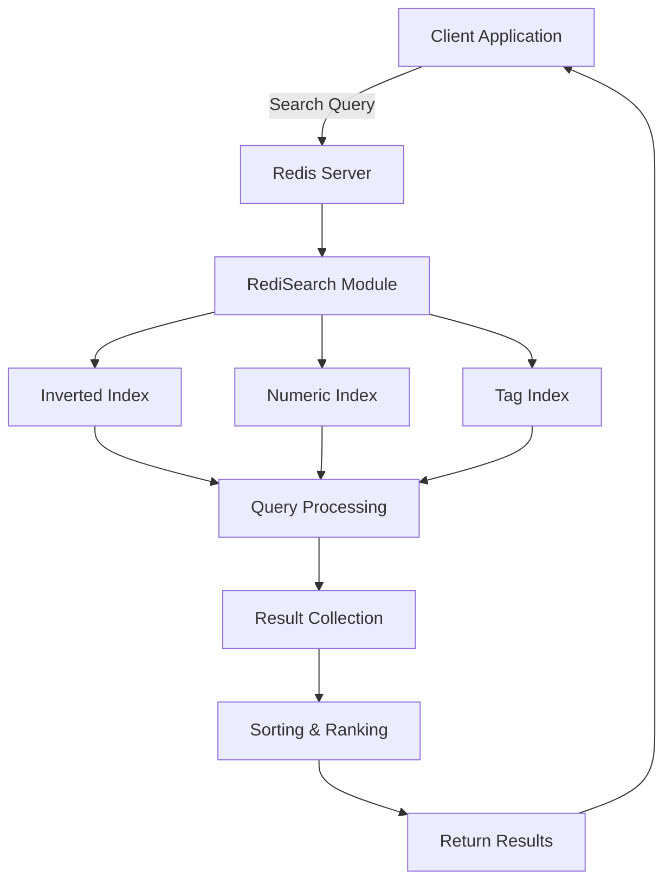

# Redis Search Engine

## Introduction

Redis is primarily known as an in-memory key-value store, but with the RediSearch module, it transforms into a powerful, feature-rich search engine. This guide explores how to leverage Redis for full-text search capabilities, allowing you to build fast, scalable search functionality into your applications without the need for a separate specialized search service.

Whether you're building a product catalog, content management system, or any application requiring search functionality, Redis Search provides a straightforward yet powerful solution that maintains Redis's renowned performance characteristics.

## What is Redis Search?

Redis Search (RediSearch) is a module that adds full-text search capabilities to Redis. It allows you to:

- Create secondary indexes on Redis hashes
- Perform complex text searches with ranking
- Filter by numeric fields
- Aggregate results
- Execute complex queries combining full-text search with numeric and geo filters

Let's dive into how it works and how to use it effectively.

## Getting Started with Redis Search

### Prerequisites

Before we begin, you'll need:

- Redis server installed (version 6.0 or later recommended)
- RediSearch module installed

### Installing RediSearch

You can install Redis with the RediSearch module in several ways:

#### Option 1: Using Docker

```bash
docker run -p 6379:6379 redislabs/redisearch:latest
```

#### Option 2: From Redis Stack

Redis Stack includes RediSearch and other useful modules:

```bash
docker run -p 6379:6379 redis/redis-stack:latest
```

#### Option 3: Compile from Source

For advanced users who prefer building from source:

```bash
git clone https://github.com/RediSearch/RediSearch.git
cd RediSearch
make build
```

## Creating Your First Search Index

Let's create a basic search index for a product catalog.

### Step 1: Connect to Redis

First, we need to connect to our Redis instance. We'll use the `redis-py` client library for Python:

```python
import redis
from redis.commands.search.field import TextField, NumericField, TagField
from redis.commands.search.indexDefinition import IndexDefinition, IndexType

# Connect to Redis
r = redis.Redis(host='localhost', port=6379, decode_responses=True)
```

### Step 2: Define the Schema and Create an Index

Now, let's define our product schema and create an index:

```python
# Check if index exists and drop it if it does
try:
    r.ft("idx:products").dropindex()
except:
    pass

# Define the schema for the product index
schema = (
    TextField("name", weight=5.0),          # Product name with high importance
    TextField("description"),                # Product description
    NumericField("price"),                   # Product price
    TagField("category", separator=",")      # Product categories as tags
)

# Create the index
r.ft("idx:products").create_index(
    schema,
    definition=IndexDefinition(prefix=["product:"], index_type=IndexType.HASH)
)
```

### Step 3: Add Data to the Index

Let's add some sample products to our Redis database:

```python
# Add some sample products
products = [
    {
        "name": "Wireless Headphones",
        "description": "Noise-cancelling Bluetooth headphones with 20-hour battery life",
        "price": 149.99,
        "category": "electronics,audio"
    },
    {
        "name": "Smartphone",
        "description": "Latest model with high-resolution camera and fast processor",
        "price": 799.99,
        "category": "electronics,phones"
    },
    {
        "name": "Coffee Maker",
        "description": "Programmable coffee machine with built-in grinder",
        "price": 89.99,
        "category": "kitchen,appliances"
    },
    {
        "name": "Running Shoes",
        "description": "Lightweight running shoes with extra cushioning",
        "price": 79.99,
        "category": "clothing,sports"
    }
]

# Store products in Redis
for i, product in enumerate(products):
    product_id = f"product:{i+1}"
    r.hset(product_id, mapping=product)
```

### Step 4: Perform Basic Searches

Now we can perform searches against our product index:

```python
# Basic full-text search for "headphones"
results = r.ft("idx:products").search("headphones")

print(f"Found {results.total} results:")
for doc in results.docs:
    print(f"- {doc.name}: ${doc.price}")

# Output:
# Found 1 results:
# - Wireless Headphones: $149.99
```

## Advanced Search Capabilities

RediSearch offers many advanced search capabilities. Let's explore some of them:

### Filtering by Numeric Fields

You can filter results based on numeric fields, such as price ranges:

```python
# Search for electronics under $200
query = "(@category:{electronics}) (@price:[0 200])"
results = r.ft("idx:products").search(query)

print(f"Electronics under $200 ({results.total} results):")
for doc in results.docs:
    print(f"- {doc.name}: ${doc.price}")

# Output:
# Electronics under $200 (1 results):
# - Wireless Headphones: $149.99
```

### Using Tag Fields for Exact Matching

Tag fields are perfect for faceted searches:

```python
# Search for kitchen products
query = "@category:{kitchen}"
results = r.ft("idx:products").search(query)

print(f"Kitchen products ({results.total} results):")
for doc in results.docs:
    print(f"- {doc.name}")

# Output:
# Kitchen products (1 results):
# - Coffee Maker
```

### Combining Multiple Conditions

You can create complex queries combining text, numeric and tag conditions:

```python
# Search for products that mention "lightweight" and cost less than $100
query = "lightweight (@price:[0 100])"
results = r.ft("idx:products").search(query)

print(f"Lightweight products under $100 ({results.total} results):")
for doc in results.docs:
    print(f"- {doc.name}: ${doc.price}")

# Output:
# Lightweight products under $100 (1 results):
# - Running Shoes: $79.99
```

## Building a Real-World Search Application

Let's create a more practical example: a movies database with search functionality.

### Step 1: Creating the Movie Index

```python
import redis
import json
from redis.commands.search.field import TextField, NumericField, TagField
from redis.commands.search.indexDefinition import IndexDefinition, IndexType

# Connect to Redis
r = redis.Redis(host='localhost', port=6379, decode_responses=True)

# Drop existing index if it exists
try:
    r.ft("idx:movies").dropindex()
except:
    pass

# Define the schema for the movie index
schema = (
    TextField("title", weight=5.0),         # Movie title with high importance
    TextField("plot"),                       # Movie plot
    NumericField("year"),                    # Release year
    NumericField("rating"),                  # Movie rating (1-10)
    TagField("genres", separator=","),       # Movie genres as tags
    TagField("director"),                    # Movie director
    TagField("actors", separator=",")        # Movie actors as tags
)

# Create the index
r.ft("idx:movies").create_index(
    schema,
    definition=IndexDefinition(prefix=["movie:"], index_type=IndexType.HASH)
)
```

### Step 2: Loading Sample Movie Data

```python
# Sample movie data
movies = [
    {
        "title": "The Shawshank Redemption",
        "plot": "Two imprisoned men bond over a number of years, finding solace and eventual redemption through acts of common decency.",
        "year": 1994,
        "rating": 9.3,
        "genres": "drama,crime",
        "director": "Frank Darabont",
        "actors": "Tim Robbins,Morgan Freeman"
    },
    {
        "title": "The Godfather",
        "plot": "The aging patriarch of an organized crime dynasty transfers control of his clandestine empire to his reluctant son.",
        "year": 1972,
        "rating": 9.2,
        "genres": "crime,drama",
        "director": "Francis Ford Coppola",
        "actors": "Marlon Brando,Al Pacino,James Caan"
    },
    {
        "title": "Pulp Fiction",
        "plot": "The lives of two mob hitmen, a boxer, a gangster and his wife, and a pair of diner bandits intertwine in four tales of violence and redemption.",
        "year": 1994,
        "rating": 8.9,
        "genres": "crime,drama",
        "director": "Quentin Tarantino",
        "actors": "John Travolta,Uma Thurman,Samuel L. Jackson"
    },
    {
        "title": "The Dark Knight",
        "plot": "When the menace known as the Joker wreaks havoc and chaos on the people of Gotham, Batman must accept one of the greatest psychological and physical tests of his ability to fight injustice.",
        "year": 2008,
        "rating": 9.0,
        "genres": "action,crime,drama",
        "director": "Christopher Nolan",
        "actors": "Christian Bale,Heath Ledger,Aaron Eckhart"
    },
    {
        "title": "Inception",
        "plot": "A thief who steals corporate secrets through the use of dream-sharing technology is given the inverse task of planting an idea into the mind of a C.E.O.",
        "year": 2010,
        "rating": 8.8,
        "genres": "action,adventure,sci-fi",
        "director": "Christopher Nolan",
        "actors": "Leonardo DiCaprio,Joseph Gordon-Levitt,Ellen Page"
    }
]

# Store movies in Redis
for i, movie in enumerate(movies):
    movie_id = f"movie:{i+1}"
    r.hset(movie_id, mapping=movie)
```

### Step 3: Example Search Queries

Now let's perform various searches:

```python
# Function to display search results
def display_results(results, title):
    print(f"
{title} ({results.total} results):")
    for doc in results.docs:
        print(f"- {doc.title} ({doc.year}): Rating {doc.rating}")
        print(f"  Genres: {doc.genres}")
        print(f"  Director: {doc.director}")
        print(f"  Plot: {doc.plot[:100]}..." if len(doc.plot) > 100 else doc.plot)
        print()

# 1. Search for all movies directed by Christopher Nolan
query = "@director:{Christopher Nolan}"
results = r.ft("idx:movies").search(query)
display_results(results, "Christopher Nolan Movies")

# 2. Search for sci-fi movies with a rating above 8.5
query = "@genres:{sci-fi} @rating:[8.5 +inf]"
results = r.ft("idx:movies").search(query)
display_results(results, "Sci-Fi Movies rated above 8.5")

# 3. Search for movies from the 1990s that mention "redemption"
query = "redemption @year:[1990 1999]"
results = r.ft("idx:movies").search(query)
display_results(results, "1990s Movies about Redemption")

# 4. Search for crime movies featuring Al Pacino
query = "@genres:{crime} @actors:{Al Pacino}"
results = r.ft("idx:movies").search(query)
display_results(results, "Crime Movies with Al Pacino")
```

### Sample Output:

```
Christopher Nolan Movies (2 results):
- The Dark Knight (2008): Rating 9.0
  Genres: action,crime,drama
  Director: Christopher Nolan
  Plot: When the menace known as the Joker wreaks havoc and chaos on the people of Gotham, Batman must accept one...

- Inception (2010): Rating 8.8
  Genres: action,adventure,sci-fi
  Director: Christopher Nolan
  Plot: A thief who steals corporate secrets through the use of dream-sharing technology is given the inverse task...

Sci-Fi Movies rated above 8.5 (1 results):
- Inception (2010): Rating 8.8
  Genres: action,adventure,sci-fi
  Director: Christopher Nolan
  Plot: A thief who steals corporate secrets through the use of dream-sharing technology is given the inverse task...

1990s Movies about Redemption (1 results):
- The Shawshank Redemption (1994): Rating 9.3
  Genres: drama,crime
  Director: Frank Darabont
  Plot: Two imprisoned men bond over a number of years, finding solace and eventual redemption through acts of commo...

Crime Movies with Al Pacino (1 results):
- The Godfather (1972): Rating 9.2
  Genres: crime,drama
  Director: Francis Ford Coppola
  Plot: The aging patriarch of an organized crime dynasty transfers control of his clandestine empire to his relucta...
```

## How Redis Search Works

Let's understand the architecture and internals of Redis Search:



RediSearch uses different index types:
1. **Inverted Index**: Maps words to the documents containing them
2. **Numeric Index**: Efficient range queries on numeric values
3. **Tag Index**: For exact-match queries on multi-value fields
4. **Geo Index**: For geographical radius queries

When you perform a search, RediSearch:
1. Parses the query
2. Looks up matching documents in the relevant indices
3. Scores and ranks the results
4. Returns the matching documents

## Performance Considerations

RediSearch is designed to be fast, but there are some best practices to ensure optimal performance:

### 1. Indexing Best Practices

- Only index fields you need to search on
- Consider field weights carefully (higher weights = more importance in ranking)
- Use the right field types (Text vs. Tag vs. Numeric)

### 2. Memory Usage

RediSearch indexes consume additional memory beyond your data. As a rough estimate:
- Text fields: ~50% overhead
- Numeric fields: ~8 bytes per value
- Tag fields: Depends on the number of unique tags

### 3. Query Optimization

- Use specific field queries when possible: `@title:word` instead of just `word`
- For exact matching, use tag fields instead of text fields
- Limit the number of returned fields with `RETURN` to reduce response size

### 4. Scaling Considerations

For large datasets:
- Consider Redis Cluster for horizontal scaling
- Use pagination with `LIMIT offset num` for large result sets
- Implement proper caching strategies for common queries

## Advanced Features

### Auto-Complete Suggestions

RediSearch provides a separate suggestion feature for implementing auto-complete:

```python
# Add some suggestions
r.execute_command('FT.SUGADD', 'movie_suggestions', 'The Shawshank Redemption', 1.0)
r.execute_command('FT.SUGADD', 'movie_suggestions', 'The Godfather', 1.0)
r.execute_command('FT.SUGADD', 'movie_suggestions', 'The Dark Knight', 1.0)

# Get suggestions
suggestions = r.execute_command('FT.SUGGET', 'movie_suggestions', 'The', 'FUZZY')
print("Suggestions for 'The':", suggestions)

# Output:
# Suggestions for 'The': ['The Shawshank Redemption', 'The Godfather', 'The Dark Knight']
```

### Aggregations

RediSearch supports aggregation operations similar to SQL's GROUP BY:

```python
# Count movies by director
agg_result = r.ft("idx:movies").aggregate().group_by(
    ["@director"],
    ["count() as count"]
).execute()

print("Movies by director:")
for row in agg_result:
    print(f"- {row['director']}: {row['count']} movies")

# Output:
# Movies by director:
# - Francis Ford Coppola: 1 movies
# - Quentin Tarantino: 1 movies
# - Frank Darabont: 1 movies
# - Christopher Nolan: 2 movies
```

### Synonym Support

You can define synonyms to improve search results:

```python
# Add synonyms
r.execute_command('FT.SYNUPDATE', 'idx:movies', 'movie_synonyms', 'film', 'movie', 'picture')

# Now searching for "film" will also find results with "movie" or "picture"
```

## Practical Use Cases for Redis Search

### 1. E-commerce Product Search

Redis Search excels at product catalog searches with features like:
- Full-text search on product names and descriptions
- Filtering by price ranges, ratings, or other attributes
- Faceted search using tag fields for categories, brands, etc.
- Auto-complete suggestions for search box

### 2. Content Management Systems

For blogs, news sites, or documentation:
- Fast full-text search across articles
- Filter by publication date, author, or category
- Highlight matching terms in search results
- Related content recommendations

### 3. Real-time Analytics

- Search through logs or events
- Aggregate and analyze time-series data
- Filter by various dimensions
- Create real-time dashboards

### 4. Geospatial Applications

- Combine full-text search with geo filters
- "Find restaurants near me that serve pizza"
- Filter by distance, rating, and other attributes

## Summary

Redis Search transforms Redis from a simple key-value store into a powerful search engine with capabilities comparable to dedicated search platforms. Its key advantages include:

- **Speed**: In-memory architecture provides millisecond response times
- **Simplicity**: Integrated with Redis, reducing architectural complexity
- **Flexibility**: Supports text search, numeric filters, and geo-queries
- **Scalability**: Can handle millions of documents with proper configuration

As you've seen throughout this guide, implementing search functionality with Redis is straightforward yet powerful, making it an excellent choice for many applications where search is a critical feature.

## Exercises for Practice

1. **Basic Index Creation**
   - Create an index for a bookstore with fields for title, author, genre, price, and publication year
   - Add at least 10 sample books
   - Implement a search to find books by a specific author

2. **Advanced Query Building**
   - Create a recipe database with ingredients as tag fields
   - Implement a search that finds recipes containing specific ingredients
   - Add filters for preparation time and difficulty level

3. **Auto-Complete Implementation**
   - Build a product search with auto-complete suggestions
   - Implement fuzzy matching for typo tolerance
   - Add popularity weighting to suggestions

4. **Performance Optimization**
   - Create a large dataset (10,000+ documents)
   - Measure query performance
   - Implement optimizations to improve response time

## Additional Resources

- [RediSearch Documentation](https://redis.io/docs/stack/search/)
- [Redis University RediSearch Course](https://university.redis.com/)
- [RediSearch GitHub Repository](https://github.com/RediSearch/RediSearch)
- [Redis Stack GitHub](https://github.com/redis-stack)
- [Python Redis-py Client](https://github.com/redis/redis-py)

Remember that Redis Search is constantly evolving with new features and improvements. Check the official documentation for the most up-to-date information.