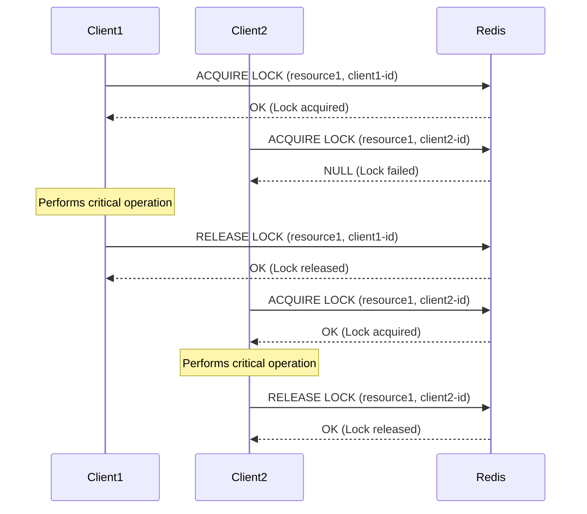

# Redis Distributed Lock Manager

## Introduction

In distributed systems, coordinating access to shared resources is a critical challenge. When multiple services or processes need to access or modify the same resource simultaneously, race conditions can occur, leading to data inconsistency or corruption. This is where distributed locks come into play.

A **Distributed Lock Manager (DLM)** provides a mechanism for mutual exclusion across distributed systems. Redis, with its speed and built-in atomic operations, makes an excellent foundation for implementing distributed locks.

In this tutorial, we'll learn:
- What distributed locks are and why they're important
- How to implement distributed locks using Redis
- Best practices and common pitfalls
- Real-world applications and use cases

## What are Distributed Locks?

A distributed lock is a synchronization mechanism that allows only one process in a distributed system to access a shared resource at any given time. Unlike local locks (such as mutexes or semaphores within a single process), distributed locks work across multiple servers or services.

### Key Properties of a Good Distributed Lock

1. **Mutual Exclusion**: Only one client can hold the lock at any time
2. **Deadlock Free**: If a client crashes while holding a lock, the system should recover
3. **Fault Tolerance**: The lock should work correctly even if some nodes fail
4. **Scalability**: The locking mechanism should not become a bottleneck

## Implementing Distributed Locks with Redis

Redis provides atomic operations that make it suitable for implementing distributed locks. The most common pattern is known as "Redlock" (Redis Distributed Lock).

### Basic Lock Implementation

Here's a simple implementation using Redis commands:

```javascript
// Function to acquire a lock
async function acquireLock(lockName, clientId, ttlInSeconds) {
  // SET with NX option means "Set if Not eXists"
  // This ensures atomic lock creation
  const result = await redis.set(
    lockName,
    clientId,
    'NX',
    'EX',
    ttlInSeconds
  );
  
  return result === 'OK';
}

// Function to release a lock
async function releaseLock(lockName, clientId) {
  // Using Lua script to ensure atomic operation
  const script = `
    if redis.call("GET", KEYS[1]) == ARGV[1] then
      return redis.call("DEL", KEYS[1])
    else
      return 0
    end
  `;
  
  const result = await redis.eval(script, 1, lockName, clientId);
  return result === 1;
}
```

Let's break down how this works:

1. **Lock Acquisition**:
   - We try to SET a key (the lock name) with a unique value (client ID)
   - The 'NX' option ensures the operation only succeeds if the key doesn't exist yet
   - The 'EX' option sets an expiration time for the lock, preventing deadlocks if a client crashes
   
2. **Lock Release**:
   - We first check if the lock still belongs to us (comparing the stored value with our client ID)
   - If it does, we delete the key, releasing the lock
   - Using a Lua script ensures this check-and-delete operation is atomic

### Example Usage

Here's how you might use these functions in a real application:

```javascript
const { v4: uuidv4 } = require('uuid');
const Redis = require('ioredis');
const redis = new Redis();

async function performCriticalOperation() {
  const lockName = 'inventory:item:10';
  const clientId = uuidv4(); // Generate a unique client identifier
  const ttl = 30; // Lock expires after 30 seconds
  
  try {
    // Try to acquire the lock
    const acquired = await acquireLock(lockName, clientId, ttl);
    
    if (!acquired) {
      console.log('Failed to acquire lock, someone else has it');
      return false;
    }
    
    console.log('Lock acquired, performing critical operation...');
    
    // Perform your critical operation here
    await updateInventory(10, -5); // Reduce item #10 by 5 units
    
    console.log('Operation completed');
    return true;
  } catch (err) {
    console.error('Error during critical operation:', err);
    return false;
  } finally {
    // Always try to release the lock when done
    await releaseLock(lockName, clientId);
    console.log('Lock released');
  }
}
```

Output:
```
Lock acquired, performing critical operation...
Operation completed
Lock released
```

## The Redlock Algorithm

The simple implementation above works for many scenarios, but it has limitations. For high-reliability systems, Redis creator Salvatore Sanfilippo proposed the **Redlock** algorithm, which works with multiple Redis instances.

The basic flow of Redlock is:

1. Get the current time
2. Try to acquire the lock in all Redis instances sequentially
3. Calculate the time elapsed to acquire locks
4. If the client acquired locks from a majority of instances and the elapsed time is less than the lock validity time, the lock is considered acquired
5. If the client failed to acquire the lock, it tries to unlock all instances

Let's implement a simplified version of Redlock:

```javascript
async function acquireRedlock(lockName, clientId, ttlMs, redisInstances) {
  const startTime = Date.now();
  let lockAcquired = 0;
  
  // Try to acquire the lock in all instances
  for (const redis of redisInstances) {
    try {
      const result = await redis.set(lockName, clientId, 'NX', 'PX', ttlMs);
      if (result === 'OK') {
        lockAcquired++;
      }
    } catch (err) {
      console.error('Error acquiring lock on Redis instance:', err);
    }
  }
  
  // Calculate elapsed time
  const elapsedTime = Date.now() - startTime;
  const validityTime = ttlMs - elapsedTime;
  
  // Check if we acquired lock on majority of instances and have enough validity time
  const majority = Math.floor(redisInstances.length / 2) + 1;
  const lockSuccess = lockAcquired >= majority && validityTime > 0;
  
  if (!lockSuccess) {
    // Failed to acquire the lock, release any acquired locks
    for (const redis of redisInstances) {
      try {
        await redis.eval(
          `if redis.call("GET", KEYS[1]) == ARGV[1] then return redis.call("DEL", KEYS[1]) else return 0 end`,
          1,
          lockName,
          clientId
        );
      } catch (err) {
        console.error('Error releasing lock on Redis instance:', err);
      }
    }
  }
  
  return lockSuccess;
}
```

## Visualizing Distributed Locks

Here's a diagram showing how distributed locks work in a system with multiple clients:



## Best Practices for Redis Locks

To ensure your distributed locks are reliable and efficient:

1. **Always Use Timeouts**: Set a reasonable expiration time for locks to prevent deadlocks if a client crashes.

2. **Use Unique Client IDs**: Ensure that each client has a unique identifier (typically a UUID) so it only releases locks it created.

3. **Implement Retry with Backoff**: When a lock acquisition fails, retry with an exponential backoff to avoid overwhelming the system:

```javascript
async function acquireLockWithRetry(lockName, clientId, ttl, maxRetries = 5, initialBackoff = 100) {
  let retries = 0;
  
  while (retries < maxRetries) {
    const acquired = await acquireLock(lockName, clientId, ttl);
    
    if (acquired) {
      return true;
    }
    
    // Calculate backoff time with jitter to avoid thundering herd
    const backoffTime = initialBackoff * Math.pow(2, retries) * (0.8 + Math.random() * 0.4);
    
    console.log(`Lock acquisition failed, retrying in ${backoffTime}ms`);
    await new Promise(resolve => setTimeout(resolve, backoffTime));
    
    retries++;
  }
  
  return false;
}
```

4. **Consider Lock Extension**: For operations that may take longer than expected, implement a mechanism to extend the lock's expiration time.

```javascript
async function extendLock(lockName, clientId, ttl) {
  // Only extend if we still own the lock
  const script = `
    if redis.call("GET", KEYS[1]) == ARGV[1] then
      return redis.call("EXPIRE", KEYS[1], ARGV[2])
    else
      return 0
    end
  `;
  
  const result = await redis.eval(script, 1, lockName, clientId, ttl);
  return result === 1;
}
```

5. **Monitor Lock Acquisition Time**: If locks are taking too long to acquire, it may indicate contention issues in your system.

## Common Distributed Lock Patterns

### Resource Locking

The most common use is to protect access to a shared resource:

```javascript
async function updateUserProfile(userId, data) {
  const lockName = `user:${userId}:lock`;
  const clientId = uuidv4();
  
  if (await acquireLock(lockName, clientId, 10)) {
    try {
      // Perform update operations safely
      await db.users.update(userId, data);
      return { success: true };
    } finally {
      await releaseLock(lockName, clientId);
    }
  } else {
    return { success: false, message: "Profile is being updated by another process" };
  }
}
```

### Rate Limiting

Distributed locks can be used to implement rate limiting across a cluster:

```javascript
async function rateLimitRequest(userId, operation, limit) {
  const lockName = `ratelimit:${userId}:${operation}`;
  
  // Try to get the current counter
  let counter = await redis.get(lockName);
  
  if (!counter) {
    // First operation in the time window
    await redis.set(lockName, 1, 'EX', 60); // Reset after 60 seconds
    return true;
  } else if (parseInt(counter) < limit) {
    // Increment the counter
    await redis.incr(lockName);
    return true;
  } else {
    // Rate limit exceeded
    return false;
  }
}
```

## Real-World Applications

### E-commerce Inventory Management

In an e-commerce platform, distributed locks can prevent overselling inventory:

```javascript
async function processOrder(orderId, items) {
  // Acquire locks for all items being ordered
  const locks = [];
  const clientId = uuidv4();
  
  for (const item of items) {
    const lockName = `inventory:${item.id}:lock`;
    const acquired = await acquireLock(lockName, clientId, 30);
    
    if (!acquired) {
      // Release any locks we acquired so far
      for (const lock of locks) {
        await releaseLock(lock, clientId);
      }
      return { success: false, message: "Inventory being updated, please try again" };
    }
    
    locks.push(lockName);
  }
  
  try {
    // Check inventory levels
    for (const item of items) {
      const available = await getInventoryLevel(item.id);
      if (available < item.quantity) {
        return { success: false, message: `Not enough inventory for item ${item.id}` };
      }
    }
    
    // Update inventory and process order
    for (const item of items) {
      await updateInventory(item.id, -item.quantity);
    }
    
    await finalizeOrder(orderId);
    return { success: true };
  } finally {
    // Release all locks
    for (const lockName of locks) {
      await releaseLock(lockName, clientId);
    }
  }
}
```

### Distributed Job Queue

Distributed locks can ensure that only one worker processes a job at a time:

```javascript
async function processJob(jobId) {
  const lockName = `job:${jobId}:lock`;
  const clientId = uuidv4();
  
  if (await acquireLock(lockName, clientId, 60)) {
    try {
      const job = await getJobDetails(jobId);
      
      if (job.status !== 'pending') {
        return { success: false, message: "Job is not in pending state" };
      }
      
      await updateJobStatus(jobId, 'processing');
      
      // Do the actual job processing
      const result = await runJobTasks(job);
      
      await updateJobStatus(jobId, result.success ? 'completed' : 'failed', result);
      return { success: true };
    } finally {
      await releaseLock(lockName, clientId);
    }
  } else {
    return { success: false, message: "Job is already being processed" };
  }
}
```

## Building a Complete Distributed Lock Manager

Now, let's put everything together to build a complete distributed lock manager class that handles acquisition, extension, and release of locks:

```javascript
class RedisLockManager {
  constructor(redisClient) {
    this.redis = redisClient;
    this.activeLocks = new Map();
    this.extensionIntervals = new Map();
  }
  
  async acquireLock(resource, options = {}) {
    const {
      ttl = 30,
      waitTime = 0,
      retry = 3,
      retryDelay = 200,
      autoExtend = false,
      extensionInterval = Math.floor(ttl / 3) * 1000
    } = options;
    
    const lockName = `lock:${resource}`;
    const clientId = uuidv4();
    
    // Try to acquire the lock with retries
    let acquired = false;
    let attempts = 0;
    
    while (!acquired && attempts < retry) {
      acquired = await this._acquireLock(lockName, clientId, ttl);
      
      if (!acquired && waitTime > 0) {
        const delay = Math.min(retryDelay * Math.pow(2, attempts), waitTime);
        await new Promise(resolve => setTimeout(resolve, delay));
      }
      
      attempts++;
    }
    
    if (!acquired) {
      return null;
    }
    
    // Store the active lock
    this.activeLocks.set(resource, { lockName, clientId, ttl });
    
    // Set up auto-extension if requested
    if (autoExtend) {
      const interval = setInterval(async () => {
        try {
          await this._extendLock(lockName, clientId, ttl);
        } catch (err) {
          console.error(`Failed to extend lock for ${resource}:`, err);
          clearInterval(interval);
          this.extensionIntervals.delete(resource);
        }
      }, extensionInterval);
      
      this.extensionIntervals.set(resource, interval);
    }
    
    return {
      resource,
      clientId,
      extend: async (newTtl = ttl) => this._extendLock(lockName, clientId, newTtl),
      release: async () => this.releaseLock(resource)
    };
  }
  
  async releaseLock(resource) {
    const lockInfo = this.activeLocks.get(resource);
    
    if (!lockInfo) {
      return false;
    }
    
    // Clear any extension interval
    const interval = this.extensionIntervals.get(resource);
    if (interval) {
      clearInterval(interval);
      this.extensionIntervals.delete(resource);
    }
    
    const { lockName, clientId } = lockInfo;
    const released = await this._releaseLock(lockName, clientId);
    
    if (released) {
      this.activeLocks.delete(resource);
    }
    
    return released;
  }
  
  async _acquireLock(lockName, clientId, ttl) {
    const result = await this.redis.set(lockName, clientId, 'NX', 'EX', ttl);
    return result === 'OK';
  }
  
  async _extendLock(lockName, clientId, ttl) {
    const script = `
      if redis.call("GET", KEYS[1]) == ARGV[1] then
        return redis.call("EXPIRE", KEYS[1], ARGV[2])
      else
        return 0
      end
    `;
    
    const result = await this.redis.eval(script, 1, lockName, clientId, ttl);
    return result === 1;
  }
  
  async _releaseLock(lockName, clientId) {
    const script = `
      if redis.call("GET", KEYS[1]) == ARGV[1] then
        return redis.call("DEL", KEYS[1])
      else
        return 0
      end
    `;
    
    const result = await this.redis.eval(script, 1, lockName, clientId);
    return result === 1;
  }
}
```

### Using the Lock Manager

Here's how you'd use this class in a real application:

```javascript
const Redis = require('ioredis');
const redis = new Redis();
const lockManager = new RedisLockManager(redis);

async function updateUserData(userId, data) {
  // Acquire a lock for this user
  const lock = await lockManager.acquireLock(`user:${userId}`, {
    ttl: 30,                 // 30 second timeout
    retry: 5,                // Retry 5 times
    waitTime: 5000,          // Wait up to 5 seconds total
    autoExtend: true         // Auto-extend the lock
  });
  
  if (!lock) {
    return { success: false, message: "Could not acquire lock for this user" };
  }
  
  try {
    console.log(`Lock acquired for user ${userId}`);
    
    // Get current data
    const userData = await fetchUserData(userId);
    
    // Perform updates
    const updatedData = { ...userData, ...data };
    
    // Save back to database
    await saveUserData(userId, updatedData);
    
    return { success: true, data: updatedData };
  } catch (err) {
    console.error(`Error updating user ${userId}:`, err);
    return { success: false, error: err.message };
  } finally {
    // Always release the lock
    await lock.release();
    console.log(`Lock released for user ${userId}`);
  }
}
```

Output:
```
Lock acquired for user 12345
Lock released for user 12345
```

## Potential Challenges with Distributed Locks

### Clock Drift

Servers in different locations may have slightly different system clocks, which can affect lock expiry timing. To mitigate this:

1. Use NTP to synchronize clocks
2. Add buffer time to lock expiry
3. Consider client-side expiry tracking

### Network Partitions

During network partitions, nodes might not be able to communicate with each other, leading to potential split-brain scenarios. The Redlock algorithm helps address this by requiring majority consensus.

### Performance Considerations

Lock operations add overhead to your system. To optimize:

1. Keep lock TTL as short as reasonably possible
2. Minimize the scope of what's being locked
3. Consider using Redis Cluster for higher availability
4. Monitor lock contention and adjust your strategy accordingly

## Summary

Distributed locks are an essential tool for ensuring data consistency in distributed systems. Redis provides an excellent foundation for implementing distributed locks due to its speed, simplicity, and atomic operations.

In this tutorial, we've covered:

1. **Basic Lock Implementation** - Using Redis SET NX for simple distributed locks
2. **The Redlock Algorithm** - For higher reliability across multiple Redis instances
3. **Best Practices** - Including timeout management, unique IDs, and retry strategies
4. **Common Patterns** - Resource locking, rate limiting, and more
5. **Real-World Applications** - E-commerce inventory and job queues
6. **A Complete Lock Manager** - Combining all concepts into a reusable class

By implementing distributed locks with Redis, you can ensure that your distributed applications maintain data consistency even under high load or partial failure conditions.

## Additional Resources and Exercises

### Resources

- [Redis.io Documentation](https://redis.io/topics/distlock)
- [Redlock Algorithm](https://redis.io/topics/distlock)
- [Redis Command Reference](https://redis.io/commands)

### Exercises

1. **Basic Lock Implementation**: Implement a simple distributed lock using Redis in your preferred programming language.

2. **Lock Extension**: Create a "heartbeat" mechanism that extends a lock's expiration time while a process is still working.

3. **Redlock Implementation**: Implement the full Redlock algorithm with multiple Redis instances.

4. **Distributed Counter**: Use Redis to implement a distributed counter that can safely increment and decrement values from multiple processes.

5. **Rate Limiter**: Build a distributed rate limiter that restricts the number of operations a user can perform within a time window.