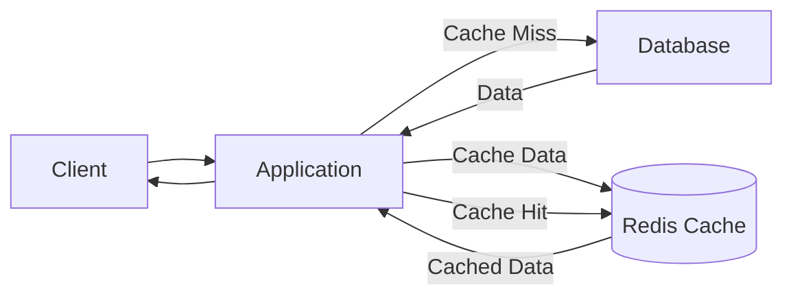

# Redis Caching Layer

## Introduction

A caching layer is one of the most effective ways to improve your application's performance. When your application needs to retrieve data that's expensive to calculate or fetch (like database queries or API calls), storing that data temporarily in a fast, in-memory cache can dramatically reduce response times for subsequent requests.

Redis (Remote Dictionary Server) is an open-source, in-memory data structure store that excels as a caching solution. In this tutorial, we'll explore how to implement a Redis caching layer in your applications to boost performance and reduce load on your primary data sources.

## What is a Redis Caching Layer?

A Redis caching layer sits between your application and your data source (typically a database):



The basic flow works like this:

1. Your application receives a request for data
2. Before querying the database, it checks if the data exists in Redis
3. If found (cache hit), it returns the cached data immediately
4. If not found (cache miss), it queries the database, stores the result in Redis, and returns the data

This pattern is often called the "Cache-Aside" or "Lazy Loading" pattern and is one of the most common caching strategies.

## Setting Up Redis

Before we dive into implementation, you'll need Redis installed and running. Here's how to get started:

### Installation

#### On macOS (using Homebrew):

```bash
brew install redis
brew services start redis
```

#### On Ubuntu/Debian:

```bash
sudo apt update
sudo apt install redis-server
sudo systemctl start redis-server
```

#### Using Docker:

```bash
docker run --name redis-cache -p 6379:6379 -d redis
```

### Verifying Installation

Once installed, test your Redis connection:

```bash
redis-cli ping
```

You should receive a `PONG` response, indicating Redis is running correctly.

## Implementing a Redis Cache in Node.js

Let's implement a simple Redis caching layer in a Node.js application. We'll use the `redis` npm package.

### Step 1: Install Dependencies

```bash
npm install redis
```

### Step 2: Create a Redis Client

```javascript
const redis = require('redis');
const { promisify } = require('util');

// Create Redis client
const client = redis.createClient({
  host: process.env.REDIS_HOST || 'localhost',
  port: process.env.REDIS_PORT || 6379,
});

// Promisify Redis commands
const getAsync = promisify(client.get).bind(client);
const setAsync = promisify(client.set).bind(client);
const delAsync = promisify(client.del).bind(client);

// Handle Redis connection errors
client.on('error', (err) => {
  console.error('Redis Error:', err);
});

module.exports = {
  getAsync,
  setAsync,
  delAsync,
  client,
};
```

### Step 3: Create a Generic Cache Function

Now, let's create a generic function that implements the cache-aside pattern:

```javascript
const { getAsync, setAsync } = require('./redis-client');

/**
 * Get data with Redis caching
 * @param {string} key - Cache key
 * @param {Function} fetchFunction - Function to fetch data if not in cache
 * @param {number} ttl - Time to live in seconds
 * @returns {Promise<any>} - Resolved data
 */
async function getCachedData(key, fetchFunction, ttl = 3600) {
  try {
    // Try to get data from cache
    const cachedData = await getAsync(key);
    
    if (cachedData) {
      console.log(`Cache hit for key: ${key}`);
      return JSON.parse(cachedData);
    }
    
    console.log(`Cache miss for key: ${key}`);
    // If not in cache, fetch data
    const freshData = await fetchFunction();
    
    // Store in cache for future requests
    await setAsync(key, JSON.stringify(freshData), 'EX', ttl);
    
    return freshData;
  } catch (error) {
    console.error('Error in getCachedData:', error);
    // On error, fetch directly (fallback)
    return fetchFunction();
  }
}

module.exports = { getCachedData };
```

### Step 4: Using the Cache in Your Application

Let's see how we might use this in an Express.js API:

```javascript
const express = require('express');
const { getCachedData } = require('./cache-service');
const { getProductFromDB } = require('./db-service'); // Hypothetical database service

const app = express();
const PORT = process.env.PORT || 3000;

app.get('/products/:id', async (req, res) => {
  const productId = req.params.id;
  
  try {
    // Use the cache service with a custom fetch function
    const product = await getCachedData(
      `product:${productId}`,
      () => getProductFromDB(productId),
      3600 // Cache for 1 hour
    );
    
    res.json(product);
  } catch (error) {
    console.error('Error fetching product:', error);
    res.status(500).json({ error: 'Failed to fetch product' });
  }
});

app.listen(PORT, () => {
  console.log(`Server running on port ${PORT}`);
});
```

## Measuring Performance Improvement

Let's see how much performance improves with our Redis cache. Here's a simple benchmark:

```javascript
const { getCachedData } = require('./cache-service');

async function simulateExpensiveOperation() {
  // Simulate a slow database query or API call
  await new Promise(resolve => setTimeout(resolve, 500));
  return { id: 123, name: 'Sample Product', price: 99.99 };
}

async function benchmark() {
  console.time('Without Cache');
  await simulateExpensiveOperation();
  console.timeEnd('Without Cache');
  
  // First call - cache miss
  console.time('First Call (Cache Miss)');
  await getCachedData('benchmark:test', simulateExpensiveOperation, 60);
  console.timeEnd('First Call (Cache Miss)');
  
  // Second call - cache hit
  console.time('Second Call (Cache Hit)');
  await getCachedData('benchmark:test', simulateExpensiveOperation, 60);
  console.timeEnd('Second Call (Cache Hit)');
}

benchmark();
```

Output:
```
Without Cache: 503.285ms
First Call (Cache Miss): 506.123ms
Second Call (Cache Hit): 3.241ms
```

As you can see, the cached response is dramatically faster - over 150x in this example!

## Common Redis Caching Patterns

Let's explore a few common patterns for using Redis as a caching layer:

### 1. Time-based Expiration

The simplest approach is to set a time-to-live (TTL) on cache entries:

```javascript
// Cache data for 1 hour
await setAsync('user:123', JSON.stringify(userData), 'EX', 3600);
```

### 2. Cache Invalidation

When the underlying data changes, you need to invalidate the cache:

```javascript
async function updateUser(userId, userData) {
  // Update in database
  await updateUserInDB(userId, userData);
  
  // Invalidate cache
  await delAsync(`user:${userId}`);
}
```

### 3. Cache Stampede Protection

When a popular cache entry expires, multiple simultaneous requests can hit your database - this is called a "cache stampede". Here's a simple solution using locks:

```javascript
const { getAsync, setAsync } = require('./redis-client');

async function getCachedDataWithLock(key, fetchFunction, ttl = 3600) {
  const lockKey = `lock:${key}`;
  const lockTtl = 10; // 10 seconds lock timeout
  
  // Try to get from cache first
  const cachedData = await getAsync(key);
  if (cachedData) {
    return JSON.parse(cachedData);
  }
  
  // Try to acquire lock
  const lockAcquired = await setAsync(lockKey, '1', 'NX', 'EX', lockTtl);
  
  if (!lockAcquired) {
    // Someone else is refreshing, wait and retry
    await new Promise(resolve => setTimeout(resolve, 100));
    return getCachedDataWithLock(key, fetchFunction, ttl);
  }
  
  try {
    // Check cache again (another process might have updated it)
    const cachedDataRetry = await getAsync(key);
    if (cachedDataRetry) {
      return JSON.parse(cachedDataRetry);
    }
    
    // Fetch fresh data
    const freshData = await fetchFunction();
    
    // Store in cache
    await setAsync(key, JSON.stringify(freshData), 'EX', ttl);
    
    return freshData;
  } finally {
    // Release lock
    await delAsync(lockKey);
  }
}
```

## Real-World Use Cases

Let's explore some practical applications of Redis caching:

### 1. Database Query Caching

Database queries, especially complex ones, can be expensive. Caching the results can significantly improve performance:

```javascript
async function getUserWithPosts(userId) {
  const cacheKey = `user:${userId}:with_posts`;
  
  return getCachedData(
    cacheKey,
    async () => {
      // This expensive join query now runs only on cache misses
      const user = await db.query(`
        SELECT users.*, posts.* 
        FROM users 
        LEFT JOIN posts ON users.id = posts.user_id
        WHERE users.id = ?
      `, [userId]);
      
      return user;
    },
    1800 // Cache for 30 minutes
  );
}
```

### 2. API Rate Limiting

Redis is excellent for implementing API rate limiting:

```javascript
async function rateLimiter(req, res, next) {
  const userId = req.user.id;
  const key = `ratelimit:${userId}`;
  
  // Get current count
  const count = await getAsync(key) || 0;
  
  if (count >= 100) {
    return res.status(429).json({ error: 'Rate limit exceeded' });
  }
  
  // Increment count
  await client.incr(key);
  
  // Set expiry if first request
  if (count === 0) {
    await client.expire(key, 3600); // Reset after 1 hour
  }
  
  next();
}
```

### 3. Session Store

Redis is commonly used as a session store for web applications:

```javascript
const session = require('express-session');
const RedisStore = require('connect-redis')(session);

app.use(
  session({
    store: new RedisStore({ client: redisClient }),
    secret: 'your-secret-key',
    resave: false,
    saveUninitialized: false,
    cookie: { maxAge: 86400000 } // 1 day
  })
);
```

## Best Practices

To get the most out of your Redis caching layer:

1. **Choose appropriate TTLs**: Set expiration times based on how frequently your data changes
2. **Use meaningful keys**: Follow a consistent naming convention (e.g., `entity:id:attribute`)
3. **Monitor cache hit rates**: Track and optimize your cache performance
4. **Implement cache warming**: Pre-populate your cache for important data
5. **Plan for cache failures**: Always have a fallback to the primary data source
6. **Be mindful of memory usage**: Monitor Redis memory and implement eviction policies

## Common Redis Cache Commands

Here are some essential Redis commands for caching:

| Command | Description | Example |
|---------|-------------|---------|
| `SET` | Store a key-value pair | `SET user:123 '{"name":"John"}' EX 3600` |
| `GET` | Retrieve a value | `GET user:123` |
| `DEL` | Delete a key | `DEL user:123` |
| `EXISTS` | Check if a key exists | `EXISTS user:123` |
| `EXPIRE` | Set key expiration | `EXPIRE user:123 3600` |
| `TTL` | Get remaining time to live | `TTL user:123` |
| `FLUSHALL` | Clear entire cache | `FLUSHALL` |

## Summary

Redis caching layers offer a powerful way to improve your application's performance by reducing the load on your database and delivering faster responses to your users. By implementing proper caching strategies and following best practices, you can achieve significant performance gains with relatively little code.

Remember these key points:

- Redis is an in-memory data store ideal for caching
- The cache-aside pattern is the most common implementation approach
- Set appropriate TTLs based on your data's volatility
- Implement cache invalidation when the underlying data changes
- Monitor your cache performance and memory usage

## Exercises

1. Implement a Redis caching layer for a list of products in an e-commerce application
2. Create a function that automatically invalidates the cache when data is updated
3. Modify the caching example to include a compression mechanism for large objects
4. Implement a tiered caching strategy using both application-level (local) caching and Redis
5. Create a dashboard that monitors cache hit rates and performance gains

## Additional Resources

- [Redis Documentation](https://redis.io/documentation)
- [Redis Data Types](https://redis.io/topics/data-types)
- [Redis Pub/Sub](https://redis.io/topics/pubsub)
- [Redis Persistence](https://redis.io/topics/persistence)
- [Redis Cluster](https://redis.io/topics/cluster-tutorial)

By implementing a Redis caching layer, you'll significantly improve your application's performance, reduce database load, and provide a better experience for your users.