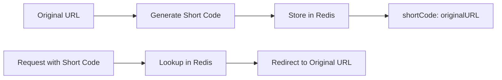

# Redis URL Shortener

## Introduction

URL shorteners have become essential tools in our digital landscape. They transform long, cumbersome URLs into brief, manageable links that are easier to share across platforms. In this tutorial, we'll build a simple yet powerful URL shortener using Redis as our database.

Redis is particularly well-suited for this task due to its speed, simplicity, and key-value structure. Our URL shortener will store original URLs as values, with shortened codes as keys, allowing for lightning-fast lookups.

By the end of this tutorial, you'll understand:
- How Redis works as a key-value store
- How to implement basic CRUD operations with Redis
- How to build a functional URL shortener service
- Best practices for generating unique short codes

## Prerequisites

Before we begin, make sure you have:
- Basic knowledge of JavaScript and Node.js
- Node.js installed on your computer
- Redis installed locally or access to a Redis instance
- Understanding of basic HTTP concepts

## Project Setup

Let's start by setting up our project:

```bash
mkdir redis-url-shortener
cd redis-url-shortener
npm init -y
npm install express redis nanoid
```

Here's what these packages do:
- **Express**: Web framework for handling HTTP requests
- **Redis**: Redis client for Node.js
- **nanoid**: Library for generating unique, URL-friendly IDs

Next, create an `index.js` file in your project directory:

```javascript
const express = require('express');
const redis = require('redis');
const { nanoid } = require('nanoid');
const util = require('util');

const app = express();
app.use(express.json());

// Create Redis client
const client = redis.createClient({
  host: 'localhost',
  port: 6379
});

// Promisify Redis operations
const setAsync = util.promisify(client.set).bind(client);
const getAsync = util.promisify(client.get).bind(client);

client.on('error', (err) => {
  console.error('Redis Error:', err);
});

// Base URL for our shortened URLs
const BASE_URL = 'http://short.url/';

// Start server
const PORT = process.env.PORT || 3000;
app.listen(PORT, () => {
  console.log(`Server running on port ${PORT}`);
});
```

## How Redis Works for URL Shortening

Before diving into the implementation, let's understand how Redis will function in our URL shortener:



In this system:
1. When a user submits a URL to be shortened, we generate a unique short code
2. We store the original URL in Redis with the short code as its key
3. When someone visits the shortened URL, we look up the short code in Redis
4. If found, we redirect the user to the original URL

Redis excels at this pattern because:
- Key-value lookups are extremely fast (O(1) complexity)
- Redis can handle thousands of operations per second
- The data structure naturally fits our use case

## Implementing the URL Shortener

Let's add the core functionality to our application:

```javascript
// Generate a short URL
app.post('/shorten', async (req, res) => {
  const { url } = req.body;
  
  if (!url) {
    return res.status(400).json({ error: 'URL is required' });
  }
  
  try {
    // Generate a short code (6 characters)
    const shortCode = nanoid(6);
    
    // Store the URL in Redis with the short code as key
    await setAsync(shortCode, url, 'EX', 60 * 60 * 24 * 30); // Expire after 30 days
    
    // Return the shortened URL
    return res.json({
      success: true,
      shortUrl: `${BASE_URL}${shortCode}`,
      originalUrl: url,
      expiresIn: '30 days'
    });
  } catch (err) {
    console.error('Error shortening URL:', err);
    return res.status(500).json({ error: 'Server error' });
  }
});

// Redirect to the original URL
app.get('/:shortCode', async (req, res) => {
  const { shortCode } = req.params;
  
  try {
    // Get the original URL from Redis
    const originalUrl = await getAsync(shortCode);
    
    if (!originalUrl) {
      return res.status(404).json({ error: 'URL not found' });
    }
    
    // Redirect to the original URL
    return res.redirect(originalUrl);
  } catch (err) {
    console.error('Error redirecting:', err);
    return res.status(500).json({ error: 'Server error' });
  }
});
```

Let's understand what's happening here:

1. The `/shorten` endpoint:
   - Receives a URL in the request body
   - Generates a unique short code using nanoid
   - Stores the URL in Redis with the short code as the key
   - Sets an expiration time (30 days in this example)
   - Returns the shortened URL to the client

2. The `/:shortCode` endpoint:
   - Extracts the short code from the URL
   - Looks up the original URL in Redis
   - Redirects the user to the original URL if found
   - Returns a 404 error if the URL is not found

## Example Usage

Let's see how our URL shortener works in practice:

### Shortening a URL

**Request:**
```bash
curl -X POST http://localhost:3000/shorten \
  -H "Content-Type: application/json" \
  -d '{"url": "https://www.example.com/very/long/url/that/is/hard/to/share/on/social/media/platforms"}'
```

**Response:**
```json
{
  "success": true,
  "shortUrl": "http://short.url/Abc123",
  "originalUrl": "https://www.example.com/very/long/url/that/is/hard/to/share/on/social/media/platforms",
  "expiresIn": "30 days"
}
```

### Accessing a shortened URL

When a user visits `http://short.url/Abc123`, our server:
1. Looks up the short code `Abc123` in Redis
2. Finds the original URL
3. Redirects the user to the original URL

## Adding Analytics (Optional)

We can enhance our URL shortener by tracking click statistics using Redis Hash data structures:

```javascript
// Add statistics tracking
app.get('/:shortCode', async (req, res) => {
  const { shortCode } = req.params;
  
  try {
    // Get the original URL from Redis
    const originalUrl = await getAsync(shortCode);
    
    if (!originalUrl) {
      return res.status(404).json({ error: 'URL not found' });
    }
    
    // Increment the click count (in a hash)
    client.hincrby(`stats:${shortCode}`, 'clicks', 1);
    
    // Record the timestamp of the click
    client.hset(`stats:${shortCode}`, 'lastAccessed', Date.now());
    
    // Redirect to the original URL
    return res.redirect(originalUrl);
  } catch (err) {
    console.error('Error redirecting:', err);
    return res.status(500).json({ error: 'Server error' });
  }
});

// Get statistics for a shortened URL
app.get('/stats/:shortCode', async (req, res) => {
  const { shortCode } = req.params;
  
  try {
    // Promisify the hgetall operation
    const hgetallAsync = util.promisify(client.hgetall).bind(client);
    
    // Get the stats from Redis
    const stats = await hgetallAsync(`stats:${shortCode}`);
    
    if (!stats) {
      return res.status(404).json({ error: 'Statistics not found' });
    }
    
    return res.json({
      shortCode,
      clicks: parseInt(stats.clicks) || 0,
      lastAccessed: stats.lastAccessed ? new Date(parseInt(stats.lastAccessed)) : null
    });
  } catch (err) {
    console.error('Error getting statistics:', err);
    return res.status(500).json({ error: 'Server error' });
  }
});
```

## Security Considerations

When building a URL shortener, consider implementing these security measures:

1. **URL Validation**: Verify that submitted URLs are valid and safe:

```javascript
function isValidUrl(url) {
  try {
    new URL(url);
    return true;
  } catch (err) {
    return false;
  }
}

app.post('/shorten', async (req, res) => {
  const { url } = req.body;
  
  if (!url || !isValidUrl(url)) {
    return res.status(400).json({ error: 'Invalid URL' });
  }
  
  // Rest of the code...
});
```

2. **Rate Limiting**: Prevent abuse by limiting requests per IP:

```javascript
// Simple rate limiting using Redis
async function rateLimiter(req, res, next) {
  const ip = req.ip;
  
  try {
    // Increment the counter for this IP
    const requests = await client.incr(`ratelimit:${ip}`);
    
    // Set expiry if this is the first request in the window
    if (requests === 1) {
      client.expire(`ratelimit:${ip}`, 60); // 1 minute window
    }
    
    // Check if rate limit exceeded
    if (requests > 10) { // 10 requests per minute
      return res.status(429).json({ error: 'Rate limit exceeded' });
    }
    
    next();
  } catch (err) {
    console.error('Rate limiting error:', err);
    next();
  }
}

// Apply rate limiting to the shorten endpoint
app.post('/shorten', rateLimiter, async (req, res) => {
  // ... existing code
});
```

## Advanced Redis Features for URL Shorteners

Redis offers several features that can enhance our URL shortener:

### 1. Using Sets for Custom Short Codes

Allow users to request custom short codes while ensuring uniqueness:

```javascript
app.post('/shorten/custom', async (req, res) => {
  const { url, customCode } = req.body;
  
  if (!url) {
    return res.status(400).json({ error: 'URL is required' });
  }
  
  if (!customCode || customCode.length < 4) {
    return res.status(400).json({ error: 'Custom code must be at least 4 characters' });
  }
  
  try {
    // Check if the custom code is already in use
    const isMemberAsync = util.promisify(client.sismember).bind(client);
    const exists = await isMemberAsync('short_codes', customCode);
    
    if (exists) {
      return res.status(409).json({ error: 'Custom code already in use' });
    }
    
    // Add the custom code to the set of used codes
    const saddAsync = util.promisify(client.sadd).bind(client);
    await saddAsync('short_codes', customCode);
    
    // Store the URL
    await setAsync(customCode, url, 'EX', 60 * 60 * 24 * 30);
    
    return res.json({
      success: true,
      shortUrl: `${BASE_URL}${customCode}`,
      originalUrl: url,
      expiresIn: '30 days'
    });
  } catch (err) {
    console.error('Error creating custom short URL:', err);
    return res.status(500).json({ error: 'Server error' });
  }
});
```

### 2. Using Sorted Sets for Popularity Rankings

Track and display the most popular URLs:

```javascript
// Increment click count and update sorted set for popular URLs
app.get('/:shortCode', async (req, res) => {
  const { shortCode } = req.params;
  
  try {
    // Get the original URL
    const originalUrl = await getAsync(shortCode);
    
    if (!originalUrl) {
      return res.status(404).json({ error: 'URL not found' });
    }
    
    // Increment the click count
    client.hincrby(`stats:${shortCode}`, 'clicks', 1);
    
    // Get the updated click count
    const hgetAsync = util.promisify(client.hget).bind(client);
    const clicks = await hgetAsync(`stats:${shortCode}`, 'clicks');
    
    // Update the sorted set of popular URLs
    client.zadd('popular_urls', parseInt(clicks), shortCode);
    
    // Redirect to the original URL
    return res.redirect(originalUrl);
  } catch (err) {
    console.error('Error redirecting:', err);
    return res.status(500).json({ error: 'Server error' });
  }
});

// Get the most popular URLs
app.get('/popular', async (req, res) => {
  try {
    // Get the top 10 URLs from the sorted set
    const zrevrangeAsync = util.promisify(client.zrevrange).bind(client);
    const popularCodes = await zrevrangeAsync('popular_urls', 0, 9, 'WITHSCORES');
    
    // Format the results
    const result = [];
    for (let i = 0; i < popularCodes.length; i += 2) {
      const shortCode = popularCodes[i];
      const clicks = parseInt(popularCodes[i + 1]);
      
      const url = await getAsync(shortCode);
      if (url) {
        result.push({
          shortCode,
          shortUrl: `${BASE_URL}${shortCode}`,
          originalUrl: url,
          clicks
        });
      }
    }
    
    return res.json(result);
  } catch (err) {
    console.error('Error getting popular URLs:', err);
    return res.status(500).json({ error: 'Server error' });
  }
});
```

## Scaling Your URL Shortener

As your URL shortener grows, you might need to scale your Redis implementation:

### 1. Redis Clustering

For handling larger datasets and higher throughput:

```javascript
const Redis = require('ioredis');

// Create a Redis Cluster client
const cluster = new Redis.Cluster([
  {
    port: 6379,
    host: '127.0.0.1'
  },
  {
    port: 6380,
    host: '127.0.0.1'
  }
]);

// Use the cluster instead of a single client
```

### 2. Redis Sentinel for High Availability

For ensuring uptime and automatic failover:

```javascript
const Redis = require('ioredis');

// Create a Redis client with Sentinel
const redis = new Redis({
  sentinels: [
    { host: 'sentinel-1', port: 26379 },
    { host: 'sentinel-2', port: 26379 }
  ],
  name: 'mymaster'
});
```

## Complete Application

Here's the complete code for our Redis URL shortener:

```javascript
const express = require('express');
const redis = require('redis');
const { nanoid } = require('nanoid');
const util = require('util');

const app = express();
app.use(express.json());

// Create Redis client
const client = redis.createClient({
  host: 'localhost',
  port: 6379
});

// Promisify Redis operations
const setAsync = util.promisify(client.set).bind(client);
const getAsync = util.promisify(client.get).bind(client);
const hgetallAsync = util.promisify(client.hgetall).bind(client);

client.on('error', (err) => {
  console.error('Redis Error:', err);
});

// Base URL for our shortened URLs
const BASE_URL = 'http://short.url/';

// Validate URL function
function isValidUrl(url) {
  try {
    new URL(url);
    return true;
  } catch (err) {
    return false;
  }
}

// Rate limiting middleware
async function rateLimiter(req, res, next) {
  const ip = req.ip;
  
  try {
    // Increment the counter for this IP
    const requests = await client.incr(`ratelimit:${ip}`);
    
    // Set expiry if this is the first request in the window
    if (requests === 1) {
      client.expire(`ratelimit:${ip}`, 60); // 1 minute window
    }
    
    // Check if rate limit exceeded
    if (requests > 10) { // 10 requests per minute
      return res.status(429).json({ error: 'Rate limit exceeded' });
    }
    
    next();
  } catch (err) {
    console.error('Rate limiting error:', err);
    next();
  }
}

// Generate a short URL
app.post('/shorten', rateLimiter, async (req, res) => {
  const { url } = req.body;
  
  if (!url || !isValidUrl(url)) {
    return res.status(400).json({ error: 'Invalid URL' });
  }
  
  try {
    // Generate a short code (6 characters)
    const shortCode = nanoid(6);
    
    // Store the URL in Redis with the short code as key
    await setAsync(shortCode, url, 'EX', 60 * 60 * 24 * 30); // Expire after 30 days
    
    // Add the code to the set of used codes
    client.sadd('short_codes', shortCode);
    
    // Return the shortened URL
    return res.json({
      success: true,
      shortUrl: `${BASE_URL}${shortCode}`,
      originalUrl: url,
      expiresIn: '30 days'
    });
  } catch (err) {
    console.error('Error shortening URL:', err);
    return res.status(500).json({ error: 'Server error' });
  }
});

// Redirect to the original URL
app.get('/:shortCode', async (req, res) => {
  const { shortCode } = req.params;
  
  try {
    // Get the original URL from Redis
    const originalUrl = await getAsync(shortCode);
    
    if (!originalUrl) {
      return res.status(404).json({ error: 'URL not found' });
    }
    
    // Increment the click count
    client.hincrby(`stats:${shortCode}`, 'clicks', 1);
    
    // Record the timestamp of the click
    client.hset(`stats:${shortCode}`, 'lastAccessed', Date.now());
    
    // Get the updated click count
    const hgetAsync = util.promisify(client.hget).bind(client);
    const clicks = await hgetAsync(`stats:${shortCode}`, 'clicks');
    
    // Update the sorted set of popular URLs
    client.zadd('popular_urls', parseInt(clicks), shortCode);
    
    // Redirect to the original URL
    return res.redirect(originalUrl);
  } catch (err) {
    console.error('Error redirecting:', err);
    return res.status(500).json({ error: 'Server error' });
  }
});

// Get statistics for a shortened URL
app.get('/stats/:shortCode', async (req, res) => {
  const { shortCode } = req.params;
  
  try {
    // Get the stats from Redis
    const stats = await hgetallAsync(`stats:${shortCode}`);
    
    if (!stats) {
      return res.status(404).json({ error: 'Statistics not found' });
    }
    
    // Get the original URL
    const originalUrl = await getAsync(shortCode);
    
    return res.json({
      shortCode,
      shortUrl: `${BASE_URL}${shortCode}`,
      originalUrl,
      clicks: parseInt(stats.clicks) || 0,
      lastAccessed: stats.lastAccessed ? new Date(parseInt(stats.lastAccessed)) : null
    });
  } catch (err) {
    console.error('Error getting statistics:', err);
    return res.status(500).json({ error: 'Server error' });
  }
});

// Get the most popular URLs
app.get('/popular', async (req, res) => {
  try {
    // Get the top 10 URLs from the sorted set
    const zrevrangeAsync = util.promisify(client.zrevrange).bind(client);
    const popularCodes = await zrevrangeAsync('popular_urls', 0, 9, 'WITHSCORES');
    
    // Format the results
    const result = [];
    for (let i = 0; i < popularCodes.length; i += 2) {
      const shortCode = popularCodes[i];
      const clicks = parseInt(popularCodes[i + 1]);
      
      const url = await getAsync(shortCode);
      if (url) {
        result.push({
          shortCode,
          shortUrl: `${BASE_URL}${shortCode}`,
          originalUrl: url,
          clicks
        });
      }
    }
    
    return res.json(result);
  } catch (err) {
    console.error('Error getting popular URLs:', err);
    return res.status(500).json({ error: 'Server error' });
  }
});

// Serve a simple frontend
app.get('/', (req, res) => {
  res.send(`
    <!DOCTYPE html>
    <html>
    <head>
      <title>URL Shortener</title>
      <style>
        body { font-family: Arial, sans-serif; max-width: 800px; margin: 0 auto; padding: 20px; }
        input, button { padding: 8px; margin: 10px 0; }
        #result { margin-top: 20px; }
      </style>
    </head>
    <body>
      <h1>URL Shortener</h1>
      <input type="text" id="url" placeholder="Enter a URL to shorten" style="width: 70%;">
      <button id="shorten">Shorten</button>
      <div id="result"></div>
      
      <script>
        document.getElementById('shorten').addEventListener('click', async () => {
          const url = document.getElementById('url').value;
          
          if (!url) return;
          
          try {
            const response = await fetch('/shorten', {
              method: 'POST',
              headers: { 'Content-Type': 'application/json' },
              body: JSON.stringify({ url })
            });
            
            const data = await response.json();
            
            if (data.success) {
              document.getElementById('result').innerHTML = \`
                <p>Shortened URL: <a href="\${data.shortUrl}" target="_blank">\${data.shortUrl}</a></p>
                <p>Original URL: \${data.originalUrl}</p>
                <p>Expires in: \${data.expiresIn}</p>
              \`;
            } else {
              document.getElementById('result').innerHTML = \`<p>Error: \${data.error}</p>\`;
            }
          } catch (err) {
            document.getElementById('result').innerHTML = \`<p>Error: \${err.message}</p>\`;
          }
        });
      </script>
    </body>
    </html>
  `);
});

// Start server
const PORT = process.env.PORT || 3000;
app.listen(PORT, () => {
  console.log(`Server running on port ${PORT}`);
});
```

## Summary

In this tutorial, we've built a complete URL shortener service using Redis as the backend. We've covered:

1. Setting up a Node.js and Express project with Redis
2. Creating endpoints for shortening URLs and redirecting
3. Implementing analytics to track click statistics
4. Adding security features like URL validation and rate limiting
5. Exploring advanced Redis features like sets and sorted sets
6. Discussing scaling options for larger deployments

Redis is an excellent choice for URL shorteners due to its speed, simplicity, and appropriate data structures. The key-value nature of Redis perfectly matches the functionality needed for a URL shortener, making it both efficient and easy to implement.

## Further Exercises

To continue learning and improving your Redis URL shortener:

1. **Add User Authentication**: Allow users to register and manage their shortened URLs
2. **Implement URL Expiration Notifications**: Notify users when their URLs are about to expire
3. **Create a Dashboard**: Build a more comprehensive UI for managing and analyzing URLs
4. **Add QR Code Generation**: Generate QR codes for shortened URLs
5. **Implement Custom Domain Support**: Allow users to use their own domains for shortened URLs

## Additional Resources

- [Redis Documentation](https://redis.io/documentation)
- [Express.js Documentation](https://expressjs.com/)
- [nanoid GitHub Repository](https://github.com/ai/nanoid)
- [Redis University](https://university.redis.com/) - Free Redis courses
- [Redis Best Practices](https://redis.io/topics/optimization)

Happy coding!