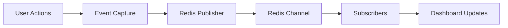

# Redis Analytics Dashboard

## Introduction

Redis is an in-memory data structure store that excels at handling high-throughput, low-latency operations, making it perfect for real-time analytics. Building an analytics dashboard with Redis allows you to capture, process, and visualize data in real-time, providing immediate insights without the delays associated with traditional database systems.

In this tutorial, we'll build a Redis-powered analytics dashboard that tracks website visitor metrics. You'll learn how to:

- Store and retrieve time-series data in Redis
- Use Redis Pub/Sub for real-time updates
- Create a Node.js backend to interface with Redis
- Build a React frontend to visualize the data
- Deploy the entire solution as a cohesive application

By the end, you'll have both the knowledge and skills to build your own real-time analytics applications using Redis.

## Prerequisites

- Basic knowledge of JavaScript
- Node.js installed on your system
- Redis server (local installation or cloud-based)
- Familiarity with React basics (helpful but not required)

## Setting Up the Environment

Let's start by setting up our development environment:

```bash
# Create project directory
mkdir redis-analytics-dashboard
cd redis-analytics-dashboard

# Initialize a new Node.js project
npm init -y

# Install dependencies
npm install express redis socket.io react react-dom chart.js

# Set up project structure
mkdir -p server/routes client/src client/public
```

## Redis for Analytics: Core Concepts

Before diving into code, let's understand how Redis fits into an analytics system:

### Time-Series Data in Redis

Redis doesn't have a native time-series data type, but we can implement time series using several approaches:

1. **Sorted Sets**: Store timestamps as scores and values as members
2. **Hash Maps**: Store timestamp-value pairs
3. **Redis Time Series module**: A dedicated module for time-series data (if available)

For our dashboard, we'll use sorted sets as they provide efficient range queries by time.

### Real-time Updates with Redis Pub/Sub

Redis Pub/Sub allows for real-time message broadcasting:



This architecture enables our dashboard to receive updates immediately as events occur.

## Backend Implementation

Let's create our server-side code to interface with Redis:

### Server Setup

Create a file `server/index.js`:

```javascript
const express = require('express');
const http = require('http');
const socketIo = require('socket.io');
const redis = require('redis');
const { promisify } = require('util');

const app = express();
const server = http.createServer(app);
const io = socketIo(server);

// Create Redis client
const redisClient = redis.createClient({
  host: process.env.REDIS_HOST || 'localhost',
  port: process.env.REDIS_PORT || 6379,
});

// Promisify Redis commands
const zrangebyscore = promisify(redisClient.zrangebyscore).bind(redisClient);
const zadd = promisify(redisClient.zadd).bind(redisClient);
const publish = promisify(redisClient.publish).bind(redisClient);

// Error handling
redisClient.on('error', (error) => {
  console.error('Redis error:', error);
});

// Serve static files
app.use(express.static('../client/build'));
app.use(express.json());

// Start server
const PORT = process.env.PORT || 3000;
server.listen(PORT, () => {
  console.log(`Server running on port ${PORT}`);
});

module.exports = { app, redisClient, io, zadd, zrangebyscore, publish };
```

### Creating API Routes

Create a file `server/routes/analytics.js`:

```javascript
const express = require('express');
const router = express.Router();
const { redisClient, zadd, zrangebyscore, publish } = require('../index');

// Record a new pageview
router.post('/pageview', async (req, res) => {
  try {
    const { page, timestamp = Date.now() } = req.body;
    
    // Store in Redis sorted set
    await zadd('pageviews', timestamp, `${page}:${timestamp}`);
    
    // Publish update
    await publish('analytics_updates', JSON.stringify({ 
      type: 'pageview', 
      page, 
      timestamp 
    }));
    
    res.status(200).json({ success: true });
  } catch (error) {
    console.error('Error recording pageview:', error);
    res.status(500).json({ error: 'Failed to record pageview' });
  }
});

// Get pageviews for a time range
router.get('/pageviews', async (req, res) => {
  try {
    const { startTime = 0, endTime = Date.now() } = req.query;
    
    // Get data from Redis
    const results = await zrangebyscore('pageviews', startTime, endTime);
    
    // Process results
    const pageviewsByPage = {};
    
    results.forEach(result => {
      const [page] = result.split(':');
      pageviewsByPage[page] = (pageviewsByPage[page] || 0) + 1;
    });
    
    res.status(200).json(pageviewsByPage);
  } catch (error) {
    console.error('Error fetching pageviews:', error);
    res.status(500).json({ error: 'Failed to fetch pageviews' });
  }
});

module.exports = router;
```

Add the routes to your server:

```javascript
// In server/index.js
const analyticsRoutes = require('./routes/analytics');
app.use('/api/analytics', analyticsRoutes);
```

### Setting Up Real-time Updates

Update your `server/index.js` to handle WebSocket connections:

```javascript
// In server/index.js
// Set up Redis subscriber for real-time updates
const redisSubscriber = redisClient.duplicate();

redisSubscriber.subscribe('analytics_updates');
redisSubscriber.on('message', (channel, message) => {
  io.emit('analytics_update', JSON.parse(message));
});

// Socket.io connection handling
io.on('connection', (socket) => {
  console.log('Client connected');
  
  socket.on('disconnect', () => {
    console.log('Client disconnected');
  });
});
```

## Frontend Implementation

Now, let's create the dashboard UI:

### React Setup

Create the basic React application structure:

```jsx
// client/src/App.js
import React, { useState, useEffect } from 'react';
import { Chart, registerables } from 'chart.js';
import io from 'socket.io-client';

// Register Chart.js components
Chart.register(...registerables);

function App() {
  const [pageViews, setPageViews] = useState({});
  const [socket, setSocket] = useState(null);
  
  useEffect(() => {
    // Fetch initial data
    fetch('/api/analytics/pageviews')
      .then(response => response.json())
      .then(data => setPageViews(data))
      .catch(error => console.error('Error fetching data:', error));
    
    // Set up socket connection
    const newSocket = io();
    setSocket(newSocket);
    
    newSocket.on('analytics_update', (update) => {
      if (update.type === 'pageview') {
        setPageViews(prev => {
          const page = update.page;
          return {
            ...prev,
            [page]: (prev[page] || 0) + 1
          };
        });
      }
    });
    
    return () => {
      newSocket.disconnect();
    };
  }, []);
  
  return (
    <div className="App">
      <header className="App-header">
        <h1>Redis Analytics Dashboard</h1>
      </header>
      <main>
        <section className="dashboard">
          <PageViewsChart data={pageViews} />
          <TopPagesTable data={pageViews} />
        </section>
      </main>
    </div>
  );
}

export default App;
```

### Creating Chart Components

Let's create the chart component:

```jsx
// client/src/components/PageViewsChart.js
import React, { useEffect, useRef } from 'react';
import { Chart } from 'chart.js';

function PageViewsChart({ data }) {
  const chartRef = useRef(null);
  const chartInstance = useRef(null);
  
  useEffect(() => {
    if (!chartRef.current) return;
    
    const labels = Object.keys(data);
    const values = Object.values(data);
    
    // Destroy previous chart if it exists
    if (chartInstance.current) {
      chartInstance.current.destroy();
    }
    
    // Create new chart
    const ctx = chartRef.current.getContext('2d');
    chartInstance.current = new Chart(ctx, {
      type: 'bar',
      data: {
        labels,
        datasets: [{
          label: 'Page Views',
          data: values,
          backgroundColor: 'rgba(54, 162, 235, 0.5)',
          borderColor: 'rgba(54, 162, 235, 1)',
          borderWidth: 1
        }]
      },
      options: {
        responsive: true,
        scales: {
          y: {
            beginAtZero: true,
            title: {
              display: true,
              text: 'Number of Views'
            }
          },
          x: {
            title: {
              display: true,
              text: 'Page'
            }
          }
        }
      }
    });
    
    return () => {
      if (chartInstance.current) {
        chartInstance.current.destroy();
      }
    };
  }, [data]);
  
  return (
    <div className="chart-container">
      <h2>Page Views</h2>
      <canvas ref={chartRef} />
    </div>
  );
}

export default PageViewsChart;
```

And a simple table component:

```jsx
// client/src/components/TopPagesTable.js
import React from 'react';

function TopPagesTable({ data }) {
  // Sort pages by view count (descending)
  const sortedPages = Object.entries(data)
    .sort(([, countA], [, countB]) => countB - countA);
  
  return (
    <div className="table-container">
      <h2>Top Pages</h2>
      <table>
        <thead>
          <tr>
            <th>Page</th>
            <th>Views</th>
          </tr>
        </thead>
        <tbody>
          {sortedPages.map(([page, count]) => (
            <tr key={page}>
              <td>{page}</td>
              <td>{count}</td>
            </tr>
          ))}
        </tbody>
      </table>
    </div>
  );
}

export default TopPagesTable;
```

## Implementing a Page Tracker

To track pageviews from your website, you'll need a tracking script:

```javascript
// tracker.js
function trackPageView() {
  const page = window.location.pathname;
  
  fetch('/api/analytics/pageview', {
    method: 'POST',
    headers: {
      'Content-Type': 'application/json'
    },
    body: JSON.stringify({
      page,
      timestamp: Date.now()
    })
  }).catch(error => console.error('Error tracking pageview:', error));
}

// Track on page load
document.addEventListener('DOMContentLoaded', trackPageView);

// Track on navigation (for single-page applications)
if (typeof history.pushState === 'function') {
  const originalPushState = history.pushState;
  history.pushState = function() {
    originalPushState.apply(this, arguments);
    trackPageView();
  };
  
  window.addEventListener('popstate', trackPageView);
}
```

## Advanced Features

Let's enhance our dashboard with more advanced Redis features:

### Time-Based Filtering with Redis

```javascript
// server/routes/analytics.js
// Add a new route for time series data
router.get('/pageviews/timeseries', async (req, res) => {
  try {
    const { page, interval = 'hour', startTime = 0, endTime = Date.now() } = req.query;
    
    // Get all pageviews in the time range
    const results = await zrangebyscore('pageviews', startTime, endTime);
    
    // Filter by page if specified
    const filteredResults = page 
      ? results.filter(result => result.startsWith(`${page}:`)) 
      : results;
    
    // Group by time interval
    const timeseriesData = {};
    
    filteredResults.forEach(result => {
      const timestamp = parseInt(result.split(':')[1]);
      let intervalKey;
      
      switch(interval) {
        case 'minute':
          intervalKey = new Date(timestamp).setSeconds(0, 0);
          break;
        case 'hour':
          intervalKey = new Date(timestamp).setMinutes(0, 0, 0);
          break;
        case 'day':
          intervalKey = new Date(timestamp).setHours(0, 0, 0, 0);
          break;
        default:
          intervalKey = new Date(timestamp).setMinutes(0, 0, 0);
      }
      
      timeseriesData[intervalKey] = (timeseriesData[intervalKey] || 0) + 1;
    });
    
    // Convert to array format for charting
    const formattedData = Object.entries(timeseriesData).map(([time, count]) => ({
      time: parseInt(time),
      count
    }));
    
    res.status(200).json(formattedData);
  } catch (error) {
    console.error('Error fetching timeseries data:', error);
    res.status(500).json({ error: 'Failed to fetch timeseries data' });
  }
});
```

### Using Redis HyperLogLog for Unique Visitors

Redis HyperLogLog is a probabilistic data structure perfect for counting unique visitors:

```javascript
// Add to server/routes/analytics.js
const pfadd = promisify(redisClient.pfadd).bind(redisClient);
const pfcount = promisify(redisClient.pfcount).bind(redisClient);

// Track unique visitors
router.post('/visitor', async (req, res) => {
  try {
    const { visitorId, page } = req.body;
    const date = new Date().toISOString().split('T')[0]; // YYYY-MM-DD
    
    // Add to HyperLogLog
    await pfadd(`visitors:${date}:${page}`, visitorId);
    await pfadd(`visitors:${date}:all`, visitorId);
    
    res.status(200).json({ success: true });
  } catch (error) {
    console.error('Error tracking visitor:', error);
    res.status(500).json({ error: 'Failed to track visitor' });
  }
});

// Get unique visitor count
router.get('/visitors/count', async (req, res) => {
  try {
    const { date = new Date().toISOString().split('T')[0], page } = req.query;
    
    const key = page ? `visitors:${date}:${page}` : `visitors:${date}:all`;
    const count = await pfcount(key);
    
    res.status(200).json({ date, page: page || 'all', uniqueVisitors: count });
  } catch (error) {
    console.error('Error fetching visitor count:', error);
    res.status(500).json({ error: 'Failed to fetch visitor count' });
  }
});
```

## Adding User Sessions with Redis

We can use Redis to track user sessions and their activity:

```javascript
// Add to server/routes/analytics.js
const hset = promisify(redisClient.hset).bind(redisClient);
const hgetall = promisify(redisClient.hgetall).bind(redisClient);
const expire = promisify(redisClient.expire).bind(redisClient);

// Start/update session
router.post('/session', async (req, res) => {
  try {
    const { sessionId, page, referrer } = req.body;
    const timestamp = Date.now();
    
    // Store session data
    await hset(`session:${sessionId}`,
      'last_page', page,
      'last_active', timestamp,
      'referrer', referrer || '',
      'started', timestamp
    );
    
    // Set expiration (30 minutes)
    await expire(`session:${sessionId}`, 1800);
    
    res.status(200).json({ success: true });
  } catch (error) {
    console.error('Error updating session:', error);
    res.status(500).json({ error: 'Failed to update session' });
  }
});

// Get active sessions
router.get('/sessions/active', async (req, res) => {
  try {
    // This would need a more complex implementation with Redis SCAN
    // For demonstration, we'll return a simple response
    res.status(200).json({ 
      message: 'For a complete implementation, you would use Redis SCAN to find all active sessions'
    });
  } catch (error) {
    console.error('Error fetching active sessions:', error);
    res.status(500).json({ error: 'Failed to fetch active sessions' });
  }
});
```

## Building a Complete Dashboard

Let's update our frontend to display all this information:

```jsx
// Update client/src/App.js to include the new components
import React, { useState, useEffect } from 'react';
import PageViewsChart from './components/PageViewsChart';
import TopPagesTable from './components/TopPagesTable';
import VisitorCountCard from './components/VisitorCountCard';
import TimeSeriesChart from './components/TimeSeriesChart';
import ActiveSessionsTable from './components/ActiveSessionsTable';
import './App.css';

function App() {
  // State for all data
  const [pageViews, setPageViews] = useState({});
  const [timeSeriesData, setTimeSeriesData] = useState([]);
  const [uniqueVisitors, setUniqueVisitors] = useState(0);
  const [interval, setInterval] = useState('hour');
  
  // Fetch all data on load
  useEffect(() => {
    fetchPageViews();
    fetchTimeSeriesData();
    fetchUniqueVisitors();
    
    // Set up real-time updates
    const socket = io();
    socket.on('analytics_update', handleUpdate);
    
    return () => {
      socket.disconnect();
    };
  }, [interval]);
  
  const fetchPageViews = () => {
    fetch('/api/analytics/pageviews')
      .then(response => response.json())
      .then(data => setPageViews(data))
      .catch(error => console.error('Error fetching pageviews:', error));
  };
  
  const fetchTimeSeriesData = () => {
    fetch(`/api/analytics/pageviews/timeseries?interval=${interval}`)
      .then(response => response.json())
      .then(data => setTimeSeriesData(data))
      .catch(error => console.error('Error fetching timeseries data:', error));
  };
  
  const fetchUniqueVisitors = () => {
    fetch('/api/analytics/visitors/count')
      .then(response => response.json())
      .then(data => setUniqueVisitors(data.uniqueVisitors))
      .catch(error => console.error('Error fetching visitor count:', error));
  };
  
  const handleUpdate = (update) => {
    if (update.type === 'pageview') {
      fetchPageViews();
      fetchTimeSeriesData();
    } else if (update.type === 'visitor') {
      fetchUniqueVisitors();
    }
  };
  
  return (
    <div className="dashboard-container">
      <header>
        <h1>Redis Analytics Dashboard</h1>
        <div className="interval-controls">
          <label>Time Interval:</label>
          <select value={interval} onChange={(e) => setInterval(e.target.value)}>
            <option value="minute">Minute</option>
            <option value="hour">Hour</option>
            <option value="day">Day</option>
          </select>
        </div>
      </header>
      
      <div className="dashboard-grid">
        <div className="grid-item">
          <VisitorCountCard count={uniqueVisitors} />
        </div>
        
        <div className="grid-item">
          <TimeSeriesChart data={timeSeriesData} interval={interval} />
        </div>
        
        <div className="grid-item">
          <PageViewsChart data={pageViews} />
        </div>
        
        <div className="grid-item">
          <TopPagesTable data={pageViews} />
        </div>
      </div>
    </div>
  );
}

export default App;
```

## Deployment Considerations

When deploying your Redis analytics dashboard, consider:

1. **Redis Persistence**: Configure Redis with AOF or RDB persistence for data durability
2. **Security**: Set up Redis with authentication and firewall rules
3. **Scalability**: Consider Redis Cluster for high-volume applications
4. **Backup Strategy**: Implement regular backups of your Redis data

## Performance Optimization

As your analytics volume grows, consider these optimizations:

1. **Data Expiration**: Set TTL (Time To Live) on older data
2. **Data Aggregation**: Pre-aggregate data for common time intervals
3. **Connection Pooling**: Use Redis connection pools for high-concurrency environments
4. **Batch Operations**: Use Redis pipelining for batch inserts

## Summary

In this tutorial, we've built a comprehensive Redis-powered analytics dashboard that:

- Captures and stores pageviews and visitor data
- Provides real-time updates using Redis Pub/Sub
- Visualizes analytics data with charts and tables
- Uses advanced Redis features like HyperLogLog and sorted sets

Redis is an excellent choice for real-time analytics due to its speed, versatility, and specialized data structures. By leveraging Redis alongside modern web technologies, you can create powerful analytics solutions that provide immediate insights into your application's usage patterns.

## Additional Resources

- [Redis Documentation](https://redis.io/documentation)
- [Redis Time Series Module](https://oss.redis.com/redistimeseries/)
- [Chart.js Documentation](https://www.chartjs.org/docs/latest/)
- [Socket.IO Documentation](https://socket.io/docs/v4)

## Exercises

1. Add filtering capabilities to the dashboard to view analytics for specific pages.
2. Implement user segmentation based on referrer or other attributes.
3. Create a heatmap visualization showing activity by hour and day of week.
4. Add alerting functionality for unusual traffic patterns.
5. Extend the dashboard to track and visualize user journeys through your website.