# Building a Redis Shopping Cart

## Introduction

A shopping cart is a fundamental component of any e-commerce application. It needs to be fast, reliable, and able to handle concurrent users without data conflicts. Traditional database solutions can become bottlenecks during high traffic periods, which is why Redis offers an excellent alternative for shopping cart implementations.

In this tutorial, we'll build a shopping cart system using Redis, a powerful in-memory data store that excels at handling real-time data with minimal latency. Redis is perfect for shopping carts because it:

- Provides lightning-fast read/write operations
- Offers built-in data structures that simplify cart management
- Supports automatic expiration for abandoned carts
- Handles high concurrency without performance degradation

By the end of this tutorial, you'll understand how to leverage Redis for building a robust shopping cart system that can scale with your application.

## Prerequisites

Before we dive in, make sure you have:

- Basic knowledge of JavaScript and Node.js
- Redis installed locally or access to a Redis instance
- Node.js installed on your machine
- npm or yarn for package management

## Project Setup

Let's start by creating a new Node.js project and installing the required dependencies:

```bash
mkdir redis-shopping-cart
cd redis-shopping-cart
npm init -y
npm install redis express express-session
```

Now, let's create our main application file:

```javascript
// app.js
const express = require('express');
const redis = require('redis');
const session = require('express-session');
const { promisify } = require('util');

const app = express();
const port = 3000;

// Redis client setup
const client = redis.createClient({
  host: 'localhost',
  port: 6379
});

// Promisify Redis commands
const hgetall = promisify(client.hgetall).bind(client);
const hmset = promisify(client.hmset).bind(client);
const hdel = promisify(client.hdel).bind(client);
const expire = promisify(client.expire).bind(client);

// Express middleware
app.use(express.json());
app.use(express.urlencoded({ extended: true }));
app.use(session({
  secret: 'redis-cart-secret',
  resave: false,
  saveUninitialized: true,
  cookie: { maxAge: 3600000 } // 1 hour
}));

app.listen(port, () => {
  console.log(`Shopping cart app listening at http://localhost:${port}`);
});
```

## Data Modeling with Redis

Before implementing the shopping cart functionality, let's understand how we'll model our data in Redis:

```mermaid
graph TD
    A[Shopping Cart Data Model] --> B["Cart Key: cart:{sessionId}"]
    B --> C["Hash: product_id → quantity"]
    A --> D["Product Key: product:{id}"]
    D --> E[Hash: name, price, stock]
    A --> F["Session Key: session:{id}"]
    F --> G[Hash: user_data, expiry]
```



We'll use three main data structures:

1. **Cart Hash**: Stores products in a user's cart using a hash where each field is a product ID and each value is the quantity.
2. **Product Hash**: Stores product information like name, price, and available stock.
3. **Session Hash**: Keeps track of user session information.

## Key Redis Commands We'll Use

For our shopping cart, we'll use these Redis commands:

- `HMSET`: Set multiple fields in a hash
- `HGETALL`: Get all fields and values in a hash
- `HGET`: Get the value of a specific field in a hash
- `HINCRBY`: Increment a numeric value in a hash
- `HDEL`: Delete a field from a hash
- `EXPIRE`: Set a key's time to live in seconds

## Implementing Shopping Cart Functionality

Let's implement the core functionality of our shopping cart:

### 1. Adding a Product to the Cart

```javascript
// Add product to cart
app.post('/cart/add', async (req, res) => {
  try {
    const { productId, quantity = 1 } = req.body;
    const sessionId = req.session.id;
    const cartKey = `cart:${sessionId}`;
    
    // Check if product exists and has enough stock
    const productKey = `product:${productId}`;
    const product = await hgetall(productKey);
    
    if (!product) {
      return res.status(404).json({ error: 'Product not found' });
    }
    
    if (parseInt(product.stock) < quantity) {
      return res.status(400).json({ error: 'Not enough stock available' });
    }
    
    // Get current quantity in cart (if any)
    client.hget(cartKey, productId, async (err, currentQty) => {
      const newQuantity = parseInt(currentQty || 0) + parseInt(quantity);
      
      // Update cart
      await hmset(cartKey, productId, newQuantity);
      
      // Set expiration on cart (1 hour)
      await expire(cartKey, 3600);
      
      res.json({
        message: 'Product added to cart',
        productId,
        quantity: newQuantity
      });
    });
  } catch (error) {
    res.status(500).json({ error: error.message });
  }
});
```

### 2. Viewing the Cart Contents

```javascript
// Get cart contents
app.get('/cart', async (req, res) => {
  try {
    const sessionId = req.session.id;
    const cartKey = `cart:${sessionId}`;
    
    const cartItems = await hgetall(cartKey) || {};
    
    // If cart is empty
    if (Object.keys(cartItems).length === 0) {
      return res.json({ items: [], total: 0 });
    }
    
    // Get product details for each item in cart
    const enrichedItems = await Promise.all(
      Object.entries(cartItems).map(async ([productId, quantity]) => {
        const productKey = `product:${productId}`;
        const product = await hgetall(productKey);
        
        return {
          productId,
          name: product.name,
          price: parseFloat(product.price),
          quantity: parseInt(quantity),
          subtotal: parseFloat(product.price) * parseInt(quantity)
        };
      })
    );
    
    // Calculate total
    const total = enrichedItems.reduce((sum, item) => sum + item.subtotal, 0);
    
    res.json({
      items: enrichedItems,
      total
    });
  } catch (error) {
    res.status(500).json({ error: error.message });
  }
});
```

### 3. Updating Cart Quantities

```javascript
// Update product quantity in cart
app.put('/cart/update', async (req, res) => {
  try {
    const { productId, quantity } = req.body;
    const sessionId = req.session.id;
    const cartKey = `cart:${sessionId}`;
    
    if (quantity <= 0) {
      // Remove item if quantity is zero or negative
      await hdel(cartKey, productId);
      return res.json({ message: 'Product removed from cart' });
    }
    
    // Check if product has enough stock
    const productKey = `product:${productId}`;
    const product = await hgetall(productKey);
    
    if (!product) {
      return res.status(404).json({ error: 'Product not found' });
    }
    
    if (parseInt(product.stock) < quantity) {
      return res.status(400).json({ error: 'Not enough stock available' });
    }
    
    // Update quantity
    await hmset(cartKey, productId, quantity);
    
    res.json({
      message: 'Cart updated',
      productId,
      quantity
    });
  } catch (error) {
    res.status(500).json({ error: error.message });
  }
});
```

### 4. Removing Items from the Cart

```javascript
// Remove product from cart
app.delete('/cart/remove/:productId', async (req, res) => {
  try {
    const { productId } = req.params;
    const sessionId = req.session.id;
    const cartKey = `cart:${sessionId}`;
    
    // Remove product from cart
    await hdel(cartKey, productId);
    
    res.json({
      message: 'Product removed from cart',
      productId
    });
  } catch (error) {
    res.status(500).json({ error: error.message });
  }
});
```

### 5. Clearing the Entire Cart

```javascript
// Clear entire cart
app.delete('/cart/clear', async (req, res) => {
  try {
    const sessionId = req.session.id;
    const cartKey = `cart:${sessionId}`;
    
    // Delete the cart key
    client.del(cartKey, (err, reply) => {
      if (err) throw err;
      
      res.json({
        message: 'Cart cleared',
        success: reply === 1
      });
    });
  } catch (error) {
    res.status(500).json({ error: error.message });
  }
});
```

## Managing Product Inventory

Let's also implement basic product management to make our shopping cart system complete:

```javascript
// Add a product
app.post('/products', async (req, res) => {
  try {
    const { id, name, price, stock } = req.body;
    const productKey = `product:${id}`;
    
    // Store product details
    await hmset(productKey, {
      'name': name,
      'price': price.toString(),
      'stock': stock.toString()
    });
    
    res.json({
      message: 'Product added',
      product: { id, name, price, stock }
    });
  } catch (error) {
    res.status(500).json({ error: error.message });
  }
});

// Get a product
app.get('/products/:id', async (req, res) => {
  try {
    const { id } = req.params;
    const productKey = `product:${id}`;
    
    const product = await hgetall(productKey);
    
    if (!product) {
      return res.status(404).json({ error: 'Product not found' });
    }
    
    res.json({
      id,
      ...product,
      price: parseFloat(product.price),
      stock: parseInt(product.stock)
    });
  } catch (error) {
    res.status(500).json({ error: error.message });
  }
});
```

## Checkout Process

Finally, let's implement a simple checkout process that updates inventory and clears the cart:

```javascript
// Checkout process
app.post('/cart/checkout', async (req, res) => {
  try {
    const sessionId = req.session.id;
    const cartKey = `cart:${sessionId}`;
    
    // Get cart items
    const cartItems = await hgetall(cartKey) || {};
    
    if (Object.keys(cartItems).length === 0) {
      return res.status(400).json({ error: 'Cart is empty' });
    }
    
    // Update inventory for each product
    await Promise.all(
      Object.entries(cartItems).map(async ([productId, quantity]) => {
        const productKey = `product:${productId}`;
        const product = await hgetall(productKey);
        
        if (!product) {
          throw new Error(`Product ${productId} not found`);
        }
        
        const newStock = parseInt(product.stock) - parseInt(quantity);
        
        if (newStock < 0) {
          throw new Error(`Not enough stock for product ${productId}`);
        }
        
        // Update stock
        await hmset(productKey, 'stock', newStock.toString());
      })
    );
    
    // Create order record (in a real app, you'd store this in a persistent database)
    const orderId = Date.now().toString();
    const orderKey = `order:${orderId}`;
    
    // Store order details
    await hmset(orderKey, {
      'sessionId': sessionId,
      'timestamp': Date.now().toString(),
      'status': 'completed'
    });
    
    // Clear the cart
    client.del(cartKey);
    
    res.json({
      message: 'Checkout successful',
      orderId
    });
  } catch (error) {
    res.status(500).json({ error: error.message });
  }
});
```

## Testing Our Shopping Cart

To test our Redis shopping cart, we need to:

1. Start our Node.js application
2. Make sure Redis server is running
3. Add some products to our system
4. Interact with the cart API endpoints

Here's a sample test flow using `curl` commands:

```bash
# Add products
curl -X POST http://localhost:3000/products -H "Content-Type: application/json" -d '{"id":"1","name":"Laptop","price":999.99,"stock":10}'

# Add item to cart
curl -X POST http://localhost:3000/cart/add -H "Content-Type: application/json" -d '{"productId":"1","quantity":2}'

# View cart
curl -X GET http://localhost:3000/cart

# Update quantity
curl -X PUT http://localhost:3000/cart/update -H "Content-Type: application/json" -d '{"productId":"1","quantity":3}'

# Checkout
curl -X POST http://localhost:3000/cart/checkout
```

## Performance Considerations

One of the main advantages of using Redis for shopping carts is performance. Here are some metrics to consider:

- Redis can handle tens of thousands of operations per second on a single instance
- Average operation latency is typically under 1ms
- Memory usage is efficient (a cart with 10 items might use less than 1KB of memory)

For large e-commerce sites, you can further optimize by:

1. Implementing Redis clusters for horizontal scaling
2. Using Redis Sentinel for high availability
3. Setting appropriate expiration times for abandoned carts

## Real-World Extensions

In a production environment, you might want to extend this basic implementation with:

1. **User Authentication**: Associate carts with registered users and merge guest carts upon login
2. **Coupons and Discounts**: Store discount codes and apply them during checkout
3. **Wishlist Feature**: Similar to cart but without quantity constraints
4. **Recently Viewed Products**: Track products a user has viewed using Redis Sets
5. **Persistent Storage Backup**: Periodically save cart data to a persistent database

## Example: Merging Guest Cart with User Cart

Here's how you might implement cart merging when a user logs in:

```javascript
// Merge guest cart with user cart on login
app.post('/login', async (req, res) => {
  try {
    const { userId } = req.body;
    const guestSessionId = req.session.id;
    
    // Set user info in session
    req.session.userId = userId;
    
    const guestCartKey = `cart:${guestSessionId}`;
    const userCartKey = `cart:user:${userId}`;
    
    // Get guest cart items
    const guestCartItems = await hgetall(guestCartKey) || {};
    
    // Get user cart items
    const userCartItems = await hgetall(userCartKey) || {};
    
    // Merge carts
    for (const [productId, quantity] of Object.entries(guestCartItems)) {
      const currentQty = parseInt(userCartItems[productId] || 0);
      const newQty = currentQty + parseInt(quantity);
      userCartItems[productId] = newQty.toString();
    }
    
    // Save merged cart
    if (Object.keys(userCartItems).length > 0) {
      const entries = [];
      for (const [key, value] of Object.entries(userCartItems)) {
        entries.push(key, value);
      }
      
      await hmset(userCartKey, ...entries);
      
      // Set expiration
      await expire(userCartKey, 86400); // 24 hours
    }
    
    // Remove guest cart
    client.del(guestCartKey);
    
    res.json({
      message: 'Login successful, carts merged',
      userId
    });
  } catch (error) {
    res.status(500).json({ error: error.message });
  }
});
```

## Summary

In this tutorial, we've built a comprehensive shopping cart system using Redis that includes:

- Adding, viewing, updating, and removing items from the cart
- Managing product inventory
- Processing checkouts
- Handling cart expiration for abandoned carts

Redis provides an excellent solution for shopping cart implementations due to its speed, built-in data structures, and support for automatic expiration. The in-memory nature of Redis makes it perfect for handling the high-throughput, low-latency requirements of e-commerce applications.

## Exercises for Practice

1. **Implement a wishlist feature** using Redis Sets to store products a user wants to save for later.
2. **Add a discount coupon system** where coupon codes are stored in Redis and applied during checkout.
3. **Create a "Frequently Bought Together" recommendation feature** using Redis Sets to track products commonly purchased together.
4. **Implement inventory reservation** during checkout to prevent overselling during high-traffic periods.
5. **Add real-time cart sharing** where multiple users can view and modify the same cart simultaneously.

## Additional Resources

- [Redis Official Documentation](https://redis.io/documentation)
- [Redis Data Types](https://redis.io/topics/data-types)
- [Node Redis Client](https://github.com/redis/node-redis)
- [E-commerce Patterns with Redis](https://redis.com/solutions/use-cases/ecommerce/)

By leveraging Redis for your shopping cart implementation, you'll create a fast, reliable, and scalable solution that can handle high traffic and provide a smooth user experience for your e-commerce application.