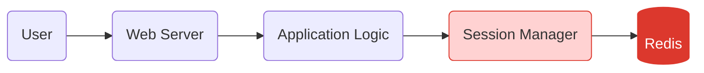

# Redis User Session Manager

## Introduction

Session management is a critical component of modern web applications. It allows your application to remember users across page loads and maintain their state while navigating your site. Traditional session management often relies on server memory or database storage, which can become problematic as your application scales.

In this tutorial, we'll explore how to implement a user session manager using Redis. Redis is an in-memory data structure store that excels at handling fast-changing data with high performance, making it ideal for session management.

## Why Redis for Session Management?

Redis offers several advantages for managing user sessions:

1. **Speed**: Redis operations typically complete in less than a millisecond.
2. **Built-in expiration**: Redis can automatically remove expired sessions.
3. **Scalability**: Redis can be easily scaled across multiple servers.
4. **Persistence options**: Redis can persist data to disk when needed.
5. **Simple API**: Redis has a straightforward interface for storing and retrieving data.

Let's visualize how Redis fits into a web application's architecture:



## Setting Up Redis for Session Management

Before we dive into code, make sure you have Redis installed and running. You can follow the [official Redis installation guide](https://redis.io/docs/getting-started/) for your platform.

### Basic Redis Setup with Node.js

Let's start by setting up a basic Node.js project with Redis integration:

```bash
mkdir redis-session-manager
cd redis-session-manager
npm init -y
npm install express redis connect-redis express-session
```

Now, let's create a basic Express application with Redis session support:

```javascript
const express = require('express');
const session = require('express-session');
const Redis = require('redis');
const connectRedis = require('connect-redis');

const app = express();
const RedisStore = connectRedis(session);

// Configure Redis client
const redisClient = Redis.createClient({
  host: 'localhost',
  port: 6379
});

redisClient.on('error', (err) => {
  console.log('Redis error: ', err);
});

// Configure session middleware
app.use(session({
  store: new RedisStore({ client: redisClient }),
  secret: 'your_secret_key',
  resave: false,
  saveUninitialized: false,
  cookie: {
    secure: false, // Set to true if using HTTPS
    httpOnly: true,
    maxAge: 1000 * 60 * 30 // 30 minutes
  }
}));

app.get('/', (req, res) => {
  // Initialize session view count if not present
  if (!req.session.viewCount) {
    req.session.viewCount = 0;
  }
  
  // Increment view count
  req.session.viewCount++;
  
  res.send(`You have visited this page ${req.session.viewCount} times`);
});

app.listen(3000, () => {
  console.log('Server running on port 3000');
});
```

When you run this application and visit the homepage repeatedly, you'll see the view count increase. This data is being stored in Redis!

## Building a Custom Redis Session Manager

While the example above uses existing libraries, let's build a custom session manager to better understand the concepts. We'll create a simple class to handle Redis session operations:

```javascript
const Redis = require('redis');
const { promisify } = require('util');

class RedisSessionManager {
  constructor(options = {}) {
    this.client = Redis.createClient(options);
    this.keyPrefix = options.keyPrefix || 'session:';
    this.expiry = options.expiry || 1800; // 30 minutes in seconds
    
    // Promisify Redis methods
    this.getAsync = promisify(this.client.get).bind(this.client);
    this.setAsync = promisify(this.client.set).bind(this.client);
    this.delAsync = promisify(this.client.del).bind(this.client);
    
    this.client.on('error', (err) => {
      console.error('Redis Session Manager Error:', err);
    });
  }
  
  // Create a session key
  _sessionKey(sessionId) {
    return `${this.keyPrefix}${sessionId}`;
  }
  
  // Create a new session
  async createSession(userId, data = {}) {
    const sessionId = this._generateSessionId();
    const sessionData = {
      userId,
      createdAt: Date.now(),
      data
    };
    
    await this.setAsync(
      this._sessionKey(sessionId),
      JSON.stringify(sessionData),
      'EX',
      this.expiry
    );
    
    return sessionId;
  }
  
  // Get session data
  async getSession(sessionId) {
    const data = await this.getAsync(this._sessionKey(sessionId));
    if (!data) return null;
    
    try {
      return JSON.parse(data);
    } catch (e) {
      return null;
    }
  }
  
  // Update session data
  async updateSession(sessionId, data) {
    const session = await this.getSession(sessionId);
    if (!session) return false;
    
    session.data = { ...session.data, ...data };
    session.updatedAt = Date.now();
    
    await this.setAsync(
      this._sessionKey(sessionId),
      JSON.stringify(session),
      'EX',
      this.expiry
    );
    
    return true;
  }
  
  // Extend session expiry
  async extendSession(sessionId) {
    const session = await this.getSession(sessionId);
    if (!session) return false;
    
    await this.setAsync(
      this._sessionKey(sessionId),
      JSON.stringify(session),
      'EX',
      this.expiry
    );
    
    return true;
  }
  
  // Delete a session
  async deleteSession(sessionId) {
    return await this.delAsync(this._sessionKey(sessionId));
  }
  
  // Generate random session ID (simplified)
  _generateSessionId() {
    return Math.random().toString(36).substring(2, 15) + 
           Math.random().toString(36).substring(2, 15);
  }
  
  // Close Redis connection
  close() {
    this.client.quit();
  }
}

module.exports = RedisSessionManager;
```

## Integrating the Session Manager with Express

Now let's create a middleware to use our custom session manager with Express:

```javascript
const express = require('express');
const cookieParser = require('cookie-parser');
const RedisSessionManager = require('./RedisSessionManager');

const app = express();
app.use(cookieParser());
app.use(express.json());

// Initialize the session manager
const sessionManager = new RedisSessionManager({
  host: 'localhost',
  port: 6379,
  keyPrefix: 'myapp:session:',
  expiry: 3600 // 1 hour
});

// Session middleware
app.use(async (req, res, next) => {
  // Get session ID from cookie
  const sessionId = req.cookies.sessionId;
  
  if (sessionId) {
    // Get session data
    const session = await sessionManager.getSession(sessionId);
    
    if (session) {
      // Attach session to request
      req.session = session;
      req.sessionId = sessionId;
      
      // Extend session on every request
      await sessionManager.extendSession(sessionId);
    }
  }
  
  next();
});

// Login route
app.post('/login', async (req, res) => {
  const { username, password } = req.body;
  
  // In a real app, you would validate credentials
  // This is a simplified example
  const userId = username; // Use username as userId for demo
  
  // Create a new session
  const sessionId = await sessionManager.createSession(userId, {
    username,
    loggedInAt: new Date().toISOString()
  });
  
  // Set session cookie
  res.cookie('sessionId', sessionId, {
    httpOnly: true,
    maxAge: 3600000 // 1 hour in milliseconds
  });
  
  res.json({ success: true, message: 'Logged in successfully' });
});

// Protected route
app.get('/profile', async (req, res) => {
  if (!req.session) {
    return res.status(401).json({ success: false, message: 'Not authenticated' });
  }
  
  // Access session data
  const { userId, data } = req.session;
  
  // Update session with last access time
  await sessionManager.updateSession(req.sessionId, {
    lastAccessed: new Date().toISOString()
  });
  
  res.json({
    success: true,
    userId,
    username: data.username,
    loggedInAt: data.loggedInAt,
    lastAccessed: data.lastAccessed
  });
});

// Logout route
app.post('/logout', async (req, res) => {
  if (req.sessionId) {
    await sessionManager.deleteSession(req.sessionId);
    res.clearCookie('sessionId');
  }
  
  res.json({ success: true, message: 'Logged out successfully' });
});

app.listen(3000, () => {
  console.log('Server running on port 3000');
});

// Handle application shutdown
process.on('SIGINT', () => {
  sessionManager.close();
  process.exit();
});
```

## Testing the Session Manager

You can test this application using tools like `curl` or Postman:

1. Log in to create a session:

```bash
curl -X POST http://localhost:3000/login \
  -H "Content-Type: application/json" \
  -d '{"username":"user1","password":"password123"}' \
  -v
```

This will return a successful response and set a `sessionId` cookie.

2. Access the protected profile route with the cookie:

```bash
curl -X GET http://localhost:3000/profile \
  -H "Cookie: sessionId=YOUR_SESSION_ID" \
  -v
```

3. Logout to destroy the session:

```bash
curl -X POST http://localhost:3000/logout \
  -H "Cookie: sessionId=YOUR_SESSION_ID" \
  -v
```

## Monitoring Redis Sessions

Redis provides helpful commands to monitor and manage sessions. Here are some useful Redis commands for session management:

```bash
# List all session keys
redis-cli KEYS "myapp:session:*"

# Get the number of active sessions
redis-cli KEYS "myapp:session:*" | wc -l

# Get a specific session's data
redis-cli GET "myapp:session:SOME_SESSION_ID"

# Check session TTL (time to expiry in seconds)
redis-cli TTL "myapp:session:SOME_SESSION_ID"

# Delete all sessions (useful during development)
redis-cli KEYS "myapp:session:*" | xargs redis-cli DEL
```

## Advanced Redis Session Features

### Storing Different Types of Session Data

Redis allows storing various types of data structures that can be useful for different session scenarios:

```javascript
// Using hashes for more structured session data
async storeSessionDataAsHash(sessionId, data) {
  const key = this._sessionKey(sessionId);
  
  // Convert object to flat key-value pairs
  const entries = Object.entries(data).flat();
  
  // HSET key field1 value1 field2 value2 ...
  await this.client.hsetAsync(key, ...entries);
  await this.client.expireAsync(key, this.expiry);
}

// Retrieving hash session data
async getSessionDataFromHash(sessionId) {
  const key = this._sessionKey(sessionId);
  return await this.client.hgetallAsync(key);
}
```

### Session Invalidation Strategies

Sometimes you need to invalidate sessions, for example when a user changes their password:

```javascript
// Invalidate all sessions for a specific user
async invalidateUserSessions(userId) {
  // Get all session keys
  const keys = await this.client.keysAsync(`${this.keyPrefix}*`);
  
  for (const key of keys) {
    const sessionData = JSON.parse(await this.getAsync(key));
    
    // If session belongs to target user, delete it
    if (sessionData && sessionData.userId === userId) {
      await this.delAsync(key);
    }
  }
}
```

### Implementing Session Tracking and Analytics

Redis can track user activity across sessions:

```javascript
// Record user activity
async recordUserActivity(sessionId, activity) {
  const session = await this.getSession(sessionId);
  if (!session) return false;
  
  const activityKey = `activity:${session.userId}`;
  
  // Use Redis sorted set with timestamp as score
  await this.client.zaddAsync(
    activityKey,
    Date.now(),
    JSON.stringify({
      sessionId,
      timestamp: new Date().toISOString(),
      ...activity
    })
  );
  
  // Keep only last 100 activities
  await this.client.zremrangebyrankAsync(activityKey, 0, -101);
  
  // Set expiry on activity log
  await this.client.expireAsync(activityKey, 60 * 60 * 24 * 30); // 30 days
  
  return true;
}

// Get user activity history
async getUserActivityHistory(userId, limit = 10) {
  const activityKey = `activity:${userId}`;
  
  // Get latest activities (highest scores)
  const activities = await this.client.zrevrangeAsync(
    activityKey,
    0,
    limit - 1
  );
  
  return activities.map(item => JSON.parse(item));
}
```

## Handling Redis Session Manager in Production

For production environments, consider these best practices:

### Connection Pooling

Use a Redis connection pool for improved performance:

```javascript
const Redis = require('redis');
const { promisify } = require('util');
const genericPool = require('generic-pool');

// Create Redis connection factory
const redisFactory = {
  create: async () => {
    const client = Redis.createClient({
      host: process.env.REDIS_HOST || 'localhost',
      port: process.env.REDIS_PORT || 6379,
      password: process.env.REDIS_PASSWORD
    });
    
    // Promisify Redis commands
    ['get', 'set', 'del', 'expire'].forEach(cmd => {
      client[`${cmd}Async`] = promisify(client[cmd]).bind(client);
    });
    
    return client;
  },
  destroy: (client) => {
    return client.quit();
  }
};

// Create the pool
const redisPool = genericPool.createPool(redisFactory, {
  max: 10, // Maximum size of the pool
  min: 2   // Minimum size of the pool
});

// Use the pool in the session manager
class PooledRedisSessionManager {
  constructor(options = {}) {
    this.pool = redisPool;
    this.keyPrefix = options.keyPrefix || 'session:';
    this.expiry = options.expiry || 1800;
  }
  
  async getSession(sessionId) {
    let client;
    try {
      client = await this.pool.acquire();
      const data = await client.getAsync(this._sessionKey(sessionId));
      return data ? JSON.parse(data) : null;
    } catch (err) {
      console.error('Redis session error:', err);
      return null;
    } finally {
      if (client) this.pool.release(client);
    }
  }
  
  // Other methods would follow similar pattern
}
```

### Redis Clustering for High Availability

For production systems, consider using Redis Cluster for increased reliability:

```javascript
const Redis = require('redis');
const RedisCluster = require('redis-cluster');

// Define cluster nodes
const nodes = [
  { host: '127.0.0.1', port: 7000 },
  { host: '127.0.0.1', port: 7001 },
  { host: '127.0.0.1', port: 7002 }
];

// Create cluster client
const cluster = new RedisCluster(nodes, {
  redisOptions: {
    password: process.env.REDIS_PASSWORD
  }
});

// Use cluster in session manager
class ClusteredRedisSessionManager {
  constructor(options = {}) {
    this.client = cluster;
    this.keyPrefix = options.keyPrefix || 'session:';
    this.expiry = options.expiry || 1800;
    
    // Promisify methods
    // ... similar to previous examples
  }
  
  // Session methods
  // ... similar to previous examples
}
```

## Performance Considerations

Redis is already extremely fast, but here are some tips to maximize performance:

1. **Minimize session data size**: Store only essential information in the session.
2. **Use appropriate data types**: Choose the right Redis data structures for your use case.
3. **Consider pipelining**: Use Redis pipelining for multiple operations.
4. **Set reasonable TTLs**: Don't set excessively long session timeouts.
5. **Monitor Redis memory**: Use `redis-cli info memory` to monitor usage.

## Security Best Practices

When implementing session management, security is critical:

1. **Use secure cookies**: Set the `secure` flag in production.
2. **Implement CSRF protection**: Use tokens to prevent cross-site request forgery.
3. **Rotate session IDs**: Generate new session IDs periodically, especially after authentication.
4. **Use strong session IDs**: Ensure session IDs are cryptographically strong.
5. **Set appropriate Redis ACLs**: Restrict Redis access to necessary operations only.

Here's an example of more secure session ID generation:

```javascript
const crypto = require('crypto');

// Generate secure session ID
_generateSecureSessionId() {
  return crypto.randomBytes(32).toString('hex');
}
```

## Summary

In this tutorial, we've explored how to implement a Redis-based user session manager. We've covered:

1. Basic Redis session integration with Express
2. Building a custom session manager
3. Session creation, retrieval, updating, and deletion
4. Advanced features like user activity tracking
5. Production considerations including connection pooling and clustering
6. Performance and security best practices

Redis provides an excellent foundation for session management due to its speed, simplicity, and built-in features like automatic expiration. By implementing a Redis-based session manager, you can create scalable, performant web applications that maintain state effectively.

## Exercises

1. Implement a "remember me" feature that extends session lifetime for trusted devices.
2. Create a user interface to display active sessions to users (like Google's account security page).
3. Add rate limiting to prevent brute force login attempts using Redis counters.
4. Implement session sharing across multiple applications using the same Redis instance.
5. Add a session invalidation webhook that triggers when suspicious activity is detected.

## Additional Resources

- [Redis Documentation](https://redis.io/documentation)
- [Node Redis Client](https://github.com/redis/node-redis)
- [OWASP Session Management Cheat Sheet](https://cheatsheetseries.owasp.org/cheatsheets/Session_Management_Cheat_Sheet.html)
- [Express Session middleware](https://github.com/expressjs/session)