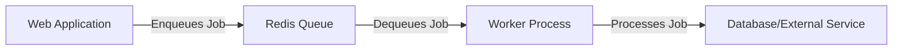

# Redis Job Queue

## Introduction

A job queue is a powerful mechanism for handling tasks asynchronously in your applications. Instead of processing resource-intensive operations immediately (which might slow down your application's response time), you can add them to a queue and process them in the background.

Redis, an in-memory data structure store, offers an excellent foundation for building robust job queues due to its speed, reliability, and built-in data structures. In this tutorial, we'll explore how to implement a job queue using Redis, a solution that's both powerful and beginner-friendly.

## Why Use Redis for Job Queues?

Redis provides several advantages for implementing job queues:

1. **Speed**: Redis operates in-memory, making it incredibly fast for queue operations
2. **Reliability**: Redis offers persistence options to prevent job loss
3. **Atomic operations**: Redis commands are atomic, reducing race conditions
4. **Simple implementation**: Redis lists and sorted sets make queue implementation straightforward
5. **Scalability**: Redis can handle high throughput, making it suitable for applications of all sizes

## Basic Job Queue Concepts

Before diving into code, let's understand some key concepts:

- **Producer**: The component that adds jobs to the queue
- **Consumer/Worker**: The component that processes jobs from the queue
- **Job**: A unit of work to be processed (typically serialized as JSON)
- **Queue**: The data structure storing pending jobs

Here's a basic visualization of a job queue system:



## Setting Up Redis

First, ensure you have Redis installed and running. If you're using Docker, you can start Redis with:

```bash
docker run --name redis-queue -p 6379:6379 -d redis
```

For this tutorial, we'll use Node.js with the `redis` and `bull` packages to interact with Redis:

```bash
npm install redis bull
```

## Implementation 1: Basic Redis List Queue

Let's start with a simple implementation using Redis Lists:

```javascript
const redis = require('redis');
const { promisify } = require('util');

// Create Redis client
const client = redis.createClient({
  host: 'localhost',
  port: 6379
});

// Promisify Redis commands
const lpushAsync = promisify(client.lpush).bind(client);
const brpopAsync = promisify(client.brpop).bind(client);

// Producer: Add jobs to the queue
async function addJob(queueName, jobData) {
  const jobString = JSON.stringify({
    id: Date.now(),
    data: jobData,
    status: 'pending',
    created: new Date().toISOString()
  });
  
  await lpushAsync(queueName, jobString);
  console.log(`Job added to queue ${queueName}`);
  return JSON.parse(jobString);
}

// Consumer: Process jobs from the queue
async function processJobs(queueName) {
  console.log(`Worker started for queue: ${queueName}`);
  
  // Continuous processing loop
  while (true) {
    try {
      // BRPOP blocks until a job is available
      const result = await brpopAsync(queueName, 0);
      
      if (result) {
        const [queue, jobString] = result;
        const job = JSON.parse(jobString);
        
        console.log(`Processing job ${job.id}`);
        
        // Simulate job processing
        await processJob(job);
        
        console.log(`Completed job ${job.id}`);
      }
    } catch (error) {
      console.error('Error processing job:', error);
    }
  }
}

// Example job processing function
async function processJob(job) {
  return new Promise(resolve => {
    // Simulate work being done
    setTimeout(() => {
      console.log(`Job ${job.id} result:`, job.data);
      resolve();
    }, 1000);
  });
}

// Example usage
async function runExample() {
  // Add some example jobs
  await addJob('image-processing', { type: 'resize', file: 'photo.jpg', dimensions: [800, 600] });
  await addJob('email-sending', { to: 'user@example.com', subject: 'Welcome!', body: 'Hello there!' });
  
  // Start processing jobs (in a real app, you would run this in a separate process)
  processJobs('image-processing');
}

runExample().catch(console.error);
```

When you run this example, you'll see output similar to:

```
Job added to queue image-processing
Job added to queue email-sending
Worker started for queue: image-processing
Processing job 1678901234567
Job 1678901234567 result: { type: 'resize', file: 'photo.jpg', dimensions: [800, 600] }
Completed job 1678901234567
```

## Implementation 2: Bull Queue

While the basic implementation works, for production use cases, you'll want features like retries, priorities, and monitoring. [Bull](https://github.com/OptimalBits/bull) is a popular Node.js library that adds these features on top of Redis:

```javascript
const Queue = require('bull');

// Create queues
const imageQueue = new Queue('image-processing', {
  redis: {
    host: 'localhost',
    port: 6379
  }
});

const emailQueue = new Queue('email-sending', {
  redis: {
    host: 'localhost',
    port: 6379
  }
});

// Producer: Add jobs to the queue
async function addImageJob(data) {
  return await imageQueue.add(data, {
    attempts: 3,               // Retry up to 3 times if job fails
    backoff: {                 // Exponential backoff for retries
      type: 'exponential',
      delay: 1000
    },
    removeOnComplete: true     // Remove job from queue when completed
  });
}

async function addEmailJob(data, delay = 0) {
  return await emailQueue.add(data, {
    delay,                     // Delay in milliseconds before processing
    priority: 2                // Lower number = higher priority
  });
}

// Consumer: Process jobs from the queue
imageQueue.process(async (job) => {
  console.log(`Processing image job ${job.id}: ${JSON.stringify(job.data)}`);
  
  // Simulate image processing
  await new Promise(resolve => setTimeout(resolve, 1000));
  
  // Return a result (optional)
  return { processed: true, dimensions: job.data.dimensions };
});

emailQueue.process(async (job) => {
  console.log(`Sending email to ${job.data.to}`);
  
  // Simulate sending email
  await new Promise(resolve => setTimeout(resolve, 500));
  
  return { sent: true, recipient: job.data.to };
});

// Event handlers
imageQueue.on('completed', (job, result) => {
  console.log(`Image job ${job.id} completed with result:`, result);
});

emailQueue.on('failed', (job, error) => {
  console.error(`Email job ${job.id} failed with error:`, error.message);
});

// Example usage
async function runBullExample() {
  // Add some example jobs
  await addImageJob({ type: 'resize', file: 'photo.jpg', dimensions: [800, 600] });
  await addEmailJob({ to: 'new-user@example.com', subject: 'Welcome!', body: 'Hello there!' });
  
  // Add a delayed job (send email in 5 seconds)
  await addEmailJob(
    { to: 'reminder@example.com', subject: 'Don\'t forget!', body: 'Important reminder' },
    5000 // 5 seconds delay
  );
  
  console.log('Jobs added to queues');
}

runBullExample().catch(console.error);
```

## Real-World Example: Image Processing Service

Let's build a more practical example: a service that processes uploaded images (resizing, applying filters, etc.):

```javascript
const express = require('express');
const multer = require('multer');
const Queue = require('bull');
const sharp = require('sharp');
const path = require('path');
const fs = require('fs');

// Set up Express
const app = express();
const upload = multer({ dest: 'uploads/' });
const PORT = 3000;

// Set up Bull queue
const imageQueue = new Queue('image-processing', {
  redis: {
    host: 'localhost',
    port: 6379
  }
});

// Set up routes
app.post('/upload', upload.single('image'), async (req, res) => {
  try {
    if (!req.file) {
      return res.status(400).json({ error: 'No image uploaded' });
    }
    
    const operations = req.body.operations ? JSON.parse(req.body.operations) : ['resize'];
    const jobId = Date.now().toString();
    
    // Add job to queue
    await imageQueue.add({
      id: jobId,
      filePath: req.file.path,
      fileName: req.file.originalname,
      operations: operations
    });
    
    res.status(202).json({ 
      message: 'Image received and queued for processing',
      jobId: jobId
    });
  } catch (error) {
    res.status(500).json({ error: error.message });
  }
});

app.get('/status/:jobId', async (req, res) => {
  const job = await imageQueue.getJob(req.params.jobId);
  
  if (!job) {
    return res.status(404).json({ error: 'Job not found' });
  }
  
  const state = await job.getState();
  const result = job.returnvalue;
  
  res.json({
    id: job.id,
    state: state,
    result: result
  });
});

// Process queue
imageQueue.process(async (job) => {
  console.log(`Processing job ${job.id}`);
  
  const { filePath, fileName, operations } = job.data;
  const outputDir = 'processed';
  
  // Ensure output directory exists
  if (!fs.existsSync(outputDir)) {
    fs.mkdirSync(outputDir);
  }
  
  try {
    // Start with the original image
    let imageProcessor = sharp(filePath);
    
    // Apply operations
    for (const operation of operations) {
      switch (operation) {
        case 'resize':
          imageProcessor = imageProcessor.resize(800, 600, { fit: 'inside' });
          break;
        case 'grayscale':
          imageProcessor = imageProcessor.grayscale();
          break;
        case 'blur':
          imageProcessor = imageProcessor.blur(5);
          break;
        // Add more operations as needed
      }
    }
    
    // Generate output filename
    const outputPath = path.join(outputDir, `processed_${path.basename(fileName)}`);
    
    // Save the processed image
    await imageProcessor.toFile(outputPath);
    
    // Clean up the original upload
    fs.unlinkSync(filePath);
    
    return {
      success: true,
      operations: operations,
      outputPath: outputPath
    };
  } catch (error) {
    console.error(`Error processing image: ${error.message}`);
    throw error;
  }
});

// Start server
app.listen(PORT, () => {
  console.log(`Server running on port ${PORT}`);
});
```

To use this service:

1. Start the server: `node image-service.js`
2. Upload an image with cURL:

```bash
curl -X POST -F "image=@/path/to/image.jpg" -F "operations=[\"resize\",\"grayscale\"]" http://localhost:3000/upload
```

3. Check the status with the returned job ID:

```bash
curl http://localhost:3000/status/1678901234567
```

## Monitoring and Management

For production use, you'll want to monitor your job queues. Bull offers a dashboard called [Bull Board](https://github.com/vcapretz/bull-board):

```javascript
const { createBullBoard } = require('@bull-board/api');
const { BullAdapter } = require('@bull-board/api/bullAdapter');
const { ExpressAdapter } = require('@bull-board/express');

// Set up Bull Board
const serverAdapter = new ExpressAdapter();
const { addQueue, removeQueue, setQueues, replaceQueues } = createBullBoard({
  queues: [
    new BullAdapter(imageQueue),
    new BullAdapter(emailQueue)
  ],
  serverAdapter: serverAdapter
});

serverAdapter.setBasePath('/admin/queues');
app.use('/admin/queues', serverAdapter.getRouter());
```

Now you can access the dashboard at `http://localhost:3000/admin/queues`.

## Best Practices

When working with Redis job queues:

1. **Handle failures gracefully**: Implement retry mechanisms and dead-letter queues
2. **Monitor queue size**: Ensure jobs aren't piling up faster than they're processed
3. **Use transactions**: When related operations need to be atomic
4. **Consider job timeouts**: Prevent workers from getting stuck on problematic jobs
5. **Implement graceful shutdown**: Process remaining jobs before shutting down workers
6. **Use separate Redis instances**: For production, separate your queue Redis from other Redis uses
7. **Implement proper logging**: Log job details for debugging and auditing

## Advanced Features

As you grow more comfortable with Redis job queues, explore these advanced features:

1. **Job priorities**: Process critical jobs before less important ones
2. **Delayed jobs**: Schedule jobs to run at specific times
3. **Job progress**: Track and report progress during long-running jobs
4. **Concurrency control**: Limit the number of concurrent jobs
5. **Rate limiting**: Prevent overwhelming external services
6. **Job dependencies**: Set up jobs that depend on other jobs completing first

## Summary

Redis job queues provide a powerful way to handle asynchronous tasks in your applications. We've covered:

- Basic concepts of job queues
- Simple implementation using Redis lists
- Advanced implementation using Bull
- A real-world example for image processing
- Monitoring and best practices

By offloading time-consuming tasks to background workers, you can keep your application responsive while processing resource-intensive operations asynchronously.

## Exercises

1. Modify the image processing service to support additional operations (crop, rotate, etc.)
2. Implement a progress reporting mechanism for long-running jobs
3. Create a notification system that alerts users when their jobs complete
4. Implement a dead-letter queue for jobs that fail repeatedly
5. Add authentication to the job status endpoint

## Additional Resources

- [Redis Documentation](https://redis.io/documentation)
- [Bull Documentation](https://github.com/OptimalBits/bull/blob/master/REFERENCE.md)
- [Node.js Redis Client](https://github.com/redis/node-redis)
- [Bull Board for Monitoring](https://github.com/vcapretz/bull-board)