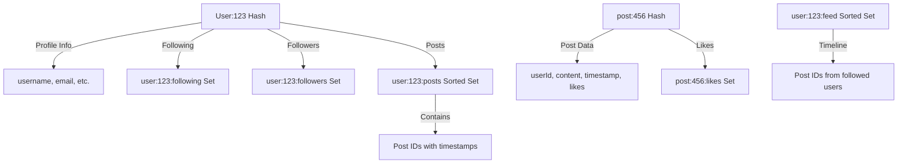

# Redis Social Feed

## Introduction

Social media feeds are a core component of many modern applications. Whether it's a Twitter-like timeline, Facebook's news feed, or Instagram's photo stream, these feeds share common functionality: they display a chronological collection of posts from users you follow.

In this tutorial, we'll build a Redis-powered social feed system. Redis is particularly well-suited for this task due to its speed, built-in data structures, and time-based sorting capabilities. By the end, you'll understand how Redis can be leveraged to create efficient, scalable social feeds.

## Prerequisites

- Basic knowledge of Redis commands
- Node.js installed on your system
- A running Redis server (local or remote)
- npm package: `redis` or `ioredis` client

## Redis Data Structures for Social Feeds

For our social feed implementation, we'll use several Redis data structures:

1. **Sorted Sets** - For time-ordered feeds
2. **Hashes** - For storing post content
3. **Sets** - For following relationships

Let's explore how each of these works in our social media application.

## Building Blocks of a Social Feed

### 1. User Profile Storage

We'll store user profiles as Redis hashes:

```javascript
// Store a user profile
async function createUser(client, userId, username, email) {
  await client.hSet(`user:${userId}`, {
    username,
    email,
    createdAt: Date.now()
  });
  
  // Also create an index by username for lookups
  await client.set(`username:${username}`, userId);
  
  return userId;
}

// Retrieve a user profile
async function getUser(client, userId) {
  return client.hGetAll(`user:${userId}`);
}
```

### 2. Creating Posts

Posts will be stored as hashes with a unique ID:

```javascript
// Create a new post
async function createPost(client, userId, content) {
  // Generate a unique post ID
  const postId = await client.incr('post:id:counter');
  const timestamp = Date.now();
  
  // Store the post content
  await client.hSet(`post:${postId}`, {
    userId,
    content,
    timestamp,
    likes: 0
  });
  
  // Add to user's posts
  await client.zAdd(`user:${userId}:posts`, {
    score: timestamp,
    value: postId
  });
  
  return postId;
}

// Get post by ID
async function getPost(client, postId) {
  return client.hGetAll(`post:${postId}`);
}
```

When we create a post, we:
1. Generate a unique ID using Redis' `INCR` command
2. Store the post content in a hash
3. Add the post to the user's personal timeline using a sorted set

### 3. Following Users

We'll use Redis sets to track following relationships:

```javascript
// Follow a user
async function followUser(client, userId, targetUserId) {
  // Add to "following" set
  await client.sAdd(`user:${userId}:following`, targetUserId);
  
  // Add to target's "followers" set
  await client.sAdd(`user:${targetUserId}:followers`, userId);
}

// Unfollow a user
async function unfollowUser(client, userId, targetUserId) {
  await client.sRem(`user:${userId}:following`, targetUserId);
  await client.sRem(`user:${targetUserId}:followers`, userId);
}

// Get followers
async function getFollowers(client, userId) {
  return client.sMembers(`user:${userId}:followers`);
}

// Get following
async function getFollowing(client, userId) {
  return client.sMembers(`user:${userId}:following`);
}
```

### 4. Building the Timeline Feed

Now for the core functionality - the timeline feed that displays posts from users you follow:

```javascript
// Generate a user's timeline feed
async function generateFeed(client, userId, offset = 0, count = 10) {
  // Get the list of users this person follows
  const following = await client.sMembers(`user:${userId}:following`);
  
  // Include the user's own posts in their feed
  following.push(userId);
  
  const feedKey = `user:${userId}:feed`;
  
  // Create a temporary sorted set for the merged timeline
  const pipeline = client.pipeline();
  
  // Add each followed user's posts to the temporary feed
  for (const followedId of following) {
    pipeline.zRange(`user:${followedId}:posts`, 0, 100, { REV: true });
  }
  
  const results = await pipeline.exec();
  const posts = [];
  
  // Collect all post IDs
  results.forEach(result => {
    if (result[0] === null && Array.isArray(result[1])) {
      posts.push(...result[1]);
    }
  });
  
  // Get the post data
  const feedPosts = [];
  for (let i = offset; i < Math.min(offset + count, posts.length); i++) {
    const postData = await getPost(client, posts[i]);
    feedPosts.push({
      id: posts[i],
      ...postData
    });
  }
  
  return feedPosts;
}
```

This approach generates the feed on-demand by:
1. Finding all users the current user follows
2. Retrieving recent posts from each
3. Merging and sorting them by timestamp
4. Fetching full post data for display

### 5. Liking Posts

Let's implement a like system for posts:

```javascript
// Like a post
async function likePost(client, userId, postId) {
  // Check if already liked
  const alreadyLiked = await client.sIsMember(`post:${postId}:likes`, userId);
  
  if (!alreadyLiked) {
    // Add user to the set of users who liked this post
    await client.sAdd(`post:${postId}:likes`, userId);
    
    // Increment the like counter
    await client.hIncrBy(`post:${postId}`, 'likes', 1);
    
    return true;
  }
  
  return false;
}

// Unlike a post
async function unlikePost(client, userId, postId) {
  const didLike = await client.sRem(`post:${postId}:likes`, userId);
  
  if (didLike) {
    await client.hIncrBy(`post:${postId}`, 'likes', -1);
    return true;
  }
  
  return false;
}

// Get users who liked a post
async function getLikes(client, postId) {
  return client.sMembers(`post:${postId}:likes`);
}
```

## Optimizing for Production

The above implementation works, but can be optimized for production use:

### Fan-out on Write vs. Fan-out on Read

There are two main approaches to building social feeds:

<div className="grid grid-cols-2 gap-4">
  <div>
    <h4>Fan-out on Write</h4>
    <p>When a user posts, immediately copy the post to all followers' feeds</p>
    <ul>
      <li>Faster reads (feeds are pre-built)</li>
      <li>Higher write costs</li>
      <li>Great for feeds with many readers per post</li>
    </ul>
  </div>
  <div>
    <h4>Fan-out on Read</h4>
    <p>Build the feed dynamically when a user requests it</p>
    <ul>
      <li>Lower write costs</li>
      <li>Higher read complexity</li>
      <li>Better for many posts, fewer readers</li>
    </ul>
  </div>
</div>

Our example uses fan-out on read, but here's how you'd implement fan-out on write:

```javascript
// Fan-out on write implementation
async function createPostWithFanout(client, userId, content) {
  // Create the post as before
  const postId = await client.incr('post:id:counter');
  const timestamp = Date.now();
  
  await client.hSet(`post:${postId}`, {
    userId,
    content,
    timestamp,
    likes: 0
  });
  
  // Add to user's posts
  await client.zAdd(`user:${userId}:posts`, {
    score: timestamp,
    value: postId
  });
  
  // Fan out to followers
  const followers = await client.sMembers(`user:${userId}:followers`);
  
  // Also include the user's own feed
  followers.push(userId);
  
  const pipeline = client.pipeline();
  
  // Add the new post to each follower's feed
  for (const followerId of followers) {
    pipeline.zAdd(`user:${followerId}:feed`, {
      score: timestamp,
      value: postId
    });
    
    // Keep feeds to a reasonable size
    pipeline.zRemRangeByRank(`user:${followerId}:feed`, 0, -1001);
  }
  
  await pipeline.exec();
  
  return postId;
}
```

This approach is used by services like Twitter to enable immediate feed updates.

### Feed Data Model Diagram

Here's a visual representation of our Redis data model:



## Complete Example: Building a Simple Twitter Clone

Let's put everything together in a simple Node.js application:

```javascript
const { createClient } = require('redis');

async function main() {
  // Connect to Redis
  const client = createClient();
  await client.connect();
  
  // Create some users
  const alice = await createUser(client, 1, 'alice', 'alice@example.com');
  const bob = await createUser(client, 2, 'bob', 'bob@example.com');
  const charlie = await createUser(client, 3, 'charlie', 'charlie@example.com');
  
  // Create following relationships
  await followUser(client, alice, bob);
  await followUser(client, alice, charlie);
  await followUser(client, bob, alice);
  
  // Create some posts
  await createPost(client, alice, "Hello from Alice!");
  await createPost(client, bob, "Bob's first post");
  await createPost(client, charlie, "Charlie here!");
  await createPost(client, bob, "Bob's second post");
  
  // Like some posts
  await likePost(client, alice, 2); // Alice likes Bob's first post
  await likePost(client, charlie, 1); // Charlie likes Alice's post
  
  // Generate Alice's feed
  const aliceFeed = await generateFeed(client, alice);
  
  console.log("Alice's feed:");
  for (const post of aliceFeed) {
    const user = await getUser(client, post.userId);
    console.log(`${user.username}: ${post.content} (${post.likes} likes)`);
  }
  
  await client.quit();
}

main().catch(console.error);
```

Expected output:

```
Alice's feed:
bob: Bob's second post (0 likes)
charlie: Charlie here! (0 likes)
bob: Bob's first post (1 likes)
alice: Hello from Alice! (1 likes)
```

## Performance Considerations

When implementing a Redis-based feed system, consider these performance factors:

1. **Memory usage**: Redis stores data in memory, so monitor usage as your user base grows
2. **Key eviction policies**: Configure Redis with appropriate eviction policies
3. **Pagination**: Always use limits and offsets when retrieving feeds
4. **Caching**: Consider caching feed results for active users
5. **Mixed approach**: Use fan-out on write for users with few followers, and fan-out on read for users with many followers (Instagram uses this hybrid approach)

## Handling Scale

For large-scale applications, consider these advanced techniques:

1. **Redis Cluster**: Distribute data across multiple Redis nodes
2. **Time-based partitioning**: Split feeds into time buckets (e.g., monthly)
3. **Selective fan-out**: Only fan-out to active users
4. **Background processing**: Use a job queue for feed generation
5. **Feed trimming**: Keep feed sizes manageable by removing old entries

## Exercise: Implementing Comments

As an exercise, try implementing a comment system for posts. Here's a starting point:

```javascript
// Add a comment to a post
async function addComment(client, userId, postId, content) {
  const commentId = await client.incr('comment:id:counter');
  const timestamp = Date.now();
  
  // Store the comment
  await client.hSet(`comment:${commentId}`, {
    userId,
    postId,
    content,
    timestamp
  });
  
  // Add to the post's comments using a sorted set
  await client.zAdd(`post:${postId}:comments`, {
    score: timestamp,
    value: commentId
  });
  
  return commentId;
}

// Get comments for a post
async function getComments(client, postId, offset = 0, count = 10) {
  const commentIds = await client.zRange(
    `post:${postId}:comments`, 
    offset, 
    offset + count - 1
  );
  
  // Get comment details
  const pipeline = client.pipeline();
  for (const commentId of commentIds) {
    pipeline.hGetAll(`comment:${commentId}`);
  }
  
  const results = await pipeline.exec();
  return results.map((result, index) => ({
    id: commentIds[index],
    ...result[1]
  }));
}
```

## Summary

In this tutorial, we've built a complete social feed system using Redis. We've covered:

- Storing user profiles and relationships
- Creating and retrieving posts
- Building following/follower relationships
- Generating timeline feeds
- Implementing likes
- Handling performance at scale

Redis offers an excellent foundation for building social features due to its speed and versatile data structures. The sorted sets, in particular, provide an elegant solution for time-ordered content.

## Additional Resources

- [Redis Documentation](https://redis.io/documentation)
- [Redis Sorted Sets Commands](https://redis.io/commands/?group=sorted-set)
- [Scaling a Twitter Clone](https://redis.com/blog/use-case-twitter-clone/)
- [Twitter's Architecture](https://blog.twitter.com/engineering/en_us/a/2013/redis-at-twitter)

## Challenge Projects

1. **Advanced Feed**: Implement a feed that shows a mix of posts and suggested content
2. **Notifications**: Build a notification system using Redis pub/sub
3. **Analytics**: Track and display post engagement metrics
4. **Trending Topics**: Implement a system to display trending hashtags or topics
5. **Geolocation**: Add location-based filtering to the feed