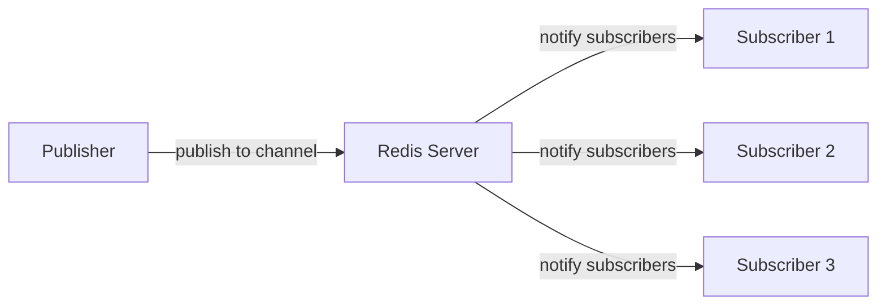
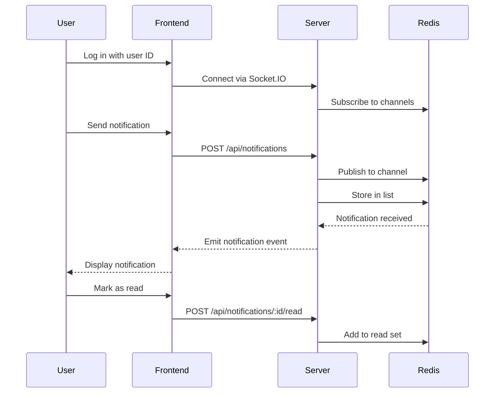

# Redis Notification System

Real-time notifications have become an essential feature in modern applications. Whether it's a social media platform notifying users about new likes, an e-commerce site sending order updates, or a collaboration tool alerting team members about changes - notifications help keep users engaged and informed.

In this tutorial, we'll build a notification system using Redis, focusing on its powerful Pub/Sub (Publish/Subscribe) feature. This project is perfect for beginners who want to understand how real-time communication works in web applications.

## What You'll Learn

- Understanding Redis Pub/Sub mechanism
- Setting up a notification publisher and subscriber
- Implementing notification types and filtering
- Building a simple notification center with persistence
- Handling notification delivery and read receipts

## Prerequisites

- Basic knowledge of Redis commands
- Node.js installed on your system
- Some familiarity with JavaScript/Node.js programming

## Understanding Redis Pub/Sub

Redis Pub/Sub is a messaging pattern where publishers send messages to channels without knowing who will receive them, while subscribers express interest in channels and receive messages without knowing who sent them.



The publisher and subscribers are completely decoupled, making this pattern ideal for building notification systems where multiple clients need to be notified about events.

## Setting Up Our Project

Let's start by setting up a basic Node.js project with the required dependencies:

```bash
mkdir redis-notification-system
cd redis-notification-system
npm init -y
npm install redis express socket.io
```

Now let's create our main files:

```
redis-notification-system/
├── server.js         # Main server file
├── publisher.js      # For publishing notifications
├── subscriber.js     # For subscribing to notifications
└── package.json
```

## Implementing the Subscriber

First, let's create a subscriber that listens for notifications:

```js
// subscriber.js
const redis = require('redis');
const subscriber = redis.createClient();

async function main() {
  await subscriber.connect();
  
  console.log('Subscriber connected to Redis');
  
  // Subscribe to notification channels
  await subscriber.subscribe('notifications', (message) => {
    const notification = JSON.parse(message);
    console.log(`Received notification: ${notification.message}`);
    
    // Process notification based on type
    processNotification(notification);
  });
  
  // Subscribe to a specific user's notifications
  await subscriber.subscribe('user:1234:notifications', (message) => {
    const notification = JSON.parse(message);
    console.log(`Received user-specific notification: ${notification.message}`);
  });
}

function processNotification(notification) {
  switch(notification.type) {
    case 'message':
      console.log(`New message from ${notification.sender}: ${notification.message}`);
      break;
    case 'friend_request':
      console.log(`New friend request from ${notification.sender}`);
      break;
    case 'system':
      console.log(`System notification: ${notification.message}`);
      break;
    default:
      console.log(`Unknown notification type: ${notification.type}`);
  }
}

// Handle errors and connection events
subscriber.on('error', (err) => console.error('Redis Client Error', err));

main().catch(console.error);
```

## Implementing the Publisher

Now, let's create a publisher that sends notifications:

```js
// publisher.js
const redis = require('redis');
const publisher = redis.createClient();

async function main() {
  await publisher.connect();
  
  console.log('Publisher connected to Redis');
  
  // Publish a global notification
  await publishNotification({
    id: generateId(),
    type: 'system',
    message: 'System maintenance scheduled for tomorrow',
    timestamp: Date.now()
  });
  
  // Publish a user-specific notification
  await publishUserNotification('1234', {
    id: generateId(),
    type: 'message',
    message: 'You have a new message',
    sender: 'Alice',
    timestamp: Date.now()
  });
}

async function publishNotification(notification) {
  await publisher.publish('notifications', JSON.stringify(notification));
  console.log(`Published notification: ${notification.message}`);
  
  // Also store in Redis for persistence
  await storeNotification(notification);
}

async function publishUserNotification(userId, notification) {
  await publisher.publish(`user:${userId}:notifications`, JSON.stringify(notification));
  console.log(`Published notification to user ${userId}: ${notification.message}`);
  
  // Also store in Redis for persistence
  await storeUserNotification(userId, notification);
}

async function storeNotification(notification) {
  // Store in a Redis list for persistence
  await publisher.lPush('recent_notifications', JSON.stringify(notification));
  // Keep only the 100 most recent notifications
  await publisher.lTrim('recent_notifications', 0, 99);
}

async function storeUserNotification(userId, notification) {
  // Store in a Redis list for user-specific persistence
  await publisher.lPush(`user:${userId}:notifications`, JSON.stringify(notification));
  // Keep only the 50 most recent notifications per user
  await publisher.lTrim(`user:${userId}:notifications`, 0, 49);
}

function generateId() {
  return Math.random().toString(36).substring(2, 15);
}

// Handle errors
publisher.on('error', (err) => console.error('Redis Client Error', err));

main().catch(console.error);
```

## Building a Web Server with Real-time Notifications

Now, let's integrate our notification system with a web application using Express and Socket.IO:

```js
// server.js
const express = require('express');
const http = require('http');
const { Server } = require('socket.io');
const redis = require('redis');

const app = express();
const server = http.createServer(app);
const io = new Server(server);

// Redis clients
const subscriber = redis.createClient();
const redisClient = redis.createClient();

async function main() {
  await subscriber.connect();
  await redisClient.connect();
  
  console.log('Redis clients connected');
  
  // Set up static files
  app.use(express.static('public'));
  app.use(express.json());
  
  // API endpoint to fetch recent notifications
  app.get('/api/notifications', async (req, res) => {
    const userId = req.query.userId || 'guest';
    
    try {
      // Get global notifications
      const globalNotifications = await redisClient.lRange('recent_notifications', 0, 9);
      
      // Get user-specific notifications if userId is provided and not guest
      let userNotifications = [];
      if (userId !== 'guest') {
        userNotifications = await redisClient.lRange(`user:${userId}:notifications`, 0, 19);
      }
      
      // Combine and parse notifications
      const allNotifications = [
        ...globalNotifications.map(n => JSON.parse(n)),
        ...userNotifications.map(n => JSON.parse(n))
      ];
      
      // Sort by timestamp, newest first
      allNotifications.sort((a, b) => b.timestamp - a.timestamp);
      
      res.json(allNotifications.slice(0, 20)); // Return top 20
    } catch (error) {
      console.error('Error fetching notifications:', error);
      res.status(500).json({ error: 'Failed to fetch notifications' });
    }
  });
  
  // API endpoint to mark notification as read
  app.post('/api/notifications/:id/read', async (req, res) => {
    const { id } = req.params;
    const { userId } = req.body;
    
    if (!userId) {
      return res.status(400).json({ error: 'User ID is required' });
    }
    
    try {
      await redisClient.sAdd(`user:${userId}:read_notifications`, id);
      res.json({ success: true });
    } catch (error) {
      console.error('Error marking notification as read:', error);
      res.status(500).json({ error: 'Failed to mark notification as read' });
    }
  });
  
  // API endpoint to send a new notification
  app.post('/api/notifications', async (req, res) => {
    const { type, message, targetUserId } = req.body;
    
    if (!type || !message) {
      return res.status(400).json({ error: 'Type and message are required' });
    }
    
    try {
      const notification = {
        id: Math.random().toString(36).substring(2, 15),
        type,
        message,
        timestamp: Date.now()
      };
      
      // If targetUserId is provided, send a targeted notification
      if (targetUserId) {
        await publishUserNotification(targetUserId, notification);
      } else {
        // Otherwise, send a global notification
        await publishNotification(notification);
      }
      
      res.json({ success: true, notification });
    } catch (error) {
      console.error('Error sending notification:', error);
      res.status(500).json({ error: 'Failed to send notification' });
    }
  });
  
  // Socket.IO connection
  io.on('connection', (socket) => {
    console.log('A user connected');
    
    // Authenticate user
    socket.on('authenticate', async (userId) => {
      // Store user ID in socket
      socket.userId = userId;
      
      // Join rooms for notifications
      socket.join('global_notifications');
      socket.join(`user:${userId}:notifications`);
      
      console.log(`User ${userId} authenticated`);
      
      // Send welcome notification
      socket.emit('notification', {
        id: Math.random().toString(36).substring(2, 15),
        type: 'system',
        message: 'Welcome to the notification center!',
        timestamp: Date.now()
      });
      
      // Fetch and send unread notifications
      const unreadNotifications = await getUnreadNotifications(userId);
      if (unreadNotifications.length > 0) {
        socket.emit('unread_notifications', unreadNotifications);
      }
    });
    
    socket.on('disconnect', () => {
      console.log('User disconnected');
    });
  });
  
  // Subscribe to Redis channels for notifications
  await subscriber.subscribe('notifications', (message) => {
    const notification = JSON.parse(message);
    // Broadcast to all connected clients
    io.to('global_notifications').emit('notification', notification);
  });
  
  // Pattern subscribe to user-specific notifications
  await subscriber.pSubscribe('user:*:notifications', (message, channel) => {
    const notification = JSON.parse(message);
    // Extract user ID from channel name
    const userId = channel.split(':')[1];
    // Send to specific user's room
    io.to(`user:${userId}:notifications`).emit('notification', notification);
  });
  
  // Start server
  const PORT = process.env.PORT || 3000;
  server.listen(PORT, () => {
    console.log(`Server running on port ${PORT}`);
  });
}

async function getUnreadNotifications(userId) {
  // Get all notifications for the user
  const globalNotifications = await redisClient.lRange('recent_notifications', 0, 19);
  const userNotifications = await redisClient.lRange(`user:${userId}:notifications`, 0, 19);
  
  // Get IDs of read notifications
  const readNotificationIds = await redisClient.sMembers(`user:${userId}:read_notifications`);
  
  // Filter out read notifications
  const allNotifications = [
    ...globalNotifications.map(n => JSON.parse(n)),
    ...userNotifications.map(n => JSON.parse(n))
  ].filter(notification => !readNotificationIds.includes(notification.id));
  
  // Sort by timestamp
  allNotifications.sort((a, b) => b.timestamp - a.timestamp);
  
  return allNotifications;
}

async function publishNotification(notification) {
  await redisClient.publish('notifications', JSON.stringify(notification));
  // Also store in Redis list for persistence
  await redisClient.lPush('recent_notifications', JSON.stringify(notification));
  await redisClient.lTrim('recent_notifications', 0, 99); // Keep last 100
}

async function publishUserNotification(userId, notification) {
  await redisClient.publish(`user:${userId}:notifications`, JSON.stringify(notification));
  // Also store in Redis list for persistence
  await redisClient.lPush(`user:${userId}:notifications`, JSON.stringify(notification));
  await redisClient.lTrim(`user:${userId}:notifications`, 0, 49); // Keep last 50
}

// Handle errors
subscriber.on('error', (err) => console.error('Redis Subscriber Error', err));
redisClient.on('error', (err) => console.error('Redis Client Error', err));

main().catch(console.error);
```

## Creating a Simple Frontend

Let's create a basic HTML/JS frontend to display notifications:

```html
<!-- public/index.html -->
<!DOCTYPE html>
<html lang="en">
<head>
  <meta charset="UTF-8" />
  <meta name="viewport" content="width=device-width, initial-scale=1.0" />
  <title>Redis Notification System</title>
  <style>
    body {
      font-family: Arial, sans-serif;
      max-width: 800px;
      margin: 0 auto;
      padding: 20px;
    }
    
    .notification {
      padding: 10px;
      margin-bottom: 10px;
      border-radius: 4px;
      position: relative;
    }
    
    .notification.unread {
      border-left: 3px solid #4caf50;
      background-color: #f9fff9;
    }
    
    .notification.message {
      border-left: 3px solid #2196f3;
      background-color: #f1f8ff;
    }
    
    .notification.system {
      border-left: 3px solid #ff9800;
      background-color: #fffaf1;
    }
    
    .notification .time {
      font-size: 0.8em;
      color: #666;
    }
    
    .notification-center {
      border: 1px solid #ddd;
      border-radius: 4px;
      margin-top: 20px;
      max-height: 400px;
      overflow-y: auto;
    }
    
    .mark-read {
      position: absolute;
      right: 10px;
      top: 10px;
      cursor: pointer;
      color: #2196f3;
    }
    
    .controls {
      display: flex;
      justify-content: space-between;
      margin-bottom: 20px;
    }
    
    button {
      padding: 8px 12px;
      background: #4caf50;
      color: white;
      border: none;
      border-radius: 4px;
      cursor: pointer;
    }
    
    input, select {
      padding: 8px;
      border: 1px solid #ddd;
      border-radius: 4px;
    }
  </style>
</head>
<body>
  <h1>Redis Notification System</h1>
  
  <div class="controls">
    <div>
      <label for="userId">User ID:</label>
      <input type="text" id="userId" value="1234" />
      <button id="loginBtn">Log In</button>
    </div>
    
    <div>
      <select id="notificationType">
        <option value="message">Message</option>
        <option value="system">System</option>
        <option value="friend_request">Friend Request</option>
      </select>
      <input type="text" id="notificationText" placeholder="Notification message" />
      <input type="text" id="targetUser" placeholder="Target user ID (optional)" />
      <button id="sendBtn">Send Notification</button>
    </div>
  </div>
  
  <h2>Notifications <span id="unreadCount"></span></h2>
  <div class="notification-center" id="notificationCenter">
    <div class="notification system">
      <div class="time">Just now</div>
      <div class="content">Welcome to the notification system! Log in to see your notifications.</div>
    </div>
  </div>
  
  <script src="/socket.io/socket.io.js"></script>
  <script>
    // Initialize variables
    let socket;
    let currentUserId = null;
    let notifications = [];
    let readNotifications = new Set();
    
    // DOM elements
    const notificationCenter = document.getElementById('notificationCenter');
    const userIdInput = document.getElementById('userId');
    const loginBtn = document.getElementById('loginBtn');
    const sendBtn = document.getElementById('sendBtn');
    const notificationTypeSelect = document.getElementById('notificationType');
    const notificationTextInput = document.getElementById('notificationText');
    const targetUserInput = document.getElementById('targetUser');
    const unreadCountSpan = document.getElementById('unreadCount');
    
    // Event listeners
    loginBtn.addEventListener('click', login);
    sendBtn.addEventListener('click', sendNotification);
    
    // Initial UI setup
    updateUnreadCount();
    
    function login() {
      const userId = userIdInput.value.trim();
      if (!userId) {
        alert('Please enter a user ID');
        return;
      }
      
      // Disconnect previous socket if exists
      if (socket) {
        socket.disconnect();
      }
      
      // Clear notifications
      notifications = [];
      readNotifications = new Set();
      notificationCenter.innerHTML = '';
      
      // Connect to server
      socket = io();
      currentUserId = userId;
      
      // Socket events
      socket.on('connect', () => {
        console.log('Connected to server');
        socket.emit('authenticate', userId);
        fetchNotifications();
      });
      
      socket.on('notification', (notification) => {
        console.log('New notification:', notification);
        addNotification(notification);
      });
      
      socket.on('unread_notifications', (unreadNotifications) => {
        console.log('Unread notifications:', unreadNotifications);
        unreadNotifications.forEach(notification => {
          addNotification(notification, true);
        });
      });
      
      socket.on('disconnect', () => {
        console.log('Disconnected from server');
      });
      
      loginBtn.textContent = 'Logged In';
    }
    
    function fetchNotifications() {
      fetch(`/api/notifications?userId=${currentUserId}`)
        .then(response => response.json())
        .then(data => {
          // Clear existing notifications
          notificationCenter.innerHTML = '';
          notifications = data;
          
          // Display notifications
          notifications.forEach(notification => {
            addNotificationToDOM(notification);
          });
          
          updateUnreadCount();
        })
        .catch(error => {
          console.error('Error fetching notifications:', error);
        });
    }
    
    function sendNotification() {
      const type = notificationTypeSelect.value;
      const message = notificationTextInput.value.trim();
      const targetUserId = targetUserInput.value.trim();
      
      if (!message) {
        alert('Please enter a notification message');
        return;
      }
      
      const notificationData = {
        type,
        message
      };
      
      if (targetUserId) {
        notificationData.targetUserId = targetUserId;
      }
      
      fetch('/api/notifications', {
        method: 'POST',
        headers: {
          'Content-Type': 'application/json'
        },
        body: JSON.stringify(notificationData)
      })
        .then(response => response.json())
        .then(data => {
          console.log('Notification sent:', data);
          notificationTextInput.value = '';
        })
        .catch(error => {
          console.error('Error sending notification:', error);
        });
    }
    
    function addNotification(notification, isUnread = true) {
      // Add to notifications array
      notifications.unshift(notification);
      
      // Update DOM
      addNotificationToDOM(notification, isUnread);
      updateUnreadCount();
    }
    
    function addNotificationToDOM(notification, isUnread = false) {
      const notificationEl = document.createElement('div');
      notificationEl.className = `notification ${notification.type}`;
      
      if (isUnread && !readNotifications.has(notification.id)) {
        notificationEl.classList.add('unread');
      }
      
      const time = new Date(notification.timestamp).toLocaleTimeString();
      
      notificationEl.innerHTML = `
        <div class="time">${time}</div>
        <div class="content">${notification.message}</div>
        <div class="mark-read" data-id="${notification.id}">Mark as read</div>
      `;
      
      // Add event listener for mark as read
      notificationEl.querySelector('.mark-read').addEventListener('click', (e) => {
        const notificationId = e.target.getAttribute('data-id');
        markAsRead(notificationId);
        notificationEl.classList.remove('unread');
      });
      
      // Add to notification center
      notificationCenter.insertBefore(notificationEl, notificationCenter.firstChild);
    }
    
    function markAsRead(notificationId) {
      if (!currentUserId) return;
      
      readNotifications.add(notificationId);
      
      fetch(`/api/notifications/${notificationId}/read`, {
        method: 'POST',
        headers: {
          'Content-Type': 'application/json'
        },
        body: JSON.stringify({
          userId: currentUserId
        })
      })
        .then(response => response.json())
        .then(data => {
          console.log('Marked as read:', data);
          updateUnreadCount();
        })
        .catch(error => {
          console.error('Error marking as read:', error);
        });
    }
    
    function updateUnreadCount() {
      const unreadCount = document.querySelectorAll('.notification.unread').length;
      unreadCountSpan.textContent = unreadCount > 0 ? `(${unreadCount} unread)` : '';
    }
  </script>
</body>
</html>
```

## How It All Works Together

Let's understand how all components of our Redis Notification System work together:

1. **Publisher Component**: Generates and sends notifications to Redis channels
2. **Redis Pub/Sub**: Acts as the message broker, routing notifications to appropriate subscribers
3. **Subscriber Component**: Listens for notifications on specific channels
4. **Persistence Layer**: Stores notifications in Redis lists for history and retrieval
5. **Web Server**: Provides API endpoints for managing notifications
6. **Socket.IO**: Delivers real-time notifications to connected clients
7. **Web Frontend**: Displays notifications and allows user interaction



## Extending the Notification System

Here are some ways you can extend this notification system:

### 1. Adding Notification Categories

We can categorize notifications for better organization:

```js
// Extended notification object
{
  id: "abc123",
  type: "message",
  category: "social",  // social, system, marketing, etc.
  message: "Alice sent you a message",
  sender: "Alice",
  priority: "high",    // high, medium, low
  timestamp: 1618456789000
}
```

### 2. Implementing Notification Preferences

Allow users to specify which notifications they want to receive:

```js
// Store user preferences in Redis hash
await redisClient.hSet(`user:${userId}:preferences`, {
  'social': true,
  'marketing': false,
  'system': true
});

// Check preferences before sending
async function shouldSendNotification(userId, category) {
  const preferences = await redisClient.hGetAll(`user:${userId}:preferences`);
  return preferences[category] === 'true';
}
```

### 3. Adding Notification Expiry

Some notifications should expire after a certain time:

```js
// Add expiry to notification
async function publishNotificationWithExpiry(notification, expirySeconds) {
  await publishNotification(notification);
  
  // Set expiry key
  const expiryKey = `notification:${notification.id}:expiry`;
  await redisClient.set(expiryKey, '1');
  await redisClient.expire(expiryKey, expirySeconds);
}
```

## Practical Application: Chat Application Notifications

Let's look at how our notification system could be used in a real-world chat application:

```js
// When a new message is received in a chat
async function handleNewChatMessage(chatId, message) {
  // Get all users in this chat
  const chatMembers = await redisClient.sMembers(`chat:${chatId}:members`);
  
  // Send notification to each member except sender
  for (const userId of chatMembers) {
    if (userId !== message.senderId) {
      // Check if user is currently viewing this chat
      const activeChat = await redisClient.get(`user:${userId}:active_chat`);
      
      // Only send notification if user is not currently viewing this chat
      if (activeChat !== chatId) {
        const notification = {
          id: generateId(),
          type: 'message',
          category: 'chat',
          message: `New message from ${message.senderName} in ${message.chatName}`,
          chatId: chatId,
          senderId: message.senderId,
          senderName: message.senderName,
          preview: message.content.substring(0, 50),
          timestamp: Date.now()
        };
        
        await publishUserNotification(userId, notification);
      }
    }
  }
}
```

## Summary

In this tutorial, we've built a comprehensive notification system using Redis Pub/Sub. We've covered:

1. How Redis Pub/Sub works for real-time communication
2. Setting up publishers and subscribers for notifications
3. Implementing a web server to handle notification management
4. Building a frontend to display and interact with notifications
5. Extending the system with additional features
6. Applying the notification system to a real-world chat application

Redis Pub/Sub provides a powerful foundation for building real-time features in your applications. This notification system can be adapted for various use cases, from social media platforms to e-commerce sites, collaboration tools, and more.

## Exercise Ideas

1. Add support for notification grouping (e.g., "5 new messages from Alice")
2. Implement notification badges for different categories
3. Add sound alerts for high-priority notifications
4. Create a notification dashboard for administrators
5. Implement push notifications using a service like Firebase

## Additional Resources

- [Redis Documentation](https://redis.io/topics/pubsub)
- [Socket.IO Documentation](https://socket.io/docs/v4)
- [Node Redis Client](https://github.com/redis/node-redis)
- [Web Notifications API](https://developer.mozilla.org/en-US/docs/Web/API/Notifications_API)

By mastering Redis Pub/Sub for notifications, you've gained a valuable skill for building responsive, real-time applications!