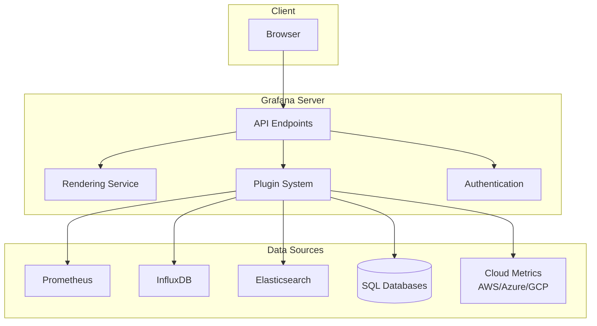

# Grafana Introduction

## What is Grafana?

Grafana is an open-source analytics and interactive visualization web application. It allows you to query, visualize, alert on, and explore your metrics, logs, and traces wherever they are stored. With Grafana, you can create, explore, and share dashboards with your team and foster a data-driven culture.

Originally built for time series data, Grafana has evolved to support many different types of data sources and visualization needs. Whether you need to monitor infrastructure, analyze application performance, or track business metrics, Grafana provides powerful tools to transform your data into insightful visualizations.

## Why Use Grafana?

Grafana offers several key benefits:

- **Unified Monitoring**: Visualize metrics from multiple data sources in a single dashboard
- **Powerful Visualization Options**: Choose from various chart types and customization options
- **Alerting**: Set up alerts based on thresholds and receive notifications
- **Extensibility**: Expand functionality with plugins and integrations
- **Community Support**: Benefit from a large, active community and extensive documentation

## Core Concepts in Grafana

Before diving deep into Grafana, let's understand some fundamental concepts:

### Dashboards

A dashboard is a set of one or more panels organized and arranged into rows. Dashboards are how you view and interact with your data in Grafana.

### Panels

Panels are the basic visualization building blocks in Grafana. Each panel has a query editor specific to the data source selected for the panel. Panels can display data as graphs, tables, heatmaps, and more.

### Data Sources

Data sources are the connection points that allow Grafana to retrieve data from various storage backends. Common data sources include:

- Prometheus
- Elasticsearch
- InfluxDB
- MySQL/PostgreSQL
- Graphite
- AWS CloudWatch
- Azure Monitor

### Queries

Queries define what data to display in a panel. The query language depends on the data source you're using (e.g., PromQL for Prometheus, SQL for database sources).

### Organizations

Organizations in Grafana represent a logical grouping of resources (dashboards, users, and data sources) that typically align with a company, team, or project.

## Grafana Architecture

Grafana follows a client-server architecture:



## Getting Started with Grafana

### Installation

Grafana can be installed in various ways depending on your environment:

#### Using Docker

```bash
docker run -d -p 3000:3000 --name=grafana grafana/grafana
```

#### On Ubuntu/Debian

```bash
sudo apt-get install -y apt-transport-https software-properties-common
sudo add-apt-repository "deb https://packages.grafana.com/oss/deb stable main"
wget -q -O - https://packages.grafana.com/gpg.key | sudo apt-key add -
sudo apt-get update
sudo apt-get install grafana
sudo systemctl start grafana-server
sudo systemctl enable grafana-server
```

#### On macOS (using Homebrew)

```bash
brew update
brew install grafana
brew services start grafana
```

After installation, you can access the Grafana UI at `http://localhost:3000` (default credentials: admin/admin).

### First Login

1. Open your web browser and navigate to `http://localhost:3000`
2. Log in with the default credentials (username: `admin`, password: `admin`)
3. You'll be prompted to change the default password
4. After logging in, you'll see the Grafana home dashboard

### Adding Your First Data Source

1. Click on the gear icon (⚙️) in the side menu to open the Configuration menu
2. Select "Data Sources"
3. Click "Add data source"
4. Choose a data source type (for example, Prometheus)
5. Configure the connection settings
6. Click "Save & Test" to verify the connection

Here's an example configuration for a Prometheus data source:

```json
{
  "name": "Prometheus",
  "type": "prometheus",
  "url": "http://prometheus:9090",
  "access": "proxy",
  "basicAuth": false
}
```

### Creating Your First Dashboard

1. Click on the "+" icon in the side menu
2. Select "Dashboard"
3. Click "Add new panel"
4. Select your data source
5. Write a query to visualize data
6. Configure visualization options
7. Click "Apply" to add the panel to your dashboard
8. Save your dashboard by clicking the save icon in the top navigation bar

## Example: Monitoring System Resources

Let's create a simple dashboard to monitor system resources using Prometheus as a data source:

### Step 1: Set up Prometheus and Node Exporter

Before proceeding, ensure you have Prometheus and Node Exporter running to collect system metrics.

### Step 2: Configure Query for CPU Usage

1. Create a new panel
2. Select Prometheus as the data source
3. Enter the following PromQL query:

```
100 - (avg by (instance) (irate(node_cpu_seconds_total{mode="idle"}[1m])) * 100)
```

4. This query shows CPU usage as a percentage

### Step 3: Configure Visualization

1. In the Panel tab, give your panel a title: "CPU Usage"
2. Set the unit to "Percent (0-100)"
3. Add thresholds to highlight high CPU usage:
   - 80% or higher: Red
   - 60-80%: Orange
   - Below 60%: Green

### Step 4: Add More Panels

Add additional panels for:

- Memory usage:
  ```
  100 * (1 - ((node_memory_MemFree_bytes + node_memory_Cached_bytes + node_memory_Buffers_bytes) / node_memory_MemTotal_bytes))
  ```

- Disk usage:
  ```
  100 - ((node_filesystem_avail_bytes{mountpoint="/"} * 100) / node_filesystem_size_bytes{mountpoint="/"})
  ```

- Network traffic:
  ```
  rate(node_network_receive_bytes_total[1m])
  ```

### Step 5: Organize Panels

Arrange your panels in a logical layout and save your dashboard.

## Grafana Variables

Variables make your dashboards more interactive and reusable. They act as placeholders for values like server names, time intervals, or any other dimension in your data.

### Creating a Dashboard Variable

1. In your dashboard, click the gear icon to open dashboard settings
2. Select "Variables" from the side menu
3. Click "Add variable"
4. Configure your variable:
   - Name: The reference name for your variable
   - Label: The display name
   - Type: The kind of variable (query, custom, etc.)
   - Query: For query variables, the query to retrieve values

Example: Creating a server instance variable:

```
label_values(node_cpu_seconds_total, instance)
```

This query will populate a dropdown with all available server instances in your Prometheus data.

### Using Variables in Queries

Once defined, you can use variables in your queries with the syntax: `$variable_name`

For example:

```
100 - (avg by (instance) (irate(node_cpu_seconds_total{instance="$instance",mode="idle"}[1m])) * 100)
```

This query now shows CPU usage only for the selected instance.

## Alerts in Grafana

Grafana allows you to create alerts that notify you when metrics cross specified thresholds.

### Creating an Alert

1. Edit a panel that visualizes the metric you want to alert on
2. Go to the "Alert" tab
3. Click "Create Alert"
4. Configure:
   - Conditions: Define when the alert should trigger
   - Evaluation interval: How often to check conditions
   - Notifications: Where to send alerts

Example alert configuration for high CPU usage:

- Rule name: "High CPU Usage"
- Condition: WHEN avg() OF query(A, 5m, now) IS ABOVE 90
- Evaluation: Every 1m for 5m
- Notification: Send to email

## Best Practices

As you work with Grafana, keep these best practices in mind:

1. **Organize Dashboards**: Use folders to keep dashboards organized
2. **Use Templates**: Create template dashboards for common monitoring needs
3. **Consistent Naming**: Adopt a consistent naming convention for panels and dashboards
4. **Dashboard Annotations**: Add annotations to mark significant events
5. **Regular Reviews**: Periodically review and refine your dashboards
6. **Time Range Controls**: Configure appropriate default time ranges
7. **Documentation**: Add documentation to complex dashboards with text panels

## Summary

Grafana is a powerful platform for data visualization and monitoring that allows you to:

- Connect to various data sources
- Create custom dashboards with different visualization types
- Set up alerts for critical metrics
- Share insights with your team

By mastering Grafana, you can transform raw data into actionable insights, helping you make data-driven decisions and identify issues before they become critical problems.

## Next Steps

Now that you've learned the fundamentals of Grafana, here are some exercises to reinforce your knowledge:

1. Install Grafana and connect it to a data source
2. Create a dashboard with at least three different panel types
3. Configure a dashboard variable and use it in your queries
4. Set up an alert for a critical metric
5. Explore Grafana's plugin library and add a new visualization type

In the next sections of this Grafana Learning Path, we'll dive deeper into advanced dashboard creation, complex query writing, and specialized visualization techniques.