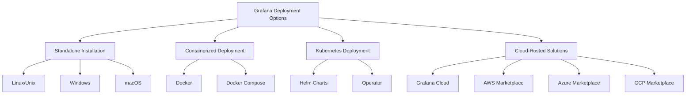

# Grafana Deployment Options

## Introduction

Deploying Grafana is a critical step in setting up your monitoring and visualization environment. Grafana offers remarkable flexibility in how and where you can deploy it, accommodating various infrastructure requirements, team sizes, and technical expertise levels. This guide explores the different deployment options available for Grafana, helping you choose the approach that best fits your specific needs.

Whether you're a solo developer looking for a quick setup, a growing team needing scalable solutions, or an enterprise requiring high availability and security, Grafana has deployment options to suit your scenario.

## Deployment Options Overview

Grafana can be deployed in multiple ways, each with its own advantages and considerations:



Let's explore each option in detail.

## Standalone Installation

Standalone installation involves setting up Grafana directly on a server's operating system.

### Linux/Unix Installation

Installing Grafana on Linux distributions is straightforward using package managers.

#### Debian/Ubuntu Installation

```bash
# Add the Grafana GPG key
wget -q -O - https://packages.grafana.com/gpg.key | sudo apt-key add -

# Add the repository for stable releases
echo "deb https://packages.grafana.com/oss/deb stable main" | sudo tee -a /etc/apt/sources.list.d/grafana.list

# Update and install
sudo apt-get update
sudo apt-get install grafana

# Start Grafana server
sudo systemctl start grafana-server
sudo systemctl enable grafana-server
```

#### RPM-based Installation (CentOS, RHEL, Fedora)

```bash
# Create a repository file
sudo tee /etc/yum.repos.d/grafana.repo << EOF
[grafana]
name=grafana
baseurl=https://packages.grafana.com/oss/rpm
repo_gpgcheck=1
enabled=1
gpgcheck=1
gpgkey=https://packages.grafana.com/gpg.key
sslverify=1
sslcacert=/etc/pki/tls/certs/ca-bundle.crt
EOF

# Install Grafana
sudo yum install grafana

# Start Grafana server
sudo systemctl start grafana-server
sudo systemctl enable grafana-server
```

### Windows Installation

Grafana is available as a Windows installer:

1. Download the latest Windows installer from the [Grafana download page](https://grafana.com/grafana/download)
2. Run the `.msi` installer
3. Follow the installation wizard
4. Grafana can be started as a Windows service or run manually

### macOS Installation

Using Homebrew is the simplest way to install Grafana on macOS:

```bash
# Install Homebrew if you don't have it
/bin/bash -c "$(curl -fsSL https://raw.githubusercontent.com/Homebrew/install/HEAD/install.sh)"

# Install Grafana
brew update
brew install grafana

# Start Grafana
brew services start grafana
```

### Advantages of Standalone Installation

- **Direct control**: Full control over the Grafana instance
- **Performance**: Can be optimized for specific hardware
- **Integration**: Easy integration with existing infrastructure
- **Customization**: Straightforward access to configuration files

### Considerations

- **Maintenance**: Requires manual updates and maintenance
- **Scalability**: Scaling requires additional setup
- **Resources**: Uses host system resources directly

## Containerized Deployment

Containerization offers a lightweight, portable approach to Grafana deployment.

### Docker Deployment

Docker allows you to run Grafana in an isolated container:

```bash
# Pull the latest Grafana image
docker pull grafana/grafana:latest

# Run Grafana container
docker run -d -p 3000:3000 --name=grafana grafana/grafana:latest
```

For persistent storage, mount volumes:

```bash
docker run -d -p 3000:3000 --name=grafana \
  -v grafana-storage:/var/lib/grafana \
  grafana/grafana:latest
```

### Docker Compose Setup

For a more complex setup including a database, Docker Compose is ideal:

```yaml
version: '3'
services:
  grafana:
    image: grafana/grafana:latest
    container_name: grafana
    ports:
      - 3000:3000
    volumes:
      - grafana-storage:/var/lib/grafana
    environment:
      - GF_SECURITY_ADMIN_PASSWORD=admin
    restart: always
    networks:
      - monitoring

  prometheus:
    image: prom/prometheus:latest
    container_name: prometheus
    ports:
      - 9090:9090
    volumes:
      - ./prometheus.yml:/etc/prometheus/prometheus.yml
    restart: always
    networks:
      - monitoring

networks:
  monitoring:

volumes:
  grafana-storage:
```

Save this as `docker-compose.yml` and run:

```bash
docker-compose up -d
```

### Advantages of Containerized Deployment

- **Isolation**: Runs in its own environment
- **Portability**: Easily move between different hosts
- **Version Control**: Simple to upgrade or downgrade
- **Consistent Environment**: Same environment across development and production

### Considerations

- **Container Knowledge**: Requires understanding of Docker concepts
- **Resource Overhead**: Slight overhead from container runtime
- **Persistent Storage**: Requires proper volume setup for data persistence

## Kubernetes Deployment

Kubernetes offers robust orchestration for Grafana in large-scale environments.

### Using Helm Charts

Helm simplifies Kubernetes deployments:

```bash
# Add Grafana Helm repository
helm repo add grafana https://grafana.github.io/helm-charts
helm repo update

# Install Grafana
helm install grafana grafana/grafana

# Get admin password
kubectl get secret --namespace default grafana -o jsonpath="{.data.admin-password}" | base64 --decode ; echo

# Forward the port to access Grafana
kubectl port-forward service/grafana 3000:80
```

### Using Grafana Operator

The Grafana Operator provides a more Kubernetes-native way to manage Grafana:

```bash
# Install the Grafana Operator
kubectl apply -f https://raw.githubusercontent.com/grafana/grafana-operator/master/deploy/manifests/latest/grafana-operator.yaml

# Create a Grafana instance
cat <<EOF | kubectl apply -f -
apiVersion: integreatly.org/v1alpha1
kind: Grafana
metadata:
  name: grafana-instance
spec:
  deployment:
    replicas: 1
  service:
    type: ClusterIP
  dashboardLabelSelector:
    - matchExpressions:
      - key: app
        operator: In
        values:
          - grafana
EOF
```

### Advantages of Kubernetes Deployment

- **High Availability**: Easy to set up redundant instances
- **Scalability**: Horizontal scaling with simple configuration
- **Self-Healing**: Automatic recovery from failures
- **Resource Management**: Efficient distribution across cluster
- **Integration**: Native integration with other Kubernetes services

### Considerations

- **Complexity**: More complex to set up and manage
- **Resource Requirements**: Kubernetes itself requires resources
- **Learning Curve**: Requires Kubernetes knowledge

## Cloud-Hosted Solutions

Cloud-hosted options offer managed Grafana instances with minimal setup.

### Grafana Cloud

Grafana Cloud is the official managed service:

1. Sign up at [Grafana Cloud](https://grafana.com/products/cloud/)
2. Follow the setup wizard to create your hosted Grafana instance
3. Start creating dashboards and connecting data sources

### Cloud Marketplace Offerings

Grafana is available as a managed service in major cloud marketplaces:

- **AWS Marketplace**: Pre-configured AMIs for easy deployment
- **Azure Marketplace**: Managed Grafana instances on Azure
- **Google Cloud Marketplace**: Click-to-deploy Grafana on GCP

### Advantages of Cloud-Hosted Solutions

- **Zero Maintenance**: Provider handles updates and infrastructure
- **Reliability**: Built-in high availability and backups
- **Scalability**: Easily scale with growing needs
- **Security**: Managed security updates and compliance
- **Integration**: Seamless integration with cloud services

### Considerations

- **Cost**: Usually more expensive than self-hosted options
- **Customization Limitations**: Less control over the underlying infrastructure
- **Vendor Lock-in**: Potential difficulty in migrating data

## Choosing the Right Deployment Option

When selecting a Grafana deployment option, consider these factors:

### Team Size and Expertise

- **Small Teams/Beginners**: Docker or Grafana Cloud
- **Medium Teams**: Standalone or Kubernetes (small cluster)
- **Large Teams/Enterprises**: Kubernetes or Cloud-Hosted

### Infrastructure Requirements

- **Existing Containerization**: Docker or Docker Compose
- **Existing Kubernetes Cluster**: Helm or Operator
- **Minimal Infrastructure**: Grafana Cloud
- **Traditional Infrastructure**: Standalone Installation

### Scale and Performance Needs

- **Small Scale**: Standalone or Docker
- **Medium Scale**: Docker Compose or small Kubernetes
- **Large Scale**: Kubernetes or Cloud-Hosted

### Budget Considerations

- **Low Budget**: Standalone or Docker
- **Medium Budget**: Kubernetes
- **Flexible Budget**: Cloud-Hosted Solutions

## Real-World Deployment Scenarios

### Scenario 1: Startup Monitoring Stack

**Requirements:**
- Small development team
- Limited infrastructure expertise
- Need for quick setup
- Cost-sensitive

**Recommended Solution:** Docker Compose

```yaml
version: '3'
services:
  grafana:
    image: grafana/grafana:latest
    ports:
      - 3000:3000
    volumes:
      - grafana-data:/var/lib/grafana
    environment:
      - GF_SECURITY_ADMIN_PASSWORD=securepassword
      - GF_USERS_ALLOW_SIGN_UP=false
  
  prometheus:
    image: prom/prometheus:latest
    ports:
      - 9090:9090
    volumes:
      - ./prometheus.yml:/etc/prometheus/prometheus.yml
      - prometheus-data:/prometheus

volumes:
  grafana-data:
  prometheus-data:
```

### Scenario 2: Enterprise Monitoring Platform

**Requirements:**
- Large IT team
- High availability needs
- Multiple environments
- Strict security requirements

**Recommended Solution:** Kubernetes with Helm

```bash
# Create namespace
kubectl create namespace monitoring

# Install Prometheus and Grafana with Helm
helm install prometheus prometheus-community/prometheus \
  --namespace monitoring \
  --set alertmanager.persistentVolume.storageClass="gp2" \
  --set server.persistentVolume.storageClass="gp2"

helm install grafana grafana/grafana \
  --namespace monitoring \
  --set persistence.enabled=true \
  --set persistence.storageClassName="gp2" \
  --set persistence.size=10Gi \
  --set ingress.enabled=true \
  --set ingress.hosts[0]=grafana.yourdomain.com
```

### Scenario 3: DevOps Personal Project

**Requirements:**
- Single developer
- Local development
- Rapid iteration
- Minimal overhead

**Recommended Solution:** Docker

```bash
# Create a simple docker run script
cat > run-grafana.sh << 'EOF'
#!/bin/bash
docker run -d \
  -p 3000:3000 \
  --name=grafana \
  -v "$PWD/grafana-data:/var/lib/grafana" \
  -e "GF_SECURITY_ADMIN_PASSWORD=admin" \
  grafana/grafana:latest
EOF

chmod +x run-grafana.sh
./run-grafana.sh
```

## Post-Deployment Configuration

Regardless of your deployment method, some common post-deployment configurations include:

### Setting Up Data Sources

Add data sources through the Grafana UI or via provisioning:

```yaml
# /etc/grafana/provisioning/datasources/datasource.yml
apiVersion: 1

datasources:
  - name: Prometheus
    type: prometheus
    url: http://prometheus:9090
    isDefault: true
```

### Configuring Security

Set up proper authentication methods:

```ini
# /etc/grafana/grafana.ini
[auth]
disable_login_form = false

[auth.github]
enabled = true
allow_sign_up = true
client_id = YOUR_GITHUB_APP_CLIENT_ID
client_secret = YOUR_GITHUB_APP_CLIENT_SECRET
scopes = user:email,read:org
auth_url = https://github.com/login/oauth/authorize
token_url = https://github.com/login/oauth/access_token
api_url = https://api.github.com/user
```

### Setting Up Default Dashboards

Provision default dashboards:

```yaml
# /etc/grafana/provisioning/dashboards/default.yml
apiVersion: 1

providers:
  - name: 'default'
    orgId: 1
    folder: ''
    type: file
    disableDeletion: false
    updateIntervalSeconds: 10
    options:
      path: /var/lib/grafana/dashboards
```

## Summary

Grafana offers flexible deployment options to suit various requirements:

- **Standalone Installation**: Best for direct control and traditional infrastructure
- **Containerized Deployment**: Ideal for portability and consistency
- **Kubernetes Deployment**: Perfect for scalability and high availability
- **Cloud-Hosted Solutions**: Excellent for minimal maintenance and quick setup

When choosing a deployment option, consider your team's expertise, infrastructure requirements, scaling needs, and budget constraints. Each option has its own advantages and considerations that should be evaluated against your specific use case.

By understanding these deployment options, you can make an informed decision that sets your monitoring environment up for success.

## Additional Resources

- [Official Grafana Installation Documentation](https://grafana.com/docs/grafana/latest/installation/)
- [Grafana Docker Hub](https://hub.docker.com/r/grafana/grafana/)
- [Grafana Helm Charts Repository](https://github.com/grafana/helm-charts)
- [Grafana Cloud Getting Started Guide](https://grafana.com/docs/grafana-cloud/getting-started/)

## Exercises

1. Set up a Grafana instance using Docker and connect it to a Prometheus data source.
2. Create a Docker Compose file that includes Grafana, Prometheus, and Alertmanager.
3. Deploy Grafana on a Kubernetes cluster using Helm and configure persistent storage.
4. Compare the performance and resource usage between standalone and containerized Grafana deployments.
5. Set up a multi-environment Grafana deployment with different configuration files for development and production.