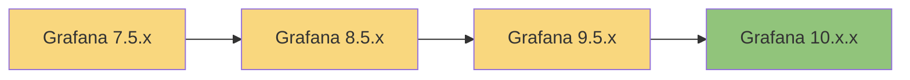
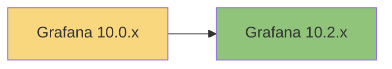

# Grafana Versioning

## Introduction

Versioning is a critical aspect of software development and maintenance. For Grafana users and administrators, understanding how Grafana's versioning system works helps in planning deployments, upgrades, and ensuring compatibility with plugins and features. This guide explains Grafana's versioning scheme, release cycles, and best practices for managing Grafana versions in your environment.

## Grafana Version Numbering

Grafana follows semantic versioning (SemVer), which uses a three-part version number format:

**`MAJOR.MINOR.PATCH`**

For example, in version `10.1.2`:
- `10` is the major version
- `1` is the minor version
- `2` is the patch version

Let's understand what each component means:

### Major Version (X.y.z)

Major version increments indicate significant changes that may include:
- Breaking API changes
- Substantial UI overhauls
- Removal of deprecated features
- Changes that require careful migration planning

When Grafana increments a major version (e.g., from 9.x to 10.x), you should review the migration guides carefully before upgrading.

### Minor Version (x.Y.z)

Minor version increments add functionality in a backward-compatible manner:
- New features and capabilities
- Enhancements to existing features
- Non-breaking API additions
- Performance improvements

These updates typically don't break existing functionality.

### Patch Version (x.y.Z)

Patch releases contain bug fixes and smaller improvements:
- Security patches
- Bug fixes
- Minor performance optimizations
- Documentation updates

Patch updates are generally safe to apply with minimal testing.

## Grafana Release Cycles

Grafana follows a regular release schedule to deliver new features and improvements.

### Release Cadence

- **Major releases**: Typically once per year
- **Minor releases**: Every 4-8 weeks
- **Patch releases**: As needed for critical bug fixes and security patches

### Release Channels

Grafana offers different release channels to suit various deployment needs:

1. **Stable Releases**
   - Production-ready versions recommended for most users
   - Thoroughly tested and reliable
   - Released after completing beta testing

2. **Beta Releases**
   - Preview of upcoming stable releases
   - Include new features being tested
   - Not recommended for production environments
   - Named with beta suffix (e.g., `10.0.0-beta1`)

3. **Nightly Builds**
   - Daily builds from the main development branch
   - Contain the latest code changes
   - Only for testing and development
   - Not suitable for production use

## Version Compatibility Considerations

When working with Grafana, several compatibility factors should be considered:

### Plugin Compatibility

Plugins often specify which Grafana versions they support. This includes:

```json
{
  "name": "Example Plugin",
  "id": "example-plugin",
  "info": {
    "version": "1.0.0",
    "grafanaDependency": ">=9.0.0"
  }
}
```

This example indicates the plugin works with Grafana version 9.0.0 and higher.

### Database Compatibility

Grafana uses a database to store dashboards, users, and configuration. Major version upgrades might include database schema changes:

- Grafana automatically migrates the database schema during upgrades
- Database backups are strongly recommended before major version upgrades
- Downgrades after database migrations can be problematic or impossible

### API Compatibility

If you use Grafana's HTTP API for automation or integration:

- Major versions may include breaking API changes
- New API endpoints are typically added in minor releases
- API usage should be updated when upgrading major versions

## Checking Grafana Version

You can check your current Grafana version in several ways:

### Via the UI

1. Log in to Grafana
2. Click on the Grafana logo in the bottom left corner
3. The version information appears at the bottom of the side menu

### Via the API

Send a GET request to the Grafana health endpoint:

```bash
curl http://your-grafana-instance/api/health
```

Example response:

```json
{
  "commit": "34e299d",
  "database": "ok",
  "version": "10.1.2"
}
```

### Via the Command Line

For local installations or when you have shell access:

```bash
grafana-server -v
```

Output:

```
Version 10.1.2 (commit: 34e299d)
```

## Best Practices for Upgrading Grafana

Following these best practices will help ensure smooth Grafana upgrades:

### Before Upgrading

1. **Read the Release Notes**
   - Check for breaking changes
   - Review deprecated features
   - Note new features you want to utilize

2. **Backup Your Data**
   - Export important dashboards
   - Backup the Grafana database
   - Backup configuration files

   ```bash
   # Example backup commands
   # Backup configuration
   cp /etc/grafana/grafana.ini /etc/grafana/grafana.ini.backup
   
   # Backup SQLite database (if using SQLite)
   cp /var/lib/grafana/grafana.db /var/lib/grafana/grafana.db.backup
   
   # Export dashboards via API
   curl -H "Authorization: Bearer YOUR_API_KEY" \
     http://your-grafana/api/dashboards/uid/DASHBOARD_UID > dashboard_backup.json
   ```

3. **Test in a Non-Production Environment**
   - Replicate your production setup
   - Test all critical dashboards
   - Verify plugin compatibility

### Upgrade Strategies

#### Sequential Upgrades

For large version jumps (e.g., from 7.x to 10.x), consider upgrading sequentially:



This approach:
- Reduces risk of compatibility issues
- Makes troubleshooting easier
- Follows recommended practices from Grafana

#### Skip-Version Upgrades

For minor upgrades within the same major version, you can often skip intermediate versions:



### Post-Upgrade Tasks

After upgrading:

1. **Verify Functionality**
   - Check that all dashboards load correctly
   - Ensure data sources work properly
   - Test alerts and notifications

2. **Update Documentation**
   - Record the version you upgraded to
   - Document any issues encountered
   - Update internal documentation

3. **Clean Up**
   - Remove old backups if the upgrade was successful
   - Update any automation scripts that might reference version-specific features

## Long-Term Support (LTS)

Grafana offers Long-Term Support for certain releases, ideal for organizations that prioritize stability over new features.

### Key LTS Features

- Extended support period (typically 12+ months)
- Security updates and critical bug fixes
- No new feature additions
- Greater stability for production environments

### When to Choose LTS

Consider LTS versions when:
- You have complex, stable dashboards that you don't want to risk breaking
- Your update cycle is infrequent
- You need predictable support windows
- Your change management process is strict

## Versioning for Grafana Cloud

If you're using Grafana Cloud instead of self-hosted Grafana:

- Version upgrades are managed by Grafana Labs
- Updates are rolled out gradually
- You'll receive notifications before major updates
- Testing environments are available for preview

## Summary

Understanding Grafana's versioning system is essential for maintaining a stable monitoring environment. By following semantic versioning with its major, minor, and patch components, Grafana provides clear signals about the nature of changes in each release.

Remember these key points:
- Major versions may contain breaking changes
- Minor versions add features in a backward-compatible way
- Patch versions fix bugs and security issues
- Always backup before upgrading
- Test upgrades in non-production environments first
- Consider LTS versions for maximum stability

By applying these versioning principles and best practices, you can confidently manage Grafana upgrades while minimizing disruption to your monitoring capabilities.

## Further Learning

To deepen your understanding of Grafana versioning:

- Practice upgrading Grafana in a test environment
- Compare release notes between versions
- Create an upgrade policy for your organization
- Set up automated testing for critical dashboards to verify post-upgrade functionality