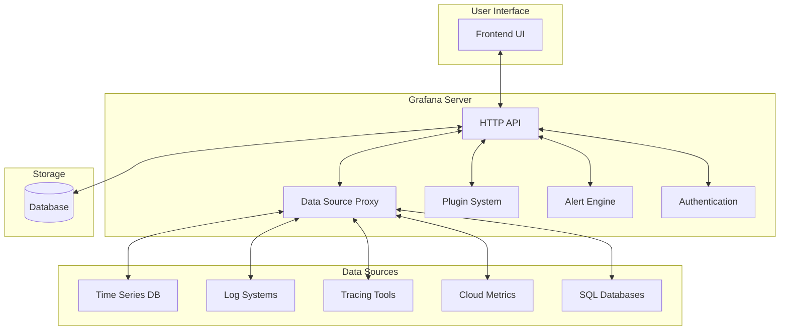
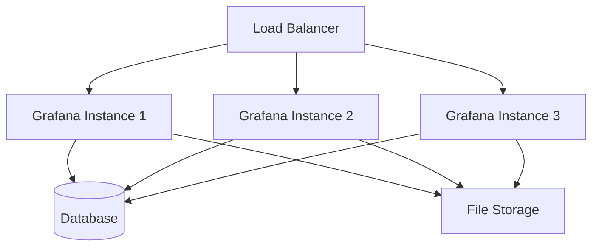

# Grafana Architecture

## Introduction

Grafana is a powerful open-source platform for monitoring and observability that allows you to query, visualize, alert on, and understand your metrics no matter where they are stored. To effectively work with Grafana, it's important to understand its underlying architecture and how its various components interact with each other.

In this guide, we'll explore the core architectural components of Grafana, how data flows through the system, and the key concepts that make Grafana such a flexible and powerful monitoring solution.

## Core Components of Grafana Architecture

Grafana's architecture consists of several key components that work together to provide its visualization and monitoring capabilities:

### 1. The Frontend UI Layer

The Grafana UI is a React-based application that provides:

- Dashboards for visualization
- Explore interface for ad-hoc queries
- Configuration panels for data sources, users, and alerts
- Admin interfaces for system configuration

### 2. The Backend Server

The Grafana backend is primarily written in Go and handles:

- HTTP API requests from the frontend
- Authentication and authorization
- Data source proxy
- Dashboard and data source storage
- Alert rule evaluations
- Plugin management

### 3. The Database Layer

Grafana requires a database to store:

- Users, teams, and organizations
- Data source configurations
- Dashboards
- Alert rules
- Annotations

Grafana supports several database options:
- SQLite (default)
- MySQL
- PostgreSQL

### 4. Data Sources

Data sources are external systems that store the metrics, logs, or traces that Grafana visualizes:

- Time-series databases (Prometheus, InfluxDB, Graphite)
- Logging systems (Loki, Elasticsearch)
- Tracing tools (Tempo, Jaeger, Zipkin)
- Cloud provider metrics (AWS CloudWatch, Google Cloud Monitoring)
- SQL databases (MySQL, PostgreSQL, Microsoft SQL Server)

### 5. Plugins

Plugins extend Grafana's functionality:

- **Data source plugins**: Connect to various data backends
- **Panel plugins**: New visualization types
- **App plugins**: Provide custom pages and functionality

## High-Level Architecture Diagram



## Data Flow in Grafana

Let's explore how data flows through Grafana:

1. **User Interaction**: A user visits a dashboard or the Explore interface.

2. **Query Request**: The frontend sends query requests to the Grafana backend.

3. **Authentication**: The backend validates the user's credentials and permissions.

4. **Data Source Proxy**: The backend forwards the query to the appropriate data source through the data source proxy.

5. **Data Retrieval**: The data source processes the query and returns the results.

6. **Data Transformation**: Grafana applies any transformations configured for the panel.

7. **Visualization**: The frontend renders the data using the selected panel type.

## Key Architectural Concepts

### Multi-Tenant Architecture

Grafana uses a multi-tenant architecture with:

- **Organizations**: Isolated groups of users and resources
- **Users**: Can belong to multiple organizations with different roles
- **Teams**: Groups of users within an organization

### Pluggable Data Sources

Grafana's data source architecture allows it to connect to virtually any system that stores metrics, logs, or traces via:

- Native data source plugins
- Custom-built plugins
- The SimpleJSON plugin for custom API integration

### Independent Visualization Layer

Grafana decouples the visualization from the data source, allowing:

- The same visualization to work with different data sources
- Multiple data sources to be used in a single dashboard
- Transformations to be applied regardless of the data source

## Deployment Models

Grafana can be deployed in several ways:

### 1. Standalone Installation

```bash
# Install Grafana on Ubuntu/Debian
sudo apt-get install -y apt-transport-https
sudo apt-get install -y software-properties-common wget
wget -q -O - https://packages.grafana.com/gpg.key | sudo apt-key add -
echo "deb https://packages.grafana.com/oss/deb stable main" | sudo tee -a /etc/apt/sources.list.d/grafana.list
sudo apt-get update
sudo apt-get install grafana
sudo systemctl start grafana-server
sudo systemctl enable grafana-server
```

### 2. Docker Deployment

```bash
# Run Grafana in Docker
docker run -d -p 3000:3000 --name=grafana grafana/grafana
```

### 3. Kubernetes Deployment

```yaml
# Sample Kubernetes manifest for Grafana
apiVersion: apps/v1
kind: Deployment
metadata:
  name: grafana
spec:
  replicas: 1
  selector:
    matchLabels:
      app: grafana
  template:
    metadata:
      labels:
        app: grafana
    spec:
      containers:
      - name: grafana
        image: grafana/grafana:latest
        ports:
        - containerPort: 3000
          name: http
        volumeMounts:
        - name: grafana-storage
          mountPath: /var/lib/grafana
      volumes:
      - name: grafana-storage
        emptyDir: {}
---
apiVersion: v1
kind: Service
metadata:
  name: grafana
spec:
  ports:
  - port: 3000
    targetPort: 3000
  selector:
    app: grafana
```

### 4. Grafana Cloud

Grafana Labs also offers Grafana Cloud, a fully managed service that handles the infrastructure for you.

## Configuring Grafana

Grafana's configuration is handled through:

1. **Configuration file**: `grafana.ini` (or custom location)
2. **Environment variables**: Prefixed with `GF_`
3. **Command line arguments**

Example configuration for database and server settings:

```ini
[database]
type = postgres
host = 127.0.0.1:5432
name = grafana
user = grafana
password = password

[server]
http_port = 3000
domain = localhost
```

## Practical Example: Setting Up a Complete Monitoring Stack

Let's look at how to set up a basic monitoring stack with Grafana, Prometheus, and Node Exporter:

1. **Deploy Prometheus** to collect metrics:

```bash
# Launch Prometheus with Docker
docker run -d -p 9090:9090 --name=prometheus \
  -v $(pwd)/prometheus.yml:/etc/prometheus/prometheus.yml \
  prom/prometheus
```

2. **Deploy Node Exporter** to expose host metrics:

```bash
# Launch Node Exporter with Docker
docker run -d -p 9100:9100 --name=node-exporter \
  prom/node-exporter
```

3. **Configure Prometheus** to scrape Node Exporter:

```yaml
# prometheus.yml
global:
  scrape_interval: 15s

scrape_configs:
  - job_name: 'prometheus'
    static_configs:
      - targets: ['localhost:9090']

  - job_name: 'node-exporter'
    static_configs:
      - targets: ['node-exporter:9100']
```

4. **Launch Grafana** and add Prometheus as a data source:

```bash
docker run -d -p 3000:3000 --name=grafana grafana/grafana
```

5. **Configure Prometheus Data Source** in Grafana:
   - Navigate to Configuration > Data Sources > Add data source
   - Select Prometheus
   - Set URL to `http://prometheus:9090`
   - Click "Save & Test"

6. **Create a Dashboard** in Grafana:
   - Click "+" > Dashboard
   - Add a new panel
   - In the query editor, write a PromQL query: `node_cpu_seconds_total{mode="user"}`
   - Configure visualization options
   - Save the dashboard

## Scaling Grafana

As your monitoring needs grow, you can scale Grafana in several ways:

### Horizontal Scaling

- Deploy multiple Grafana instances behind a load balancer
- Use a shared database backend
- Use a shared file system or object storage for images



### Vertical Scaling

- Increase resources (CPU, memory) for the Grafana server
- Optimize database performance
- Use database connection pooling

### High Availability Configuration

- Set up Grafana in high availability mode
- Configure database replication
- Use a distributed file system or object storage

## Summary

Grafana's flexible, component-based architecture makes it a powerful platform for observability and monitoring. Its key architectural strengths include:

- **Pluggable data sources**: Connect to virtually any system that stores metrics, logs, or traces
- **Multi-tenant design**: Isolate resources with organizations and teams
- **Extensible plugin system**: Add new visualizations and functionality
- **Flexible deployment options**: From simple single instances to complex high availability setups

Understanding Grafana's architecture helps you make better decisions about how to deploy, configure, and scale your monitoring solution as your needs evolve.

## Additional Resources

To deepen your understanding of Grafana architecture:

- Explore the [official Grafana documentation](https://grafana.com/docs/grafana/latest/)
- Try setting up a complete monitoring stack with Prometheus and Loki
- Experiment with different data sources and visualization types
- Learn about Grafana provisioning for automated deployment

## Exercises

1. Set up a local Grafana instance using Docker and connect it to a Prometheus data source.
2. Create a dashboard that monitors system resources (CPU, memory, disk) using Node Exporter.
3. Configure Grafana to use PostgreSQL instead of the default SQLite database.
4. Create a simple data source plugin that connects to a custom API.
5. Set up a highly available Grafana deployment with multiple instances and a shared database.