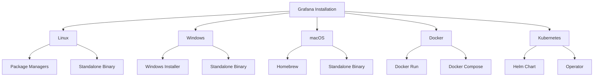

# Grafana Installation

## Introduction

Grafana is an open-source analytics and interactive visualization web application. It provides charts, graphs, and alerts when connected to supported data sources. In this guide, we'll walk through the process of installing Grafana on different operating systems and platforms. By the end of this tutorial, you'll have Grafana up and running on your system, ready to connect to data sources and create powerful dashboards.

## Prerequisites

Before installing Grafana, ensure you have:

- A system with at least 2GB of RAM
- 1GB of free disk space
- Administrative/root access to your system
- Internet connection for downloading packages

## Installation Methods Overview

Grafana can be installed using various methods depending on your operating system and preferences:



## Installing Grafana on Linux

### Using Package Managers

#### For Debian/Ubuntu

```bash
# Add the Grafana GPG key
wget -q -O - https://packages.grafana.com/gpg.key | sudo apt-key add -

# Add the repository
sudo add-apt-repository "deb https://packages.grafana.com/oss/deb stable main"

# Update package list
sudo apt update

# Install Grafana
sudo apt install grafana

# Start the service
sudo systemctl start grafana-server

# Enable service on boot
sudo systemctl enable grafana-server
```

#### For Red Hat/CentOS/Fedora

```bash
# Create a repository file
sudo tee /etc/yum.repos.d/grafana.repo << EOF
[grafana]
name=grafana
baseurl=https://packages.grafana.com/oss/rpm
repo_gpgcheck=1
enabled=1
gpgcheck=1
gpgkey=https://packages.grafana.com/gpg.key
sslverify=1
sslcacert=/etc/pki/tls/certs/ca-bundle.crt
EOF

# Install Grafana
sudo yum install grafana

# Start the service
sudo systemctl start grafana-server

# Enable service on boot
sudo systemctl enable grafana-server
```

### Using Standalone Binary

```bash
# Download the latest Linux binary
wget https://dl.grafana.com/oss/release/grafana-9.5.2.linux-amd64.tar.gz

# Extract the archive
tar -zxvf grafana-9.5.2.linux-amd64.tar.gz

# Navigate to the directory
cd grafana-9.5.2/

# Start Grafana
./bin/grafana-server web
```

## Installing Grafana on Windows

### Using Windows Installer

1. Download the latest Windows installer from the [Grafana download page](https://grafana.com/grafana/download?platform=windows)
2. Run the installer (.msi file) and follow the installation wizard
3. Choose installation options (install location, service setup)
4. Complete the installation

The installer will set up Grafana as a Windows service that starts automatically.

### Using Standalone Binary

```powershell
# Download the zip file
Invoke-WebRequest -Uri "https://dl.grafana.com/oss/release/grafana-9.5.2.windows-amd64.zip" -OutFile "grafana-9.5.2.windows-amd64.zip"

# Extract the zip file
Expand-Archive -Path "grafana-9.5.2.windows-amd64.zip" -DestinationPath "C:\Program Files"

# Navigate to the directory
cd "C:\Program Files\grafana-9.5.2"

# Start Grafana
.\bin\grafana-server.exe
```

## Installing Grafana on macOS

### Using Homebrew

```bash
# Install Homebrew if not already installed
/bin/bash -c "$(curl -fsSL https://raw.githubusercontent.com/Homebrew/install/HEAD/install.sh)"

# Install Grafana
brew update
brew install grafana

# Start Grafana
brew services start grafana
```

### Using Standalone Binary

```bash
# Download the tarball
curl -O https://dl.grafana.com/oss/release/grafana-9.5.2.darwin-amd64.tar.gz

# Extract the tarball
tar -zxvf grafana-9.5.2.darwin-amd64.tar.gz

# Navigate to the directory
cd grafana-9.5.2/

# Start Grafana
./bin/grafana-server web
```

## Installing Grafana with Docker

### Using Docker Run

```bash
# Pull the Grafana image
docker pull grafana/grafana:latest

# Run Grafana container
docker run -d \
  -p 3000:3000 \
  --name=grafana \
  -v grafana-storage:/var/lib/grafana \
  grafana/grafana:latest
```

### Using Docker Compose

Create a `docker-compose.yml` file:

```yaml
version: '3'
services:
  grafana:
    image: grafana/grafana:latest
    container_name: grafana
    ports:
      - 3000:3000
    volumes:
      - grafana-storage:/var/lib/grafana
    restart: unless-stopped

volumes:
  grafana-storage:
```

Then run:

```bash
docker-compose up -d
```

## Installing Grafana on Kubernetes

### Using Helm Chart

```bash
# Add Grafana Helm repository
helm repo add grafana https://grafana.github.io/helm-charts

# Update repositories
helm repo update

# Install Grafana
helm install grafana grafana/grafana
```

### Using Grafana Operator

```bash
# Create a namespace for Grafana
kubectl create namespace grafana

# Install the Grafana Operator
kubectl apply -f https://raw.githubusercontent.com/grafana/grafana-operator/master/deploy/crds/grafana.integreatly.org_grafanas_crd.yaml
kubectl apply -f https://raw.githubusercontent.com/grafana/grafana-operator/master/deploy/crds/grafana.integreatly.org_grafanadashboards_crd.yaml
kubectl apply -f https://raw.githubusercontent.com/grafana/grafana-operator/master/deploy/crds/grafana.integreatly.org_grafanadatasources_crd.yaml
kubectl apply -f https://raw.githubusercontent.com/grafana/grafana-operator/master/deploy/service_account.yaml
kubectl apply -f https://raw.githubusercontent.com/grafana/grafana-operator/master/deploy/role.yaml
kubectl apply -f https://raw.githubusercontent.com/grafana/grafana-operator/master/deploy/role_binding.yaml
kubectl apply -f https://raw.githubusercontent.com/grafana/grafana-operator/master/deploy/operator.yaml
```

## Post-Installation Steps

After installing Grafana, follow these steps to get started:

1. **Access Grafana**: Open your browser and navigate to `http://localhost:3000/` (or the appropriate host/port if you've customized the installation)

2. **Login with default credentials**:
   - Username: `admin`
   - Password: `admin`

3. **Change the default password**: On your first login, you'll be prompted to change the default password for security reasons.

4. **Verify Installation**: Check the Grafana version and health on the bottom of the login page or in the UI after logging in.

## Common Installation Issues and Solutions

### Problem: Cannot connect to Grafana after installation

**Solutions**:
- Verify that the Grafana service is running: `systemctl status grafana-server`
- Check if the port is accessible: `netstat -tulpn | grep 3000`
- Ensure your firewall allows connections to port 3000: `sudo ufw allow 3000/tcp`

### Problem: Grafana fails to start due to permission issues

**Solutions**:
- Check log files in `/var/log/grafana/` for specific errors
- Ensure correct ownership of Grafana directories: `chown -R grafana:grafana /var/lib/grafana`

### Problem: Configuration issues

**Solutions**:
- Review configuration at `/etc/grafana/grafana.ini`
- Restart Grafana after making changes: `systemctl restart grafana-server`

## Configuring Environment Variables

Grafana can be configured using environment variables. Here are some examples:

```bash
# Set admin password
export GF_SECURITY_ADMIN_PASSWORD=your_password

# Change the HTTP port
export GF_SERVER_HTTP_PORT=8080

# Enable anonymous access
export GF_AUTH_ANONYMOUS_ENABLED=true
```

For Docker, pass these as environment variables:

```bash
docker run -d \
  -p 3000:3000 \
  --name=grafana \
  -e "GF_SECURITY_ADMIN_PASSWORD=your_password" \
  -e "GF_SERVER_HTTP_PORT=3000" \
  -e "GF_AUTH_ANONYMOUS_ENABLED=true" \
  grafana/grafana:latest
```

## Production Deployment Best Practices

When deploying Grafana in production, consider these best practices:

1. **Use HTTPS**: Configure SSL/TLS for secure connections
2. **Configure authentication**: Set up LDAP, OAuth, or other enterprise authentication methods
3. **Implement backup strategy**: Regularly backup Grafana's database
4. **Monitor Grafana itself**: Set up monitoring for your Grafana instance
5. **Use a dedicated database**: For larger installations, use MySQL or PostgreSQL instead of the default SQLite
6. **Set up high availability**: Consider deploying multiple Grafana instances behind a load balancer

## Summary

In this guide, we've covered:

- Installing Grafana on various operating systems (Linux, Windows, macOS)
- Container-based deployments with Docker and Kubernetes
- Post-installation configuration steps
- Troubleshooting common installation issues
- Best practices for production deployment

Now that you have Grafana installed, you're ready to move on to connecting data sources and building your first dashboards.

## Additional Resources

- [Official Grafana Documentation](https://grafana.com/docs/)
- [Grafana Community Forums](https://community.grafana.com/)
- [Grafana GitHub Repository](https://github.com/grafana/grafana)

## Exercises

1. Install Grafana using a method appropriate for your operating system.
2. Change the default port from 3000 to 8080 by modifying the configuration.
3. Configure Grafana to use HTTPS instead of HTTP.
4. Create a backup strategy for your Grafana installation.
5. Setup Grafana with a reverse proxy like Nginx or Apache.