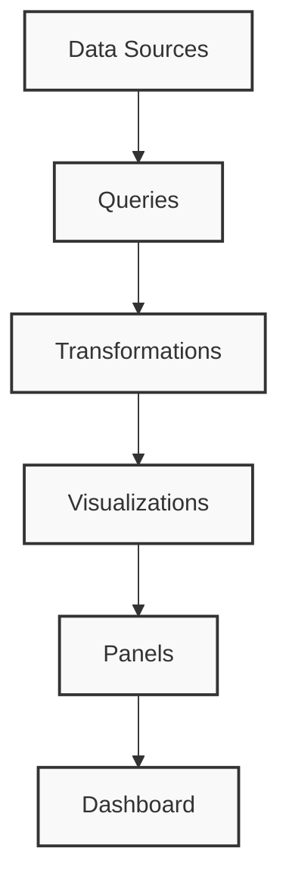

# Grafana Interface Overview

## Introduction

Grafana is a powerful open-source analytics and monitoring platform that allows you to visualize your data through beautiful dashboards. Before diving into creating complex visualizations, it's essential to understand the Grafana interface and its components. This guide will walk you through the main elements of the Grafana UI, helping you navigate confidently as you begin your data visualization journey.

## The Main Interface

When you first log into Grafana, you'll be greeted with the home dashboard. Let's break down the key components you'll encounter:

### Navigation Bar

The navigation bar is located at the left side of the screen and provides access to Grafana's primary features:

- **Home** - Returns you to the home dashboard
- **Dashboards** - Access to your created and imported dashboards
- **Explore** - Ad-hoc querying and metric exploration tool
- **Alerting** - Configure alerts based on your metrics
- **Configuration** - System-wide settings and configurations
- **Server Admin** - Administrative tasks (visible to admin users only)

### Top Header Bar

The top header bar contains:

- **Grafana logo** - Click to return to the home page
- **Search bar** - Search for dashboards, panels, and other resources
- **Create (+) button** - Quick access to create dashboards, panels, etc.
- **Alerts bell icon** - View current alerts
- **Help menu** - Access documentation and support
- **User profile** - Account settings and sign out

## Working with Dashboards

Dashboards are central to the Grafana experience. Let's explore the dashboard interface:

### Dashboard Header

When viewing a dashboard, the header provides these controls:

- **Dashboard title** - Shows the current dashboard name
- **Star icon** - Add dashboard to favorites
- **Share icon** - Share dashboard via link or snapshot
- **Settings icon** - Dashboard settings and metadata
- **Time picker** - Select the time range for all panels
- **Refresh icon** - Manually refresh data or set auto-refresh
- **Dashboard insights** - View dashboard usage statistics

### Dashboard Controls

Additional controls appear at the top of each dashboard:

```
┌─────────────────────────────────────────────────────────────┐
│  Dashboard Title                       Time Range   Refresh  │
├─────────────────────────────────────────────────────────────┤
│  Add Panel  |  Variables  |  Settings  |  Time Range  | ... │
└─────────────────────────────────────────────────────────────┘
```

- **Add Panel** - Create a new visualization
- **Variables** - Manage dashboard variables
- **Dashboard Settings** - Configure dashboard properties
- **Time Range** - Adjust time window for data display
- **Save** - Save changes to the dashboard
- **Apply** - Apply template variable changes

## Panel Interface

Panels are individual visualizations within a dashboard. Each panel has its own interface:

### Panel Header

The panel header contains:

- **Panel title** - Name of the visualization
- **Time range info** - Shows if panel uses dashboard or custom time
- **Panel menu** - Access panel options (edit, duplicate, remove)

### Editing a Panel

When you edit a panel, you'll see several tabs:

1. **Query** - Define data sources and queries
2. **Transform** - Apply transformations to your data
3. **Visualization** - Select and configure visualization type
4. **General** - Set panel title, description, and links
5. **Alert** - Configure alerting rules (if applicable)

Here's a sample visualization configuration:

```javascript
// Sample panel JSON configuration
{
  "datasource": "Prometheus",
  "fieldConfig": {
    "defaults": {
      "color": {
        "mode": "palette-classic"
      },
      "custom": {
        "axisLabel": "",
        "axisPlacement": "auto",
        "barAlignment": 0,
        "drawStyle": "line",
        "fillOpacity": 10,
        "gradientMode": "none",
        "hideFrom": {
          "legend": false,
          "tooltip": false,
          "viz": false
        },
        "lineInterpolation": "linear",
        "lineWidth": 1,
        "pointSize": 5,
        "scaleDistribution": {
          "type": "linear"
        },
        "showPoints": "never",
        "spanNulls": true,
        "stacking": {
          "group": "A",
          "mode": "none"
        }
      },
      "mappings": [],
      "thresholds": {
        "mode": "absolute",
        "steps": [
          {
            "color": "green",
            "value": null
          },
          {
            "color": "red",
            "value": 80
          }
        ]
      },
      "unit": "short"
    }
  },
  "targets": [
    {
      "expr": "rate(node_cpu_seconds_total{mode=\"user\"}[1m])",
      "interval": "",
      "legendFormat": "{{cpu}}",
      "refId": "A"
    }
  ],
  "title": "CPU Usage",
  "type": "timeseries"
}
```

## Explore Mode

Explore is a powerful feature that allows ad-hoc querying and exploration of your data:

- **Data Source Selector** - Choose which data source to query
- **Query Editor** - Write and edit queries
- **Run Button** - Execute the query
- **Time Range** - Select the time window
- **Results Panel** - View query results

## Visualization Types

Grafana offers many visualization types to represent your data effectively:

### Common Visualization Types

- **Time Series** - For time-based line, area or bar charts
- **Gauge** - Display single values with thresholds
- **Stat** - Show single values with optional sparklines
- **Bar Chart** - Compare values across categories
- **Pie Chart** - Show proportions of a whole
- **Table** - Display data in tabular format
- **Heatmap** - Visualize data density
- **Logs** - Display log data with filtering options

Here's a diagram showing the relationship between data sources, panels, and dashboards:



## Creating Your First Dashboard

Let's walk through a simple example of creating a basic dashboard:

1. Click the "+" icon in the side menu and select "Dashboard"
2. Click "Add new panel" to add a visualization
3. Select a data source (e.g., Prometheus, InfluxDB)
4. Write a query in the query editor:

```sql
SELECT mean("cpu_usage_idle") FROM "system" WHERE $timeFilter GROUP BY time($__interval) fill(null)
```

5. Select your visualization type (e.g., Time Series)
6. Configure visualization options like axes, legends, and colors
7. Add a title for your panel, such as "CPU Usage"
8. Click "Save" to add the panel to your dashboard
9. Add additional panels as needed
10. Save the dashboard with a descriptive name

## Working with Variables

Variables make your dashboards dynamic and interactive:

```
$server = prod-app-01, prod-app-02, prod-app-03
$interval = 1m, 5m, 10m, 30m, 1h, 6h, 12h, 1d
```

When used in queries, these can be referenced like:

```sql
SELECT mean("cpu_usage_idle") FROM "system" WHERE "host" = '$server' AND $timeFilter GROUP BY time($interval) fill(null)
```

The user can then select different values from dropdown menus at the top of the dashboard.

## Practical Application: System Monitoring Dashboard

A common use case for Grafana is system monitoring. Here's a simple structure for such a dashboard:

1. **Server Overview Panel** - Key metrics at a glance
   - CPU usage
   - Memory usage
   - Disk space
   - Network traffic

2. **Detailed CPU Metrics Panel** - Breakdown of CPU usage
   - User time
   - System time
   - I/O wait
   - CPU load

3. **Memory Panel** - Memory allocation visualization
   - Used memory
   - Free memory
   - Cached memory
   - Swap usage

4. **Disk I/O Panel** - Storage performance metrics
   - Read/Write operations
   - Throughput
   - Latency

## Keyboard Shortcuts

Grafana provides keyboard shortcuts to increase productivity:

- `d` + `b` - Open/close side menu
- `d` + `h` - Go to Home dashboard
- `d` + `p` - Open Dashboard picker
- `d` + `s` - Open Search
- `esc` - Exit panel edit/view mode
- `e` - Toggle panel edit mode (when panel is focused)

## Summary

In this guide, we've explored the fundamental aspects of the Grafana interface:

- The main navigation components and layout
- Dashboard structure and controls
- Panel editing and visualization options
- The Explore mode for ad-hoc queries
- Basic dashboard creation workflow
- Variable usage for dynamic dashboards

Understanding the Grafana interface is the first step toward creating powerful, informative dashboards. As you become more familiar with these elements, you'll be able to navigate Grafana more efficiently and create more sophisticated visualizations.

## Additional Resources

Here are some exercises to help you become more familiar with the Grafana interface:

1. **Interface Navigation Exercise**: Log into your Grafana instance and practice navigating between different sections (Dashboards, Explore, etc.)

2. **Panel Creation Exercise**: Create a new dashboard with three different panel types (e.g., Graph, Gauge, and Table)

3. **Variable Practice**: Create a dashboard with a variable that lets you select different servers or services to display data for

4. **Dashboard Organization**: Create a folder structure for organizing your dashboards by team or application

5. **Dashboard Export/Import**: Practice exporting a dashboard to JSON and importing it again