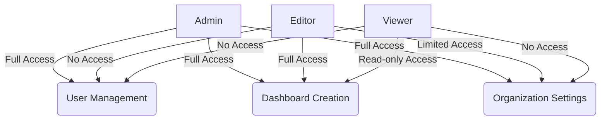

# Grafana User Management

## Introduction

User management is a critical aspect of any monitoring platform, and Grafana is no exception. As your organization grows and more people rely on Grafana dashboards for insights, properly managing users becomes essential for security, organization, and collaboration.

In this guide, we'll explore Grafana's user management capabilities, including:

- User authentication methods
- Creating and managing users
- Organizing users into teams
- Role-based access control
- Permissions and authorization

By the end of this guide, you'll have a solid understanding of how to implement effective user management practices in your Grafana environment.

## Understanding Grafana Authentication

Before diving into user management, it's important to understand how Grafana handles authentication.

### Authentication Methods

Grafana supports several authentication methods, providing flexibility for different organizational needs:

1. **Built-in authentication** - The default method using Grafana's internal user database
2. **LDAP/Active Directory** - Integration with enterprise directory services
3. **OAuth providers** - Authentication via Google, GitHub, GitLab, etc.
4. **SAML** - Enterprise single sign-on solution
5. **Auth Proxy** - Authentication using a reverse proxy

Let's explore the basic configuration for each method.

### Built-in Authentication

This is the simplest authentication method, where user accounts are stored in Grafana's internal database.

Here's how the configuration looks in the `grafana.ini` file:

```ini
[auth]
# Set to false to disable built-in user authentication
disable_login_form = false

# Set to true to disable the possibility to create users from the UI
disable_signout = false
```

### LDAP Authentication

For organizations that use LDAP or Active Directory, Grafana provides robust integration.

Configuration example:

```ini
[auth.ldap]
enabled = true
config_file = /etc/grafana/ldap.toml
```

The LDAP configuration file (`ldap.toml`) might look like this:

```toml
[[servers]]
host = "ldap.example.com"
port = 389
use_ssl = false
bind_dn = "cn=admin,dc=example,dc=com"
bind_password = "admin_password"
search_filter = "(cn=%s)"
search_base_dns = ["dc=example,dc=com"]

[servers.attributes]
name = "givenName"
surname = "sn"
username = "cn"
member_of = "memberOf"
email = "email"
```

### OAuth Integration

Grafana supports various OAuth providers. Here's an example configuration for GitHub:

```ini
[auth.github]
enabled = true
allow_sign_up = true
client_id = YOUR_GITHUB_APP_CLIENT_ID
client_secret = YOUR_GITHUB_APP_CLIENT_SECRET
scopes = user:email,read:org
auth_url = https://github.com/login/oauth/authorize
token_url = https://github.com/login/oauth/access_token
api_url = https://api.github.com/user
team_ids =
allowed_organizations = YOUR_GITHUB_ORG_NAME
```

## Managing Users

Once you've set up authentication, you'll need to manage users within Grafana.

### Creating Users

With admin privileges, you can create users through the Grafana UI:

1. Navigate to **Configuration → Users**
2. Click **Add new user**
3. Fill in details (name, email, username, password)
4. Assign an organization role (Admin, Editor, Viewer)

The same can be accomplished via the Grafana API:

```bash
curl -X POST -H "Content-Type: application/json" -H "Authorization: Bearer YOUR_API_KEY" \
  http://your-grafana-instance/api/admin/users \
  -d '{"name":"New User", "email":"user@example.com", "login":"newuser", "password":"userpassword"}'
```

### User Roles

Grafana provides three main user roles:

1. **Admin** - Can manage users, create dashboards, and has full access to the Grafana instance
2. **Editor** - Can create and edit dashboards but cannot manage users or change settings
3. **Viewer** - Can only view dashboards and cannot make changes

Let's visualize the role hierarchy:



### Managing User Permissions

To change a user's role:

1. Go to **Configuration → Users**
2. Find the user and click the role dropdown
3. Select the new role
4. Click **Update**

Via the API:

```bash
curl -X PATCH -H "Content-Type: application/json" -H "Authorization: Bearer YOUR_API_KEY" \
  http://your-grafana-instance/api/org/users/1 \
  -d '{"role":"Editor"}'
```

## Working with Teams

Teams provide a way to organize users and assign permissions to multiple users at once.

### Creating a Team

1. Navigate to **Configuration → Teams**
2. Click **New team**
3. Enter a team name and email
4. Click **Create**

### Adding Members to a Team

1. Navigate to the team page
2. Click **Add member**
3. Select a user from the dropdown
4. Click **Add to team**

### Team Permissions

Teams can be given access to specific dashboards, folders, or data sources:

1. Go to **Dashboards** and select a dashboard
2. Click the gear icon to access dashboard settings
3. Select **Permissions**
4. Click **Add permission**
5. Select **Team** and choose your team
6. Assign a role (Admin, Editor, Viewer)
7. Click **Save**

## Implementing Role-Based Access Control (RBAC)

Grafana Enterprise offers enhanced RBAC capabilities for more granular control.

### Basic vs. Enhanced RBAC

Here's a comparison:

| Feature | Basic RBAC (Grafana OSS) | Enhanced RBAC (Grafana Enterprise) |
|---------|--------------------------|-----------------------------------|
| User Roles | Admin, Editor, Viewer | Custom role creation |
| Permissions Scope | Organization level | Resource level (dashboard, folder, data source) |
| Permission Management | Basic | Fine-grained control |
| Team Permissions | Basic | Advanced team permissions |

### Setting Up Custom Roles (Enterprise)

With Grafana Enterprise, you can create custom roles:

1. Go to **Configuration → Access Control**
2. Click **New custom role**
3. Define the role name and permissions
4. Assign the role to users or teams

## Practical Example: Multi-Team Dashboard Access

Let's walk through a practical example of setting up permissions for a multi-team environment:

1. Create teams for different departments (Development, Operations, Business)
2. Create folders for different dashboard categories (System Metrics, Application Metrics, Business Metrics)
3. Assign appropriate permissions:

```javascript
// Development Team Permissions
// System Metrics: Admin
// Application Metrics: Admin
// Business Metrics: Viewer

// Operations Team Permissions
// System Metrics: Admin
// Application Metrics: Editor
// Business Metrics: Viewer

// Business Team Permissions
// System Metrics: Viewer
// Application Metrics: Viewer
// Business Metrics: Editor
```

This setup ensures that:
- Development team can fully manage technical dashboards
- Operations team can monitor and edit operational dashboards
- Business team can view technical metrics but manage business-related dashboards

## Best Practices for User Management

To maintain a secure and well-organized Grafana environment, follow these best practices:

1. **Use the principle of least privilege** - Grant users only the permissions they need
2. **Organize with teams** - Group users with similar roles to simplify permission management
3. **Implement folder structure** - Organize dashboards in folders with appropriate permissions
4. **Audit regularly** - Review user accounts and permissions periodically
5. **Document your setup** - Keep documentation of your user management structure
6. **Use strong authentication** - Implement LDAP or OAuth when possible
7. **Enable multi-factor authentication** - For enhanced security

## Troubleshooting Common Issues

### Users Can't Access Dashboards

If users report they can't access dashboards:

1. Check the user's role in the organization
2. Verify dashboard folder permissions
3. Check if the user belongs to a team with proper access
4. Review Grafana logs for authentication issues:

```bash
grep "access denied" /var/log/grafana/grafana.log
```

### Authentication Issues

For authentication problems:

1. Verify configuration in `grafana.ini`
2. Check connectivity to identity providers (LDAP, OAuth)
3. Review browser console for errors
4. Check Grafana logs for authentication failures

## Summary

Effective user management is essential for maintaining security and organization in your Grafana environment. By implementing proper authentication methods, organizing users into teams, and setting up appropriate permissions, you can ensure that everyone has access to the dashboards and data they need without compromising security.

In this guide, we've covered:
- Authentication methods in Grafana
- Creating and managing users
- Working with teams
- Setting up role-based access control
- Best practices for user management

## Additional Resources

To further enhance your Grafana user management skills:

- Experiment with different authentication methods
- Create a comprehensive permission model for your organization
- Implement team-based dashboard access
- Review the official Grafana documentation for advanced features

## Exercise: Create a User Management Plan

As a practical exercise, create a user management plan for your organization:

1. List all departments/teams that need access to Grafana
2. Define the appropriate role for each team
3. Plan a folder structure for dashboards
4. Document the permission model
5. Implement the plan in your Grafana instance

This exercise will help you apply the concepts learned in this guide to your specific organizational needs.