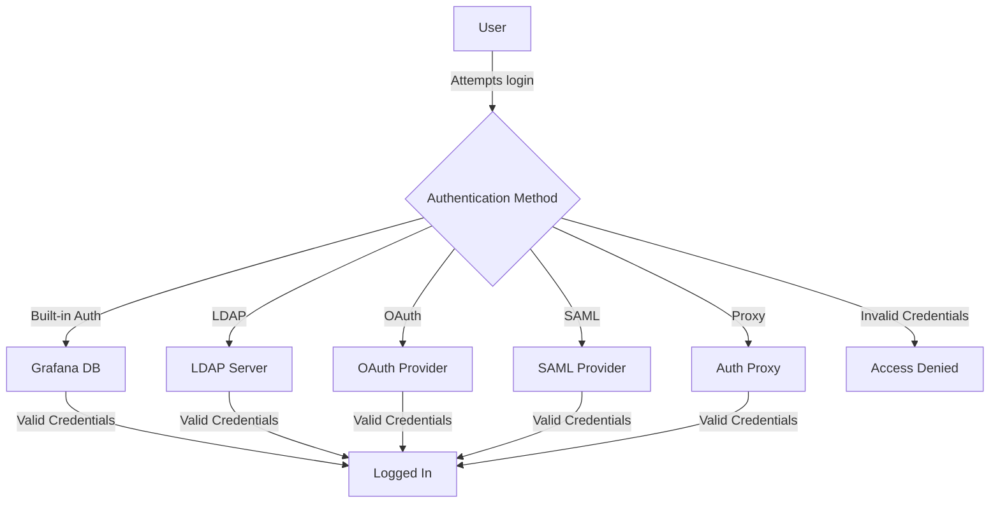

# Grafana Authentication

## Introduction

Authentication is a critical aspect of any monitoring system. It ensures that only authorized users can access, modify, and manage your Grafana dashboards and data sources. In this guide, we'll explore the various authentication methods supported by Grafana, understand how to configure them, and learn best practices for securing your Grafana instance.

Whether you're setting up Grafana for personal use, a small team, or an enterprise environment, understanding authentication options will help you implement the right security controls for your needs.

## Authentication Fundamentals

Authentication in Grafana answers the question "Who are you?" before allowing access to the system. Once a user is authenticated, authorization determines what actions they can perform.

### Default Authentication

By default, Grafana comes with its own built-in user authentication system. When you first install Grafana, you can log in with:

- Username: `admin`
- Password: `admin`

You'll be prompted to change this password on the first login for security reasons.

### Authentication Flow

Here's a basic flowchart of how authentication works in Grafana:



## Authentication Methods

Grafana supports multiple authentication methods that can be configured based on your organization's requirements:

### 1. Built-in Authentication

The simplest form of authentication where Grafana manages user credentials in its own database.

**Configuration Example:**

The built-in authentication is enabled by default in the Grafana configuration file:

```ini
[auth]
# disable login form
disable_login_form = false

# disable signout menu
disable_signout_menu = false
```

### 2. LDAP Authentication

For organizations using LDAP (Lightweight Directory Access Protocol) or Active Directory.

**Configuration Example:**

Enable LDAP in your Grafana configuration file:

```ini
[auth.ldap]
enabled = true
config_file = /etc/grafana/ldap.toml
allow_sign_up = true
```

Then configure the LDAP server in the `ldap.toml` file:

```toml
[[servers]]
host = "ldap.example.com"
port = 389
use_ssl = false
start_tls = true
bind_dn = "cn=admin,dc=example,dc=com"
bind_password = 'grafana'
search_filter = "(cn=%s)"
search_base_dns = ["dc=example,dc=com"]

[servers.attributes]
name = "givenName"
surname = "sn"
username = "cn"
member_of = "memberOf"
email = "email"
```

### 3. OAuth Authentication

Connect Grafana with popular OAuth providers like Google, GitHub, GitLab, or custom OAuth2 servers.

**Configuration Example for GitHub OAuth:**

```ini
[auth.github]
enabled = true
allow_sign_up = true
client_id = YOUR_GITHUB_APP_CLIENT_ID
client_secret = YOUR_GITHUB_APP_CLIENT_SECRET
scopes = user:email,read:org
auth_url = https://github.com/login/oauth/authorize
token_url = https://github.com/login/oauth/access_token
api_url = https://api.github.com/user
team_ids =
allowed_organizations =
```

### 4. SAML Authentication

For enterprise environments that use Security Assertion Markup Language (SAML).

**Configuration Example:**

```ini
[auth.saml]
enabled = true
certificate_path = /path/to/certificate.cert
private_key_path = /path/to/private_key.pem
idp_metadata_path = /path/to/idp_metadata.xml
max_issue_delay = 90s
metadata_valid_duration = 48h
assertion_attribute_name = displayName
assertion_attribute_login = mail
assertion_attribute_email = mail
```

### 5. Auth Proxy Authentication

Allow authentication through a reverse proxy that handles the authentication process.

**Configuration Example:**

```ini
[auth.proxy]
enabled = true
header_name = X-WEBAUTH-USER
header_property = username
auto_sign_up = true
ldap_sync_ttl = 60
whitelist = 192.168.1.1, 192.168.2.1
headers = Email:X-User-Email, Name:X-User-Name
```

## Implementing Authentication: Step-by-Step Guide

Let's walk through setting up OAuth authentication with Google as a practical example:

### Step 1: Create OAuth Credentials in Google Cloud Console

1. Go to the [Google Cloud Console](https://console.cloud.google.com/)
2. Create a new project or select an existing one
3. Navigate to "APIs & Services" > "Credentials"
4. Click "Create Credentials" and select "OAuth client ID"
5. Set the application type to "Web application"
6. Add your Grafana instance URL to the authorized redirect URIs: `https://your-grafana-instance/login/google`
7. Note the Client ID and Client Secret

### Step 2: Configure Grafana

Edit your Grafana configuration file (`grafana.ini` or custom.ini):

```ini
[auth.google]
enabled = true
client_id = YOUR_GOOGLE_CLIENT_ID
client_secret = YOUR_GOOGLE_CLIENT_SECRET
scopes = https://www.googleapis.com/auth/userinfo.profile https://www.googleapis.com/auth/userinfo.email
auth_url = https://accounts.google.com/o/oauth2/auth
token_url = https://accounts.google.com/o/oauth2/token
allowed_domains = yourdomain.com
allow_sign_up = true
```

### Step 3: Restart Grafana

```bash
# For systemd-based systems
sudo systemctl restart grafana-server

# For init.d-based systems
sudo service grafana-server restart
```

### Step 4: Test the Authentication

1. Open your Grafana instance in a browser
2. You should now see a "Sign in with Google" button on the login page
3. Click it and follow the Google authentication flow
4. After successful authentication, you'll be redirected back to Grafana

## Authentication Best Practices

Follow these best practices to ensure your Grafana instance remains secure:

1. **Change Default Credentials**: Always change the default admin password immediately after installation.

2. **Use Strong Passwords**: Enforce strong password policies for built-in authentication.

3. **Implement Multi-Factor Authentication (MFA)**: When possible, enable MFA for additional security layers.

4. **Use HTTPS**: Always secure your Grafana instance with HTTPS to prevent credential interception.

5. **Regular User Audits**: Periodically review user accounts and remove unnecessary access rights.

6. **Principle of Least Privilege**: Give users the minimum level of access required to perform their tasks.

7. **Monitor Authentication Logs**: Regularly review authentication logs for suspicious activities.

**Example of securing Grafana with HTTPS:**

```ini
[server]
protocol = https
http_addr = 127.0.0.1
http_port = 3000
domain = grafana.example.com
cert_file = /path/to/cert.pem
cert_key = /path/to/cert_key.pem
```

## Real-World Applications

### Case Study 1: Small Team Setup

For a small development team, GitHub OAuth is often a convenient choice:

```ini
[auth.github]
enabled = true
allow_sign_up = true
client_id = YOUR_GITHUB_APP_CLIENT_ID
client_secret = YOUR_GITHUB_APP_CLIENT_SECRET
scopes = user:email,read:org
team_ids = 1234567,7654321
allowed_organizations = your-github-org
```

This setup allows all members of specific GitHub teams or your entire organization to access Grafana without creating separate accounts.

### Case Study 2: Enterprise Environment

For larger organizations, LDAP integration with Active Directory provides centralized user management:

```ini
[auth.ldap]
enabled = true
config_file = /etc/grafana/ldap.toml
```

With the following in `ldap.toml`:

```toml
[[servers]]
host = "ad.company.com"
port = 389
use_ssl = true
start_tls = false
bind_dn = "cn=grafana,ou=service accounts,dc=company,dc=com"
bind_password = 'secure-password'
search_filter = "(sAMAccountName=%s)"
search_base_dns = ["ou=users,dc=company,dc=com"]

[servers.attributes]
name = "givenName"
surname = "sn"
username = "sAMAccountName"
member_of = "memberOf"
email = "mail"

[[servers.group_mappings]]
group_dn = "cn=grafana-admins,ou=groups,dc=company,dc=com"
org_role = "Admin"

[[servers.group_mappings]]
group_dn = "cn=grafana-editors,ou=groups,dc=company,dc=com"
org_role = "Editor"

[[servers.group_mappings]]
group_dn = "*"
org_role = "Viewer"
```

This configuration maps Active Directory groups to different roles in Grafana, providing automated access control.

## Troubleshooting Common Authentication Issues

### Issue 1: "Invalid username or password"

**Possible causes:**
- Incorrect credentials
- User account is locked
- Database connectivity issues (for built-in auth)

**Solution:**
Check the Grafana logs for more details:
```bash
grep "Invalid login" /var/log/grafana/grafana.log
```

### Issue 2: OAuth Configuration Problems

**Possible causes:**
- Incorrect client ID or secret
- Misconfigured redirect URI
- Scope issues

**Solution:**
Verify your OAuth configuration and check the Grafana logs:
```bash
grep "OAuth" /var/log/grafana/grafana.log
```

### Issue 3: LDAP Authentication Failures

**Possible causes:**
- Incorrect bind credentials
- Wrong search filter
- Network connectivity issues

**Solution:**
Enable LDAP debug logging in Grafana:
```ini
[auth.ldap]
enabled = true
config_file = /etc/grafana/ldap.toml
debug = true
```

Then check the logs:
```bash
grep "LDAP" /var/log/grafana/grafana.log
```

## Summary

Authentication is a crucial component of Grafana security. In this guide, we've explored:

- The various authentication methods supported by Grafana
- Detailed configuration examples for each method
- Step-by-step implementation of Google OAuth
- Best practices for securing your Grafana instance
- Real-world application examples
- Troubleshooting common authentication issues

By implementing appropriate authentication mechanisms, you can ensure that your Grafana dashboards and data sources are secure while providing convenient access to authorized users.

## Additional Resources

- [Grafana Authentication Documentation](https://grafana.com/docs/grafana/latest/auth/)
- [Grafana Security Best Practices](https://grafana.com/docs/grafana/latest/administration/security/)
- [OAuth 2.0 Specification](https://oauth.net/2/)
- [LDAP Authentication Guide](https://grafana.com/docs/grafana/latest/auth/ldap/)

## Exercises

1. **Basic Setup**: Configure Grafana to use GitHub OAuth authentication for your personal or organization's GitHub account.

2. **LDAP Integration**: If you have access to an LDAP server or Active Directory, configure Grafana to authenticate against it.

3. **Role-Based Access Control**: Configure different user roles (Admin, Editor, Viewer) based on authentication group memberships.

4. **Security Audit**: Review your Grafana authentication settings against the best practices outlined in this guide and identify areas for improvement.

5. **Authentication Scenarios**: Design authentication solutions for three different scenarios: a personal project, a small team, and an enterprise deployment.