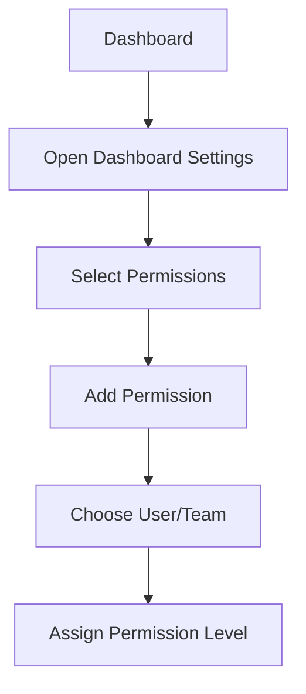

# Grafana Permissions

## Introduction

One of the key aspects of managing a Grafana instance is controlling who can access what. Grafana's permission system allows administrators to define granular access levels for users and teams, ensuring that everyone has appropriate access to the dashboards, data sources, and other resources they need - and nothing more.

In this tutorial, we'll explore Grafana's permission model, understand different permission levels, and learn how to configure them for various resources. By the end, you'll have a solid understanding of how to set up secure, appropriate access controls for your Grafana instance.

## Permission Concepts in Grafana

### User Types

Grafana has different types of users with varying default permissions:

- **Admin**: Has full access to all features and resources
- **Editor**: Can create and edit dashboards and alerts
- **Viewer**: Can only view dashboards (cannot modify)

### Permission Levels

Grafana permissions generally fall into these categories:

- **View**: Can view but not change resources
- **Edit**: Can modify existing resources
- **Admin**: Full control including permission management
- **No Access**: Cannot see or interact with resources

### Permission Scopes

Permissions in Grafana can be applied at different levels:

- **Organization-level**: Affects access throughout an organization
- **Dashboard-level**: Controls access to specific dashboards
- **Folder-level**: Controls access to a group of dashboards
- **Data source-level**: Controls access to specific data sources
- **Team-level**: Manages user groups with shared permissions

## Basic Permission Management

### Viewing Organizational Users and Roles

To view and manage users in your organization:

1. Navigate to **Configuration** → **Users**
2. Here you can see all users and their current roles
3. Change a user's role by clicking the role dropdown

```
User         | Email                  | Role      | Actions
-------------|------------------------|-----------|--------
John Smith   | john.smith@example.com | Admin     | [...]
Sara Johnson | sara.j@example.com     | Editor    | [...]
Alex Wong    | alex.w@example.com     | Viewer    | [...]
```

### Setting Dashboard Permissions

Grafana's dashboard permissions let you control who can view, edit, or administer each dashboard:

1. Navigate to the dashboard you want to manage
2. Click the gear icon (⚙️) to open dashboard settings
3. Select **Permissions**
4. Click **Add Permission**
5. Choose a user or team and assign the appropriate permission level



### Example: Configuring Team Access to a Dashboard

Let's say you have a monitoring team that needs Editor access to a production dashboard:

```javascript
// Dashboard permissions configuration example
// Note: This is a representation - actual configuration is done via UI
{
  "dashboard": "Production Overview",
  "permissions": [
    {
      "team": "Monitoring Team",
      "permission": "Edit"  // Options: View, Edit, Admin
    },
    {
      "team": "Development Team",
      "permission": "View"
    }
  ]
}
```

## Advanced Permission Features

### Folder Permissions

Folders help organize dashboards and enable permission inheritance:

1. Navigate to **Dashboards** → **Manage**
2. Find or create a folder
3. Click the folder settings icon
4. Select **Permissions**
5. Configure permissions that will apply to all dashboards in the folder

```javascript
// Example folder permission structure (conceptual)
{
  "folder": "Production Dashboards",
  "permissions": [
    {
      "role": "Admin",
      "permission": "Admin"
    },
    {
      "team": "SRE Team",
      "permission": "Edit"
    },
    {
      "team": "Development",
      "permission": "View"
    }
  ]
}
```

### Data Source Permissions

Data sources can have their own permissions to control who can query or manage them:

1. Navigate to **Configuration** → **Data Sources**
2. Select a data source
3. Go to the **Permissions** tab
4. Add user or team permissions

### Role-Based Access Control (RBAC)

In Grafana Enterprise, Role-Based Access Control (RBAC) provides more granular control:

1. Navigate to **Configuration** → **Users and access** → **Roles**
2. Create custom roles with specific permissions
3. Assign roles to users or teams

```javascript
// Example RBAC role definition (Enterprise feature)
{
  "role": "Dashboard Creator",
  "permissions": [
    "dashboards:create",
    "dashboards:write",
    "folders:read",
    "datasources:query"
  ]
}
```

## Default Permissions Explained

When a new dashboard or folder is created, it inherits permissions from its parent:

- New dashboards inherit permissions from their folder
- Dashboards in the General folder inherit organization-wide defaults
- New data sources are accessible only to admins until permissions are modified

### Default Permission Matrix

| Resource Type | Admin | Editor | Viewer |
|---------------|-------|--------|--------|
| Dashboards    | Admin | Edit   | View   |
| Folders       | Admin | Edit   | View   |
| Data Sources  | Admin | Query  | None   |
| Alerts        | Admin | Edit   | View   |
| Organizations | Admin | None   | None   |

## Practical Use Cases

### Use Case 1: Team-Based Dashboard Access

Let's say you want to set up a monitoring team with access to specific production dashboards:

1. Create a "Monitoring" team
2. Add relevant users to the team
3. Create a "Production Dashboards" folder
4. Grant the team Edit permissions to the folder
5. Place all production dashboards in that folder

### Use Case 2: Service Provider Setup

If you're managing Grafana for different clients or departments:

1. Create a separate organization for each client
2. Assign appropriate users as admins in each organization
3. Use Grafana Enterprise features for multi-tenancy

### Use Case 3: Compliance Requirements

For environments with strict compliance needs:

1. Limit Admin users to the minimum necessary
2. Use RBAC (Enterprise) to create roles with precise permissions
3. Enable audit logging to track permission changes
4. Implement regular permission reviews

## Common Permission Problems and Solutions

### Problem: Users Can't See a Dashboard

If users report they can't access a dashboard:

1. Check if the user has at least Viewer role in the organization
2. Verify dashboard permissions (user or their team should have at least View access)
3. Check folder permissions (may override dashboard settings)

```javascript
// Troubleshooting checklist
const checkPermissionsAccess = [
  "Verify user Organization role",
  "Check dashboard-specific permissions",
  "Check folder permissions",
  "Verify team membership if permissions are team-based",
  "Check data source permissions if dashboard shows 'No Data'"
];
```

### Problem: Too Many Admin Users

A common security issue is having too many users with Admin privileges:

1. Audit current admin users
2. Downgrade to Editor where appropriate
3. Use Team permissions for specific dashboards instead of organization-wide Admin

## Best Practices for Grafana Permissions

1. **Follow the Principle of Least Privilege**:
   - Grant users only the permissions they need
   - Regularly review and adjust permissions

2. **Use Teams for Permission Management**:
   - Organize users into teams based on roles/departments
   - Assign permissions to teams rather than individuals

3. **Leverage Folders for Organization**:
   - Group related dashboards into folders
   - Set permissions at the folder level for easier management

4. **Document Your Permission Strategy**:
   - Create and maintain documentation for your permission structure
   - Establish procedures for requesting and approving permission changes

5. **Implement Regular Audits**:
   - Review users and their permissions periodically
   - Check for unused accounts and inappropriate access levels

## Summary

Grafana's permission system provides flexible, granular control over who can access and modify different resources. By understanding user roles, permission levels, and the various scopes at which permissions can be applied, you can secure your Grafana instance while ensuring users have appropriate access to the resources they need.

Whether you're managing a small team or a large organization with complex compliance requirements, Grafana's permission features can be tailored to meet your needs. Remember to follow best practices like the principle of least privilege and organizing users into teams for more efficient permission management.

## Additional Resources

- [Grafana Official Documentation on Permissions](https://grafana.com/docs/grafana/latest/administration/user-management/manage-dashboard-permissions/)
- [Role-Based Access Control for Enterprise](https://grafana.com/docs/grafana/latest/enterprise/access-control/)

## Practice Exercises

1. Create a new folder and configure different permission levels for Admins, Editors, and Viewers.
2. Set up a team and grant it specific permissions to a dashboard.
3. Audit your current Grafana instance and document all users with Admin privileges.
4. Create a permission strategy document for your organization based on best practices.
5. Implement a folder structure that reflects your organizational needs and set appropriate permissions at each level.