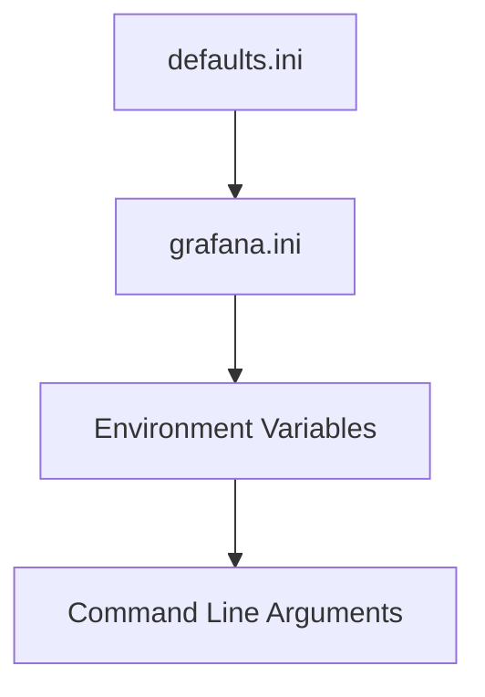

# Grafana Configuration

## Introduction

Configuration is a critical aspect of working with Grafana. Proper configuration ensures your Grafana instance connects to the right data sources, displays the information you need, and remains secure and accessible to the right users. This guide will walk you through the essential configuration options in Grafana, from basic setup to advanced customization.

Whether you're setting up Grafana for personal use or deploying it in an enterprise environment, understanding these configuration options will help you build effective monitoring solutions.

## Configuration Basics

Grafana offers multiple ways to configure your instance:

1. **Configuration files** - Static configuration defined before Grafana starts
2. **Environment variables** - Override settings through your environment
3. **Command line arguments** - Quick overrides when starting Grafana
4. **Web interface** - Settings that can be changed while Grafana is running

Let's explore each of these methods.

### Configuration Files

The primary configuration file for Grafana is `grafana.ini`. On most systems, this file is located in:

- Linux: `/etc/grafana/grafana.ini`
- macOS: `/usr/local/etc/grafana/grafana.ini`
- Windows: `<Grafana installation directory>/conf/defaults.ini`

Grafana uses a hierarchical configuration system:



The `defaults.ini` file contains all default settings. You should never modify this file directly. Instead, make your changes in `grafana.ini` or through other override methods.

Here's a basic example of what the configuration file looks like:

```ini
[server]
http_port = 3000
domain = localhost

[database]
type = sqlite3
path = grafana.db

[security]
admin_user = admin
admin_password = admin
```

### Environment Variables

You can override configuration settings using environment variables. The format follows this pattern:

```
GF_<SECTION>_<KEY>
```

For example, to change the HTTP port:

```bash
export GF_SERVER_HTTP_PORT=8080
```

This is especially useful in containerized environments like Docker:

```bash
docker run -d -p 3000:3000 \
  -e "GF_SERVER_HTTP_PORT=3000" \
  -e "GF_SECURITY_ADMIN_PASSWORD=mypassword" \
  grafana/grafana-enterprise
```

### Command Line Arguments

You can also specify configuration options when starting Grafana:

```bash
grafana-server --config=/custom/config.ini --homepath=/custom/grafana
```

Common command line options include:

- `--config`: Path to config file
- `--homepath`: Path to Grafana installation
- `--pidfile`: Path to pidfile

## Essential Configuration Areas

Let's explore the most important areas you'll need to configure.

### Server Configuration

The `[server]` section controls basic server settings:

```ini
[server]
http_port = 3000
domain = grafana.example.com
root_url = %(protocol)s://%(domain)s:%(http_port)s/
serve_from_sub_path = false
```

- `http_port`: The port Grafana listens on
- `domain`: The domain name used to access Grafana
- `root_url`: The full URL used to access Grafana
- `serve_from_sub_path`: Whether Grafana can be served from a subpath

### Database Configuration

Grafana requires a database to store users, dashboards, and other persistent data:

```ini
[database]
type = postgres
host = 127.0.0.1:5432
name = grafana
user = grafana
password = password
ssl_mode = disable
```

Supported database types:
- `sqlite3` (default)
- `mysql`
- `postgres`

For small or personal installations, SQLite works fine. For production environments, PostgreSQL is recommended.

### Security Configuration

Controlling access to your Grafana instance is crucial:

```ini
[security]
admin_user = admin
admin_password = strongpassword
secret_key = SW2YcwTIb9zpOOhoPsMm
disable_gravatar = true
cookie_secure = true
cookie_samesite = lax
```

- `admin_user` and `admin_password`: Initial admin credentials
- `secret_key`: Used for signing cookies and other security functions
- `disable_gravatar`: Disables profile pictures from Gravatar
- `cookie_secure`: Only sends cookies over HTTPS

### Authentication

Grafana supports multiple authentication methods:

```ini
[auth]
disable_login_form = false
disable_signout_menu = false

[auth.anonymous]
enabled = false

[auth.basic]
enabled = true

[auth.google]
enabled = false
client_id = your_client_id
client_secret = your_client_secret
scopes = https://www.googleapis.com/auth/userinfo.profile https://www.googleapis.com/auth/userinfo.email
auth_url = https://accounts.google.com/o/oauth2/auth
token_url = https://accounts.google.com/o/oauth2/token
```

Grafana supports many authentication providers, including:
- Basic authentication
- LDAP
- Google, GitHub, GitLab, Azure, Okta
- Generic OAuth
- SAML

### Data Source Configuration

While data sources are typically configured via the web interface, you can also provision them through configuration:

Create a YAML file at `/etc/grafana/provisioning/datasources/default.yaml`:

```yaml
apiVersion: 1

datasources:
  - name: Prometheus
    type: prometheus
    access: proxy
    url: http://prometheus:9090
    isDefault: true
  
  - name: InfluxDB
    type: influxdb
    access: proxy
    url: http://influxdb:8086
    database: metrics
    user: grafana
    secureJsonData:
      password: password
```

### Dashboard Configuration

Similarly, you can provision dashboards through configuration:

Create a YAML file at `/etc/grafana/provisioning/dashboards/default.yaml`:

```yaml
apiVersion: 1

providers:
  - name: 'Default'
    orgId: 1
    folder: ''
    type: file
    disableDeletion: false
    updateIntervalSeconds: 10
    options:
      path: /var/lib/grafana/dashboards
```

Then place your dashboard JSON files in the specified path.

## Practical Configuration Examples

Let's look at some real-world configuration scenarios.

### Setting Up Grafana Behind a Reverse Proxy

If you're running Grafana behind Nginx or another reverse proxy:

```ini
[server]
domain = monitoring.example.com
root_url = https://monitoring.example.com/grafana/
serve_from_sub_path = true
```

Nginx configuration:

```nginx
server {
    listen 80;
    server_name monitoring.example.com;
    
    location /grafana/ {
        proxy_pass http://localhost:3000/;
        proxy_set_header Host $host;
        proxy_set_header X-Real-IP $remote_addr;
        proxy_set_header X-Forwarded-For $proxy_add_x_forwarded_for;
        proxy_set_header X-Forwarded-Proto $scheme;
    }
}
```

### Configuring SMTP for Email Notifications

To enable email alerts:

```ini
[smtp]
enabled = true
host = smtp.gmail.com:587
user = grafana@example.com
password = your_password
from_address = grafana@example.com
from_name = Grafana Alert
ehlo_identity = dashboard.example.com
starttls_policy = OpportunisticStartTLS
```

### Setting Up Multiple Organizations

For multi-tenant environments:

```ini
[users]
auto_assign_org = true
auto_assign_org_id = 1

[auth]
org_name = Main Org.
org_role = Viewer

[auth.proxy]
enabled = true
header_name = X-WEBAUTH-USER
header_property = username
auto_sign_up = true
sync_ttl = 60
```

## Advanced Configuration

For larger deployments, consider these advanced options:

### High Availability Setup

```ini
[clustering]
enabled = true

[remote_cache]
type = redis
connstr = addr=127.0.0.1:6379,pool_size=100,db=0,ssl=false
```

### Plugin Management

```ini
[plugins]
enable_alpha = false
app_tls_skip_verify_insecure = false
plugin_admin_enabled = false
plugin_admin_external_manage_enabled = false
plugin_catalog_url = https://grafana.com/api/plugins
```

### Metrics and Monitoring

Grafana can expose its own metrics:

```ini
[metrics]
enabled = true
basic_auth_username = metrics
basic_auth_password = password
interval_seconds = 10
```

These metrics can be scraped by Prometheus, allowing you to monitor Grafana itself.

## Troubleshooting Configuration Issues

If you encounter configuration problems:

1. Check Grafana logs (usually in `/var/log/grafana/` or the console output)
2. Verify configuration file permissions
3. Ensure environment variables are correctly set
4. Validate configuration syntax

Grafana provides a config dump command to see the current effective configuration:

```bash
grafana-server --config=/etc/grafana/grafana.ini --homepath /usr/share/grafana dump-config
```

## Summary

Proper configuration is essential for a well-functioning Grafana installation. In this guide, we've covered:

- Configuration methods (files, environment variables, command line)
- Essential configuration areas (server, database, security, auth)
- Provisioning data sources and dashboards
- Practical examples for common scenarios
- Advanced configuration options
- Troubleshooting tips

By mastering these configuration options, you'll be able to tailor Grafana to your specific monitoring needs, whether for personal projects or enterprise deployments.

## Additional Resources

- [Official Grafana Configuration Documentation](https://grafana.com/docs/grafana/latest/administration/configuration/)
- [Grafana Provisioning Documentation](https://grafana.com/docs/grafana/latest/administration/provisioning/)
- [Grafana Security Documentation](https://grafana.com/docs/grafana/latest/administration/security/)

## Exercises

1. Set up a basic Grafana instance with a custom port and admin password using environment variables.
2. Configure Grafana to connect to a PostgreSQL database instead of the default SQLite.
3. Create a provisioning configuration that automatically adds Prometheus and InfluxDB data sources.
4. Configure Grafana to send email notifications through your email provider.
5. Set up Grafana behind a reverse proxy with a custom sub-path.