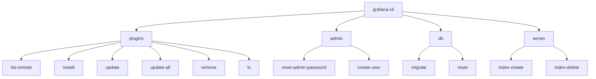

# Grafana Command Line

## Introduction

The Grafana Command Line Interface (CLI) is a powerful tool that allows you to manage and automate various aspects of your Grafana installation directly from the terminal. Whether you need to perform administrative tasks, manage plugins, reset passwords, or troubleshoot issues, the Grafana CLI provides a straightforward way to interact with your Grafana instance without using the web interface.

In this tutorial, we'll explore the Grafana CLI's capabilities, understand its structure, and walk through common commands you'll use in day-to-day Grafana administration.

## Prerequisites

Before we begin, make sure you have:

- Grafana installed on your system
- Terminal or command-line access to your Grafana server
- Basic familiarity with command-line operations

## Understanding the Grafana CLI Structure

The Grafana CLI follows a consistent structure:

```
grafana-cli [global options] command [command options] [arguments...]
```

Let's break this down:

- `grafana-cli`: The base command
- `[global options]`: Options that apply to all commands
- `command`: The specific operation you want to perform
- `[command options]`: Options specific to the chosen command
- `[arguments...]`: Additional arguments needed for the command

### Global Options

The most commonly used global options include:

```
--homepath STRING    Path to Grafana installation
--configfile STRING  Path to config file
--config STRING      Path to config file (same as above)
--pluginsDir STRING  Path to Grafana plugins directory
--pluginUrl STRING   URL to download plugins from
--debug              Enable debug logging
```

## Common Grafana CLI Commands

### 1. Managing Plugins

One of the most frequent uses of the Grafana CLI is to manage plugins. Let's look at the available commands:

#### Listing Available Plugins

To see a list of all available plugins:

```bash
grafana-cli plugins list-remote
```

**Output:**
```
id:alexander-zobnin-zabbix-app version: 4.3.1
id:alexanderzobnin-zabbix-app version: 4.3.1
id:alibaba-cloud-apsaradb-for-redis-datasource version: 1.0.0
...
```

#### Installing Plugins

To install a plugin:

```bash
grafana-cli plugins install grafana-clock-panel
```

**Output:**
```
installing grafana-clock-panel @ 1.3.1
from: https://grafana.com/api/plugins/grafana-clock-panel/versions/1.3.1/download
into: /var/lib/grafana/plugins

✔ Installed grafana-clock-panel successfully 
```

#### Updating Plugins

To update all plugins:

```bash
grafana-cli plugins update-all
```

To update a specific plugin:

```bash
grafana-cli plugins update grafana-clock-panel
```

#### Removing Plugins

To remove a plugin:

```bash
grafana-cli plugins remove grafana-clock-panel
```

**Output:**
```
Removed grafana-clock-panel successfully
```

### 2. User Management

#### Resetting the Admin Password

If you've forgotten the admin password, you can reset it with:

```bash
grafana-cli admin reset-admin-password newpassword
```

**Output:**
```
Admin password changed successfully ✔
```

#### Creating an Admin User

```bash
grafana-cli admin create-user --login=admin --password=admin --email=admin@example.com
```

### 3. Database Management

#### Migrating Database

If you need to migrate your database:

```bash
grafana-cli db migrate
```

#### Resetting Database

To reset your database (be careful with this!):

```bash
grafana-cli db reset
```

## Real-World Examples

### Example 1: Setting Up a New Grafana Instance

Let's walk through a common workflow when setting up a new Grafana instance:

```bash
# Step 1: Install required plugins
grafana-cli plugins install grafana-piechart-panel
grafana-cli plugins install grafana-worldmap-panel
grafana-cli plugins install alexanderzobnin-zabbix-app

# Step 2: Create an admin user
grafana-cli admin create-user --login=admin --password=secure_password --email=admin@example.com

# Step 3: Verify the installation
grafana-cli plugins ls
```

### Example 2: Troubleshooting and Maintenance Script

Here's a simple bash script that performs routine maintenance on your Grafana instance:

```bash
#!/bin/bash
# Grafana maintenance script

echo "Updating all plugins..."
grafana-cli plugins update-all

echo "Checking for any required database migrations..."
grafana-cli db migrate

echo "Verifying Grafana service status..."
systemctl status grafana-server

echo "Maintenance complete!"
```

## Advanced CLI Usage

### Custom Plugin Repositories

You can install plugins from custom repositories:

```bash
grafana-cli --pluginUrl https://company.com/grafana/plugins plugins install custom-plugin
```

### Working with Different Configuration Files

For testing different configurations:

```bash
grafana-cli --config /path/to/custom/config.ini admin reset-admin-password newpassword
```

### Debugging Issues

When troubleshooting, enabling debug mode can be helpful:

```bash
grafana-cli --debug plugins install my-plugin
```

## Command Reference

Here's a quick reference of commonly used commands:



## Summary

The Grafana CLI is an essential tool for anyone managing a Grafana instance. It provides a quick and efficient way to perform administrative tasks, manage plugins, and maintain your Grafana installation without needing to use the web interface.

Key takeaways from this tutorial:

- The Grafana CLI follows a consistent structure with global options and command-specific options
- Plugin management is one of the most common uses of the CLI
- You can perform user management tasks like resetting passwords and creating users
- Database operations and maintenance can be automated using the CLI
- Scripts can be created to automate routine maintenance tasks

## Additional Resources

To learn more about the Grafana CLI, consider exploring:

- The official Grafana documentation for the most up-to-date information
- Run `grafana-cli help` or `grafana-cli command --help` for detailed help on specific commands
- Community forums for user-created scripts and workflows

## Exercises

1. **Basic**: Install three different visualization plugins using the Grafana CLI.
2. **Intermediate**: Create a bash script that installs a set of plugins, creates an admin user, and performs a database migration.
3. **Advanced**: Set up a cron job that runs weekly to update all plugins and back up your Grafana configuration.

By mastering the Grafana CLI, you'll be able to manage your Grafana installations more efficiently and automate routine tasks, saving time and reducing the chance of human error.