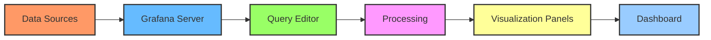

# Data Sources Overview

## Introduction

Data sources are the foundation of Grafana's visualization capabilities. They represent the connection between Grafana and your data storage systems, allowing you to query, visualize, and analyze metrics from various platforms. Think of data sources as bridges that enable Grafana to communicate with your databases, cloud services, and other data repositories.

As a beginner to Grafana, understanding how data sources work is essential for creating meaningful dashboards and visualizations. This guide will walk you through the basics of Grafana data sources, how to configure them, and how to use them effectively in your dashboards.

## What Are Data Sources?

A data source in Grafana is a configured connection to a specific data storage system. Grafana supports numerous data sources out of the box and can be extended to support even more through plugins.

### Common Data Source Types

Grafana can connect to various types of data sources:

- **Time-series databases** (Prometheus, InfluxDB, Graphite)
- **SQL databases** (MySQL, PostgreSQL, Microsoft SQL Server)
- **Cloud services** (AWS CloudWatch, Azure Monitor, Google Cloud Monitoring)
- **Logging platforms** (Loki, Elasticsearch)
- **Other sources** (OpenTSDB, Jaeger, Zipkin, and more)

Each data source type has specific capabilities and query languages that Grafana can leverage to retrieve and visualize data.

## How Data Sources Work in Grafana

Let's understand the flow of data in Grafana:



1. **Configuration**: You set up a data source by providing connection details
2. **Query**: Using the query editor specific to each data source type
3. **Data Retrieval**: Grafana sends queries to the data source
4. **Processing**: Retrieved data is processed for visualization
5. **Display**: Data is displayed in panels within dashboards

## Setting Up Your First Data Source

To add a data source in Grafana:

1. Log in to your Grafana instance
2. Navigate to Configuration > Data Sources
3. Click "Add data source"
4. Select the type of data source you want to add
5. Fill in the required connection details
6. Test and save the connection

Here's an example of what the configuration page looks like for a Prometheus data source:

```jsx
// Example code showing the configuration object structure for a Prometheus data source
const datasourceConfig = {
  name: 'My Prometheus',
  type: 'prometheus',
  url: 'http://prometheus:9090',
  access: 'proxy',
  basicAuth: false,
  withCredentials: false,
  isDefault: true,
  jsonData: {
    httpMethod: 'POST',
    timeInterval: '15s'
  }
};
```

## Data Source Query Editors

Each data source in Grafana has its own specialized query editor designed to work with that source's query language or API. Let's look at a few examples:

### Prometheus Query Editor Example

When working with Prometheus, you'll use PromQL (Prometheus Query Language):

```jsx
// Example of a simple Prometheus query in a panel
const prometheusQuery = 'sum(rate(http_requests_total{job="api-server"}[5m])) by (method)';
```

This query calculates the rate of HTTP requests over 5 minutes, summed by HTTP method.

### SQL Query Editor Example

For SQL databases like MySQL or PostgreSQL, you'll write SQL queries:

```sql
SELECT 
  time_column as time,
  metric_value as value,
  host as metric
FROM 
  performance_metrics
WHERE 
  $__timeFilter(time_column) 
ORDER BY 
  time
```

This query retrieves performance metrics within a time range selected on the dashboard.

## Working with Variables in Data Sources

Variables make your dashboards dynamic and interactive. They allow users to change what data is displayed without editing the dashboard.

### Example: Creating a Host Variable

```jsx
// Example variable definition
const hostVariable = {
  name: 'host',
  type: 'query',
  datasource: 'Prometheus',
  query: 'label_values(node_cpu_seconds_total, instance)',
  refresh: 1, // On dashboard load
  sort: 3, // Alphabetical (asc)
};
```

This creates a dropdown variable that lists all hosts from which Prometheus is collecting CPU metrics.

## Data Source Permissions

Grafana allows you to control who can access which data sources through permissions:

1. **Organization-level permissions**: Control who can query, edit, or administer data sources
2. **Data source-level permissions**: Control access to specific data sources
3. **Query-level permissions**: Control what users can query within a data source

## Troubleshooting Data Source Connections

Common issues with data sources include:

- **Connection errors**: Check network connectivity and firewall settings
- **Authentication failures**: Verify credentials and permissions
- **Query timeout issues**: Adjust timeout settings or optimize queries
- **Data not appearing**: Verify time range and query syntax

When troubleshooting, start by using the "Test" button on the data source configuration page:

```jsx
// Example function to test data source connection
function testDataSource(datasource) {
  return grafana.api.post(`/api/datasources/test`, {
    name: datasource.name,
    type: datasource.type,
    url: datasource.url,
    access: datasource.access,
    basicAuth: datasource.basicAuth,
    // other properties
  });
}
```

## Practical Example: Creating a Multi-Data Source Dashboard

Let's imagine we want to create a dashboard that monitors both system metrics from Prometheus and logs from Loki:

1. **Configure both data sources** in Grafana
2. **Create a new dashboard**
3. **Add a graph panel** using Prometheus as the data source
   ```jsx
   // Prometheus query for CPU usage
   const cpuQuery = 'sum by(instance) (rate(node_cpu_seconds_total{mode!="idle"}[5m]))';
   ```
4. **Add a logs panel** using Loki as the data source
   ```jsx
   // Loki query for error logs
   const logQuery = '{app="myapp"} |= "error"';
   ```
5. **Link the panels** using template variables to keep them in sync

This approach gives you a comprehensive view of both metrics and logs, making troubleshooting much easier.

## Best Practices for Data Sources

1. **Use descriptive names** for your data sources
2. **Document connection details** securely
3. **Create separate data sources** for different environments (development, testing, production)
4. **Use variables** to make dashboards reusable across different data sources
5. **Monitor data source performance** and adjust as needed
6. **Keep credentials secure** by using environment variables or Grafana's secure storage
7. **Set appropriate query timeouts** to prevent dashboard slowdowns

## Summary

Data sources are the vital connection between Grafana and your data. They enable the powerful visualization and monitoring capabilities that make Grafana such a valuable tool. As you continue your Grafana journey, you'll learn to work with specific data sources in depth and create increasingly sophisticated dashboards.

To become proficient with Grafana data sources:

1. Start with a single data source and master its query language
2. Experiment with different visualization options
3. Learn how to use template variables
4. Gradually add more data sources as needed
5. Practice creating cross-data source dashboards

## Additional Resources

- Explore the official [Grafana documentation](https://grafana.com/docs/grafana/latest/datasources/) for detailed guides on specific data sources
- Try the built-in Grafana tutorials within your Grafana instance
- Join the Grafana community forums to learn from other users' experiences
- Experiment with the Grafana Play site to see examples of different data sources in action

## Practice Exercises

1. Configure a Prometheus data source and create a simple dashboard showing system metrics
2. Create a dashboard with two different data sources and link them with a template variable
3. Write a query that uses template variables to filter data by host or service
4. Create a dashboard that compares metrics from two different data sources side by side