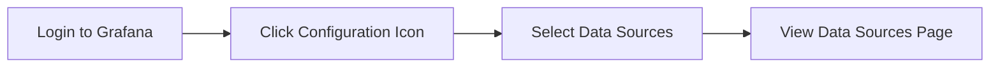
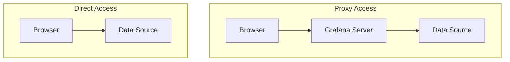

# Adding Data Sources

## Introduction

Data sources are the foundation of Grafana's visualization capabilities. A data source represents a connection to a database, API, or service that stores your metrics, logs, or other data. Before you can create dashboards and visualizations in Grafana, you need to connect it to your data by adding and configuring data sources.

In this guide, you'll learn:
- What data sources are in Grafana
- How to add and configure different types of data sources
- How to test your data source connections
- Best practices for managing data sources

## Understanding Data Sources in Grafana

Grafana supports numerous data sources out of the box, including:

- **Time series databases**: Prometheus, InfluxDB, Graphite
- **SQL databases**: MySQL, PostgreSQL, Microsoft SQL Server
- **Cloud platforms**: AWS CloudWatch, Google Cloud Monitoring, Azure Monitor
- **Logs**: Loki, Elasticsearch
- **Tracing**: Tempo, Jaeger, Zipkin
- **And many more**

Each data source type has its own configuration options and query languages, but the process of adding them follows a similar pattern.

## Adding a Data Source in Grafana

### Step 1: Access Data Sources Configuration

1. Log in to your Grafana instance
2. In the sidebar, click on the **Configuration** (gear) icon
3. Select **Data Sources** from the menu



### Step 2: Add a New Data Source

1. Click the **Add data source** button at the top of the page
2. Browse or search for the type of data source you want to add
3. Click on the data source to select it

### Step 3: Configure the Data Source

Each data source has its own specific configuration options, but most include:

- **Name**: A name for your data source (used in Grafana UI)
- **URL/Connection details**: How to connect to your data source
- **Authentication**: Credentials or API keys needed to access your data
- **Advanced options**: Timeouts, query limits, etc.

Let's look at some common data source configurations:

#### Example: Adding Prometheus as a Data Source

```javascript
// Configuration form fields for Prometheus
{
  name: "Production Prometheus",
  url: "http://prometheus:9090",
  access: "Server (default)",
  basicAuth: false,
  // Additional fields would appear here
}
```

Here's how to add a Prometheus data source:

1. Select **Prometheus** from the list of data sources
2. Configure the following settings:
   - **Name**: Enter a name like "Production Prometheus"
   - **URL**: Enter the URL of your Prometheus server (e.g., `http://prometheus:9090`)
   - **Access**: Choose "Server" (default) if Grafana server can access Prometheus directly
   - **Auth**: Configure authentication if your Prometheus instance requires it
3. Click **Save & Test** to verify the connection

#### Example: Adding MySQL as a Data Source

For a MySQL database:

1. Select **MySQL** from the list of data sources
2. Configure:
   - **Name**: "Production MySQL"
   - **Host**: Your MySQL server address with port (e.g., `mysql:3306`)
   - **Database**: The database name
   - **User** and **Password**: Database credentials
   - **TLS/SSL options**: Configure if needed
3. Click **Save & Test**

## Testing Data Source Connections

After configuring a data source, always test the connection by clicking the **Save & Test** button. Grafana will attempt to connect to your data source and report any issues.

Successful test:
```
Data source is working
```

Failed test example:
```
Error connecting to data source: dial tcp 127.0.0.1:3000: connect: connection refused
```

If the test fails, check:
- Connection URL and credentials
- Network connectivity between Grafana and your data source
- Firewall settings
- Authentication configuration

## Managing Data Sources

### Setting a Default Data Source

You can set a default data source that will be pre-selected when creating new panels:

1. Go to the data sources list
2. Click the star icon next to the data source you want to set as default

### Organizing Data Sources

For organizations with many data sources:

- Use consistent naming conventions
- Use folders (in Grafana Enterprise) to organize data sources
- Consider using tags to group related data sources

### Permissions and Access Control

In Grafana Enterprise, you can control who can:
- Add, edit, and delete data sources
- Query specific data sources
- Use specific data sources for alerts

## Proxy vs. Direct Access

Grafana offers two access modes for data sources:

- **Server/Proxy access**: Grafana's backend sends queries to the data source
- **Browser/Direct access**: Queries are sent directly from the browser to the data source



The proxy mode is more secure and works with data sources that:
- Are not accessible from user browsers
- Require authentication credentials you don't want to expose to browsers
- Are behind firewalls

## Practical Examples

### Example 1: Setting Up a Development Dashboard with Multiple Data Sources

Let's create a development dashboard that combines data from both Prometheus and a SQL database:

1. Add Prometheus data source:
   - Name: "Dev Prometheus"
   - URL: Your dev Prometheus URL
   
2. Add PostgreSQL data source:
   - Name: "Dev PostgreSQL"
   - Connection details for your dev database
   
3. Create a new dashboard with:
   - Panels querying metrics from Prometheus for system health
   - Panels querying PostgreSQL for application-specific data

### Example 2: Configuring CloudWatch for AWS Monitoring

To monitor AWS services:

1. Add CloudWatch data source:
   - Name: "AWS CloudWatch"
   - Authentication: Choose between:
     - Access & secret key
     - IAM roles
     - AWS credentials file
   
2. Configure region and namespaces:
   - Default Region: e.g., "us-east-1"
   - Enable Custom Namespaces if needed

3. Test with a CloudWatch metrics query:
   ```javascript
   // Example CloudWatch query structure
   {
     region: 'us-east-1',
     namespace: 'AWS/EC2',
     metricName: 'CPUUtilization',
     dimensions: { InstanceId: 'i-12345abcdef' },
     statistic: 'Average',
     period: '300'
   }
   ```

## Troubleshooting Common Issues

Here are solutions to common data source problems:

### Connection Errors

If you see "Connection refused" errors:
- Check if the data source is running and accessible
- Verify network connectivity and firewalls
- For proxy access, ensure Grafana server can reach the data source

### Authentication Issues

For "Unauthorized" or "Access denied" errors:
- Verify credentials are correct
- Check if the user has proper permissions
- Look for expired API keys or tokens

### Query Performance Problems

If queries are slow:
- Check time range selection (large ranges = more data)
- Verify data source performance
- Consider adding caching or aggregation at the data source level

## Summary

Adding data sources is a fundamental step in setting up Grafana for monitoring and visualization. In this guide, you've learned:

- How to add and configure data sources in Grafana
- The different types of data sources Grafana supports
- How to test connections and troubleshoot issues
- Best practices for managing data sources

With your data sources properly configured, you're now ready to create dashboards and visualizations that provide insights into your systems and applications.

## Additional Resources

- Try adding different types of data sources to understand their unique configurations
- Explore how to query each data source effectively
- Learn about data source variables and templates for dynamic dashboards

## Exercises

1. Add a Prometheus data source and create a simple dashboard showing CPU and memory usage.
2. Configure a SQL data source and write a query to display application metrics.
3. Set up a logs data source (like Loki) and create a dashboard that shows both metrics and related logs.
4. Try combining multiple data sources in a single dashboard to correlate data from different systems.