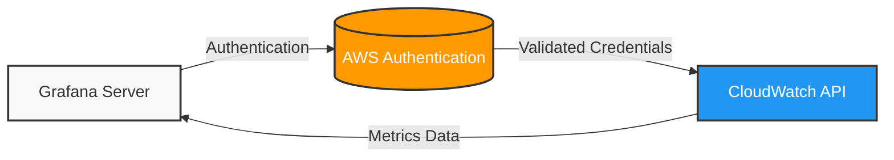

# AWS CloudWatch Data Source

## Introduction

Amazon CloudWatch is AWS's monitoring and observability service that provides data and actionable insights for AWS resources and applications. The AWS CloudWatch data source in Grafana allows you to visualize and analyze your CloudWatch metrics directly in your Grafana dashboards, creating a unified monitoring experience across your entire infrastructure.

In this guide, you'll learn how to configure the AWS CloudWatch data source in Grafana, query CloudWatch metrics, create insightful visualizations, and leverage CloudWatch's features to monitor your AWS environment effectively.

## Prerequisites

Before getting started, ensure you have:

- A working Grafana instance (version 7.0 or later recommended)
- An AWS account with permissions to access CloudWatch metrics
- Basic understanding of AWS services and CloudWatch concepts

## Configuring the AWS CloudWatch Data Source

### Step 1: Add the Data Source

1. Log in to your Grafana instance with administrator privileges
2. Navigate to **Configuration** → **Data Sources**
3. Click on the **Add data source** button
4. Search for and select **CloudWatch**

### Step 2: Configure Authentication

Grafana offers several authentication methods for connecting to AWS:

#### Authentication with AWS IAM Credentials

```jsx
// Example AWS IAM credentials configuration
{
  "accessKey": "YOUR_ACCESS_KEY",
  "secretKey": "YOUR_SECRET_KEY"
}
```

1. Enter your AWS Access Key and Secret Access Key
2. Specify the default AWS region
3. (Optional) Configure the Assume Role settings if you're using cross-account access

#### Authentication with EC2 IAM Role

If your Grafana server is running on an EC2 instance:

1. Select **Access & Secret key** as the authentication provider
2. Leave the Access Key and Secret Key fields blank
3. Attach an appropriate IAM role to your EC2 instance with CloudWatch read permissions

#### Authentication with EKS IAM Role

For Grafana running in Amazon EKS:

1. Select **Workspace IAM Role** as the authentication provider
2. Configure the role ARN that has access to CloudWatch

### Step 3: Additional Settings

Configure these additional settings as needed:

- **Default Region**: The AWS region Grafana will query by default
- **Custom Endpoints**: For VPC endpoints or local development
- **Namespaces**: Filter to specific CloudWatch namespaces
- **Timeout**: Adjust query timeout settings if needed

Here's a diagram showing the connection flow:



## Querying CloudWatch Metrics

### Basic Query Structure

CloudWatch queries in Grafana have several components:

1. **Region**: The AWS region to query
2. **Namespace**: The CloudWatch namespace (e.g., AWS/EC2, AWS/Lambda)
3. **Metric Name**: The specific metric to query
4. **Statistic**: How to aggregate the data (Average, Sum, Maximum, etc.)
5. **Dimensions**: Filters that narrow down which resources to include
6. **Period**: The time interval for data aggregation

### Example Queries

#### EC2 CPU Utilization

```jsx
// Query configuration for EC2 CPU Utilization
{
  "region": "us-east-1",
  "namespace": "AWS/EC2",
  "metricName": "CPUUtilization",
  "dimensions": {
    "InstanceId": "i-0123456789abcdef0"
  },
  "statistic": "Average",
  "period": "60"
}
```

#### Lambda Function Invocations

```jsx
// Query configuration for Lambda Invocations
{
  "region": "us-east-1",
  "namespace": "AWS/Lambda",
  "metricName": "Invocations",
  "dimensions": {
    "FunctionName": "my-lambda-function"
  },
  "statistic": "Sum",
  "period": "300"
}
```

### Using Math Expressions

CloudWatch in Grafana supports math expressions for advanced calculations:

```jsx
// Example math expression to calculate CPU utilization percentage
m1 / m2 * 100
```

Where:
- `m1` is a query for CPU used
- `m2` is a query for CPU allocated

### Dynamic Dimension Values

For dynamic dashboards, you can use template variables:

```jsx
// Using template variables in a query
{
  "namespace": "AWS/EC2",
  "metricName": "CPUUtilization",
  "dimensions": {
    "InstanceId": "$instance_id"
  }
}
```

## Advanced Features

### CloudWatch Logs Insights

In addition to metrics, you can query CloudWatch Logs using CloudWatch Logs Insights:

1. Switch to the **Logs** tab in the query editor
2. Select your Log Group
3. Enter a Logs Insights query

```sql
-- Example CloudWatch Logs Insights query
fields @timestamp, @message
| filter @message like /ERROR/
| sort @timestamp desc
| limit 20
```

### Cross-Account Observation

To monitor resources across multiple AWS accounts:

1. Configure IAM roles in each account with appropriate permissions
2. Set up Role ARNs in your data source configuration
3. Use the account selector in the query editor to switch between accounts

### CloudWatch Alarms

You can visualize CloudWatch Alarms in Grafana:

1. Switch to the **Alarms** tab in the query editor
2. Configure filters for states, alarm names, or other properties
3. Create a table panel to display alarm status

## Real-World Examples

### Example 1: EC2 Instance Monitoring Dashboard

Create a comprehensive dashboard for EC2 instances:

1. Add a CloudWatch query for CPU Utilization
2. Add queries for Network In/Out
3. Add queries for Disk I/O
4. Use template variables to make the dashboard dynamic

```jsx
// Template variable setup for EC2 instances
{
  "type": "query",
  "name": "instance",
  "label": "Instance",
  "query": {
    "region": "us-east-1",
    "namespace": "AWS/EC2",
    "metricName": "CPUUtilization",
    "dimensionKey": "InstanceId"
  }
}
```

### Example 2: RDS Database Performance

Monitor database performance with CloudWatch metrics:

1. Add queries for DatabaseConnections
2. Add queries for ReadIOPS and WriteIOPS
3. Add queries for FreeStorageSpace
4. Create alerts on critical thresholds

```jsx
// Alert configuration for database connections
{
  "alert": {
    "name": "High Database Connections",
    "conditions": [
      {
        "evaluator": {
          "type": "gt",
          "params": [100]
        },
        "query": {
          "region": "us-east-1",
          "namespace": "AWS/RDS",
          "metricName": "DatabaseConnections"
        }
      }
    ]
  }
}
```

### Example 3: Lambda Monitoring

Create a serverless monitoring dashboard:

1. Add queries for Invocations
2. Add queries for Errors
3. Add queries for Duration
4. Add queries for Throttles
5. Correlate with CloudWatch Logs

## Best Practices

### Optimize CloudWatch Costs

CloudWatch queries can increase AWS costs. To optimize:

- Use appropriate time periods (larger periods mean fewer API calls)
- Limit the number of metrics queried
- Use math expressions instead of querying pre-calculated metrics
- Consider CloudWatch retention policies

### Performance Tuning

For better Grafana performance with CloudWatch:

- Limit dashboard time ranges when possible
- Use template variables strategically
- Consider caching at the Grafana level
- Adjust the query timeout settings

### Security Considerations

Follow these security best practices:

- Use IAM roles with least privilege access
- Rotate access keys regularly if using authentication keys
- Consider using AWS PrivateLink for enhanced security
- Enable audit logging for CloudWatch API calls

## Troubleshooting

### Common Issues

1. **No Data** issues:
   - Verify IAM permissions
   - Check region settings
   - Verify the CloudWatch namespace is correct
   - Ensure the time range contains data

2. **Authentication Errors**:
   - Verify access keys or IAM roles
   - Check for expired credentials
   - Verify region configuration

3. **Performance Issues**:
   - Adjust period to reduce data points
   - Optimize your queries
   - Check Grafana server resources

## Summary

AWS CloudWatch is a powerful data source for Grafana that allows you to visualize and analyze metrics from your AWS environment. With proper configuration, you can create comprehensive dashboards that give you insights into your AWS resources' performance, availability, and health.

By following the steps and examples in this guide, you've learned how to:

- Configure the AWS CloudWatch data source in Grafana
- Query CloudWatch metrics effectively
- Use advanced features like math expressions and template variables
- Create real-world monitoring dashboards
- Follow best practices for cost optimization and security

## Additional Resources

- [Grafana CloudWatch Documentation](https://grafana.com/docs/grafana/latest/datasources/cloudwatch/)
- [AWS CloudWatch Documentation](https://docs.aws.amazon.com/cloudwatch/)
- [CloudWatch Metrics Reference](https://docs.aws.amazon.com/AmazonCloudWatch/latest/monitoring/CW_Support_For_AWS.html)

## Practice Exercises

1. Create a dashboard that monitors EC2 instances across multiple AWS regions
2. Set up a dashboard for monitoring an ECS cluster using CloudWatch metrics
3. Configure alerts based on CloudWatch metrics for an RDS instance
4. Create a dashboard that combines CloudWatch metrics with logs for troubleshooting
5. Build a cost monitoring dashboard using CloudWatch billing metrics