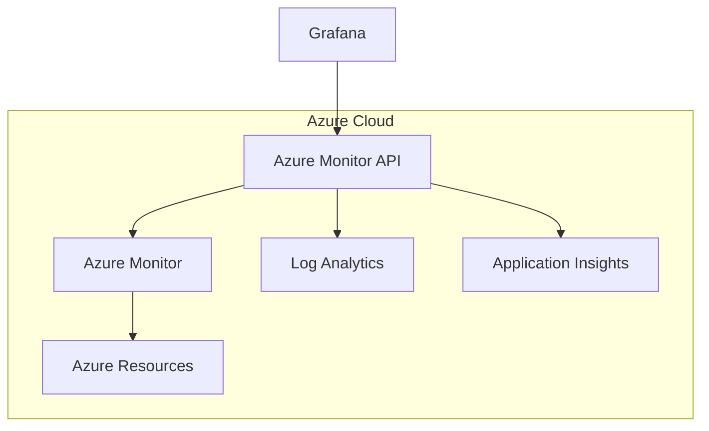

# Azure Monitor Data Source

## Introduction

Azure Monitor is Microsoft's cloud-based monitoring service that provides a comprehensive solution for collecting, analyzing, and responding to telemetry data from your Azure resources. The Azure Monitor data source in Grafana allows you to visualize and analyze metrics, logs, and traces from your Azure services directly within your Grafana dashboards.

This integration is particularly powerful as it enables you to:

- Monitor Azure services alongside other data sources in unified dashboards
- Set up alerts based on Azure Monitor metrics
- Query data across Azure Monitor, Azure Log Analytics, and Application Insights
- Visualize cloud resource performance in real-time

## Prerequisites

Before you begin, ensure you have:

- A Grafana instance (version 8.0 or later recommended)
- An Azure subscription
- Appropriate permissions to access Azure Monitor data

## Setting Up the Azure Monitor Data Source

### Step 1: Create an Azure AD Application

First, you'll need to register an application in Azure Active Directory to authenticate Grafana:

1. Navigate to Azure Portal > Azure Active Directory > App registrations
2. Click "New registration"
3. Name your application (e.g., "Grafana")
4. Set the redirect URI to `https://your-grafana-instance/login/azuremonitor`
5. Click "Register"

After registration, note down:
- Application (client) ID
- Directory (tenant) ID

### Step 2: Configure API Permissions

1. In your registered app, go to "API permissions"
2. Add permissions:
   - For Azure Monitor: `Microsoft.Azure.Monitor/read`
   - For Log Analytics: `user_impersonation` on Log Analytics API
3. Grant admin consent for the permissions

### Step 3: Create Client Secret

1. Go to "Certificates & secrets"
2. Create a new client secret
3. Note down the secret value (you won't be able to see it again)

### Step 4: Configure Grafana

In Grafana, add a new data source:

1. Go to Configuration > Data Sources
2. Click "Add data source"
3. Search for and select "Azure Monitor"
4. Configure the data source with your Azure credentials:

```json
{
  "cloudName": "azuremonitor",
  "tenantId": "YOUR_TENANT_ID",
  "clientId": "YOUR_CLIENT_ID",
  "clientSecret": "YOUR_CLIENT_SECRET"
}
```

5. Click "Save & Test" to verify the connection

## Query Types

The Azure Monitor data source supports three query types:

### 1. Azure Monitor Metrics

Metrics are numerical values collected at regular intervals from your Azure resources. They help you understand how your systems are performing.

To query Azure Monitor metrics:

1. Select "Metrics" as the service
2. Choose your subscription
3. Select a resource group
4. Select a resource
5. Choose a metric namespace and metric name

```typescript
// Example query structure
const azureMonitorQuery = {
  subscription: "your-subscription-id",
  resourceGroup: "your-resource-group",
  resourceName: "your-vm-name",
  metricNamespace: "Microsoft.Compute/virtualMachines",
  metricName: "Percentage CPU",
  aggregation: "Average",
  timeGrain: "PT1M" // ISO 8601 duration format
};
```

### 2. Azure Log Analytics

Log Analytics allows you to query and analyze log data from your Azure resources using Kusto Query Language (KQL).

To query Log Analytics:

1. Select "Logs" as the service
2. Choose your Log Analytics workspace
3. Write your KQL query

```kql
// Example KQL query for Log Analytics
// Get CPU usage for VMs
Perf
| where ObjectName == "Processor" and CounterName == "% Processor Time"
| where TimeGenerated >= ago(1h)
| summarize avg(CounterValue) by Computer, bin(TimeGenerated, 5m)
| render timechart
```

### 3. Application Insights

Application Insights helps you monitor your live applications, detecting performance anomalies and issues.

To query Application Insights:

1. Select "Application Insights" as the service
2. Choose your Application Insights resource
3. Write your query using either:
   - Metrics explorer (for predefined metrics)
   - Analytics (using KQL)

```kql
// Example Application Insights query
// Track page load time
requests
| where timestamp >= ago(24h)
| where name == "GET /home"
| summarize avg(duration) by bin(timestamp, 1h)
```

## Template Variables

Template variables make your dashboards more dynamic and reusable. With Azure Monitor, you can create variables for:

- Subscriptions
- Resource Groups
- Resources
- Metric Namespaces
- Metric Names

Example template variable setup:

1. Go to dashboard settings > Variables > New
2. Create a variable for subscriptions:
   - Name: `subscription`
   - Type: "Azure Monitor"
   - Resource: "Subscriptions"

2. Create a dependent variable for resource groups:
   - Name: `resourceGroup`
   - Type: "Azure Monitor"
   - Resource: "Resource Groups"
   - Subscription: `$subscription`

This creates a cascading selection in your dashboard.

## Creating a Comprehensive Azure Monitor Dashboard

Let's build a simple dashboard to monitor an Azure VM:

### Step 1: Create the Dashboard

1. Create a new dashboard
2. Add template variables for subscription, resource group, and VM name

### Step 2: Add CPU and Memory Panels

1. Add a new panel
2. Configure the Azure Monitor query:
   - Service: Metrics
   - Subscription: `$subscription`
   - Resource Group: `$resourceGroup`
   - Resource: `$vm`
   - Metric Namespace: "Microsoft.Compute/virtualMachines"
   - Metric: "Percentage CPU"
   - Aggregation: Average
   - Time Grain: Auto

3. Add another panel for memory:
   - Similar configuration but select "Available Memory Bytes" metric

### Step 3: Add Network Panels

1. Add panels for network metrics:
   - Network In Total
   - Network Out Total

### Step 4: Add Log Analytics Panel

1. Add a panel with a Log Analytics query:

```kql
// VM errors in the last 24 hours
Event
| where Computer == "$vm"
| where EventLevelName == "Error"
| summarize count() by Source
| sort by count_ desc
```

## Advanced Configuration: Query Optimization

Azure Monitor can generate large volumes of data. To optimize your queries:

1. Use appropriate time grains to reduce data points
2. Apply aggregation functions (avg, min, max, sum)
3. Limit the time range of your queries
4. Use efficient KQL patterns

Example optimized KQL query:

```kql
// Before optimization
Perf
| where TimeGenerated >= ago(7d)
| where ObjectName == "Processor" and CounterName == "% Processor Time"
| project TimeGenerated, CounterValue, Computer

// After optimization
Perf
| where TimeGenerated >= ago(7d)
| where ObjectName == "Processor" and CounterName == "% Processor Time"
| summarize avg(CounterValue) by Computer, bin(TimeGenerated, 15m)
| project TimeGenerated, AvgCPU=avg_CounterValue, Computer
```

## Visualizing Azure Monitor Architecture

The following diagram shows how Grafana interfaces with Azure Monitor:



## Troubleshooting Common Issues

### Authentication Failures

If you encounter "Unauthorized" errors:
1. Verify client ID and secret are correct
2. Check that API permissions are properly assigned
3. Ensure admin consent has been granted

### Query Timeouts

For query timeout issues:
1. Reduce the time range of your query
2. Add more specific filters
3. Increase the time grain to reduce data points

### Missing Metrics

If metrics aren't appearing:
1. Verify the resource is emitting the metrics you're querying
2. Check if the metrics require enabling diagnostic settings
3. Ensure the time range includes periods when the metrics were emitted

## Summary

The Azure Monitor data source for Grafana provides a powerful way to visualize and analyze your Azure infrastructure and applications. By following the steps in this guide, you can:

- Configure the Azure Monitor data source in Grafana
- Query metrics from Azure Monitor
- Analyze logs using Log Analytics and Application Insights
- Create dynamic dashboards with template variables
- Optimize your queries for better performance

With this integration, you can build comprehensive monitoring solutions that combine data from Azure and other systems in a single pane of glass.

## Additional Resources

- [Grafana Azure Monitor Documentation](https://grafana.com/docs/grafana/latest/datasources/azuremonitor/)
- [Azure Monitor Documentation](https://docs.microsoft.com/en-us/azure/azure-monitor/)
- [Kusto Query Language (KQL) Reference](https://docs.microsoft.com/en-us/azure/data-explorer/kusto/query/)

## Exercises

1. Set up the Azure Monitor data source in your Grafana instance.
2. Create a dashboard that monitors CPU, memory, and disk usage for an Azure VM.
3. Create a Log Analytics query that tracks failed login attempts on your Azure resources.
4. Build a dashboard with template variables for different Azure regions to compare performance.
5. Create a dashboard that combines Azure Monitor metrics with metrics from another data source (like Prometheus).