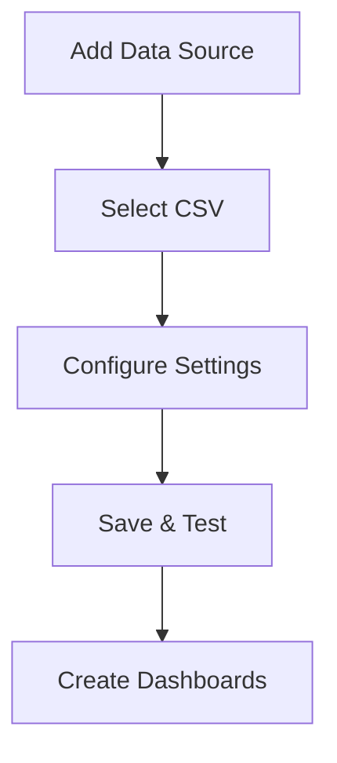

# CSV Data Source

## Introduction

The CSV (Comma-Separated Values) data source in Grafana allows you to use CSV files to visualize and analyze data. This is particularly useful when you have data that isn't stored in a traditional database or when you want to quickly prototype dashboards with existing CSV data exports.

CSV files are a simple and widely used format for storing tabular data. They're lightweight, easy to create, and compatible with most spreadsheet applications, making them an excellent choice for beginners working with Grafana.

## Understanding CSV Data Format

Before diving into Grafana integration, let's understand what a CSV file actually is:

- A CSV file is a plain text file where data is organized in rows and columns
- Values are separated by commas (or sometimes other delimiters like semicolons or tabs)
- Each line in the file represents a row of data
- The first row often contains column headers

Here's a simple example of CSV data:

```
timestamp,temperature,humidity
2023-01-01 00:00:00,22.5,45
2023-01-01 01:00:00,22.3,46
2023-01-01 02:00:00,22.1,48
2023-01-01 03:00:00,21.8,49
```

## Setting Up CSV Data Source in Grafana

Grafana doesn't include a native CSV data source plugin in its core installation. However, you can add this functionality through community plugins. Let's walk through the process:

### Installing the CSV Data Source Plugin

1. Navigate to Grafana's plugin page: Configuration → Plugins
2. Search for "CSV" or "CSV Datasource"
3. Click on the plugin and select "Install"
4. Restart your Grafana server if required

Alternatively, you can install the plugin using the Grafana CLI:

```bash
grafana-cli plugins install marcusolsson-csv-datasource
```

### Configuring the CSV Data Source

Once installed, you can add a new CSV data source:

1. Go to Configuration → Data Sources
2. Click "Add data source"
3. Search for and select "CSV"
4. Configure the data source:



The configuration page will have several options:

- **Name**: A friendly name for your data source
- **URL**: The path to your CSV file (can be a local path or URL)
- **Delimiter**: The character used to separate values (usually comma)
- **Header**: Whether your CSV file includes a header row

## Querying CSV Data

Once you've set up your CSV data source, you can start creating visualizations:

1. Create a new dashboard or panel
2. Select your CSV data source
3. Use the query editor to select columns and apply transformations

### Basic Query Example

Let's say we have a CSV file with weather data and want to visualize temperature trends:

```
timestamp,temperature,humidity,pressure
2023-01-01 00:00:00,22.5,45,1013
2023-01-01 01:00:00,22.3,46,1012
2023-01-01 02:00:00,22.1,48,1012
2023-01-01 03:00:00,21.8,49,1011
```

In the query editor:
1. Select `timestamp` as the time column
2. Select `temperature` as the value column
3. Choose a visualization type (like Graph)

### Advanced CSV Features

The CSV data source plugin typically offers several advanced features:

- **Caching**: Improve performance by caching parsed data
- **Auto-refresh**: Set how often Grafana should refresh the data
- **Column types**: Specify data types for columns (string, number, time)
- **Transformations**: Apply transformations to your data before visualization

## Practical Examples

### Example 1: Monitoring IoT Sensor Data

Imagine you have IoT temperature sensors exporting data to CSV files. You can create a Grafana dashboard to monitor these sensors:

```
timestamp,sensor_id,temperature,battery
2023-01-01 12:00:00,sensor1,24.5,92
2023-01-01 12:00:00,sensor2,22.1,87
2023-01-01 12:30:00,sensor1,24.7,91
2023-01-01 12:30:00,sensor2,22.3,86
```

To create a multi-sensor temperature dashboard:
1. Create a new panel
2. Use the query editor to select `timestamp` as the time column
3. Choose `temperature` as the value column
4. Add a filter for `sensor_id`
5. Select a Graph visualization
6. Repeat the panel for each sensor

### Example 2: Analyzing Website Analytics

If you have website analytics exported as CSV, you can visualize traffic patterns:

```
date,page_views,unique_visitors,bounce_rate
2023-01-01,1245,876,45.2
2023-01-02,1342,932,43.8
2023-01-03,1456,1021,41.5
2023-01-04,1201,876,46.7
```

To create an analytics dashboard:
1. Create multiple panels for different metrics
2. For each panel, select the appropriate columns
3. Use different visualizations (graphs for trends, gauges for current values)
4. Add annotations for important events

## Best Practices for Using CSV Data Source

For the best experience with CSV data in Grafana, follow these practices:

1. **Format your data properly**:
   - Use consistent date formats
   - Ensure numeric data doesn't contain unexpected characters
   - Use headers with clear names

2. **Optimize for performance**:
   - Keep CSV files reasonably sized
   - Use data aggregation for large datasets
   - Consider pre-processing very large files

3. **Regular updates**:
   - Set up automated processes to update CSV files if they contain live data
   - Use appropriate auto-refresh settings in Grafana

4. **Security considerations**:
   - Be careful with file permissions if using local CSV files
   - For HTTP sources, consider authentication needs

## Limitations of CSV Data Source

While convenient, the CSV data source has some limitations:

- **Performance**: Not suitable for very large datasets
- **Real-time data**: Less ideal for data that updates frequently
- **Complex queries**: Limited query capabilities compared to databases
- **Data types**: May require manual type conversion for certain visualizations

## Alternative Approaches

If you find the CSV data source limiting, consider these alternatives:

1. **CSV to Database Import**: Import your CSV data into a database like MySQL or PostgreSQL
2. **Spreadsheet Data Source**: Use Google Sheets or Excel as a data source
3. **Static JSON**: Convert CSV to static JSON files
4. **CSV API Proxy**: Create a simple API that reads and transforms CSV data

## Summary

The CSV data source offers a straightforward way to visualize data from CSV files in Grafana. It's particularly useful for:

- Beginners who are just getting started with data visualization
- Prototyping dashboards before setting up a database
- Visualizing exported data from other systems
- Small to medium-sized datasets that don't change frequently

While it has some limitations compared to database data sources, the CSV data source provides an accessible entry point to Grafana's powerful visualization capabilities.

## Additional Resources

To further enhance your knowledge of using CSV data with Grafana:

- Read the [official plugin documentation](https://grafana.com/grafana/plugins/marcusolsson-csv-datasource/)
- Explore sample CSV datasets on platforms like Kaggle
- Practice creating various visualization types with your own CSV data

## Exercises

1. Create a CSV file with mock temperature data for a week and visualize it using line charts in Grafana.
2. Import a CSV export from a spreadsheet application and create a dashboard with multiple panels showing different aspects of the data.
3. Set up an automated process to update a CSV file and configure your Grafana dashboard to refresh automatically.
4. Compare the performance between a CSV data source and a database data source using the same dataset.