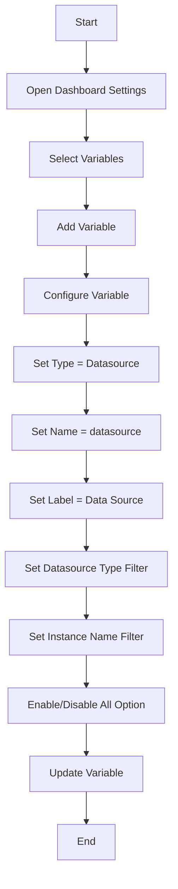

# Data Source Variables

## Introduction

Data source variables are a powerful feature in Grafana that allow you to dynamically switch between different data sources in your dashboards. Instead of creating separate panels or dashboards for each data source, you can create a single dashboard that works with multiple data sources by using variables.

This functionality is particularly useful when:
- You have multiple environments (development, staging, production)
- You want to compare data across different data sources
- You're migrating from one data source to another
- You need to create dashboards that work across different teams or projects

In this guide, we'll explore how to create and use data source variables effectively in your Grafana dashboards.

## Understanding Data Source Variables

A data source variable contains a list of your available data sources in Grafana. When you create a dashboard with a data source variable, users can select different data sources from a dropdown menu, and all panels will update to display data from the selected source.

### How Data Source Variables Work

Data source variables function by:
1. Querying the list of available data sources in your Grafana instance
2. Storing the selected data source in a variable
3. Using that variable in panel queries instead of a hardcoded data source

## Creating a Data Source Variable

Let's create a simple data source variable that will allow us to switch between different data sources:

1. Navigate to your dashboard and click the gear icon in the top right to open dashboard settings
2. Select "Variables" from the left menu
3. Click "Add variable" to create a new variable
4. Configure the variable with the following settings:

```
Name: datasource
Type: Datasource
Label: Data Source
Datasource Type: (Select the type you want to filter by, e.g., "Prometheus" or leave empty for all)
Instance name filter: (Optional regex to filter data sources)
Include All option: Yes
```

5. Click "Update" to save your variable

Here's how the configuration might look:



## Using Data Source Variables in Panels

Once you've created your data source variable, you can use it in your panel queries:

1. Edit a panel in your dashboard
2. In the query editor, click on the data source selector dropdown
3. Select "Variable" from the list (usually at the bottom)
4. Choose your data source variable (e.g., `$datasource`)

Now your panel will query the data source currently selected in the variable dropdown.

### Example: Using a Data Source Variable with Prometheus

Here's an example of using a data source variable with a Prometheus query:

```
// Without variable
// Query editor would have "Prometheus" selected as data source
rate(http_requests_total{job="api"}[5m])

// With variable
// Query editor would have "$datasource" selected as data source
rate(http_requests_total{job="api"}[5m])
```

The query itself doesn't change, but the data source it's sent to will depend on the user's selection in the dashboard.

## Advanced Usage: Filtering Data Source Types

You may want to limit the data source variable to specific types of data sources. For example, if your dashboard is designed to work with time series databases, you might want to filter for only Prometheus, InfluxDB, and Graphite data sources.

To do this, use the "Data source type" field when creating your variable. You can enter a specific type like "prometheus" or use a regex pattern to match multiple types:

```
prometheus|influxdb|graphite
```

This will restrict the variable dropdown to only show data sources of those types.

## Practical Example: Multi-Environment Dashboard

Let's create a practical example of a dashboard that monitors application performance across different environments.

### 1. Set Up Data Sources

First, ensure you have multiple data sources set up in Grafana, such as:
- prometheus-dev
- prometheus-staging
- prometheus-prod

### 2. Create a Data Source Variable

Create a data source variable as described earlier, but with these settings:

```
Name: environment
Type: Datasource
Label: Environment
Datasource Type: prometheus
Instance name filter: prometheus-.*
```

### 3. Create Dashboard Panels

Create panels that use the variable. For example, a panel showing CPU usage:

```
// Query using the environment variable as data source
avg by (instance) (rate(node_cpu_seconds_total{mode!="idle"}[5m])) * 100
```

### 4. Test the Dashboard

Now, when users visit your dashboard, they can select different environments from the dropdown, and all panels will update to show data from the selected environment's Prometheus instance.

## Best Practices for Data Source Variables

To make the most of data source variables, follow these best practices:

1. **Use Descriptive Names**: Choose clear variable names that indicate what they represent
2. **Set Default Values**: Configure default selections that make sense for most users
3. **Apply Consistent Naming**: Use a consistent naming convention for your data sources to make filtering easier
4. **Document Usage**: Add dashboard annotations or text panels explaining how to use the variables
5. **Test Compatibility**: Ensure that all panels work correctly with all selectable data sources
6. **Combine with Other Variables**: Use data source variables alongside query variables for even more dynamic dashboards

## Common Issues and Troubleshooting

### Panel Shows "No Data" After Switching Data Sources

This typically happens when:
- The query is incompatible with the selected data source
- The metrics don't exist in the selected data source
- The time range doesn't contain data in the selected data source

**Solution**: Create panels with queries that work across all your data sources, or use template variables to adjust the query based on the selected data source.

### Variable Dropdown Shows Unexpected Data Sources

If your variable dropdown shows data sources you didn't expect:

**Solution**: Refine your "Instance name filter" or "Data source type" filter to be more specific.

## Summary

Data source variables are a powerful feature in Grafana that allow you to create flexible, reusable dashboards that work with multiple data sources. By understanding how to create and use these variables effectively, you can:

- Build more versatile dashboards
- Reduce dashboard maintenance
- Enable easy comparison between different environments
- Create a better experience for your dashboard users

With the knowledge and examples provided in this guide, you should be able to implement data source variables in your own Grafana dashboards and take advantage of their flexibility.

## Additional Resources

To further expand your knowledge on Grafana variables:

- Explore other variable types like query variables, custom variables, and interval variables
- Learn about variable formats and how they can transform your variable values
- Investigate chained variables, where one variable's options depend on another variable's value

## Exercises

1. Create a dashboard with a data source variable that allows switching between Prometheus and InfluxDB
2. Build a dashboard that uses a data source variable to compare the same metrics across different environments
3. Combine a data source variable with a query variable to create a fully dynamic dashboard
4. Create a dashboard that changes its visualization type based on the selected data source