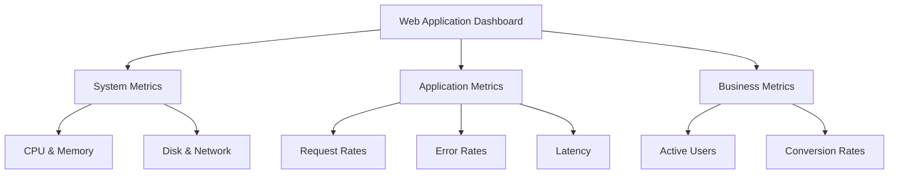

# Prometheus Data Source

## Introduction

Prometheus has become the de facto standard for metrics collection in cloud-native environments. When combined with Grafana's powerful visualization capabilities, it creates a robust monitoring solution for your applications and infrastructure.

In this guide, we'll explore how to set up Prometheus as a data source in Grafana, how to query metrics using PromQL (Prometheus Query Language), and how to build effective dashboards to visualize your data.

## What is Prometheus?

Prometheus is an open-source monitoring and alerting toolkit designed for reliability and scalability. Key features include:

- A multi-dimensional data model with time series data identified by metric name and key-value pairs
- A flexible query language (PromQL) to leverage this dimensionality
- Time series collection happens via a pull model over HTTP
- Targets can be discovered via service discovery or static configuration
- Multiple modes of graphing and dashboarding support

## Configuring Prometheus as a Data Source

### Prerequisites

Before you begin, ensure you have:
- A running Grafana instance (v7.0 or later recommended)
- A running Prometheus server with metrics

### Adding Prometheus Data Source

1. Log in to your Grafana instance
2. Navigate to Configuration > Data Sources
3. Click "Add data source"
4. Select "Prometheus" from the list

Here's how to configure the basic settings:

```
Name: Prometheus
Default: Toggle on if this is your primary data source
URL: http://your-prometheus-server:9090
Access: Server (default)
```

### Advanced Configuration Options

For more complex setups, you can configure:

- **Scrape interval**: Set this to match your Prometheus scrape interval (usually 15s)
- **Query timeout**: Maximum time for query execution (60s by default)
- **HTTP Method**: GET or POST (POST recommended for complex queries)
- **Authentication**: Basic auth, TLS client authentication, or custom headers

## Querying Prometheus in Grafana

### Understanding PromQL Basics

PromQL is the query language used to retrieve and manipulate time series data from Prometheus. Here are the fundamental concepts:

1. **Instant vectors**: A set of time series containing a single sample for each time series, all sharing the same timestamp
2. **Range vectors**: A set of time series containing a range of data points over time
3. **Scalar**: A simple numeric floating point value
4. **String**: A simple string value (currently unused)

### Simple Query Examples

Let's start with basic examples:

1. Return all time series with the metric name `http_requests_total`:
```
http_requests_total
```

2. Return all time series with the metric name `http_requests_total` and the `job` label set to `api-server`:
```
http_requests_total{job="api-server"}
```

3. Return the rate of HTTP requests per second over the last 5 minutes:
```
rate(http_requests_total[5m])
```

### Advanced Query Examples

Let's explore some more advanced queries:

1. Get the top 5 application instances by memory usage:
```
topk(5, sum(container_memory_usage_bytes) by (instance))
```

2. Calculate the 95th percentile request latency across all services:
```
histogram_quantile(0.95, sum(rate(http_request_duration_seconds_bucket[5m])) by (le))
```

3. Calculate the percentage of HTTP errors (status code >= 500):
```
sum(rate(http_requests_total{status=~"5.."}[5m])) / sum(rate(http_requests_total[5m])) * 100
```

## Creating Effective Dashboards

### Basic Dashboard Creation

To create a new dashboard:

1. Click "Create" > "Dashboard" in the Grafana sidebar
2. Click "Add new panel"
3. Select "Prometheus" as the data source
4. Enter your PromQL query in the query editor
5. Configure visualization options (Graph, Gauge, Table, etc.)
6. Click "Save" to add the panel to your dashboard

### Visualization Types for Prometheus Data

Here are recommended visualization types for different metrics:

- **Time Series**: Ideal for trends over time (CPU usage, request rates)
- **Gauge**: Perfect for single-value metrics (current memory usage percentage)
- **Stat**: Good for current values with thresholds (error rates, health statuses)
- **Bar Gauge**: Useful for comparing multiple instances (disk usage across servers)
- **Heatmap**: Excellent for distribution metrics (request duration histogram)

### Template Variables

Template variables make your dashboards dynamic and reusable. Here's how to create them:

1. Go to Dashboard settings > Variables > Add variable
2. Set Name: `instance`
3. Type: Query
4. Data source: Prometheus
5. Query: `label_values(up, instance)`
6. Enable "Multi-value" and "Include All option"

Now you can use this in your queries:
```
http_requests_total{instance=~"$instance"}
```

This allows users to select different instances from a dropdown in your dashboard.

## Real-World Examples

### Monitoring a Web Application

Let's create a comprehensive dashboard for monitoring a web application:



For this dashboard, we'd create panels with these queries:

1. **CPU Usage**:
```
100 - (avg by (instance) (rate(node_cpu_seconds_total{mode="idle"}[1m])) * 100)
```

2. **Memory Usage**:
```
node_memory_MemTotal_bytes - node_memory_MemAvailable_bytes
```

3. **Request Rate**:
```
sum(rate(http_requests_total[5m])) by (route)
```

4. **Error Rate**:
```
sum(rate(http_requests_total{status=~"5.."}[5m])) / sum(rate(http_requests_total[5m])) * 100
```

5. **Latency (95th percentile)**:
```
histogram_quantile(0.95, sum(rate(http_request_duration_seconds_bucket[5m])) by (le))
```

### Infrastructure Monitoring

For Kubernetes infrastructure monitoring, you might create these panels:

1. **Node CPU Usage**:
```
sum(rate(container_cpu_usage_seconds_total{container!="POD",container!=""}[5m])) by (node)
```

2. **Pod Memory Usage by Namespace**:
```
sum(container_memory_usage_bytes{container!="POD",container!=""}) by (namespace)
```

3. **Available Pods per Deployment**:
```
kube_deployment_status_replicas_available
```

## Best Practices

### Effective Query Patterns

1. **Use rate() for counters**: Always wrap counters with rate() or increase() functions.
```
rate(http_requests_total[5m])  # Good
http_requests_total  # Bad - raw counter
```

2. **Be specific with labels**: Target exactly what you need.
```
http_requests_total{status="500"}  # Good
http_requests_total  # May be too broad
```

3. **Be careful with expensive operations**: Operations like `topk()` and `bottomk()` can be resource-intensive.

### Alerting Based on Prometheus Metrics

Grafana allows you to set up alerts based on your Prometheus metrics:

1. Edit a panel and navigate to the "Alert" tab
2. Define a condition based on your query
3. Set evaluation intervals and notification channels

Example alert rule for high error rate:
- Condition: WHEN last() OF query(A) > 5
- Evaluation: Every 1m, For 5m
- This triggers when the error rate exceeds 5% for 5 consecutive minutes

### Dashboard Organization

- Group related panels together
- Use row collapsing for logical sections
- Include documentation panels with markdown
- Use consistent naming conventions
- Set appropriate refresh intervals (not too frequent)

## Troubleshooting Common Issues

### Query Returns No Data

Possible causes and solutions:
- **Metric doesn't exist**: Verify in Prometheus UI directly
- **Label mismatch**: Check exact label names and values
- **Time range issue**: Adjust the time range in Grafana

### High Cardinality Problems

High cardinality (too many unique time series) can cause performance issues:
- Avoid using high cardinality labels in grouping
- Use `topk()` or `bottomk()` to limit returned series
- Consider using recording rules in Prometheus for complex queries

### Connectivity Issues

If Grafana can't connect to Prometheus:
- Verify the Prometheus URL is correct
- Check network connectivity between Grafana and Prometheus
- Ensure any required authentication is configured
- Review Grafana server logs for specific errors

## Summary

Prometheus is a powerful data source for Grafana that enables comprehensive monitoring of your applications and infrastructure. By understanding PromQL and leveraging Grafana's visualization capabilities, you can create insightful dashboards that help maintain the health and performance of your systems.

Key takeaways:
- Prometheus excels at storing and querying time-series metrics
- PromQL provides a flexible way to manipulate and analyze your data
- Grafana offers diverse visualization options tailored to different metric types
- Template variables create dynamic, reusable dashboards
- Following best practices ensures efficient and effective monitoring

## Additional Resources

- [Prometheus Documentation](https://prometheus.io/docs/introduction/overview/)
- [PromQL Cheat Sheet](https://promlabs.com/promql-cheat-sheet/)
- [Grafana Prometheus Data Source Documentation](https://grafana.com/docs/grafana/latest/datasources/prometheus/)
- [Awesome Prometheus Alerts](https://awesome-prometheus-alerts.grep.to/)

## Exercises

1. **Basic Setup**: Install Prometheus and Grafana locally, then add Prometheus as a data source.

2. **Query Practice**: Create queries to monitor:
   - System load average over time
   - Memory usage percentage
   - Disk space utilization

3. **Dashboard Challenge**: Create a dashboard with at least 5 panels showing different aspects of system performance.

4. **Advanced PromQL**: Write a query that shows the ratio of errors to total requests for each service in your application.

5. **Alert Creation**: Create an alert that triggers when any instance's CPU usage exceeds 80% for more than 5 minutes.