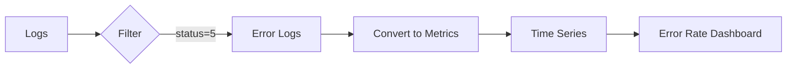
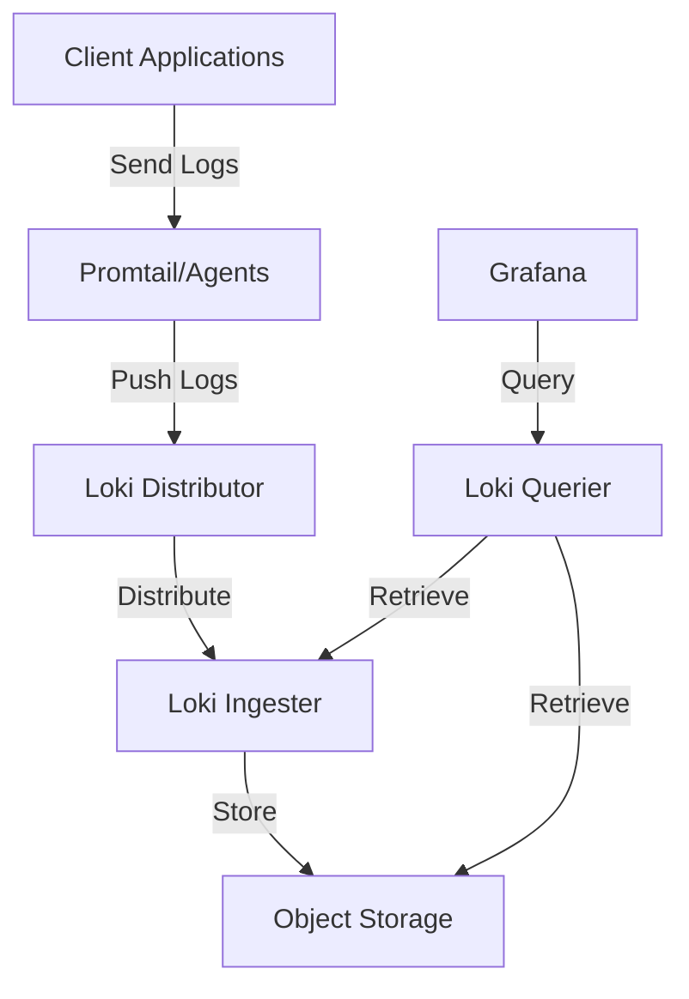

# Loki Data Source

## Introduction

Grafana Loki is a horizontally-scalable, highly-available, multi-tenant log aggregation system designed to be cost-effective and easy to operate. Unlike other logging solutions, Loki indexes metadata about your logs rather than the full text, making it more efficient and cost-effective for storing and querying large volumes of log data.

In this guide, we'll explore how to:
- Configure Loki as a data source in Grafana
- Write LogQL queries to explore your log data
- Visualize and analyze logs effectively
- Implement best practices for log monitoring

## What is Loki?

Loki is Grafana Labs' log aggregation system inspired by Prometheus. It's designed with the following principles:

- **Index labels, not content**: Loki indexes metadata (labels) attached to your logs rather than the full text content, which makes it more efficient.
- **Familiar query language**: LogQL, Loki's query language, is inspired by PromQL (Prometheus Query Language), making it easier to learn if you're already familiar with Prometheus.
- **Cost-effective**: By indexing metadata instead of full text, Loki requires fewer resources and is less expensive to operate at scale.

## Adding Loki as a Data Source in Grafana

Adding Loki as a data source in Grafana is straightforward:

1. Log in to your Grafana instance
2. Navigate to Configuration > Data sources
3. Click "Add data source"
4. Search for and select "Loki"
5. Configure the connection details:

```
Name: Loki
URL: http://loki:3100
```

6. Click "Save & Test" to verify the connection

### Configuration Options

Loki provides several configuration options:

- **HTTP**: Basic connection settings, including URL and access mode
- **Auth**: Authentication options for secure Loki instances
- **Alert manager**: Settings for alert notification handling
- **Derived fields**: Create links from log fields to other data sources

## Understanding LogQL

LogQL is Loki's query language, designed to be similar to PromQL. LogQL consists of two parts:

1. **Log stream selector**: Selects which log streams to query
2. **Filter expression**: Optional filters to refine the results

### Basic Log Queries

Let's start with a simple query to fetch logs from a service called "frontend":

```
{app="frontend"}
```

This query returns all logs with the label `app` equal to "frontend".

To filter logs containing errors:

```
{app="frontend"} |= "error"
```

The pipe operator (`|=`) filters logs that contain the word "error".

### Advanced Filtering

LogQL supports several filtering operators:

- `|=`: Contains string (case-insensitive)
- `!=`: Does not contain string (case-insensitive)
- `|~`: Contains match for regular expression (case-insensitive)
- `!~`: Does not contain match for regular expression (case-insensitive)

Example of regex filtering:

```
{app="frontend"} |~ "error|warning|critical"
```

This query returns logs containing "error", "warning", or "critical".

### Extracting and Creating Metrics

LogQL can extract and process numeric values from logs, converting them into metrics:

```
sum(rate({app="frontend"} |= "request_duration" | regexp `request_duration=(?P<duration>[0-9]+)` | unwrap duration [1m])) by (route)
```

This query:
1. Finds logs containing "request_duration"
2. Extracts the numeric duration using a regular expression
3. Processes this as a metric using `unwrap`
4. Calculates the rate over 1 minute
5. Groups results by route

## Practical Examples

### Example 1: Monitoring HTTP Error Rates

To monitor the rate of HTTP 500 errors across your services:

```
sum(rate({app=~"frontend|backend|api"} |= "status=5" [5m])) by (app)
```

You can visualize this query in a time series panel to track error rates over time:



### Example 2: Creating a Log Dashboard

Let's create a practical dashboard for monitoring application logs:

1. **Log Volume Panel**: Track total log volume trends
   ```
   sum(count_over_time({app=~"frontend|backend|api"}[1h])) by (app)
   ```

2. **Error Log Panel**: Display recent error logs
   ```
   {app=~"frontend|backend|api"} |= "error" | logfmt
   ```

3. **Slow Request Panel**: Identify slow API requests
   ```
   {app="api"} | json | duration > 1000
   ```

### Example 3: Correlating Logs with Metrics

A powerful feature of Grafana is the ability to correlate logs with metrics:

1. Create a dashboard with both Prometheus metrics and Loki logs
2. Set up a dashboard variable for service name:
   ```
   $service
   ```
3. Use this variable in both metric and log queries:
   ```
   // Prometheus query
   sum(rate(http_requests_total{service="$service"}[5m])) by (status_code)
   
   // Loki query
   {service="$service"}
   ```

This allows you to visualize metrics and explore related logs in a single dashboard.

## Parsing Log Formats

Loki has built-in parsers for common log formats:

### JSON Logs

For logs in JSON format:

```
{app="frontend"} | json | response_time > 100
```

This extracts fields from JSON-formatted logs and filters for response times greater than 100ms.

### Logfmt

For logs in logfmt format (key=value pairs):

```
{app="backend"} | logfmt | level="error" | line_format "{{.message}}"
```

This extracts fields from logfmt-formatted logs, filters for error levels, and formats the output to show only the message.

## Best Practices for Using Loki

### 1. Label Strategy

Choose your labels carefully:
- Use a limited set of high-value labels (ideally < 10)
- Avoid high-cardinality labels (like user IDs, request IDs)
- Use consistent label naming across systems

```
// Good labeling
{app="payment-service", environment="production", component="api"}

// Bad labeling (high cardinality)
{app="payment-service", request_id="a1b2c3d4", user_id="12345"}
```

### 2. Query Optimization

- Narrow time ranges when possible
- Use label selectors before text filters
- Avoid regular expressions for simple string matches

### 3. Setting Up Log Alerting

Create alerts based on log patterns:

```
sum(rate({app="payment-service"} |= "transaction failed" [5m])) > 5
```

This alert triggers if more than 5 failed transactions are logged per minute.

## Loki Architecture Overview

Loki consists of several components:



- **Promtail**: Agent that ships logs to Loki
- **Distributor**: Receives and distributes incoming logs
- **Ingester**: Processes log streams and builds chunks
- **Querier**: Handles queries from Grafana
- **Storage**: Stores compressed log chunks (typically object storage)

## Setting Up Promtail to Ship Logs

Promtail is the agent responsible for shipping logs to Loki:

```yaml
server:
  http_listen_port: 9080

positions:
  filename: /tmp/positions.yaml

clients:
  - url: http://loki:3100/loki/api/v1/push

scrape_configs:
  - job_name: system
    static_configs:
    - targets:
        - localhost
      labels:
        job: varlogs
        __path__: /var/log/*log
```

This configuration:
1. Sets up Promtail to listen on port 9080
2. Configures it to send logs to Loki at the specified URL
3. Collects logs from `/var/log/*log` and labels them with the job "varlogs"

## Summary

Grafana Loki offers a powerful, cost-effective solution for log aggregation and analysis. In this guide, we've covered:

- Configuring Loki as a data source in Grafana
- Writing and optimizing LogQL queries
- Parsing different log formats
- Creating practical log monitoring dashboards
- Best practices for effective log management

By using Loki alongside other Grafana data sources, you can create comprehensive observability solutions that combine metrics, logs, and traces for complete system monitoring.

## Additional Resources

Here are some exercises to help you practice using Loki:

1. Set up a local Loki instance with Promtail and send application logs to it
2. Create a dashboard showing error rates and log volumes for your application
3. Write LogQL queries to extract and visualize specific metrics from your logs
4. Configure alerting based on log patterns indicating potential issues
5. Explore ways to correlate your logs with metrics from Prometheus

For further learning, explore the official Grafana Loki documentation and community forums to stay updated on best practices and new features.