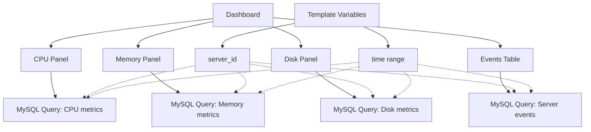

# MySQL Data Source

## Introduction

MySQL is one of the most popular open-source relational database management systems, powering millions of applications worldwide. When combined with Grafana's visualization capabilities, MySQL becomes a powerful data source for creating insightful dashboards and monitoring solutions.

In this guide, you'll learn how to:
- Configure MySQL as a data source in Grafana
- Write effective MySQL queries for visualization
- Optimize your MySQL queries for performance
- Create practical dashboards using MySQL data

Whether you're monitoring application performance, analyzing business metrics, or visualizing IoT data stored in MySQL, this guide will help you unlock the full potential of your MySQL data through Grafana.

## Prerequisites

Before you begin, ensure you have:
- A running Grafana instance (v7.0 or later recommended)
- A MySQL database (v5.7 or later recommended)
- Network connectivity between Grafana and your MySQL server
- MySQL user credentials with appropriate permissions

## Adding MySQL as a Data Source

### Step 1: Access Data Sources Configuration

1. Log in to your Grafana instance with admin privileges
2. Navigate to **Configuration** → **Data Sources** in the side menu
3. Click on the **Add data source** button

### Step 2: Select and Configure MySQL

1. Search for "MySQL" in the list of available data sources
2. Click on the MySQL option to configure it

When configuring the MySQL data source, you'll need to provide the following information:

```
Name: [Your preferred name for this data source]
Host: [MySQL server address]:[port] (default port is 3306)
Database: [Your database name]
User: [MySQL username]
Password: [MySQL password]
TLS/SSL Mode: [Select appropriate mode based on your setup]
```

### Step 3: Test and Save the Connection

After entering the required information, click the **Save & Test** button at the bottom of the page. Grafana will attempt to connect to your MySQL server and verify the connection.

If successful, you'll see a green "Database Connection OK" message. If not, check your connection details and ensure your MySQL server is accessible from Grafana.

## Understanding MySQL Query Structure in Grafana

Grafana's MySQL data source allows you to write standard SQL queries with some Grafana-specific extensions for time series visualization.

### Basic Query Structure

A basic MySQL query in Grafana looks like this:

```sql
SELECT
  $__timeColumnName as time_column,
  value_column,
  other_column
FROM
  your_table
WHERE
  $__timeFilter(time_column)
ORDER BY
  time_column ASC
```

### Important Grafana Macros for MySQL

Grafana provides several macros to make time-series queries easier:

| Macro | Description |
| ----- | ----------- |
| `$__timeFilter(column)` | Adds a WHERE condition for the time range selected in the dashboard |
| `$__timeFrom()` | Returns the start of the current dashboard time selection |
| `$__timeTo()` | Returns the end of the current dashboard time selection |
| `$__timeGroup(column, interval)` | Groups time-based data by the specified interval |
| `$__timeEpoch(column)` | Converts a DATETIME column to Unix timestamp (seconds since 1970) |

## Creating Your First MySQL Query

Let's create a simple query to visualize data from a MySQL table:

### Example 1: Visualizing Server CPU Usage

Assume you have a `server_metrics` table with the following structure:

```sql
CREATE TABLE server_metrics (
  timestamp DATETIME NOT NULL,
  server_id VARCHAR(50) NOT NULL,
  cpu_usage FLOAT NOT NULL,
  memory_usage FLOAT NOT NULL,
  disk_usage FLOAT NOT NULL,
  PRIMARY KEY (timestamp, server_id)
);
```

A query to visualize CPU usage over time would look like:

```sql
SELECT
  timestamp AS time,
  server_id,
  cpu_usage
FROM
  server_metrics
WHERE
  $__timeFilter(timestamp)
  AND server_id IN ($server_id)
ORDER BY
  timestamp ASC
```

In this query:
- `$__timeFilter(timestamp)` automatically filters data based on dashboard time range
- `$server_id` is a dashboard variable that allows users to select specific servers

### Example 2: Aggregating Data by Time Intervals

To view average CPU usage grouped by hour:

```sql
SELECT
  $__timeGroup(timestamp, '1h') AS time,
  AVG(cpu_usage) AS avg_cpu,
  MAX(cpu_usage) AS max_cpu,
  server_id
FROM
  server_metrics
WHERE
  $__timeFilter(timestamp)
  AND server_id IN ($server_id)
GROUP BY
  time, server_id
ORDER BY
  time ASC
```

## Using Template Variables with MySQL

Template variables make your dashboards more interactive and reusable. Here's how to set them up:

### Creating a Server ID Variable

1. Navigate to dashboard settings
2. Select "Variables"
3. Click "Add variable"
4. Configure a new variable:

```
Name: server_id
Label: Server
Type: Query
Data source: Your MySQL data source
Query: SELECT DISTINCT server_id FROM server_metrics ORDER BY server_id
```

Now you can use `$server_id` in your queries, and users can select specific servers from a dropdown in the dashboard.

## Advanced MySQL Queries

### Calculating Rates of Change

To calculate the rate of change for a metric:

```sql
SELECT
  timestamp AS time,
  server_id,
  (cpu_usage - LAG(cpu_usage) OVER (PARTITION BY server_id ORDER BY timestamp)) / 
  TIMESTAMPDIFF(SECOND, LAG(timestamp) OVER (PARTITION BY server_id ORDER BY timestamp), timestamp) AS cpu_usage_rate
FROM
  server_metrics
WHERE
  $__timeFilter(timestamp)
  AND server_id IN ($server_id)
ORDER BY
  timestamp ASC
```

### Using Stored Procedures

You can also call MySQL stored procedures from Grafana:

```sql
CALL get_server_metrics($__timeFrom(), $__timeTo(), ${server_id:csv});
```

## Visualizing MySQL Data

Once you've written your queries, you can visualize the data using various panel types:

### Time Series Panel

Ideal for showing how metrics change over time. To use:

1. Create a new panel
2. Select your MySQL data source
3. Write your time series query
4. In the visualization tab, select "Time series"

### Table Panel

Great for showing detailed records:

1. Create a new panel
2. Select your MySQL data source
3. Write your query (can include multiple columns)
4. In the visualization tab, select "Table"

### Stat Panel

Perfect for showing single values:

```sql
SELECT
  AVG(cpu_usage) AS "Average CPU"
FROM
  server_metrics
WHERE
  $__timeFilter(timestamp)
  AND server_id IN ($server_id)
```

## Dashboard Example: Server Monitoring

Here's a complete example of a server monitoring dashboard:



## Performance Optimization Tips

When working with large MySQL datasets in Grafana, consider these optimization tips:

1. **Create appropriate indexes**:
   ```sql
   CREATE INDEX idx_timestamp ON server_metrics(timestamp);
   CREATE INDEX idx_server_timestamp ON server_metrics(server_id, timestamp);
   ```

2. **Limit the amount of data returned**:
   ```sql
   SELECT
     timestamp AS time,
     server_id,
     cpu_usage
   FROM
     server_metrics
   WHERE
     $__timeFilter(timestamp)
     AND server_id IN ($server_id)
   ORDER BY
     timestamp ASC
   LIMIT 10000
   ```

3. **Use pre-aggregated tables** for historical data:
   ```sql
   CREATE TABLE server_metrics_hourly (
     hour DATETIME NOT NULL,
     server_id VARCHAR(50) NOT NULL,
     avg_cpu FLOAT NOT NULL,
     max_cpu FLOAT NOT NULL,
     avg_memory FLOAT NOT NULL,
     max_memory FLOAT NOT NULL,
     PRIMARY KEY (hour, server_id)
   );
   ```

4. **Implement query timeouts** in your MySQL configuration

## Troubleshooting Common Issues

### Connection Problems

If you're having trouble connecting to MySQL:

1. Check if MySQL server is accessible from Grafana's network
2. Verify that the MySQL user has permissions to access the database:
   ```sql
   GRANT SELECT ON your_database.* TO 'grafana_user'@'%';
   FLUSH PRIVILEGES;
   ```
3. Ensure your MySQL user can connect from Grafana's IP address

### Query Timeout Issues

For slow queries:

1. Increase the query timeout in data source settings
2. Optimize your query with proper indexes
3. Limit the time range or add LIMIT clause
4. Consider pre-aggregating data for faster retrieval

## Real-World Application: E-commerce Analytics

Let's create a practical example for an e-commerce business:

Suppose you have the following tables:
- `orders` - Contains order information
- `order_items` - Contains individual items in orders
- `products` - Contains product details

You can create a dashboard to monitor:

1. **Sales Overview**:
   ```sql
   SELECT
     $__timeGroup(created_at, '1d') AS time,
     SUM(total_amount) AS daily_sales,
     COUNT(*) AS order_count
   FROM
     orders
   WHERE
     $__timeFilter(created_at)
     AND status = 'completed'
   GROUP BY
     time
   ORDER BY
     time ASC
   ```

2. **Top Selling Products**:
   ```sql
   SELECT
     p.name AS product_name,
     SUM(oi.quantity) AS units_sold,
     SUM(oi.quantity * oi.unit_price) AS revenue
   FROM
     order_items oi
   JOIN
     orders o ON oi.order_id = o.id
   JOIN
     products p ON oi.product_id = p.id
   WHERE
     $__timeFilter(o.created_at)
     AND o.status = 'completed'
   GROUP BY
     p.name
   ORDER BY
     units_sold DESC
   LIMIT 10
   ```

3. **Sales by Product Category**:
   ```sql
   SELECT
     p.category,
     SUM(oi.quantity * oi.unit_price) AS revenue
   FROM
     order_items oi
   JOIN
     orders o ON oi.order_id = o.id
   JOIN
     products p ON oi.product_id = p.id
   WHERE
     $__timeFilter(o.created_at)
     AND o.status = 'completed'
   GROUP BY
     p.category
   ORDER BY
     revenue DESC
   ```

## Summary

In this guide, you've learned how to:

1. Configure MySQL as a data source in Grafana
2. Write basic and advanced MySQL queries for visualization
3. Use Grafana-specific features like macros and template variables
4. Optimize MySQL queries for better performance
5. Create practical dashboards for real-world scenarios

MySQL combined with Grafana provides a powerful platform for data visualization and analysis. By following the best practices outlined in this guide, you can create insightful dashboards that help you make data-driven decisions.

## Additional Resources

To further enhance your Grafana and MySQL skills:

- Explore Grafana's [official MySQL documentation](https://grafana.com/docs/grafana/latest/datasources/mysql/)
- Practice writing complex MySQL queries and optimizing them
- Learn about Grafana alerting based on MySQL data
- Consider creating stored procedures for complex calculations

## Exercises

1. Create a dashboard to monitor the performance of your MySQL server itself (connections, queries per second, etc.)
2. Implement a dashboard with user authentication logs visualization
3. Build a dashboard that compares current metrics with the same period last week or month
4. Create alerts based on threshold values in your MySQL data

By completing these exercises, you'll gain practical experience with MySQL data source in Grafana and be well-equipped to create powerful visualizations for your own data.