# PostgreSQL Data Source

## Introduction

PostgreSQL (often called "Postgres") is a powerful, open-source relational database system that's been in active development for over 30 years. When combined with Grafana, you can transform your database data into beautiful, insightful visualizations and dashboards.

In this guide, you'll learn how to:
- Connect Grafana to a PostgreSQL database
- Write SQL queries to extract meaningful data
- Create visualizations using your PostgreSQL data
- Implement best practices for performance and security

## What is PostgreSQL?

PostgreSQL is an advanced, enterprise-class open-source relational database system that supports both SQL (relational) and JSON (non-relational) querying. It's known for reliability, feature robustness, and performance.

Key features that make PostgreSQL valuable for Grafana dashboards include:

- **Time-series data support**: Perfect for monitoring applications
- **JSON data type**: Allows storage of semi-structured data
- **Advanced indexing**: Enables fast query performance
- **Rich query capabilities**: Comprehensive SQL support with extensions
- **Scalability**: Handles everything from small applications to large data warehouses

## Connecting PostgreSQL to Grafana

### Prerequisites

Before connecting PostgreSQL to Grafana, ensure you have:

1. A running PostgreSQL server (version 9.3 or newer)
2. A PostgreSQL user with appropriate permissions
3. Network connectivity between Grafana and PostgreSQL
4. Grafana installed (version 7.x or newer recommended)

### Adding PostgreSQL as a Data Source

1. Log in to your Grafana instance
2. Navigate to **Configuration** → **Data Sources**
3. Click the **Add data source** button
4. Search for and select **PostgreSQL**

You'll see a configuration form like this:

```
Name: [Your preferred name for this data source]
Host: [PostgreSQL server address:port]
Database: [Database name]
User: [Database username]
Password: [Database password]
SSL Mode: [Choose appropriate option]
```

### Connection Details Explained

- **Name**: A descriptive name for your data source (e.g., "Production PostgreSQL")
- **Host**: The hostname or IP address of your PostgreSQL server along with the port (default is 5432)
- **Database**: The name of the specific database you want to query
- **User & Password**: Credentials for the PostgreSQL user
- **SSL Mode**: Options include:
  - `disable` - No SSL (not recommended for production)
  - `require` - Always use SSL, but don't verify the server certificate
  - `verify-ca` - Verify that the server certificate is signed by a trusted CA
  - `verify-full` - Verify server certificate and hostname

### Testing the Connection

After entering your connection details, click the **Save & Test** button. If successful, you'll see a "Database Connection OK" message. If not, check your connection details and ensure your PostgreSQL server is accessible from Grafana.

## Writing PostgreSQL Queries in Grafana

Grafana provides a query editor for PostgreSQL that allows you to write SQL queries to extract the data you need.

### Basic Query Structure

A simple query might look like this:

```sql
SELECT
  time_column as time,
  metric_value as value,
  host as metric
FROM
  metrics_table
WHERE
  $__timeFilter(time_column)
ORDER BY
  time_column ASC
```

### Grafana-Specific Macros

Grafana provides special macros that make time-series queries easier:

- **$__time(column)** - Formats a timestamp column correctly for use in Grafana
- **$__timeFilter(column)** - Adds a WHERE clause for the current dashboard time range
- **$__timeGroup(column, interval)** - Groups time-series data into consistent intervals

### Example: Query for CPU Usage Over Time

```sql
SELECT
  $__time(time_column),
  host,
  cpu_usage
FROM
  server_metrics
WHERE
  $__timeFilter(time_column)
ORDER BY
  time_column ASC
```

### Using Template Variables

Template variables allow you to create dynamic dashboards where users can filter or change the data displayed.

To create a query that uses a template variable for filtering hosts:

```sql
SELECT
  $__time(time_column),
  cpu_usage
FROM
  server_metrics
WHERE
  $__timeFilter(time_column)
  AND host = '$host'
ORDER BY
  time_column ASC
```

## Visualizing PostgreSQL Data

Once you've set up your PostgreSQL data source and written queries, you can create various visualizations:

### Time Series Graph

Perfect for showing metrics over time, like:
- CPU/memory utilization
- Request counts
- Error rates

### Example Dashboard Setup

1. Create a new dashboard
2. Add a new panel
3. Select your PostgreSQL data source
4. Write a query like:

```sql
SELECT
  $__time(timestamp),
  avg(response_time) as "Avg Response Time",
  max(response_time) as "Max Response Time"
FROM
  api_requests
WHERE
  $__timeFilter(timestamp)
GROUP BY
  $__timeGroup(timestamp, $__interval)
ORDER BY
  1
```

4. Choose "Time series" as the visualization type
5. Adjust panel settings as needed

### Table Panel

Tables are excellent for showing:
- Event logs
- Detailed records
- Comparison data

### Example: Top 10 Slowest Queries

```sql
SELECT
  query_text,
  calls,
  round(total_time::numeric, 2) as total_time_ms,
  round(mean_time::numeric, 2) as mean_time_ms,
  round(max_time::numeric, 2) as max_time_ms
FROM
  pg_stat_statements
ORDER BY
  mean_time DESC
LIMIT 10
```

### Gauges and Stat Panels

Great for showing:
- Current values
- Percentages
- Health indicators

## Real-World Applications

Let's explore some practical examples of using PostgreSQL with Grafana:

### Application Performance Monitoring

Create a dashboard to monitor your application's performance metrics stored in PostgreSQL:

```sql
-- Query for API endpoint performance
SELECT
  $__time(timestamp),
  endpoint,
  avg(response_time) as avg_response_time,
  percentile_cont(0.95) WITHIN GROUP (ORDER BY response_time) as p95_response_time,
  count(*) as request_count
FROM
  api_requests
WHERE
  $__timeFilter(timestamp)
GROUP BY
  $__timeGroup(timestamp, $__interval),
  endpoint
ORDER BY
  timestamp
```

### Database Health Monitoring

Monitor PostgreSQL's own performance:

```sql
-- Query for database connection count
SELECT
  $__time(collected_at),
  datname as database,
  numbackends as connections
FROM
  pg_stat_database_history
WHERE
  $__timeFilter(collected_at)
  AND datname NOT IN ('template0', 'template1')
ORDER BY
  collected_at
```

### Business Metrics Dashboard

Track important business metrics:

```sql
-- Daily sales by product category
SELECT
  $__time(date_trunc('day', order_date)),
  category,
  sum(amount) as daily_sales
FROM
  orders
JOIN
  products ON orders.product_id = products.id
WHERE
  $__timeFilter(order_date)
GROUP BY
  1, 2
ORDER BY
  1
```

## Time-Series Optimization

For optimal performance with time-series data in PostgreSQL:

### Partitioning for Time-Series Data

Consider partitioning tables by time range for large datasets:

```sql
CREATE TABLE metrics (
  time_column TIMESTAMP NOT NULL,
  host TEXT,
  metric_name TEXT,
  metric_value FLOAT
) PARTITION BY RANGE (time_column);

-- Create monthly partitions
CREATE TABLE metrics_y2023m01 PARTITION OF metrics
  FOR VALUES FROM ('2023-01-01') TO ('2023-02-01');
  
CREATE TABLE metrics_y2023m02 PARTITION OF metrics
  FOR VALUES FROM ('2023-02-01') TO ('2023-03-01');
```

### Creating Proper Indexes

Indexes are crucial for query performance:

```sql
-- Create an index on the time column
CREATE INDEX idx_metrics_time ON metrics (time_column);

-- Create a composite index if you frequently filter by host
CREATE INDEX idx_metrics_time_host ON metrics (time_column, host);
```

## Common Challenges and Solutions

### Dealing with Timezones

PostgreSQL stores timestamps in UTC by default. Make sure your queries handle timezone conversions correctly:

```sql
-- Convert UTC timestamp to local timezone
SELECT
  $__time(timezone('America/New_York', time_column)),
  metric_value
FROM
  metrics
WHERE
  $__timeFilter(time_column)
```

### Handling Large Datasets

For large datasets, consider:

1. Using aggregation in your SQL rather than fetching raw data:

```sql
SELECT
  $__timeGroup(time_column, '5m'),
  avg(metric_value) as avg_value,
  max(metric_value) as max_value
FROM
  large_metrics_table
WHERE
  $__timeFilter(time_column)
GROUP BY
  1
```

2. Implementing data retention policies to keep your database size manageable
3. Using materialized views for commonly used aggregations

## Security Best Practices

When connecting Grafana to PostgreSQL:

1. **Create a dedicated read-only user** for Grafana:

```sql
CREATE USER grafana_reader WITH PASSWORD 'strong_password';
GRANT CONNECT ON DATABASE your_database TO grafana_reader;
GRANT USAGE ON SCHEMA public TO grafana_reader;
GRANT SELECT ON ALL TABLES IN SCHEMA public TO grafana_reader;
```

2. **Use SSL** for encrypted connections
3. **Limit access** to only the necessary tables
4. **Consider using PostgreSQL row-level security** for multi-tenant environments

## Troubleshooting

### Common Issues

1. **Connection Problems**
   - Check network connectivity
   - Verify PostgreSQL is accepting connections from Grafana's IP
   - Check `pg_hba.conf` for proper client authentication settings

2. **Slow Queries**
   - Review EXPLAIN ANALYZE output for slow queries
   - Add appropriate indexes
   - Consider query optimization or materialized views

3. **Time Range Issues**
   - Ensure you're using `$__timeFilter()` macro
   - Check if timestamps are stored in UTC or with proper timezone info

## Advanced PostgreSQL Functions for Grafana

PostgreSQL offers many advanced functions that can be useful in Grafana:

### Window Functions

```sql
-- Calculate moving average
SELECT
  $__time(time_column),
  metric_value,
  avg(metric_value) OVER (ORDER BY time_column
                         ROWS BETWEEN 5 PRECEDING AND CURRENT ROW) as moving_avg
FROM
  metrics
WHERE
  $__timeFilter(time_column)
```

### Time Manipulation

```sql
-- Extract hour of day to analyze patterns
SELECT
  extract(hour from time_column) as hour_of_day,
  avg(metric_value) as avg_value
FROM
  metrics
WHERE
  $__timeFilter(time_column)
GROUP BY
  1
ORDER BY
  1
```

## Diagramming Data Flow

Here's a visualization of how data flows from PostgreSQL to Grafana:

```mermaid
flowchart LR
    A[PostgreSQL Database] -- SQL Queries --> B[Grafana PostgreSQL Data Source]
    B -- JSON Data --> C[Grafana Backend]
    C -- Processed Data --> D[Visualization Rendering]
    D -- Rendered Graphics --> E[Dashboard Display]
    
    style A fill:#336791,stroke:#000,stroke-width:1px,color:#fff
    style B fill:#F46800,stroke:#000,stroke-width:1px,color:#fff
    style C fill:#F46800,stroke:#000,stroke-width:1px,color:#fff
    style D fill:#F46800,stroke:#000,stroke-width:1px,color:#fff
    style E fill:#F46800,stroke:#000,stroke-width:1px,color:#fff
```



## Summary

The PostgreSQL data source in Grafana provides a powerful way to visualize and analyze your relational database data. In this guide, you've learned:

- How to connect Grafana to PostgreSQL databases
- Writing effective SQL queries for visualization
- Creating various visualizations with PostgreSQL data
- Real-world applications and examples
- Performance optimization techniques
- Security best practices

By mastering these concepts, you can create insightful dashboards that transform your PostgreSQL data into actionable insights.

## Additional Resources

To deepen your knowledge of PostgreSQL and Grafana:

- [PostgreSQL Official Documentation](https://www.postgresql.org/docs/)
- [Grafana SQL Data Sources Documentation](https://grafana.com/docs/grafana/latest/datasources/sql/)
- [PostgreSQL Performance Tuning Guide](https://www.postgresql.org/docs/current/performance-tips.html)

## Exercises

1. Connect Grafana to a PostgreSQL database and create a simple time-series dashboard showing system metrics.
2. Create a dashboard with template variables that allows filtering by different dimensions (e.g., application, host, environment).
3. Implement a dashboard that shows both real-time and historical data, using appropriate time-period aggregations.
4. Set up alerts based on PostgreSQL metrics that notify you when values exceed certain thresholds.