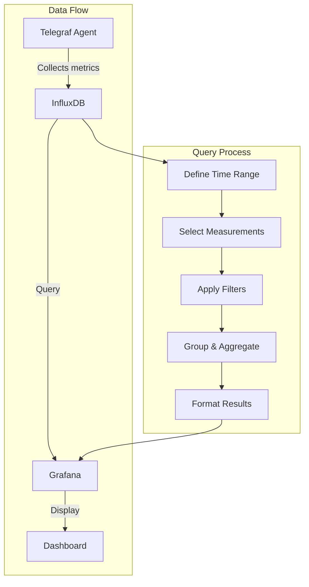

# InfluxDB Data Source

## Introduction

InfluxDB is a purpose-built time series database designed to efficiently store and query time-based data such as metrics, events, and analytics. As one of Grafana's most popular data sources, InfluxDB integration enables you to visualize and analyze your time series data with powerful dashboards and alerts.

In this guide, you'll learn how to:
- Connect Grafana to InfluxDB
- Configure your InfluxDB data source
- Query your time series data using InfluxQL and Flux
- Create effective visualizations with your InfluxDB data

## What is InfluxDB?

InfluxDB is an open-source time series database developed by InfluxData. It's optimized for:

- High-throughput write and query operations
- Data compression and downsampling
- Real-time monitoring and analytics
- IoT and sensor data collection

InfluxDB uses its own query languages (InfluxQL, which is SQL-like, and Flux, a more powerful functional language) to retrieve and process time series data.

## Connecting InfluxDB to Grafana

### Prerequisites

Before connecting InfluxDB to Grafana, ensure you have:

1. A running Grafana instance (v7.0 or later recommended)
2. A running InfluxDB instance (v1.x or v2.x)
3. Network connectivity between Grafana and InfluxDB
4. Proper access credentials for your InfluxDB instance

### Adding InfluxDB as a Data Source

Follow these steps to add InfluxDB as a data source in Grafana:

1. Log in to your Grafana instance
2. Navigate to **Configuration** → **Data Sources**
3. Click the **Add data source** button
4. Search for and select **InfluxDB**

### Configuration Options

The configuration screen offers different options depending on whether you're connecting to InfluxDB 1.x or 2.x:

#### For InfluxDB 1.x:

```
Name: My InfluxDB                 // A descriptive name for your data source
URL: http://localhost:8086        // The HTTP URL of your InfluxDB instance
Access: Server (default)          // How Grafana connects to InfluxDB
Database: mydb                    // The InfluxDB database name
User: grafana                     // Database user (if authentication is enabled)
Password: ****                    // Database password (if authentication is enabled)
HTTP Method: GET                  // Method used for queries (GET or POST)
```

#### For InfluxDB 2.x:

```
Name: My InfluxDB                 // A descriptive name for your data source
URL: http://localhost:8086        // The HTTP URL of your InfluxDB instance
Organization: myorg               // Your InfluxDB organization
Token: ****                       // Your InfluxDB API token
Default Bucket: mybucket          // Default bucket to query
```

After configuring these settings, click the **Save & Test** button to verify the connection.

## Querying InfluxDB

Grafana supports two query languages for InfluxDB:

1. **InfluxQL** - SQL-like query language (for InfluxDB 1.x)
2. **Flux** - Functional data scripting language (for InfluxDB 2.x, also supported in 1.8+)

### InfluxQL Query Editor

The InfluxQL query editor in Grafana provides a simplified interface for building queries:

```
FROM measurement WHERE tag_key = 'tag_value' GROUP BY time($__interval) fill(null)
```

Key components of an InfluxQL query include:

- **SELECT**: Choose fields and apply functions (mean, max, count, etc.)
- **FROM**: Select the measurement to query
- **WHERE**: Filter data based on tags and time
- **GROUP BY**: Group results by time intervals or tags
- **FILL**: Specify how to handle missing data points

### Example InfluxQL Query

Here's an example query that retrieves the average CPU usage grouped by host:

```sql
SELECT mean("usage_idle") 
FROM "cpu" 
WHERE $timeFilter 
GROUP BY time($__interval), "host" 
FILL(null)
```

This query:
1. Calculates the mean of the "usage_idle" field
2. From the "cpu" measurement
3. Filtered by the dashboard's time range
4. Grouped by the dashboard's interval and the "host" tag
5. Fills missing data points with null values

### Flux Query Editor

Flux is a more powerful functional language for querying InfluxDB. Grafana provides a text area where you can write Flux scripts:

```flux
from(bucket: "mybucket")
  |> range(start: v.timeRangeStart, stop: v.timeRangeStop)
  |> filter(fn: (r) => r._measurement == "cpu")
  |> filter(fn: (r) => r._field == "usage_idle")
  |> aggregateWindow(every: v.windowPeriod, fn: mean)
  |> yield()
```

Flux uses a pipe-forward operator (`|>`) to pass data through a series of functions:

- **from()**: Specifies the data source
- **range()**: Filters data by time
- **filter()**: Narrows results based on criteria
- **aggregateWindow()**: Groups and aggregates data by time windows
- **yield()**: Returns the processed data to Grafana

## Grafana Variables with InfluxDB

Grafana templates variables make your dashboards more interactive and reusable by allowing you to change query parameters on the fly.

### Creating a Variable for InfluxDB Measurements

1. Navigate to Dashboard Settings → Variables → New
2. Configure a variable to fetch available measurements:

```
Name: measurement
Label: Measurement
Type: Query
Data source: Your InfluxDB data source
Query: SHOW MEASUREMENTS
```

### Using Variables in Queries

Once created, you can use the variable in your InfluxQL queries:

```sql
SELECT mean("value") 
FROM "$measurement" 
WHERE $timeFilter 
GROUP BY time($__interval) 
FILL(null)
```

Or in Flux:

```flux
from(bucket: "mybucket")
  |> range(start: v.timeRangeStart, stop: v.timeRangeStop)
  |> filter(fn: (r) => r._measurement == "${measurement}")
```

## Practical Example: Monitoring System Metrics

Let's create a practical example of monitoring system metrics with InfluxDB and Grafana.

### Setup

1. Install [Telegraf](https://www.influxdata.com/time-series-platform/telegraf/) on your servers to collect system metrics
2. Configure Telegraf to send metrics to InfluxDB
3. Connect InfluxDB to Grafana as described above

### Creating a System Monitoring Dashboard

Create a new dashboard with the following panels:

#### CPU Usage Panel

**InfluxQL Query:**
```sql
SELECT mean("usage_idle") 
FROM "cpu" 
WHERE ("host" =~ /^$host$/) AND $timeFilter 
GROUP BY time($__interval), "host" 
FILL(null)
```

**Visualization:** Graph panel with the Y-axis inverted (100-0%) to show CPU usage instead of idle

#### Memory Usage Panel

**InfluxQL Query:**
```sql
SELECT mean("used_percent") 
FROM "mem" 
WHERE ("host" =~ /^$host$/) AND $timeFilter 
GROUP BY time($__interval), "host" 
FILL(null)
```

**Visualization:** Graph panel

#### Disk Usage Panel

**InfluxQL Query:**
```sql
SELECT mean("used_percent") 
FROM "disk" 
WHERE ("host" =~ /^$host$/) AND ("device" =~ /^$disk$/) AND $timeFilter 
GROUP BY time($__interval), "host", "device" 
FILL(null)
```

**Visualization:** Gauge panel

### Query Flow Diagram

<div className="mermaid-diagram">

</div>

## Advanced InfluxDB Features

### Using Continuous Queries for Downsampling

InfluxDB's Continuous Queries (CQs) automatically compute aggregated data at regular intervals, which can significantly improve query performance for long time ranges.

**Example Continuous Query:**

```sql
CREATE CONTINUOUS QUERY "cq_30m" ON "database_name"
BEGIN
  SELECT mean("field_name") AS "mean_field_name"
  INTO "target_measurement"
  FROM "source_measurement"
  GROUP BY time(30m), *
END
```

### Retention Policies

Retention policies in InfluxDB determine how long data is kept before being automatically removed:

```sql
CREATE RETENTION POLICY "one_week" ON "database_name" DURATION 1w REPLICATION 1 DEFAULT
```

### Using Math and Transformations

InfluxQL supports mathematical operations in queries:

```sql
SELECT (100 - mean("usage_idle")) AS "usage_busy" 
FROM "cpu" 
WHERE $timeFilter 
GROUP BY time($__interval), "host" 
FILL(null)
```

## Common Issues and Troubleshooting

### No Data Points Error

If you see "No data points" in your panels:

1. Verify your time range includes data in the database
2. Check that your query filters aren't too restrictive
3. Ensure the field names in your query match those in your database
4. Test your query directly in InfluxDB to see if it returns results

### Performance Issues

If your queries are slow:

1. Add appropriate indexes on tag values you frequently query
2. Use continuous queries to pre-aggregate data
3. Limit the number of unique series by carefully designing your schema
4. For long time ranges, use downsampled data

## Summary

In this guide, you've learned how to:
- Connect InfluxDB to Grafana as a data source
- Configure the connection for both InfluxDB 1.x and 2.x
- Write efficient queries using InfluxQL and Flux
- Create template variables for interactive dashboards
- Build a practical system monitoring dashboard
- Use advanced features like continuous queries and retention policies

InfluxDB is a powerful time series database that pairs perfectly with Grafana's visualization capabilities. By mastering this integration, you can create insightful dashboards for monitoring and analyzing your time-based data.

## Additional Resources

- [Grafana Documentation for InfluxDB](https://grafana.com/docs/grafana/latest/datasources/influxdb/)
- [InfluxDB Documentation](https://docs.influxdata.com/)
- [Flux Language Documentation](https://docs.influxdata.com/flux/)
- [Telegraf Documentation](https://docs.influxdata.com/telegraf/)

## Practice Exercises

1. Create a dashboard showing network traffic metrics using InfluxDB and Grafana
2. Set up a template variable that allows filtering by specific network interfaces
3. Create a query that calculates the rate of change for a metric
4. Design a dashboard with alerts that trigger when metrics exceed certain thresholds
5. Implement a continuous query to downsample high-frequency metrics for long-term storage