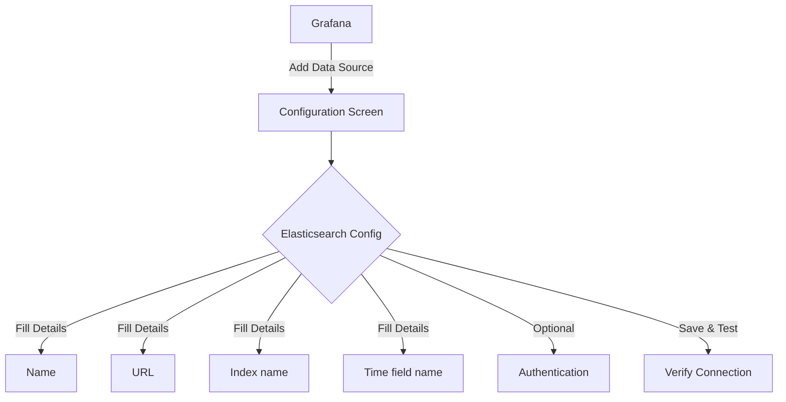
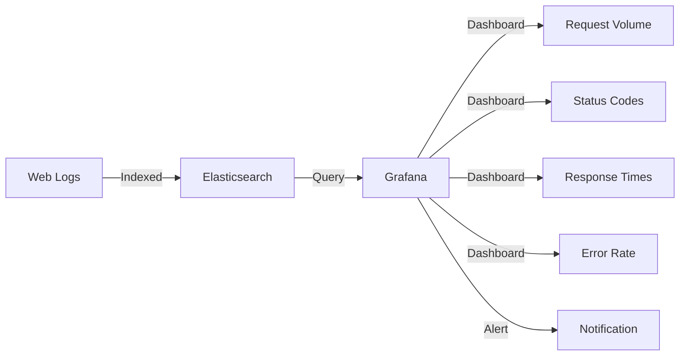

# Elasticsearch Data Source

## Introduction

Elasticsearch is a powerful, distributed, RESTful search and analytics engine that centrally stores your data for lightning-fast search, fine‑tuned relevancy, and powerful analytics. When integrated with Grafana, it allows you to create rich, interactive dashboards that visualize your Elasticsearch data through various panels and visualizations.

In this guide, we'll explore how to set up Elasticsearch as a data source in Grafana, learn how to query your data using Lucene query syntax or the Query DSL, and examine practical examples of building meaningful dashboards with Elasticsearch data.

## Prerequisites

Before we begin, you should have:
- A running Grafana instance (version 8.x or later recommended)
- Access to an Elasticsearch deployment (version 7.x or later recommended)
- Basic understanding of JSON and RESTful APIs
- Familiarity with Grafana's user interface

## Adding Elasticsearch as a Data Source

Let's start by adding Elasticsearch as a data source in Grafana:

1. Log in to your Grafana instance with administrative privileges
2. Navigate to **Configuration** > **Data Sources** in the side menu
3. Click on the **Add data source** button
4. Search for and select **Elasticsearch**

You'll be presented with a configuration page that looks similar to this:



### Configuration Options

Fill in the following required fields:

- **Name**: A descriptive name for your data source, e.g., "Production Elasticsearch"
- **URL**: The HTTP URL of your Elasticsearch instance (e.g., `http://localhost:9200`)
- **Index name**: The name of your Elasticsearch index (e.g., `logs-*` for all indices starting with "logs-")
- **Time field name**: The field containing timestamp information (e.g., `@timestamp`)

For protected Elasticsearch instances, you might also need to configure:

- **Basic auth**: Enable if your Elasticsearch requires username and password authentication
- **User** and **Password**: Your Elasticsearch credentials
- **TLS Client Auth**: For certificate-based authentication
- **Skip TLS Verify**: Enable only in trusted environments for self-signed certificates

Once you've filled in the necessary details, click **Save & Test**. If successful, you'll see a green "Data source is working" message.

## Understanding Elasticsearch Query Options in Grafana

Grafana offers several ways to query Elasticsearch data:

1. **Lucene Query**: Simple text-based queries using Lucene syntax
2. **Elasticsearch Query DSL**: More complex JSON-based queries
3. **Metric Aggregations**: For numeric computations
4. **Bucket Aggregations**: For grouping data

Let's explore each of these options.

### Lucene Query Syntax

Lucene queries are simple text-based queries that allow you to filter documents. Here's an example:

```
status:200 AND method:GET
```

This would filter for documents where the `status` field is 200 AND the `method` field is GET.

Common operators include:
- `AND`, `OR`, `NOT`: Logical operators
- `:` For field-value pairs
- `*`: Wildcard for multiple characters
- `?`: Wildcard for a single character
- `"phrase search"`: For exact phrase matching
- Ranges: `field:[start TO end]`

### Query DSL Example

For more complex queries, you can use Elasticsearch's Query DSL (Domain Specific Language):

```json
{
  "query": {
    "bool": {
      "must": [
        { "match": { "status": 200 } },
        { "match": { "method": "GET" } }
      ],
      "must_not": [
        { "match": { "agent": "Googlebot" } }
      ],
      "filter": [
        { "range": { "@timestamp": { "gte": "now-7d" } } }
      ]
    }
  }
}
```

This query finds documents where:
- `status` is 200 AND
- `method` is GET AND
- `agent` is NOT "Googlebot" AND
- `@timestamp` is within the last 7 days

## Creating Visualizations with Elasticsearch Data

Let's walk through some practical examples of creating visualizations with Elasticsearch data.

### Example 1: HTTP Status Code Distribution

Let's create a pie chart showing the distribution of HTTP status codes:

1. Create a new dashboard and add a Pie Chart panel
2. Select your Elasticsearch data source
3. Use the following configuration:

```
Metrics:
  - Aggregation: Count
Buckets:
  - Terms: status
    Size: 10
```

This will display the top 10 status codes and their respective counts.

### Example 2: Request Volume Over Time

To create a time-series graph of request volume:

1. Add a Time Series panel
2. Configure the query:

```
Metrics:
  - Aggregation: Count
Buckets:
  - Date Histogram: @timestamp
    Interval: auto
Group By:
  - Terms: method
    Size: 5
```

This will show request counts over time, grouped by HTTP method.

### Example 3: Average Response Time by Endpoint

To track performance by endpoint:

1. Add a Bar Gauge panel
2. Configure the query:

```
Metrics:
  - Aggregation: Average
    Field: response_time
Buckets:
  - Terms: endpoint
    Size: 5
    Order: avg response_time (descending)
```

This will display the top 5 endpoints with the highest average response times.

## Advanced Configurations

### Template Variables

Template variables make your dashboards more interactive and reusable. Let's create a template variable for filtering by `host`:

1. Go to dashboard settings
2. Select "Variables" and click "New"
3. Configure:
   - Name: `host`
   - Type: Query
   - Data source: Your Elasticsearch data source
   - Query: `{"find": "terms", "field": "host.keyword"}`
4. Save

Now you can use `$host` in your queries to filter data dynamically.

### Alerting with Elasticsearch Data

Grafana allows you to set up alerts based on your Elasticsearch data:

1. Edit a panel with time series data
2. Go to the "Alert" tab
3. Configure conditions, for example:
   - Condition: WHEN avg() OF query(A, 5m, now) IS ABOVE 500
4. Add notification channels
5. Save the alert

This will trigger an alert when the 5-minute average exceeds 500.

## Common Challenges and Solutions

### Challenge: High Cardinality Fields

When dealing with fields that have many unique values (high cardinality), your queries might be slow or run out of memory.

**Solution**: 
- Use the Terms aggregation with a reasonable size limit
- Apply filters to reduce the dataset before aggregation
- Consider using a field with lower cardinality for grouping

Example:
```json
{
  "aggs": {
    "endpoints": {
      "terms": {
        "field": "endpoint.keyword",
        "size": 20
      }
    }
  }
}
```

### Challenge: Date Histogram Intervals

Choosing the right interval for date histograms can be tricky.

**Solution**:
- Use `auto` for adaptive intervals based on time range
- For fixed intervals, consider the time range of your dashboard
- For performance, increase intervals when looking at larger time ranges

## Practical Example: Full Web Server Monitoring Dashboard

Let's put everything together to create a comprehensive web server monitoring dashboard:

1. Create a new dashboard
2. Add template variables for `host`, `method`, and `status_code`
3. Add the following panels:

**Panel 1: Request Volume**
- Time Series panel showing requests per second
- Group by host using the template variable

**Panel 2: Status Code Distribution**
- Pie Chart showing status code distribution
- Filtered by host and method using template variables

**Panel 3: Average Response Time**
- Time Series panel showing average response time
- Group by endpoint, top 5 by volume

**Panel 4: Error Rate**
- Stat panel showing percentage of 4xx and 5xx responses
- Alert when error rate exceeds 5%

**Panel 5: Slow Endpoints**
- Table panel showing endpoints with response time > 1s
- Columns: Endpoint, Avg Response Time, Request Count



## Implementing Log Analysis

Elasticsearch is particularly powerful for log analysis. Here's how to set up a simple log analysis dashboard:

1. Ensure your logs are properly indexed in Elasticsearch with timestamp fields
2. In Grafana, add a Logs panel
3. Configure the query:

```
Query: level:error
Fields: timestamp, level, message, service
```

This will display all error logs with relevant fields.

To enhance your log analysis, add filters by:
- Log level
- Service name
- Time range
- Error type

## Summary

In this guide, we've explored how to:

1. Configure Elasticsearch as a data source in Grafana
2. Write queries using both Lucene syntax and Query DSL
3. Create various visualizations for different types of data
4. Set up template variables for interactive dashboards
5. Configure alerts based on Elasticsearch data
6. Build practical monitoring and log analysis dashboards

Elasticsearch is a versatile data source that allows you to create powerful visualizations and gain insights from large volumes of data. By combining it with Grafana's visualization capabilities, you can build comprehensive monitoring solutions for infrastructure, applications, and business metrics.

## Practice Exercises

1. Create a dashboard showing the geographic distribution of users using a Map panel and Elasticsearch's GeoIP data
2. Set up a dashboard to monitor API requests, showing success rates, response times, and top consumers
3. Build a log analysis dashboard that helps identify application errors and their root causes
4. Create a dashboard that shows business metrics extracted from application logs or events

## Additional Resources

- [Elasticsearch Query DSL Documentation](https://www.elastic.co/guide/en/elasticsearch/reference/current/query-dsl.html)
- [Grafana Elasticsearch Documentation](https://grafana.com/docs/grafana/latest/datasources/elasticsearch/)
- [Lucene Query Syntax](https://www.elastic.co/guide/en/elasticsearch/reference/current/query-dsl-query-string-query.html#query-string-syntax)
- [Elasticsearch Aggregations](https://www.elastic.co/guide/en/elasticsearch/reference/current/search-aggregations.html)