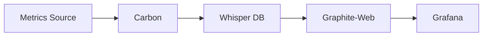

# Graphite Data Source

## Introduction

Graphite is one of the most popular and powerful open-source time-series databases and visualization tools, which serves as an excellent data source for Grafana. It specializes in storing numeric time-series data and providing visualization capabilities for monitoring systems, application metrics, and infrastructure performance.

In this guide, you'll learn how to set up and configure Graphite as a data source in Grafana, understand the Graphite query language, and explore practical use cases where Graphite shines as a monitoring solution.

## What is Graphite?

Graphite consists of three main components:

1. **Carbon** - A high-performance service that listens for time-series data
2. **Whisper** - A simple database library for storing time-series data
3. **Graphite-Web** - A Django web application that renders graphs and dashboards



As a data source for Grafana, Graphite provides a robust backend for collecting, storing, and querying numeric time-series data, which Grafana can then visualize in dashboards.

## Setting Up Graphite as a Data Source

### Prerequisites

Before you begin, ensure you have:

- A running Grafana instance (v8.x or later recommended)
- A running Graphite server (accessible from your Grafana instance)

### Adding Graphite as a Data Source

1. Log in to your Grafana instance with admin privileges
2. Navigate to **Configuration > Data Sources**
3. Click on the **Add data source** button
4. Search for and select **Graphite**

You'll see a configuration form like this:

```
Name: Graphite
URL: http://your-graphite-server:80
Access: Server (default)
```

### Basic Configuration Options

| Option | Description |
|--------|-------------|
| Name | The name you want to give to this data source |
| URL | The HTTP protocol, IP, and port of your Graphite-web instance |
| Access | How Grafana accesses the data source (Server or Browser) |
| Auth | Authentication details if your Graphite instance requires it |
| Version | The version of Graphite you're connecting to |

### Advanced Configuration

For more advanced setups, you can configure:

- **Graphite Version**: Select the version of Graphite you're running
- **Caching**: Enable caching to improve query performance
- **Custom Query Parameters**: Add HTTP query parameters to all requests
- **Transport**: Choose between proxy or direct connection

## Understanding Graphite Queries

Graphite uses a simple dot-delimited format for metric paths and provides powerful functions for manipulating and analyzing time-series data.

### Basic Query Structure

A basic Graphite query might look like:

```
servers.web01.cpu.load
```

This represents a hierarchical path to a specific metric, where:
- `servers` is the top-level namespace
- `web01` is a specific server
- `cpu` is the component being monitored
- `load` is the specific metric

### Using Wildcards

Graphite supports wildcards to query multiple metrics at once:

```
servers.*.cpu.load
```

This would return the CPU load for all servers.

### Common Graphite Functions

Graphite provides many functions to transform and analyze your data:

#### Aggregation Functions

```
# Average CPU load across all web servers
averageSeries(servers.web*.cpu.load)

# Sum of all network traffic
sumSeries(servers.*.network.*)

# Maximum memory usage
maxSeries(servers.*.memory.usage)
```

#### Transformation Functions

```
# Scale a metric by 100 to get percentage
scale(servers.web01.cpu.usage, 100)

# Get the derivative (rate of change)
derivative(servers.web01.network.bytes_in)

# Calculate moving average over 10 data points
movingAverage(servers.web01.response_time, 10)
```

## Building Grafana Dashboards with Graphite

Let's create a simple server monitoring dashboard using Graphite as a data source.

### Step 1: Create a New Dashboard

1. Click the **+** icon in the side menu
2. Select **Dashboard**
3. Click **Add new panel**

### Step 2: Configure the Panel to Use Graphite

1. In the query editor, select **Graphite** as the data source
2. Enter your query, for example: `servers.web01.cpu.load`
3. Use the function editor to add transformations if needed

### Step 3: Customize the Visualization

1. Choose an appropriate visualization type (line graph, gauge, etc.)
2. Set up axes, legends, and display options
3. Configure thresholds and alerts if desired

## Practical Examples

### Example 1: System Monitoring Dashboard

Let's create a dashboard to monitor system resources:

```jsx
// Graphite Queries for Dashboard Panels

// CPU Panel
averageSeries(servers.*.cpu.usage)

// Memory Panel
servers.*.memory.used

// Disk Panel
servers.*.disk.*.used_percentage

// Network Panel
sumSeries(servers.*.network.eth0.bytes_in)
```

### Example 2: Application Performance Monitoring

For monitoring a web application:

```jsx
// Response Time Panel
averageSeries(applications.webapp.response_time)

// Request Rate Panel
sumSeries(applications.webapp.requests_per_second)

// Error Rate Panel
sumSeries(applications.webapp.errors_per_minute)

// Database Query Time Panel
maxSeries(applications.webapp.database.query_time)
```

### Example 3: Creating Alerts

Grafana allows you to create alerts based on Graphite metrics:

1. Edit a panel using Graphite data
2. Go to the **Alert** tab
3. Define conditions, for example:
   - Condition: `WHEN avg() OF query(A, 5m, now) IS ABOVE 90`
   - This would trigger when the 5-minute average exceeds 90

```jsx
// Alert Query Example
servers.web01.cpu.usage > 90
```

## Best Practices for Graphite in Grafana

### Naming Conventions

Follow a consistent naming pattern for your metrics:

```
<environment>.<location>.<server_name>.<service>.<metric>
```

For example:
```
production.us-east.web-01.nginx.requests_per_second
```

### Query Optimization

- Use wildcards sparingly, as they can impact performance
- Leverage functions like `summarize()` for long time ranges
- Use `maxDataPoints` parameter to control resolution

### Data Retention

Configure Whisper's retention settings appropriately:
- High resolution (10s intervals) for recent data (24 hours)
- Medium resolution (1m intervals) for medium-term data (7 days)
- Low resolution (10m intervals) for long-term data (1 year)

## Troubleshooting Common Issues

### No Data Appears in Graphs

Possible causes:
- Incorrect Graphite URL in data source settings
- Metric path doesn't exist or contains typos
- Time range in Grafana doesn't match data availability in Graphite

Solution:
- Verify your metric exists using Graphite's web interface
- Check Carbon's logs for ingestion issues
- Test the query directly in Graphite-web

### Performance Issues

If queries are slow:
- Reduce the use of complex functions
- Use `maxDataPoints` to limit resolution
- Consider enabling caching in the data source settings

## Summary

Graphite is a powerful time-series database that integrates seamlessly with Grafana to provide robust monitoring solutions. In this guide, you've learned:

- How to set up Graphite as a data source in Grafana
- The basics of Graphite's query language and functions
- How to build effective dashboards using Graphite data
- Best practices for organizing and querying metrics
- Troubleshooting tips for common issues

With this knowledge, you can leverage Graphite's strengths for monitoring infrastructure, applications, and business metrics through beautiful Grafana dashboards.

## Additional Resources

- [Official Graphite Documentation](https://graphite.readthedocs.io/)
- [Grafana Documentation for Graphite](https://grafana.com/docs/grafana/latest/datasources/graphite/)
- [Graphite Functions Reference](https://graphite.readthedocs.io/en/latest/functions.html)

## Exercises

1. Set up a local Graphite instance and configure it as a data source in Grafana.
2. Create a dashboard that monitors CPU, memory, and disk usage using Graphite metrics.
3. Experiment with different Graphite functions (e.g., `movingAverage`, `derivative`, `sumSeries`) and observe how they transform your data.
4. Create an alert in Grafana based on a Graphite metric exceeding a threshold.
5. Design a dashboard for monitoring a specific application using custom metrics sent to Graphite.