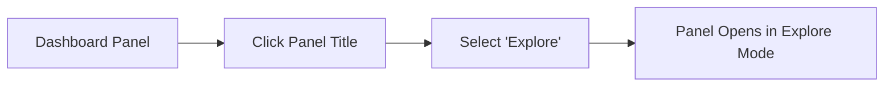

# Explore Mode

## Introduction

Grafana's Explore mode is a powerful feature designed to help you troubleshoot and explore your data without the constraints of dashboards. While dashboards are excellent for presenting organized views of your metrics, Explore mode provides a more flexible environment for ad-hoc queries, data investigation, and debugging. It enables you to quickly iterate through different queries, examine metrics in real-time, and investigate issues as they arise.

In this guide, we'll walk through how to use Explore mode effectively, understand its key features, and see how it can enhance your monitoring workflow.

## What is Explore Mode?

Explore mode is a separate interface within Grafana that focuses on the query-building experience. It provides a streamlined way to:

- Write and run ad-hoc queries
- Visualize metrics quickly
- Correlate data from different sources
- Debug issues in your monitoring stack
- Investigate anomalies without modifying dashboards

## Accessing Explore Mode

There are several ways to access Explore mode in Grafana:

1. **From the main menu**: Click on the "Explore" icon in the left sidebar.
2. **From a dashboard panel**: Click the panel title and select "Explore" from the dropdown menu.
3. **Using keyboard shortcuts**: Press `x` when a panel is selected in a dashboard.

Let's see how to access Explore from a panel:



## Key Features of Explore Mode

### 1. Query Building

Explore mode provides a dedicated query editor for each data source. The interface adapts based on the selected data source, showing the appropriate query options:

```jsx
// Example Prometheus query in Explore mode
rate(http_requests_total{job="api-server"}[5m])
```

### 2. Time Range Controls

Explore has flexible time range controls allowing you to:

- Select absolute or relative time ranges
- Use quick ranges like "Last 5 minutes" or "Last 24 hours"
- Specify custom time ranges

### 3. Split View

One of the most powerful features of Explore is the split view, which lets you compare queries side by side:

1. Click the "Split" button in the top right corner
2. Run different queries in each pane
3. Compare results across time ranges or data sources

This is especially useful for correlating metrics with logs or comparing different metric queries.

### 4. Data Source Integration

Explore works with all Grafana data sources but shines particularly with:

- **Prometheus**: For metrics exploration
- **Loki**: For log exploration
- **Tempo**: For trace exploration
- **Elastic**: For document and log searches

### 5. Running Queries

To run a query in Explore mode:

1. Select your data source
2. Write your query in the query editor
3. Click "Run Query" or press `Shift+Enter`

The results will appear below the query editor as a graph, table, or logs depending on the data source and query.

## Practical Examples

Let's walk through some common use cases for Explore mode:

### Example 1: Troubleshooting High CPU Usage

When investigating high CPU usage on a server, you can use Explore to quickly analyze the metrics:

```jsx
// Prometheus query for CPU usage by process
sum by (process) (rate(process_cpu_seconds_total{instance="server-01:9100"}[5m]))
```

This query shows you the CPU usage broken down by process, helping you identify which processes are consuming the most resources.

### Example 2: Correlating Metrics with Logs

To investigate why a service is experiencing errors:

1. In the left pane, query your metrics data source:
   ```jsx
   sum(rate(http_requests_total{status="500", service="payment-api"}[5m]))
   ```

2. Split the view and select your logs data source in the right pane:
   ```jsx
   {service="payment-api"} |= "error"
   ```

3. Align the time ranges to see if error spikes in metrics correlate with error messages in logs

### Example 3: Query History

Explore keeps track of your query history, making it easy to return to previous investigations:

1. Click the "Query history" button in the top toolbar
2. Find and select a previous query
3. The query will be loaded into the editor

This feature is invaluable when you need to revisit previous troubleshooting sessions.

## Advanced Features

### Ad-hoc Filters

For data sources that support it, Explore allows you to add ad-hoc filters to refine your queries without modifying the query text:

1. Click "Add Filter" below the query editor
2. Select a key, operator, and value
3. The filter is applied to your query

### Query Inspector

The Query Inspector helps you understand how your query is being processed:

1. Run a query in Explore
2. Click the "Inspector" button in the toolbar
3. View the raw query sent to the data source, the response data, and execution statistics

This is extremely helpful for debugging complex queries or understanding performance issues.

```jsx
// Example Prometheus query before execution
rate(http_requests_total{job="api-server"}[5m])

// What actually gets sent to Prometheus after template variables and ad-hoc filters
rate(http_requests_total{job="api-server",environment="production",instance=~"api-server-[0-9]+"}[5m])
```

### Exporting to Dashboard

Once you've crafted the perfect query in Explore, you can export it to a dashboard:

1. Run your query in Explore
2. Click "Add to dashboard" in the toolbar
3. Select an existing dashboard or create a new one
4. Configure the panel settings
5. Save the dashboard

## Using Explore Mode with Different Data Sources

### Prometheus

Explore is particularly powerful with Prometheus:

```jsx
// Finding outliers in request latency
histogram_quantile(0.95, sum(rate(http_request_duration_seconds_bucket{job="api-server"}[5m])) by (le, route))
```

This query shows the 95th percentile request latency for each route in your API server.

### Loki

For log exploration with Loki:

```jsx
// Finding error logs with context
{app="payment-service"} |= "error" 
| logfmt 
| duration > 1s
```

This query finds error logs in the payment service where the request duration was greater than 1 second.

### Tempo

For distributed tracing with Tempo:

```jsx
// Search for traces where the duration exceeds 100ms
{service="payment-api"} duration > 100ms
```

## Best Practices

1. **Start broad, then refine**: Begin with general queries and add filters to narrow down the results.
2. **Use split view for correlation**: Compare related metrics, logs, or traces side by side.
3. **Save useful queries**: Use the star feature in query history to save frequently used queries.
4. **Set appropriate time ranges**: Start with a wider time range, then zoom in on interesting periods.
5. **Export to dashboards**: Once you've identified valuable metrics to monitor, export them to a dashboard for ongoing visibility.

## Summary

Explore mode is Grafana's answer to ad-hoc data exploration and troubleshooting. It provides a flexible, powerful interface for querying and visualizing data without the constraints of dashboards.

Key takeaways:
- Explore mode is ideal for troubleshooting and ad-hoc data exploration
- Split view enables correlation between different metrics, logs, and traces
- Query history helps you return to previous investigations
- It integrates with all Grafana data sources, with special features for metrics, logs, and traces
- You can export your explorations to dashboards for ongoing monitoring

## Additional Resources

To continue learning about Grafana's Explore mode:

- Try the exercises below to get hands-on experience
- Read the [official Grafana documentation](https://grafana.com/docs/grafana/latest/explore/)
- Watch tutorial videos on the Grafana YouTube channel

## Exercises

1. **Basic Exploration**: Use Explore mode to query a metric of your choice and experiment with different time ranges.
2. **Split View Correlation**: Use split view to correlate a spike in error metrics with corresponding log entries.
3. **Query Optimization**: Use the Query Inspector to analyze the performance of a complex query and optimize it.
4. **Dashboard Export**: Create a useful query in Explore mode and export it to a dashboard as a new panel.