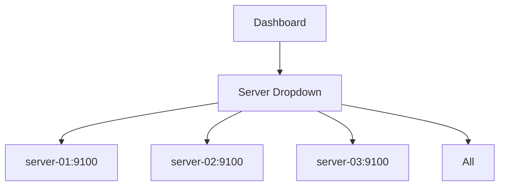
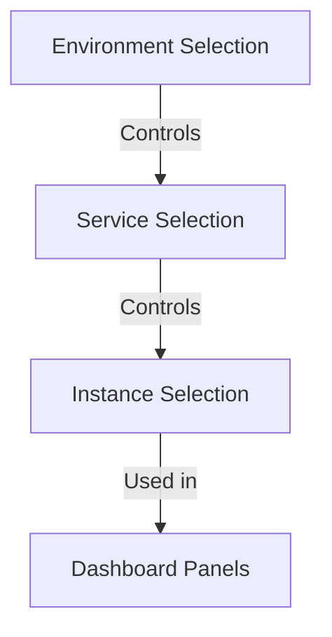

# Dashboard Variables

## Introduction

Dashboard variables are one of Grafana's most powerful features that transform static dashboards into dynamic, interactive analytics tools. Variables allow you to create dashboards that can be reused across different data sources, servers, or any dimension in your data without duplicating work or creating multiple dashboards.

In essence, variables are placeholders for values that can change, allowing users to select different options from dropdown menus, text inputs, or other interface elements. These selections can then be used in queries, panel titles, and even in other variables, making your dashboards highly flexible and interactive.

## Why Use Dashboard Variables?

Before diving into how variables work, let's understand why they're so valuable:

- **Avoid dashboard duplication**: Instead of creating separate dashboards for each server, environment, or team, create one dashboard with variables.
- **Interactive exploration**: Allow users to filter data dynamically without editing dashboard code.
- **Consistent views**: Standardize dashboard designs while accommodating different data scopes.
- **Reduce query complexity**: Simplify complex queries by parameterizing them with variables.

## Types of Variables

Grafana offers several types of variables to suit different needs:

| Variable Type | Description | Use Case |
|---------------|-------------|----------|
| Query | Obtains values from a data source query | Listing available servers, metrics, or dimensions |
| Custom | User-defined static list of values | Predefined environments or categories |
| Text box | Free-form text input | Search filters or custom thresholds |
| Constant | Fixed, hidden values | API keys or reusable string values |
| Data source | Selects from available data sources | Switching between different data environments |
| Interval | Time spans like 1h, 6h, 1d | Changing the aggregation period |
| Ad hoc filters | Key/value filters (Prometheus/InfluxDB only) | Dynamic filtering of metrics |
| Global variables | Built-in variables like `$__timeFilter` | Standardized time range references |

## Creating Basic Variables

Let's start by creating a simple query-based variable that lists all servers from a Prometheus data source:

1. Navigate to your dashboard
2. Click the dashboard settings icon (gear) in the top right
3. Select "Variables" from the left menu
4. Click "Add variable"

### Example: Server Selection Variable

```
Name: server
Label: Server
Type: Query
Data source: Prometheus
Query: label_values(node_cpu_seconds_total, instance)
```

### How It Appears in Your Dashboard

Once created, this adds a dropdown to your dashboard where users can select from available servers:



## Using Variables in Queries

Variables are referenced using the syntax `$variableName` or `${variableName}` in your queries.

### Example: Prometheus Query Using Variables

```
# Original static query
node_cpu_seconds_total{instance="server-01:9100", mode="idle"}

# Query with variable
node_cpu_seconds_total{instance="$server", mode="idle"}
```

This query will now dynamically change based on what the user selects in the server dropdown.

## Variable Formatting Options

Variables can be formatted in different ways using the `:format` syntax:

```
$variable               # Default
${variable:csv}         # Comma-separated values: 'value1,value2'
${variable:raw}         # No escaping
${variable:regex}       # Regex-escaped values for Prometheus
${variable:pipe}        # Pipe-separated values: 'value1|value2'
${variable:distributed} # For multi-value variables in InfluxDB
${variable:singlequote} # Single-quoted values: 'value1','value2'
${variable:doublequote} # Double-quoted values: "value1","value2"
```

### Example: Using Formatting in a Query

```
# When $server has multiple values selected
# Without formatting (default)
node_cpu_seconds_total{instance=$server}  
# Results in: node_cpu_seconds_total{instance=server-01:9100,server-02:9100}

# With pipe formatting for regex OR operations
node_cpu_seconds_total{instance=~${server:pipe}}  
# Results in: node_cpu_seconds_total{instance=~server-01:9100|server-02:9100}
```

## Creating Dependent Variables

Variables can depend on other variables, creating cascading selections.

### Example: Environment → Service → Instance

First, create an environment variable:

```
Name: environment
Label: Environment
Type: Custom
Values: production, staging, development
```

Then create a dependent service variable:

```
Name: service
Label: Service
Type: Query
Data source: Prometheus
Query: label_values(node_cpu_seconds_total{env="$environment"}, service)
```

Finally, create an instance variable that depends on both:

```
Name: instance
Label: Instance
Type: Query
Data source: Prometheus
Query: label_values(node_cpu_seconds_total{env="$environment", service="$service"}, instance)
```

This creates a cascading effect:



## Template Variables in Panel Titles

Variables can also be used in panel titles to make them dynamically reflect the current selections:

```
CPU Usage for ${server:raw}
```

If multiple values are selected, you might want to show a count instead:

```
CPU Usage for ${server:raw} (${server:count} servers)
```

## Interval Variables for Dynamic Time Grouping

Interval variables allow users to change the aggregation period in queries:

```
Name: interval
Label: Interval
Type: Interval
Values: 1m,10m,30m,1h,6h,12h,1d
```

Then in a Prometheus query:

```
avg_over_time(node_cpu_seconds_total{instance="$server", mode="idle"}[$interval])
```

## Variable Value Groups with Text Box Variables

Text box variables allow free-form input that can be used for filtering:

```
Name: application
Label: Application Filter
Type: Text box
Default value: .*
```

Then in a Prometheus query:

```
node_cpu_seconds_total{instance="$server", application=~"$application"}
```

## Repeating Panels and Rows with Variables

One of the most powerful features is the ability to repeat panels or rows based on variable values.

### Example: Repeat a Panel for Each Server

1. Create a panel with your metric
2. In panel options, find "Repeat options"
3. Select "Repeat by variable" and choose your server variable

This will create a copy of the panel for each server automatically.

### Example: Repeat a Row for Each Environment

1. Create a row with your panels
2. Click the row title to edit row options
3. Enable "Repeat for" and select your environment variable

This creates a separate row for each environment value, with all the panels duplicated.

## Advanced Variable Techniques

### Regular Expression Filtering

You can use regex in the variable's query to filter the options:

```
# Get only servers that start with "prod"
label_values(node_cpu_seconds_total{instance=~"prod.*"}, instance)
```

### Using Variables in Variable Definitions

Variables can reference other variables in their definition:

```
# Region variable
Name: region
Type: Custom
Values: us-east, us-west, eu-central

# Datacenter variable depends on region
Name: datacenter
Type: Query
Query: datacenters_in_region($region)
```

### Javascript for Custom Variable Processing

For complex variable behavior, you can use the `JavaScript` type (Introduced in Grafana 9+):

```
Name: serverPrefix
Type: Text box
Default: prod

Name: filteredServers
Type: Query
Query: label_values(node_cpu_seconds_total{instance=~"${serverPrefix}.*"}, instance)
```

## Practical Examples

### Example 1: Application Performance Monitoring Dashboard

```
Variables:
- environment: production, staging, development
- service: (query-based on available services)
- instance: (query-based on selected service)
- timeRange: 5m, 15m, 30m, a, 3h, 6h, 12h, 24h

Panel 1: Request Rate
Query: sum(rate(http_requests_total{env="$environment", service="$service", instance=~"$instance"}[$timeRange]))

Panel 2: Error Rate
Query: sum(rate(http_requests_total{env="$environment", service="$service", instance=~"$instance", status=~"5.."}[$timeRange])) / sum(rate(http_requests_total{env="$environment", service="$service", instance=~"$instance"}[$timeRange])) * 100
```

### Example 2: Infrastructure Dashboard with Repeated Rows

```
Variables:
- datacenter: us-east, us-west, eu-central
- server: (query-based on selected datacenter)
- metric: cpu, memory, disk, network

Row (repeated for each datacenter):
  Panel 1: CPU Usage
  Panel 2: Memory Usage
  Panel 3: Disk Usage
  Panel 4: Network Traffic
```

## Best Practices for Dashboard Variables

1. **Use descriptive names and labels**: Make variable names clear and self-explanatory.
2. **Set meaningful defaults**: Choose default values that make sense for most users.
3. **Use the "All" option thoughtfully**: Sometimes selecting all values isn't useful or may cause performance issues.
4. **Consider variable dependencies**: Design your variable hierarchy logically.
5. **Optimize queries**: Variable queries run on dashboard load, so keep them efficient.
6. **Document variables**: Use dashboard descriptions to explain how variables should be used.
7. **Test with different selections**: Ensure your dashboard works correctly with various variable combinations.

## Common Issues and Troubleshooting

### Variable Shows No Values

- Check the query syntax
- Confirm the data source is working correctly
- Verify permissions to access the requested data

### Query Takes Too Long with Variable

- Add caching to the variable (Refresh: On Dashboard Load)
- Optimize the variable query for better performance
- Limit the number of options with regex filtering

### "All" Option Causes Problems

- Disable the "Include All option" in variable settings
- Use custom logic to handle "All" selection in queries

## Summary

Dashboard variables transform static Grafana dashboards into dynamic tools for data exploration. By parameterizing your queries, panel titles, and even dashboard layouts, variables enable a single dashboard to serve multiple purposes and audiences.

From simple dropdown selections to complex interdependent cascades, variables provide the flexibility needed to build truly interactive dashboards. They reduce dashboard sprawl, improve maintainability, and enhance the user experience.

As you develop your Grafana skills, mastering variables will be essential to creating professional-grade observability solutions that can adapt to different scenarios without requiring constant updates to dashboard configurations.

## Additional Resources

- Experiment with the pre-built dashboards in Grafana to see variables in action
- Practice creating dashboards with at least one query variable and one custom variable
- Try to convert an existing static dashboard to use variables instead
- Challenge yourself to create a dashboard with interdependent cascading variables

## Exercise: Create a Dynamic Host Monitoring Dashboard

Create a Grafana dashboard that uses:
- A query variable for selecting hosts
- An interval variable for changing the aggregation period
- A custom variable for selecting metrics to display (CPU, memory, disk, network)
- Panel titles that reflect current variable selections
- A repeated row that shows detailed metrics for each selected host

This exercise will help reinforce your understanding of dashboard variables and how they can be used together to create flexible monitoring solutions.