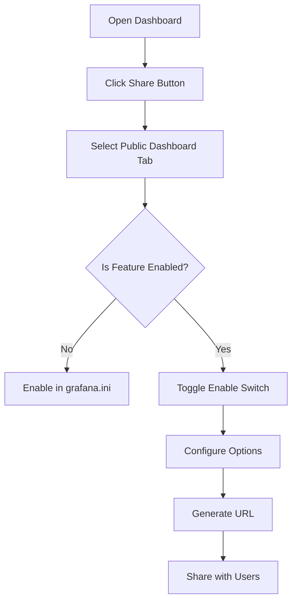

# Public Dashboards

## Introduction

Public dashboards are a powerful feature in Grafana that allows you to share your visualizations and metrics with users who don't have Grafana accounts. This feature enables you to publish selected dashboards to the web, making your data accessible to a wider audience without compromising your entire monitoring infrastructure.

In this guide, we'll explore how to create, configure, and manage public dashboards in Grafana, as well as best practices for sharing your data securely.

## What are Public Dashboards?

Public dashboards provide a way to share your Grafana dashboards with anyone via a unique URL, without requiring them to log in or have a Grafana account. This is particularly useful for:

- Sharing business metrics with stakeholders
- Publishing operational status pages
- Displaying metrics on public screens or kiosks
- Creating embeddable dashboards for websites or documentation

## Prerequisites

Before you can use public dashboards, ensure you have:

- Grafana version 9.0 or higher
- Admin privileges or appropriate permissions
- Public dashboards feature enabled in your Grafana instance

## Enabling Public Dashboards

Public dashboards are not enabled by default for security reasons. To enable this feature:

1. Access your Grafana configuration file (`grafana.ini`)
2. Find the `[public_dashboards]` section (or add it if it doesn't exist)
3. Set the `enabled` option to `true`

```ini
[public_dashboards]
enabled = true
```

For Grafana Cloud users, this feature might be available directly from the UI without configuration changes.

## Creating a Public Dashboard

Let's walk through the process of making a dashboard public:

1. Open the dashboard you want to share
2. Click the "Share" button in the top navigation bar
3. Select the "Public dashboard" tab
4. Toggle the "Enable public dashboard" switch to ON
5. Configure sharing options (read-only, time range controls, etc.)
6. Copy the generated URL to share with others

Here's a visual representation of the public dashboard workflow:



## Configuration Options

When creating a public dashboard, you have several configuration options:

### Time Range Controls

You can choose whether viewers can modify the time range:

```javascript
// Example configuration in the dashboard JSON
"publicDashboardSettings": {
  "allowTimeRangeControls": true
}
```

This setting allows viewers to explore different time periods in your data.

### Template Variables

Public dashboards support template variables, allowing viewers to filter or change the data they're viewing:

```javascript
// Example dashboard JSON with template variables
"templating": {
  "list": [
    {
      "name": "datacenter",
      "label": "Datacenter",
      "type": "query",
      "includeInPublicDashboard": true,
      // other settings...
    }
  ]
}
```

### Annotations

You can choose to show or hide annotations in your public dashboard:

```javascript
// Example configuration
"publicDashboardSettings": {
  "showAnnotations": true
}
```

## Security Considerations

When using public dashboards, keep these security aspects in mind:

1. **Data Exposure**: Only include panels that show data you're comfortable sharing publicly
2. **URL Security**: The public URL contains a unique token; treat it like a password
3. **Query Limiting**: Consider setting up query limits for public dashboards to prevent abuse
4. **Data Source Configuration**: Ensure your data sources are properly configured for public access

## Example: Creating a System Status Page

Let's walk through creating a public status page for monitoring service availability:

1. Create a new dashboard with key metrics for your services
2. Add uptime panels, response time graphs, and status indicators
3. Configure appropriate time ranges (e.g., last 24 hours)
4. Make the dashboard public using the steps above
5. Share the URL with your users or embed it in a status page

Here's an example of the dashboard JSON structure:

```json
{
  "dashboard": {
    "id": null,
    "title": "Public Service Status",
    "panels": [
      {
        "id": 1,
        "title": "Service Uptime",
        "type": "stat",
        "datasource": {
          "type": "prometheus",
          "uid": "abc123"
        },
        "targets": [
          {
            "expr": "avg_over_time(up{job=\"api\"}[24h]) * 100",
            "refId": "A"
          }
        ],
        "options": {
          "colorMode": "value",
          "graphMode": "area",
          "justifyMode": "auto",
          "textMode": "auto"
        },
        "fieldConfig": {
          "defaults": {
            "thresholds": {
              "mode": "absolute",
              "steps": [
                { "color": "red", "value": null },
                { "color": "yellow", "value": 95 },
                { "color": "green", "value": 99 }
              ]
            },
            "unit": "percent"
          }
        }
      }
      // Additional panels...
    ],
    "publicDashboardSettings": {
      "enabled": true,
      "allowTimeRangeControls": false,
      "showAnnotations": false
    }
  }
}
```

## Embedding Public Dashboards

You can embed public dashboards in external websites or applications using an iframe:

```html
<iframe
  src="https://your-grafana-instance.com/public-dashboards/abc123def456"
  width="800"
  height="600"
  frameborder="0"
></iframe>
```

This allows you to integrate your Grafana visualizations into other systems or websites.

## Managing Public Dashboards

To manage all public dashboards in your Grafana instance:

1. Navigate to Dashboards → Public dashboards in the side menu
2. View a list of all public dashboards in your organization
3. Revoke access to specific dashboards if needed
4. Monitor usage statistics for your public dashboards

## Limitations

Be aware of these limitations when using public dashboards:

1. **Data Sources**: Not all data sources support public dashboards; check compatibility
2. **Authentication**: No authentication means anyone with the URL can access the dashboard
3. **Refresh Rate**: Public dashboards might have different refresh rate limitations
4. **Query Performance**: Complex queries might impact performance for all users

## Practical Example: Creating a Business KPI Dashboard

Let's create a practical example of a public dashboard that shares business KPIs with stakeholders:

1. Create a new dashboard named "Business KPIs"
2. Add panels for key metrics like:
   - Monthly revenue
   - Customer acquisition cost
   - User growth
   - Conversion rates

3. Configure appropriate time periods and refresh intervals
4. Make the dashboard public using the steps outlined earlier
5. Share the URL with executives or stakeholders

Here's how you might set up a revenue panel query (using SQL data source):

```sql
SELECT 
  DATE_FORMAT(date, '%Y-%m-%d') AS time,
  SUM(revenue) AS "Daily Revenue"
FROM sales
WHERE date >= ${__timeFrom:sql} AND date <= ${__timeTo:sql}
GROUP BY DATE_FORMAT(date, '%Y-%m-%d')
ORDER BY time
```

## Best Practices for Public Dashboards

Follow these guidelines to make the most of public dashboards:

1. **Focus on Clarity**: Design public dashboards with clear, self-explanatory visualizations
2. **Limit Interactivity**: Consider whether viewers need to adjust time ranges or variables
3. **Optimize Performance**: Tune queries to keep the dashboard responsive for all viewers
4. **Regular Review**: Periodically review public dashboards to ensure they're still relevant
5. **Test Accessibility**: Ensure your dashboards work across different devices and browsers
6. **Monitor Usage**: Keep track of how often your public dashboards are accessed

## Troubleshooting

Common issues and their solutions:

### Dashboard Not Accessible

If your public dashboard isn't accessible:

1. Verify the feature is enabled in your Grafana configuration
2. Check that the dashboard is marked as public
3. Ensure the data sources used in the dashboard support public access
4. Verify network configurations allow external access

### Data Not Updating

If data isn't refreshing:

1. Check the refresh rate settings
2. Verify that queries are executing correctly
3. Ensure data sources are reachable from the public context

## Summary

Public dashboards provide a powerful way to share Grafana visualizations with users who don't have Grafana accounts. By following the steps and best practices outlined in this guide, you can effectively share your metrics and data visualizations with a wider audience while maintaining control over your monitoring infrastructure.

Remember these key points:

- Public dashboards require explicit configuration to enable
- They provide a unique URL that grants access without authentication
- You can control various aspects of the viewing experience
- Always consider security implications when making dashboards public

## Further Resources

To learn more about public dashboards in Grafana:

- Grafana Documentation: Public Dashboards
- Grafana Blog: Best Practices for Sharing Metrics
- Grafana Community Forums: Public Dashboard Examples

## Exercises

1. Create a public dashboard showing system metrics for a demo application
2. Set up a dashboard with template variables and test how they work in public mode
3. Design a public status page that clearly communicates service health to non-technical users
4. Create a dashboard with time range controls enabled and test the user experience
5. Implement a dashboard that uses annotations to mark important events