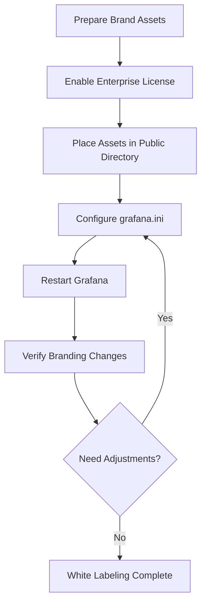

# White Labeling in Grafana

## Introduction

White labeling is a powerful enterprise feature in Grafana that allows you to customize the appearance of your Grafana instance to match your organization's branding. This includes changing logos, colors, application titles, and more. White labeling helps create a seamless experience for users by maintaining consistent branding across all your monitoring solutions.

In this tutorial, you'll learn:
- What white labeling is and its benefits
- How to configure white labeling in Grafana
- Best practices for implementing white labeling
- Real-world applications and examples

## Prerequisites

Before you begin, you'll need:
- A Grafana Enterprise license (white labeling is an Enterprise-only feature)
- Admin-level access to your Grafana instance
- Basic understanding of Grafana configuration
- Your organization's branding assets (logos, color schemes)

## Understanding White Labeling

White labeling in Grafana allows you to replace the default Grafana branding elements with your own. This creates a more integrated experience for your users and helps reinforce your brand identity within your monitoring platform.

### Key Elements You Can Customize

- **Application title**: Change "Grafana" to your organization or product name
- **Login page**: Customize the appearance of the login screen
- **Logos**: Replace the Grafana logo with your own
- **Favicon**: Change the browser tab icon
- **Application footer**: Modify or remove the footer text
- **Color scheme**: Adjust primary colors to match your brand

## Implementing White Labeling

There are two primary methods to configure white labeling in Grafana:

1. Using the Grafana configuration file
2. Using environment variables

### Method 1: Configuration File Approach

To white label Grafana using the configuration file, you'll need to modify the `grafana.ini` file or create a custom configuration file.

Here's an example of white labeling configuration:

```ini
[white_labeling]
# App title that appears in the UI
app_title = MyCompany Monitoring

# Change login title
login_title = Welcome to MyCompany Monitoring

# Change login subtitle
login_subtitle = Sign in to view your dashboards

# Replace logo (must be a URL accessible to Grafana server)
login_logo = /public/img/mycompany_logo.svg

# Replace footer links and text
footer_links = support:https://mycompany.com/support

# Replace home dashboard
home_dashboard_uid = my-custom-dashboard

[brands.primary]
# Primary brand color used for buttons, highlights, etc.
primary_color = #FF7941
text_color = #FFFFFF
background_color = #0B0C0E
```

### Method 2: Environment Variables

You can also set white labeling options using environment variables:

```bash
GF_WHITE_LABELING_APP_TITLE=MyCompany Monitoring
GF_WHITE_LABELING_LOGIN_TITLE=Welcome to MyCompany Monitoring
GF_WHITE_LABELING_LOGIN_SUBTITLE=Sign in to view your dashboards
GF_WHITE_LABELING_LOGIN_LOGO=/public/img/mycompany_logo.svg
GF_WHITE_LABELING_FOOTER_LINKS=support:https://mycompany.com/support
GF_BRANDS_PRIMARY_PRIMARY_COLOR=#FF7941
GF_BRANDS_PRIMARY_TEXT_COLOR=#FFFFFF
GF_BRANDS_PRIMARY_BACKGROUND_COLOR=#0B0C0E
```

### Custom Logo Placement

To use a custom logo, you need to place your logo file in Grafana's public directory:

1. Prepare your logo file (SVG format recommended)
2. Place it in the `/public/img/` directory of your Grafana installation
3. Reference it in your configuration as shown above

## Step-by-Step Implementation Guide

Let's walk through a complete white labeling implementation:

1. **Enable Enterprise License**
   
   Make sure your Grafana Enterprise license is properly configured.

2. **Prepare Your Assets**
   
   Create and optimize your branding assets:
   - Main logo (SVG format, around 180x30px)
   - Login logo (bigger version, around 250x100px)
   - Favicon (PNG, 32x32px)
   - Define your brand colors (primary, text, background)

3. **Place Assets in Grafana**
   
   Copy your assets to Grafana's public directory:

   ```bash
   # Example for a typical installation
   cp company_logo.svg /usr/share/grafana/public/img/
   cp favicon.png /usr/share/grafana/public/img/
   ```

4. **Configure White Labeling**
   
   Edit your `grafana.ini` file to add the white labeling section:

   ```ini
   [white_labeling]
   app_title = Acme Corp Analytics
   login_title = Acme Corp Analytics Platform
   login_subtitle = Enterprise monitoring solution
   login_logo = /public/img/company_logo.svg
   menu_logo = /public/img/company_logo_small.svg
   favicon = /public/img/favicon.png
   footer_links = Documentation:https://docs.acmecorp.com,Support:https://support.acmecorp.com
   
   [brands.primary]
   primary_color = #1E88E5
   text_color = #FFFFFF
   background_color = #111215
   ```

5. **Restart Grafana**
   
   Apply your changes by restarting the Grafana service:

   ```bash
   sudo systemctl restart grafana-server
   ```

6. **Verify Your Changes**
   
   Open your Grafana instance in a browser and check that all branding elements have been updated.

## Advanced White Labeling

### Custom Theme Creation

For more extensive customization, you can create a complete custom theme:

```ini
[brands.primary]
primary_color = #00897B
text_color = #FFFFFF
background_color = #0B0C0E
border_color = #262628
secondary_background_color = #161719
faint_background_color = #1E1E20
semi_background_color = #222426
extra_background_color = #2A2C2F
```

### Custom Home Dashboard

Set a specific dashboard as the default landing page after login:

```ini
[white_labeling]
home_dashboard_uid = your-dashboard-uid
```

## Real-World Applications

### Case Study: Internal Corporate Monitoring

A large financial institution implemented white labeling on their Grafana instance to:
- Match their corporate intranet styling
- Provide consistent branding across all internal tools
- Make the monitoring solution feel like a native company application
- Simplify user adoption with familiar branding

### Case Study: Managed Service Provider

A managed service provider used white labeling to:
- Create custom-branded monitoring portals for each client
- Present monitoring as part of their unified service offering
- Build client trust through professional, consistent branding
- Increase perceived value of their monitoring services

## Best Practices

1. **Maintain Readability**
   
   When selecting brand colors, ensure there's still good contrast for readability. Test your color scheme with accessibility tools.

2. **Keep Logos Simple**
   
   Use simple, clean logos that scale well and are recognizable even at small sizes.

3. **Documentation**
   
   Document your white labeling configuration for future reference and for other administrators.

4. **Test Thoroughly**
   
   Test your white labeling implementation across different browsers and devices to ensure consistency.

5. **Version Control**
   
   Keep your white labeling configuration in version control for tracking changes and easy redeployment.

## White Labeling Flow

Here's a diagram showing the white labeling process:



## Common Issues and Solutions

### Logo Not Displaying

If your custom logo doesn't appear:
- Verify the file path is correct
- Check file permissions (Grafana must be able to read the file)
- Ensure the image format is supported (SVG recommended)

### Color Changes Not Applied

If your color scheme isn't taking effect:
- Make sure color codes are in the correct format (#RRGGBB)
- Verify the configuration section names are correct
- Restart Grafana after making changes

### License Issues

If white labeling features aren't available:
- Verify your Enterprise license is active and properly configured
- Check your Grafana version (some features require specific versions)

## Summary

White labeling in Grafana Enterprise allows you to create a seamless, branded monitoring experience for your users. By customizing logos, colors, titles, and other visual elements, you can make Grafana feel like a native part of your organization's toolset.

Key takeaways:
- White labeling requires Grafana Enterprise
- You can customize logos, colors, titles, and more
- Configuration can be done via `grafana.ini` or environment variables
- Proper branding increases user adoption and perceived value
- Maintain readability and accessibility when customizing

## Exercise

Try implementing white labeling in your Grafana instance:

1. Create a mock branding package with a logo and color scheme
2. Configure white labeling using the configuration file method
3. Test the implementation and gather feedback
4. Document any issues encountered and how you resolved them

## Additional Resources

- [Grafana Enterprise Documentation](https://grafana.com/docs/grafana/latest/enterprise/)
- [Grafana Configuration Options](https://grafana.com/docs/grafana/latest/administration/configuration/)
- [Branding Best Practices](https://grafana.com/blog/2023/01/19/how-to-use-white-labeling-in-grafana/)