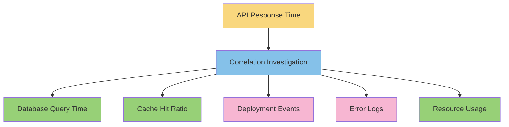

# Correlation in Grafana

## Introduction

Correlation in Grafana is a powerful feature that helps you identify relationships between different metrics and events across your monitoring system. When troubleshooting complex systems, the ability to quickly discover how different measurements relate to each other can dramatically reduce your mean time to resolution (MTTR).

In this guide, we'll explore Grafana's correlation features, understanding how they work and how to leverage them effectively in your dashboards and alerts.

## What is Correlation?

Correlation refers to a statistical relationship between two or more variables. In monitoring contexts, correlation helps answer questions like:

- When CPU usage spikes, does memory consumption also increase?
- Does a slowdown in one service impact response times in other services?
- Are error rates correlated with specific deployment events?

Grafana provides tools to visualize these relationships and even automate the discovery of correlations across your metrics, logs, and traces.

## Basic Correlation Features

### Correlation Visualizations

Grafana offers several visualization options specifically designed to show correlations:

#### 1. Scatter Plot

The scatter plot is one of the most basic and effective ways to visualize correlation between two variables.

```jsx
// Example query configuration for scatter plot
const scatterPlotQuery = {
  metrics: [
    'app_response_time_seconds',
    'database_query_time_seconds'
  ],
  timeRange: '24h'
};
```

With this visualization, you can quickly identify if there's a linear relationship, no relationship, or a non-linear relationship between metrics.

#### 2. Heatmaps

Heatmaps are excellent for showing the distribution and correlation of data points across two dimensions:

```jsx
// Example heatmap configuration
const heatmapConfig = {
  dataSource: 'Prometheus',
  expr: 'rate(http_requests_total[5m])',
  format: 'heatmap',
  yAxis: {
    format: 'ms',
    min: 0,
    max: 1000,
    logBase: 1
  }
};
```

## Advanced Correlation with Explore

Grafana's Explore feature takes correlation to the next level by allowing you to:

1. Split your view to compare different data sources side by side
2. Share timestamps across these views 
3. Add correlation hints that suggest related data

### Setting Up Split View Correlation

Here's how to use split view for correlation analysis:

1. Navigate to the Explore view in your Grafana instance
2. Run your initial query
3. Click on the "Split" button in the top right corner
4. In the new panel, select a different data source or query
5. As you hover over data points in one panel, the corresponding time is highlighted in the other

```jsx
// Example of how to programmatically set up correlated views
const setupCorrelatedViews = {
  leftPanel: {
    datasource: 'Prometheus',
    expr: 'sum(rate(http_requests_total{status=~"5.."}[5m])) by (service)'
  },
  rightPanel: {
    datasource: 'Loki',
    expr: '{app="frontend"} |= "error"'
  }
};
```

## Correlation in Dashboards

### Creating Correlation-Rich Dashboards

You can design dashboards that facilitate correlation analysis:

1. **Consistent time ranges** across panels
2. **Template variables** that apply across all visualizations
3. **Dashboard links** that preserve time ranges and variable selections

Here's an example of how to set up dashboard variables for correlation:

```jsx
// Dashboard variables for correlation
const dashboardVariables = [
  {
    name: 'service',
    type: 'query',
    datasource: 'Prometheus',
    refresh: 1,
    query: 'label_values(http_requests_total, service)',
    multi: true
  },
  {
    name: 'instance',
    type: 'query',
    datasource: 'Prometheus',
    refresh: 1,
    query: 'label_values(http_requests_total{service=~"$service"}, instance)',
    multi: true
  }
];
```

## Implementing Correlation with Annotations

Annotations in Grafana allow you to mark points or regions on time-based graphs. They're excellent for correlation analysis because they help you visualize relationships between events and metrics.

### Adding Annotation Queries

Here's an example of setting up an annotation query:

```jsx
// Annotation query configuration
const deploymentAnnotation = {
  name: 'Deployments',
  datasource: 'Loki',
  expr: '{app="ci-cd"} |= "deployment successful"',
  iconColor: 'green',
  enable: true
};
```

With this configuration, your graphs will display green markers whenever a deployment event occurs, allowing you to visually correlate deployments with changes in metrics.

## Data Links for Context-Aware Correlation

Data links in Grafana allow you to create dynamic links from one visualization to another view, preserving context and enabling deeper correlation analysis.

### Setting Up Data Links

Here's how you can configure a data link:

```jsx
// Data link configuration example
const errorToLogsLink = {
  url: '/explore?orgId=1&left={"datasource":"Loki","queries":[{"expr":"{service=\"${__series.name}\"} |= \"error\""}],"range":{"from":"${__from}","to":"${__to}"}}',
  title: 'View related logs',
  targetBlank: true
};
```

This creates a link from a metric panel to a logs view, filtered to show only errors from the service that was clicked, maintaining the same time range.

## Automated Correlation with Grafana Correlations Feature

Grafana also offers an automated correlation feature that suggests potentially related data when you're troubleshooting an issue.

### Configuring Correlation Suggestions

To set up correlation suggestions in Grafana:

1. Navigate to **Configuration** → **Data Sources**
2. Select the data source you want to configure
3. Go to the **Correlations** tab
4. Click **Add**
5. Define your correlation criteria

Here's an example of how this might be configured:

```jsx
// Correlation configuration
const correlationConfig = {
  label: 'Errors to Logs',
  description: 'Find logs for error spikes',
  source: {
    datasourceUid: 'prometheus',
    query: 'sum(rate(http_requests_total{status=~"5.."}[5m])) by (service)'
  },
  target: {
    datasourceUid: 'loki',
    transformations: [
      {
        type: 'logfmt',
        field: 'line',
        mappings: [
          {
            field: 'service',
            handlerType: 'label',
            regexp: '(.*)'
          }
        ]
      }
    ],
    query: '{service="$service"} |= "error"'
  }
};
```

## Practical Example: Troubleshooting with Correlation

Let's walk through a real-world scenario of using correlation to troubleshoot a system issue:

### Scenario: API Service Slowdown

Imagine you receive an alert about increased latency in your API service. Using correlation techniques in Grafana, you can quickly identify the root cause:

1. **Start with the alert metric**: View the API response time graph
2. **Add correlated metrics**: 
   - Database query times
   - Cache hit ratios
   - CPU and memory usage
3. **View deployment annotations**: Check if the issue correlates with a recent deployment
4. **Investigate logs**: Use data links to view error logs during the slowdown period
5. **Trace analysis**: If using distributed tracing, examine trace data for the slow requests

Using this correlation-driven approach, you might discover that the slowdown correlates perfectly with a cache service deployment and increased database query times, pointing to a cache efficiency issue.

Here's a simple dashboard layout for this investigation:



## Best Practices for Correlation in Grafana

To maximize the value of correlation in your Grafana instance:

1. **Standardize labels and tags** across metrics, logs, and traces
2. **Maintain consistent timestamps** and time zones across data sources
3. **Use template variables** to create flexible, reusable correlation dashboards
4. **Add contextual annotations** for important events
5. **Configure meaningful data links** between related visualizations
6. **Tag related dashboards** to make them discoverable as a set

## Summary

Correlation features in Grafana transform it from a visualization tool into a powerful platform for understanding complex relationships within your systems. By leveraging scatter plots, heatmaps, split views, annotations, data links, and automated correlation suggestions, you can:

- Reduce troubleshooting time
- Identify non-obvious relationships between services
- Better understand the impact of changes
- Create more insightful dashboards

As systems become increasingly complex, correlation capabilities become essential for effective monitoring and troubleshooting. Mastering these features in Grafana will significantly enhance your ability to maintain system reliability and performance.

## Additional Resources

- Try the [Grafana Correlation Workshop](https://grafana.com/tutorials/) for hands-on experience
- Explore the [Grafana documentation on correlation features](https://grafana.com/docs/)
- Check out Grafana Labs' blog posts on advanced troubleshooting techniques

## Exercises

1. Create a dashboard that shows the correlation between service CPU usage and response time
2. Set up annotation queries for deployments and configuration changes
3. Configure data links that connect metrics panels to relevant logs
4. Use the split view in Explore to investigate the correlation between error rates and resource utilization
5. Build a correlation-focused dashboard for a service of your choice, including metrics, logs, and annotations