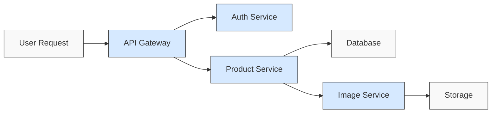

# Tracing Integration

## Introduction

Distributed tracing is a powerful observability technique that helps you understand how requests flow through your applications, especially in microservice architectures. In this guide, we'll explore how Grafana integrates with tracing systems to provide end-to-end visibility into your application performance.

Tracing complements metrics and logs by showing:
- The path of a request across services
- Performance bottlenecks
- Dependencies between components
- Exactly where errors occur

By the end of this tutorial, you'll understand how to set up, visualize, and analyze traces in Grafana to troubleshoot complex issues in your applications.

## Understanding Distributed Tracing

Before diving into Grafana's tracing capabilities, let's establish some core concepts:

### Key Tracing Concepts

- **Trace**: A record of a request's journey through your system
- **Span**: A single operation within a trace, representing work done in a service
- **Span Context**: Metadata that identifies a span and its position in the trace
- **Parent/Child Relationship**: Shows how spans relate to each other hierarchically
- **Service Graph**: Visualization of service dependencies derived from trace data



## Grafana Tracing Data Sources

Grafana supports multiple tracing backends:

1. **Tempo**: Grafana's native tracing backend
2. **Jaeger**: A popular open-source tracing system
3. **Zipkin**: Another widely-used tracing solution
4. **OpenTelemetry**: The emerging standard for observability data

Let's set up a Tempo data source as an example.

### Setting Up Tempo in Grafana

1. Navigate to **Configuration → Data Sources** in Grafana
2. Click **Add data source**
3. Select **Tempo**
4. Configure the connection:

```yaml
URL: http://tempo:3100
```

For basic setup, you can use the default values for the remaining fields.

## Exploring Traces in Grafana

Once your data source is configured, you can start exploring traces.

### Trace Explorer

The Trace Explorer is the main interface for searching and analyzing traces:

1. Go to **Explore** in the left sidebar
2. Select your tracing data source from the dropdown
3. Use the search interface to find traces:
   - By trace ID
   - By service name
   - By duration
   - By tags and attributes

### Analyzing a Trace

When you view a trace, you'll see a waterfall visualization showing:

- All spans in chronological order
- Duration of each span
- Parent-child relationships
- Service boundaries
- Error indicators

```mermaid
gantt
    title Example Trace Timeline
    dateFormat  s
    axisFormat %S.%L
    section API Gateway
    Request processing :a1, 0, 0.02s
    section Auth Service
    Token validation   :a2, after a1, 0.05s
    section Product Service
    Fetch product      :a3, after a2, 0.03s
    section Database
    Query execution    :a4, after a3, 0.08s
    section Image Service
    Get image          :a5, after a3, 0.10s
    section Storage
    Retrieve file      :a6, after a5, 0.07s
```



### Understanding Trace Details

When you select a span within a trace, you can see detailed information:

- **Operation**: The specific action being performed
- **Duration**: How long the span took to execute
- **Tags/Attributes**: Key-value pairs with additional context
- **Logs**: Events that occurred during the span
- **Process Information**: Details about the service that generated the span

## Integrating Traces with Logs and Metrics

Grafana's power comes from connecting different types of observability data.

### Trace to Logs

You can configure Grafana to jump from a trace span directly to relevant logs:

```json
{
  "datasourceUid": "loki",
  "tags": [
    { "key": "service.name", "value": "service" },
    { "key": "trace_id", "value": "traceID" }
  ],
  "spanStartTimeShift": "1h",
  "spanEndTimeShift": "1h"
}
```

This configuration tells Grafana how to construct a Loki query from trace data.

### Trace to Metrics

Similarly, you can link traces to relevant metrics:

```json
{
  "datasourceUid": "prometheus",
  "queries": [
    {
      "name": "Request Rate",
      "query": 'rate(http_requests_total{service="$service"}[$__interval])'
    }
  ],
  "tags": [
    { "key": "service.name", "value": "service" }
  ]
}
```

## Practical Example: Troubleshooting High Latency

Let's walk through a real-world example of using traces to find performance issues.

### Scenario

Users are reporting slow checkout in your e-commerce application.

### Step 1: Identify Problematic Traces

1. Go to **Explore** and select your tracing data source
2. Search for traces with the operation `checkout` and duration > 1s
3. Examine the results to find traces with unusually long durations

### Step 2: Analyze the Trace

Looking at a slow trace, you might see:

```javascript
// Trace visualization shows:
// checkout (1.2s)
//   ├─ validateCart (50ms)
//   ├─ processPayment (950ms)  <-- Suspiciously slow!
//   │   └─ paymentGateway.authorize (920ms)
//   └─ createOrder (200ms)
```

### Step 3: Drill Down into the Slow Span

Click on the `processPayment` span to see details:

- The span took 950ms, much longer than normal
- The tags show it's calling an external payment provider
- Network attributes show high latency

### Step 4: Correlate with Metrics and Logs

1. Click on "View Logs" to see relevant logs during this time
2. Check metrics for the payment service to see if this is a pattern

### Step 5: Identify and Fix the Root Cause

In this case, you might discover:
- The payment provider API is experiencing slowdowns
- Your connection pool settings are too restrictive
- The solution might be to implement a retry mechanism or circuit breaker

## Setting Up Application Instrumentation

To get traces from your applications, they need to be instrumented.

### Using OpenTelemetry (Modern Approach)

OpenTelemetry provides a vendor-neutral way to instrument applications:

```javascript
// Example Node.js instrumentation with OpenTelemetry
const { NodeTracerProvider } = require('@opentelemetry/sdk-trace-node');
const { registerInstrumentations } = require('@opentelemetry/instrumentation');
const { HttpInstrumentation } = require('@opentelemetry/instrumentation-http');
const { OTLPTraceExporter } = require('@opentelemetry/exporter-otlp-http');

// Create and register the tracer provider
const provider = new NodeTracerProvider();
provider.register();

// Set up auto-instrumentation
registerInstrumentations({
  instrumentations: [
    new HttpInstrumentation(),
  ],
});

// Configure exporter to send to Tempo
const exporter = new OTLPTraceExporter({
  url: 'http://tempo:4318/v1/traces',
});

// Connect tracer to exporter
const processor = new BatchSpanProcessor(exporter);
provider.addSpanProcessor(processor);
```

### Manual Instrumentation Example

For fine-grained control, you can add custom spans:

```javascript
// Getting a tracer
const tracer = opentelemetry.trace.getTracer('checkout-service');

// Creating a custom span
async function processOrder(orderId) {
  const span = tracer.startSpan('process-order');
  
  // Add context to the span
  span.setAttribute('order.id', orderId);
  
  try {
    // Your business logic here
    const result = await validateOrder(orderId);
    span.setAttribute('order.status', result.status);
    
    return result;
  } catch (error) {
    // Record errors
    span.recordException(error);
    span.setStatus({
      code: opentelemetry.SpanStatusCode.ERROR,
      message: error.message
    });
    throw error;
  } finally {
    // Always end the span
    span.end();
  }
}
```

## Advanced Tracing Features in Grafana

### Service Graphs

Grafana can generate service dependency maps from your trace data:

1. Go to **Explore** and select your tracing data source
2. Click on the **Service Graph** tab
3. View an interactive map showing services and their dependencies
4. Hover over connections to see request rates and error percentages

### Trace Analytics

Tempo and Grafana provide analytical views of trace data:

- **Latency Histograms**: Visualize the distribution of request durations
- **Error Rates**: Monitor failure percentages across services
- **Span Statistics**: Analyze performance patterns by operation

Example Grafana query to visualize trace latency:

```
{
  // Tempo query
  "queryType": "spans",
  "filters": [
    { "tag": "service.name", "operator": "=", "value": "checkout-service" },
    { "tag": "operation", "operator": "=", "value": "processOrder" }
  ],
  "groupBy": { "tag": "status.code" },
  "calculations": ["count", "p50", "p95", "p99"]
}
```

## Best Practices for Tracing in Grafana

1. **Sample Wisely**: In high-volume systems, trace only a percentage of requests
2. **Focus on Critical Paths**: Ensure key user journeys are well-instrumented
3. **Add Business Context**: Include business identifiers (order IDs, user IDs) as span attributes
4. **Use Consistent Naming**: Adopt a naming convention for services and operations
5. **Link All Observability Data**: Connect traces with logs and metrics
6. **Set Appropriate Retention**: Configure retention based on your troubleshooting needs

## Summary

In this guide, we've explored how to integrate tracing with Grafana to gain deeper insights into your applications:

- We learned about distributed tracing concepts
- We set up a tracing data source in Grafana
- We explored how to analyze traces to find performance issues
- We connected traces with logs and metrics
- We saw how to instrument applications to generate trace data
- We explored advanced features like service graphs and analytics

Tracing integration completes the observability triad alongside metrics and logs, giving you a comprehensive view of your system's behavior and performance.

## Additional Resources

- [Grafana Tempo Documentation](https://grafana.com/docs/tempo/latest/)
- [OpenTelemetry Documentation](https://opentelemetry.io/docs/)
- [Distributed Tracing: A Complete Guide](https://lightstep.com/distributed-tracing)
- [Grafana Labs Webinar: Tracing Made Simple with Grafana](https://grafana.com/videos/)

## Exercises

1. Set up a Tempo or Jaeger data source in your Grafana instance.
2. Instrument a simple application using OpenTelemetry and send traces to Grafana.
3. Create a dashboard that shows both metrics and trace data for a service.
4. Use the Trace Explorer to find the slowest operations in your application.
5. Configure trace-to-logs correlation to jump from spans to relevant log entries.