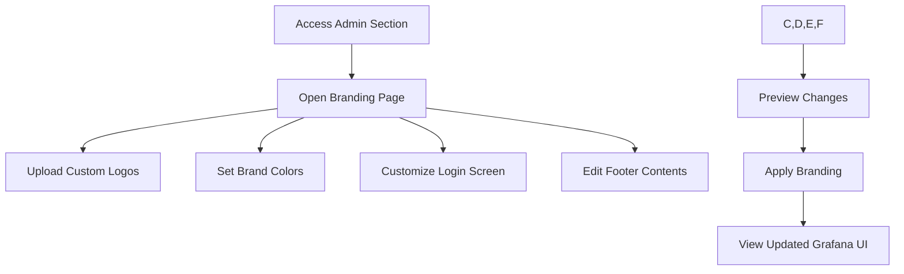

# Custom Branding

## Introduction

Custom branding in Grafana allows you to tailor the visual identity of your Grafana instance to match your organization's look and feel. By customizing elements such as logos, colors, application title, and login page appearance, you can create a cohesive user experience that aligns with your brand guidelines. This feature is particularly useful for organizations that deploy Grafana as part of their customer-facing analytics solutions or for internal teams that want to maintain consistent branding across all tools.

In this guide, you'll learn how to implement custom branding in Grafana, understand available customization options, and see real-world examples of effective Grafana branding implementations.

## Prerequisites

- Grafana version 7.0 or later
- Admin access to your Grafana instance
- Basic understanding of CSS and HTML
- For some advanced features: Grafana Enterprise license

## Basic Branding Options

Grafana offers several built-in options for customizing the appearance of your instance without requiring a Grafana Enterprise license.

### Changing the Application Title

The most basic branding change is modifying the application title that appears in the browser tab and various parts of the UI.

To change the application title, modify your Grafana configuration file (`grafana.ini`):

```ini
[server]
# Set the name displayed in the UI
app_name = My Company Analytics
```

### Customizing the Login Page

You can customize the title, subtitle, and other text on the login page:

```ini
[auth]
# Login page title
login_title = Welcome to My Company Analytics
# Login page subtitle
login_subtitle = Please sign in with your credentials
# Text for the login page footer
login_text = © My Company 2025
```

### Setting a Custom Logo

You can replace the default Grafana logo with your own organization's logo using the following configuration options:

```ini
[security]
# Path to your custom logo (30x30 px)
logo_small_url = /public/img/custom_logo_small.png
# Path to your custom logo (110x30 px)
logo_large_url = /public/img/custom_logo_large.png
```

For this to work, you need to place your logo files in the Grafana public directory (typically `/usr/share/grafana/public/` for Linux installations or similar path based on your deployment method).

## Advanced Branding with Grafana Enterprise

Grafana Enterprise offers significantly more branding capabilities through the White Labeling feature.

### Enabling White Labeling

First, ensure you have a valid Grafana Enterprise license. Then, enable white labeling in your `grafana.ini` file:

```ini
[white_labeling]
# Enable white labeling
enabled = true
```

### Customizing Colors

With White Labeling enabled, you can customize the primary colors used throughout the UI:

```ini
[white_labeling]
# Primary theme color
primary_color = #00ACEE
# Secondary color
secondary_color = #0083B3
# Link color
link_color = #00ACEE
# Hover color for links
link_hover_color = #0083B3
```

### Custom Footer and Login Background

Enhance your branding further with custom footer links and a login page background:

```ini
[white_labeling]
# Footer links (JSON format)
footer_links = [{"text":"Documentation","url":"https://mycompany.com/docs"},{"text":"Support","url":"https://mycompany.com/support"}]
# Login page background image
login_background = /public/img/custom_login_background.jpg
# Login logo (450x150 px recommended)
login_logo = /public/img/custom_login_logo.png
```

## Implementing Custom Branding Through UI

Grafana Enterprise also provides a user-friendly interface for applying custom branding without editing configuration files.

1. Navigate to the Grafana Admin section
2. Select "Branding" from the menu
3. Use the provided form to customize various branding elements
4. Save your changes and they will be immediately applied

Here's a typical branding workflow:



## Step-by-Step Example: Complete Brand Overhaul

Let's walk through a complete branding example for a fictional company called "DataViz Inc."

### Step 1: Define Branding Requirements

- Replace all Grafana logos with DataViz Inc. logos
- Change color scheme to match corporate colors (primary: #3366CC, secondary: #66AADD)
- Customize login page with company-specific messaging
- Add footer with company links and copyright information

### Step 2: Prepare Assets

Create and optimize your logo files:
- Small logo (30x30 px) for the top navigation bar
- Large logo (110x30 px) for the side menu
- Login logo (450x150 px) for the login page
- Optional login background image (1920x1080 px recommended)

### Step 3: Configure Basic Branding

Edit your `grafana.ini` file:

```ini
[server]
app_name = DataViz Analytics

[auth]
login_title = Welcome to DataViz Analytics
login_subtitle = Your data visualization platform
login_text = © DataViz Inc. 2025. All rights reserved.

[security]
logo_small_url = /public/img/dataviz_small.png
logo_large_url = /public/img/dataviz_large.png
```

### Step 4: Configure Enterprise Branding

If you have Grafana Enterprise, expand the configuration:

```ini
[white_labeling]
enabled = true
primary_color = #3366CC
secondary_color = #66AADD
link_color = #3366CC
link_hover_color = #66AADD
footer_links = [{"text":"Help Center","url":"https://dataviz.example.com/help"},{"text":"Status Page","url":"https://status.dataviz.example.com"}]
login_logo = /public/img/dataviz_login.png
login_background = /public/img/dataviz_background.jpg
```

### Step 5: Deploy Assets

Place all your image files in the appropriate public directory:

```bash
# For a typical Linux installation
sudo cp dataviz_small.png /usr/share/grafana/public/img/
sudo cp dataviz_large.png /usr/share/grafana/public/img/
sudo cp dataviz_login.png /usr/share/grafana/public/img/
sudo cp dataviz_background.jpg /usr/share/grafana/public/img/
```

### Step 6: Restart Grafana

Apply the changes by restarting the Grafana service:

```bash
sudo systemctl restart grafana-server
```

## Advanced Customization with Custom CSS

For even more advanced customization, Grafana Enterprise allows you to inject custom CSS to override specific UI elements.

Here's an example of custom CSS to further enhance your branding:

```ini
[white_labeling]
custom_css = """
.navbar {
  box-shadow: 0 2px 5px rgba(0, 0, 0, 0.1);
}
.page-header {
  background: linear-gradient(to right, #3366CC, #66AADD);
  color: white;
  padding: 15px;
  border-radius: 4px;
}
.btn-primary {
  background-color: #3366CC;
  border-color: #2255BB;
}
.btn-primary:hover {
  background-color: #2255BB;
}
"""
```

This CSS customizes the navigation bar, page headers, and primary buttons to match your brand style.

## Real-World Applications

### Customer-Facing Analytics Dashboards

Many organizations use Grafana as a platform to provide analytics to their customers. With proper branding, these dashboards appear as a seamless part of your product suite rather than a third-party tool.

**Example Scenario:** A SaaS company offers performance monitoring dashboards to their customers. By applying custom branding:
- Customers see consistent branding across the entire product ecosystem
- The analytics platform feels like a native part of the product
- The company strengthens their brand identity

### Enterprise Dashboard Solutions

For large enterprises with multiple internal tools, consistent branding helps create a unified experience across all systems.

**Example Scenario:** An IT department deploys Grafana for various teams across the organization. With custom branding:
- All monitoring dashboards maintain corporate identity
- Users experience a familiar interface across various tools
- New employees more easily recognize internal tools

## Troubleshooting Common Issues

### Logo Not Displaying

If your custom logos aren't appearing:
1. Verify file paths are correct in your configuration
2. Check file permissions (Grafana server needs read access)
3. Ensure image dimensions are appropriate
4. Clear browser cache or try in incognito mode

### Color Changes Not Applying

If custom colors aren't working:
1. Confirm you have a valid Enterprise license
2. Verify white labeling is enabled
3. Check for syntax errors in your color codes (use valid HEX codes)
4. Restart Grafana after making configuration changes

## Best Practices for Grafana Branding

1. **Maintain Readability**: Choose colors that maintain good contrast for text and UI elements
2. **Optimize Logo Files**: Keep file sizes small for faster loading
3. **Test on Multiple Devices**: Ensure your branding looks good on desktop and mobile views
4. **Document Your Changes**: Keep a record of all branding customizations for future reference
5. **Consider User Experience**: Branding should enhance, not hinder, the user experience

## Summary

Custom branding in Grafana allows you to transform the default interface into a personalized analytics platform that aligns with your organization's visual identity. Whether using the basic options available in all Grafana versions or the advanced capabilities in Grafana Enterprise, you can create a cohesive, branded experience for your users.

By following the steps and examples in this guide, you can effectively implement custom branding that strengthens your organization's identity while maintaining the powerful analytics capabilities that Grafana provides.

## Additional Resources

- [Grafana Configuration Documentation](https://grafana.com/docs/grafana/latest/administration/configuration/)
- [Grafana Enterprise Features](https://grafana.com/docs/grafana/latest/enterprise/)
- [CSS Best Practices](https://developer.mozilla.org/en-US/docs/Web/CSS)

## Exercises

1. **Basic Branding Implementation**: Configure your Grafana instance to display a custom application title and login message.

2. **Logo Replacement Challenge**: Create appropriate logo files and configure Grafana to use them instead of the default logos.

3. **Color Scheme Design**: Design a color scheme for Grafana that matches your organization's brand guidelines, then implement it using the appropriate configuration options.

4. **Comprehensive Branding Project**: Design and implement a complete branding solution for a fictional company, including logos, colors, login page customization, and footer links.