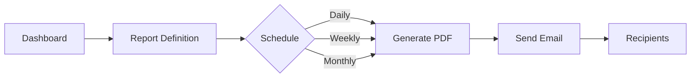

# Enterprise Features

## Introduction

Grafana Enterprise is a commercial edition of Grafana that offers additional features and capabilities beyond the open-source version. Enterprise features are designed for organizations that need enhanced security, governance, and collaboration tools for their monitoring and visualization needs. This guide will introduce you to Grafana Enterprise features, explain their benefits, and demonstrate how to implement them in your environment.

## What is Grafana Enterprise?

Grafana Enterprise builds upon the open-source foundation of Grafana and extends it with premium features intended for production environments in medium to large organizations. It includes all the functionality of Grafana Open Source, plus:

- Enterprise plugins and data source integrations
- Advanced authentication and security options
- Fine-grained access control
- Reporting and export capabilities
- Enterprise-grade support

Let's explore these features in more detail.

## Enterprise Data Source Plugins

Grafana Enterprise includes access to premium data source plugins that connect to commercial databases and monitoring tools. These plugins are not available in the open-source version and require a valid Enterprise license.

### Available Enterprise Data Sources

Some of the key enterprise data sources include:

- Splunk
- New Relic
- Dynatrace
- ServiceNow
- Oracle Database
- DataDog
- MongoDB
- SAP HANA
- Snowflake
- Google BigQuery
- Gitlab

### Using an Enterprise Data Source

Here's how to configure an Enterprise data source like Splunk:

```javascript
// Example configuration for Splunk data source
{
  "name": "Splunk Enterprise",
  "type": "splunk",
  "url": "https://your-splunk-instance:8089",
  "basicAuth": true,
  "basicAuthUser": "${SPLUNK_USER}",
  "secureJsonData": {
    "basicAuthPassword": "${SPLUNK_PASSWORD}"
  },
  "jsonData": {
    "splunkToken": "${SPLUNK_TOKEN}",
    "enableBasicAuth": true
  }
}
```

Once configured, you can query your Splunk data using the Splunk Query Language (SPL):

```sql
| tstats count where index=main by host, source
```

## Enterprise Authentication and Security

Grafana Enterprise provides advanced authentication methods and security features to help organizations meet their compliance and governance requirements.

### SAML Authentication

Security Assertion Markup Language (SAML) is an enterprise-grade authentication protocol that allows single sign-on (SSO).

Here's a basic SAML configuration example for Grafana:

```yaml
[auth.saml]
enabled = true
certificate_path = "/path/to/certificate.cert"
private_key_path = "/path/to/private_key.pem"
idp_metadata_path = "/path/to/idp_metadata.xml"
metadata_valid_duration = "48h"
assertion_attribute_name = "displayName"
assertion_attribute_login = "mail"
assertion_attribute_email = "mail"
```

### Team Sync with External Providers

Team synchronization allows you to automatically map users from your authentication provider to teams in Grafana:

```yaml
[auth.generic_oauth]
enabled = true
name = Azure AD
allow_sign_up = true
client_id = "YOUR_CLIENT_ID"
client_secret = "YOUR_CLIENT_SECRET"
scopes = "openid email profile"
auth_url = "https://login.microsoftonline.com/TENANT_ID/oauth2/v2.0/authorize"
token_url = "https://login.microsoftonline.com/TENANT_ID/oauth2/v2.0/token"
api_url = "https://graph.microsoft.com/v1.0/me"
team_ids_attribute_path = "groups"
team_ids = ["TEAM_ID_1", "TEAM_ID_2"]
```

## Fine-Grained Access Control (FGAC)

FGAC allows administrators to define granular permissions for users and teams, controlling who can view, edit, and administer different aspects of Grafana.

### Basic FGAC Configuration

Here's how to enable FGAC in your Grafana configuration:

```ini
[enterprise]
enabled = true

[feature_toggles]
accesscontrol = true
```

### Creating Custom Roles

You can create custom roles with specific permissions using the Grafana API:

```javascript
// Creating a custom role via API
const createRolePayload = {
  name: "CustomDashboardEditor",
  description: "Can edit dashboards but not create or delete them",
  permissions: [
    {
      action: "dashboards:read",
      scope: "dashboards:*",
    },
    {
      action: "dashboards:write",
      scope: "dashboards:*",
    }
  ],
  global: false
};

fetch('https://your-grafana-instance/api/access-control/roles', {
  method: 'POST',
  headers: {
    'Content-Type': 'application/json',
    'Authorization': 'Bearer YOUR_API_KEY'
  },
  body: JSON.stringify(createRolePayload)
})
.then(response => response.json())
.then(data => console.log(data));
```

## Data Source Permissions

Grafana Enterprise allows you to restrict access to specific data sources, ensuring users can only access the data they need.

```javascript
// Setting permissions for a data source
const dataSourcePermissionPayload = {
  userIds: [1, 2, 3],
  teamIds: [4, 5],
  permissions: [
    {
      permission: "datasources:read",
      enabled: true
    },
    {
      permission: "datasources:write",
      enabled: false
    }
  ]
};

fetch('https://your-grafana-instance/api/datasources/1/permissions', {
  method: 'POST',
  headers: {
    'Content-Type': 'application/json',
    'Authorization': 'Bearer YOUR_API_KEY'
  },
  body: JSON.stringify(dataSourcePermissionPayload)
})
.then(response => response.json())
.then(data => console.log(data));
```

## Reporting and Exports

Grafana Enterprise includes reporting capabilities that allow users to generate PDFs of dashboards and set up automated report delivery.

### Manual PDF Export

The simplest form of reporting is manual PDF export, which can be done directly from a dashboard:

```javascript
// Example code to trigger PDF export via API
async function exportDashboardToPDF(dashboardUid) {
  const response = await fetch(`https://your-grafana-instance/api/reports/dashboards/${dashboardUid}`, {
    method: 'POST',
    headers: {
      'Content-Type': 'application/json',
      'Authorization': 'Bearer YOUR_API_KEY'
    },
    body: JSON.stringify({
      dashboardUid: dashboardUid,
      timeRange: {
        from: 'now-24h',
        to: 'now'
      }
    })
  });
  
  const blob = await response.blob();
  // Download the PDF
  const url = window.URL.createObjectURL(blob);
  const a = document.createElement('a');
  a.href = url;
  a.download = `dashboard-${dashboardUid}.pdf`;
  document.body.appendChild(a);
  a.click();
  window.URL.revokeObjectURL(url);
}
```

### Scheduled Reports

Scheduled reports can be configured to be sent via email at regular intervals:



Here's how to set up a scheduled report via the API:

```javascript
// Creating a scheduled report
const scheduledReportPayload = {
  name: "Daily System Health",
  dashboardUid: "abc123",
  recipients: [
    { type: "email", params: { email: "team@example.com" } }
  ],
  schedule: {
    frequency: "daily",
    timeZone: "UTC",
    startTime: "08:00",
    dayOfWeek: "", // Only needed for weekly reports
    day: ""        // Only needed for monthly reports
  },
  options: {
    orientation: "landscape",
    layout: "grid",
    timeRange: {
      from: "now-24h",
      to: "now"
    }
  }
};

fetch('https://your-grafana-instance/api/reports', {
  method: 'POST',
  headers: {
    'Content-Type': 'application/json',
    'Authorization': 'Bearer YOUR_API_KEY'
  },
  body: JSON.stringify(scheduledReportPayload)
})
.then(response => response.json())
.then(data => console.log(data));
```

## White Labeling

Grafana Enterprise allows organizations to customize the look and feel of their Grafana instance with white-labeling options.

### Basic White Labeling Configuration

Here's how to configure basic white labeling in Grafana:

```ini
[white_labeling]
# Application title shown in browser title
app_title = "Company Monitoring Portal"

# Login page background image
login_background = "public/img/company-background.svg"

# Login page logo
login_logo = "public/img/company-logo.svg"

# Sidebar logo
sidebar_logo = "public/img/company-logo-small.svg"

# Footer & help links
footer_links = [{"text":"Support","url":"https://support.company.com"},{"text":"Documentation","url":"https://docs.company.com"}]

# Custom CSS file path
custom_css = "public/css/company-theme.css"
```

An example of a simple custom CSS file:

```css
/* company-theme.css */
:root {
  --primary-color: #00a3e0;
  --secondary-color: #005280;
}

.page-header {
  background-color: var(--secondary-color);
}

.navbar {
  background-color: var(--primary-color);
}
```

## Usage Insights and Analytics

Grafana Enterprise provides analytics about how users interact with dashboards, helping administrators understand which dashboards are most valuable and how they're being used.

### Dashboard Usage Analytics

You can access dashboard usage analytics through the API:

```javascript
// Getting usage data for a specific dashboard
async function getDashboardUsage(dashboardUid) {
  const response = await fetch(`https://your-grafana-instance/api/dashboards/uid/${dashboardUid}/usage`, {
    headers: {
      'Authorization': 'Bearer YOUR_API_KEY'
    }
  });
  
  const data = await response.json();
  console.log('Dashboard usage data:', data);
  
  // Example output:
  // {
  //   "views": 1245,
  //   "viewsPerUser": [
  //     { "userId": 1, "views": 256 },
  //     { "userId": 2, "views": 198 }
  //   ],
  //   "starred": 12,
  //   "lastViewedAt": "2023-09-01T12:34:56Z",
  //   "lastEditedAt": "2023-08-15T09:12:34Z"
  // }
}
```

## Data Source Proxy & Query Caching

Query caching is an Enterprise feature that improves dashboard loading times and reduces the load on your data sources by caching query results.

### Enabling Query Caching

To enable query caching, update your Grafana configuration:

```ini
[caching]
enabled = true

[caching.memory]
# Maximum memory in bytes dedicated to caching (default is 1GB)
max_size_bytes = 1073741824  

# Time to live for cached items
ttl = 10m
```

You can also configure caching on a per-data-source basis:

```javascript
// Configuring cache TTL for a specific data source
const dataSourceUpdatePayload = {
  jsonData: {
    cachingEnabled: true,
    cachingTtl: 300  // 5 minutes in seconds
  }
};

fetch('https://your-grafana-instance/api/datasources/1', {
  method: 'PUT',
  headers: {
    'Content-Type': 'application/json',
    'Authorization': 'Bearer YOUR_API_KEY'
  },
  body: JSON.stringify(dataSourceUpdatePayload)
})
.then(response => response.json())
.then(data => console.log(data));
```

## Service Accounts

Service accounts in Grafana Enterprise allow for automation and integration with other systems using dedicated tokens.

### Creating a Service Account

Here's how to create a service account via the API:

```javascript
// Creating a service account
const serviceAccountPayload = {
  name: "Data Pipeline Integration",
  role: "Editor"
};

fetch('https://your-grafana-instance/api/serviceaccounts', {
  method: 'POST',
  headers: {
    'Content-Type': 'application/json',
    'Authorization': 'Bearer YOUR_API_KEY'
  },
  body: JSON.stringify(serviceAccountPayload)
})
.then(response => response.json())
.then(data => {
  console.log('Service account created:', data);
  
  // Now create a token for this service account
  const tokenPayload = {
    name: "Pipeline Token",
    role: "Editor"
  };
  
  return fetch(`https://your-grafana-instance/api/serviceaccounts/${data.id}/tokens`, {
    method: 'POST',
    headers: {
      'Content-Type': 'application/json',
      'Authorization': 'Bearer YOUR_API_KEY'
    },
    body: JSON.stringify(tokenPayload)
  });
})
.then(response => response.json())
.then(tokenData => {
  console.log('Token created:', tokenData);
  console.log('Save this key, it will not be shown again:', tokenData.key);
});
```

## Implementing Grafana Enterprise in Your Organization

Let's walk through a step-by-step process for implementing Grafana Enterprise:

1. **Evaluate Requirements**:
   - Assess your organization's monitoring needs
   - Identify which Enterprise features would be beneficial
   - Determine the number of users and required data sources

2. **Obtain a License**:
   - Contact Grafana Labs for pricing
   - Purchase an appropriate license for your needs

3. **Install and Configure**:
   - Install Grafana Enterprise using your preferred method
   - Apply your license using the Grafana UI or configuration file

```bash
# Example Docker installation
docker run -d \
  -p 3000:3000 \
  --name=grafana-enterprise \
  -v grafana-storage:/var/lib/grafana \
  -e "GF_ENTERPRISE_LICENSE_TEXT=YOUR_LICENSE_TEXT" \
  grafana/grafana-enterprise
```

4. **Set Up Authentication**:
   - Configure SAML, LDAP, or OAuth for SSO
   - Set up team synchronization with your identity provider

5. **Implement Access Control**:
   - Define roles based on organizational needs
   - Assign permissions to teams and users
   - Configure data source permissions

6. **Configure Enterprise Data Sources**:
   - Add commercial data sources needed for your environment
   - Set up appropriate credentials and query parameters

7. **Set Up Reporting**:
   - Create report templates for critical dashboards
   - Configure scheduled reports for stakeholders

## Real-World Example: Financial Services Monitoring

Let's consider a financial services company that needs to monitor transaction systems, customer-facing applications, and internal services.

### Requirements

- **High Security**: Strict access controls and audit logging
- **Multiple Data Sources**: Need to combine data from Splunk, Oracle, and Prometheus
- **Compliance Reporting**: Regular reports for regulatory compliance
- **Custom Branding**: White-labeled dashboards for executive viewing

### Implementation

1. **Authentication and Security**:

```yaml
# Grafana SAML configuration
[auth.saml]
enabled = true
certificate_path = "/certs/okta.cert"
private_key_path = "/certs/private_key.pem"
idp_metadata_path = "/certs/idp_metadata.xml"
assertion_attribute_name = "displayName"
assertion_attribute_login = "email"
assertion_attribute_email = "email"
assertion_attribute_groups = "groups"
```

2. **Access Control Configuration**:

```javascript
// Creating role-based access through the API
const roles = [
  {
    name: "TransactionMonitor",
    description: "Can view transaction dashboards",
    permissions: [
      { action: "dashboards:read", scope: "dashboards:uid:tx*" }
    ]
  },
  {
    name: "SecurityAnalyst",
    description: "Can view and edit security dashboards",
    permissions: [
      { action: "dashboards:read", scope: "dashboards:uid:sec*" },
      { action: "dashboards:write", scope: "dashboards:uid:sec*" }
    ]
  }
];

// Create each role
roles.forEach(role => {
  fetch('https://company-grafana.example.com/api/access-control/roles', {
    method: 'POST',
    headers: {
      'Content-Type': 'application/json',
      'Authorization': 'Bearer ADMIN_API_KEY'
    },
    body: JSON.stringify(role)
  });
});
```

3. **Data Source Configuration**:

```javascript
// Configuring Oracle Enterprise data source
const oracleDataSource = {
  name: "Oracle Finance DB",
  type: "oracle",
  url: "oracle.example.com:1521/FINDB",
  access: "proxy",
  basicAuth: true,
  user: "${ORACLE_USER}",
  secureJsonData: {
    password: "${ORACLE_PASSWORD}"
  },
  jsonData: {
    connMaxLifetime: 14400,
    maxOpenConns: 10,
    maxIdleConns: 10,
    oracleServiceName: "FINDB"
  }
};

fetch('https://company-grafana.example.com/api/datasources', {
  method: 'POST',
  headers: {
    'Content-Type': 'application/json',
    'Authorization': 'Bearer ADMIN_API_KEY'
  },
  body: JSON.stringify(oracleDataSource)
});
```

4. **Scheduled Compliance Reports**:

```javascript
// Creating a weekly compliance report
const complianceReportPayload = {
  name: "Weekly Transaction Compliance Report",
  dashboardUid: "tx-compliance-dash",
  recipients: [
    { type: "email", params: { email: "compliance@company.com" } },
    { type: "email", params: { email: "auditors@company.com" } }
  ],
  schedule: {
    frequency: "weekly",
    timeZone: "America/New_York",
    startTime: "06:00",
    dayOfWeek: "monday"
  },
  options: {
    orientation: "landscape",
    layout: "grid",
    timeRange: {
      from: "now-1w",
      to: "now"
    }
  },
  formats: ["pdf"],
  enableDashboardLinks: true
};

fetch('https://company-grafana.example.com/api/reports', {
  method: 'POST',
  headers: {
    'Content-Type': 'application/json',
    'Authorization': 'Bearer ADMIN_API_KEY'
  },
  body: JSON.stringify(complianceReportPayload)
});
```

5. **White Labeling for Executive View**:

```ini
[white_labeling]
app_title = "Financial Systems Monitor"
login_background = "public/img/company/finance-background.jpg"
login_logo = "public/img/company/finance-logo.svg"
menu_logo = "public/img/company/finance-icon.svg"
fav_icon = "public/img/company/favicon.ico"
```

## Summary

Grafana Enterprise provides a comprehensive set of features designed for organizations that need enhanced security, governance, and reporting capabilities. Key enterprise features include:

- Enterprise data source plugins for commercial databases and services
- Advanced authentication and security options
- Fine-grained access control for users and teams
- Reporting and scheduling capabilities
- White labeling and customization options
- Usage insights and analytics
- Query caching for improved performance

By implementing these features, organizations can create a secure, efficient, and compliant monitoring environment that meets their specific business needs.

## Additional Resources

- [Grafana Enterprise Documentation](https://grafana.com/docs/grafana/latest/enterprise/)
- [Enterprise Data Sources](https://grafana.com/grafana/plugins/?enterprise=1&type=datasource)
- [SAML Authentication Guide](https://grafana.com/docs/grafana/latest/setup-grafana/configure-security/configure-authentication/saml/)
- [Fine-Grained Access Control](https://grafana.com/docs/grafana/latest/administration/roles-and-permissions/access-control/)

## Exercises

1. **Basic Enterprise Setup**
   - Install Grafana Enterprise in a test environment
   - Apply a trial license
   - Configure at least one enterprise data source

2. **Access Control Implementation**
   - Create three custom roles with different dashboard access levels
   - Assign these roles to test users
   - Verify that access restrictions work as expected

3. **Reporting Workflow**
   - Create a dashboard that shows system metrics
   - Set up a scheduled report for this dashboard
   - Configure the report to be delivered via email

4. **Enterprise Integration**
   - Connect Grafana Enterprise to an existing LDAP or SAML provider
   - Configure team synchronization
   - Verify that users are automatically assigned to the correct teams