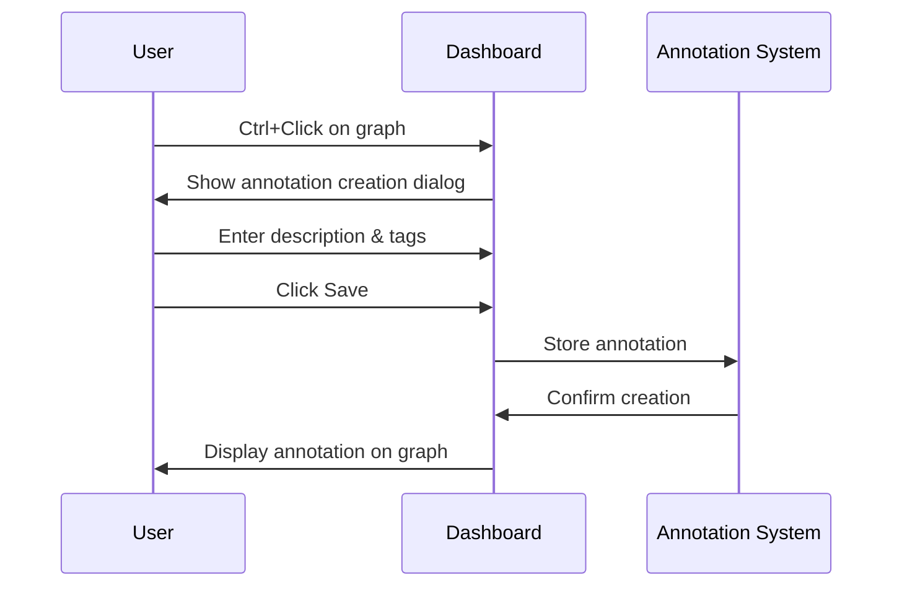

# Annotations in Grafana

## Introduction

Annotations in Grafana are a powerful feature that allows you to mark specific points in time on your dashboards. They provide context to your time series data by highlighting important events, deployments, outages, or any significant occurrences that may help explain patterns or anomalies in your metrics.

Think of annotations as sticky notes placed on your timeline that help answer questions like "Why did we see this spike in CPU usage?" or "When did we deploy that code change?" By correlating events with your metrics, annotations make your dashboards more informative and valuable for troubleshooting and analysis.

## Understanding Annotations

### What Are Annotations?

Annotations are visual markers displayed as vertical lines or regions on graphs, with optional text descriptions that appear when you hover over them. They can be:

- **Time-based**: Marking a specific moment in time (vertical line)
- **Time range-based**: Highlighting a period (shaded region)
- **Global**: Visible across all graphs in a dashboard
- **Panel-specific**: Only visible on a particular panel

### Types of Annotations in Grafana

Grafana provides several ways to create and manage annotations:

1. **Manual annotations**: Created directly through the Grafana UI
2. **Query-based annotations**: Generated automatically from data sources
3. **API-created annotations**: Added programmatically through the Grafana API
4. **Built-in annotations**: Grafana-generated markers for dashboard saves and alerts

## Creating Manual Annotations

### Adding Annotations Through the UI

The simplest way to add annotations is directly through the Grafana dashboard interface:

1. Hold the `Ctrl` or `Cmd` key and click on a graph where you want to add an annotation
2. Enter a description in the popup dialog
3. Optionally add tags to categorize your annotation
4. Click "Save"

Here's how the process looks:



### Managing Annotations

To view and manage existing annotations:

1. Hover over an annotation to see its details
2. Click on an annotation to edit or delete it
3. Use the dashboard settings to filter annotations by tags

## Query-Based Annotations

### Setting Up Data Source Annotations

Query-based annotations automatically fetch events from your data sources and display them on your dashboards:

1. Navigate to Dashboard settings > Annotations
2. Click "New Annotation Query"
3. Configure the following:
   - Name: A descriptive name for this annotation source
   - Data source: Select the appropriate data source
   - Query: Define how to fetch the annotation events
   - Tags: Optional tags to categorize these annotations

### Example: Annotations from Prometheus

```javascript
{
  "expr": "changes(app_deployments_total[1m]) > 0",
  "step": "60s",
  "legendFormat": "Deployment: {{version}}",
  "titleFormat": "New Deployment",
  "textFormat": "Version {{version}} deployed"
}
```

This query would create annotations whenever the `app_deployments_total` metric increases, indicating a new deployment.

### Example: Annotations from a Database

For SQL data sources like MySQL or PostgreSQL, you might use:

```sql
SELECT
  time_column as time,
  description as text,
  tags
FROM event_table
WHERE $__timeFilter(time_column)
```

## Practical Examples

### Example 1: Tracking Deployments

One common use case is tracking application deployments alongside performance metrics:

```javascript
// Dashboard with CPU utilization graph
{
  "annotations": {
    "list": [
      {
        "builtIn": 0,
        "datasource": "Prometheus",
        "enable": true,
        "hide": false,
        "iconColor": "rgba(0, 211, 255, 1)",
        "name": "Deployments",
        "query": "changes(app_deployments_total[1m]) > 0",
        "showIn": 0,
        "tags": ["deployment"],
        "type": "dashboard"
      }
    ]
  },
  // ... rest of dashboard definition
}
```

This setup helps correlate deployments with changes in CPU usage or other metrics, making it easier to identify if a deployment has affected system performance.

### Example 2: Maintenance Windows

Highlighting scheduled maintenance periods can help explain gaps or anomalies in data:

```javascript
// Using time range annotations to mark maintenance periods
{
  "annotations": {
    "list": [
      {
        "builtIn": 0,
        "datasource": "MySQL",
        "enable": true,
        "hide": false,
        "iconColor": "rgba(255, 96, 96, 1)",
        "name": "Maintenance",
        "query": "SELECT start_time as time, end_time as timeEnd, 'System Maintenance' as text, 'maintenance' as tags FROM maintenance_schedule WHERE $__timeFilter(start_time)",
        "showIn": 0,
        "tags": ["maintenance"],
        "type": "dashboard"
      }
    ]
  }
}
```

This creates shaded regions on your graphs during maintenance windows, helping users understand why data might be missing or anomalous during these periods.

## Annotations API

For automated workflows, you can use the Grafana HTTP API to create annotations programmatically:

```javascript
// Example: Creating an annotation via API
const createAnnotation = async () => {
  const response = await fetch('http://your-grafana-instance/api/annotations', {
    method: 'POST',
    headers: {
      'Content-Type': 'application/json',
      'Authorization': 'Bearer your-api-key'
    },
    body: JSON.stringify({
      dashboardId: 1,  // Optional: specific dashboard ID
      panelId: 2,      // Optional: specific panel ID
      time: Date.now(),
      tags: ['deployment', 'api-created'],
      text: 'Deployment of version 2.0.1'
    })
  });
  
  return response.json();
};
```

This approach is useful for integrating with CI/CD pipelines or monitoring systems to automatically annotate important events.

## Best Practices

### When to Use Annotations

- **Deployments**: Mark when code changes were deployed
- **Incidents**: Highlight outages or service disruptions
- **Configuration Changes**: Note when system configurations were modified
- **Scaling Events**: Record when infrastructure was scaled up or down
- **External Factors**: Document events like marketing campaigns that might impact metrics

### Tips for Effective Annotations

1. **Be consistent**: Use a standard naming convention for similar types of events
2. **Use tags**: Tag annotations to make filtering easier
3. **Keep descriptions brief but informative**: Include just enough detail to understand the event
4. **Don't overuse**: Too many annotations can clutter your dashboards
5. **Link to details**: Include ticket or commit IDs for reference

## Advanced Annotation Features

### Using Tags for Filtering

Tags make it easier to manage annotations, especially when you have many:

```javascript
// Dashboard settings for annotation filtering
{
  "annotations": {
    "list": [
      {
        "builtIn": 1,
        "datasource": "-- Grafana --",
        "enable": true,
        "hide": false,
        "iconColor": "rgba(0, 211, 255, 1)",
        "name": "Annotations & Alerts",
        "target": {
          "limit": 100,
          "matchAny": false,
          "tags": ["deployment"],
          "type": "dashboard"
        },
        "type": "dashboard"
      }
    ]
  }
}
```

This configuration would show only annotations tagged with "deployment".

### Annotation Permissions

In enterprise environments, you may want to control who can add or modify annotations:

- **Viewer**: Can see annotations but not add or modify them
- **Editor**: Can add and edit their own annotations
- **Admin**: Can manage all annotations

## Summary

Annotations are a vital feature in Grafana that provide context to your time series data by marking important events on your dashboards. They help correlate metrics with real-world events, making your dashboards more valuable for analysis and troubleshooting.

We've covered:
- What annotations are and their types
- How to create manual annotations
- Setting up query-based annotations from various data sources
- Practical examples for tracking deployments and maintenance windows
- Using the Annotations API for programmatic creation
- Best practices for effective annotation usage
- Advanced features like tagging and permissions

By incorporating annotations into your Grafana dashboards, you can create more informative and useful visualizations that tell the complete story of your systems and applications.

## Exercises

1. Create a dashboard with a simple time series graph and add a manual annotation marking a specific event.
2. Set up a query-based annotation that tracks events from a data source you use.
3. Write a script that uses the Grafana API to add annotations automatically when certain conditions are met.
4. Create a dashboard that displays different types of annotations (deployments, incidents, maintenance) using different colors and filters.

## Additional Resources

- [Grafana Annotations Documentation](https://grafana.com/docs/grafana/latest/dashboards/annotations/)
- [Grafana HTTP API Reference](https://grafana.com/docs/grafana/latest/http_api/annotations/)
- [Advanced Dashboard Techniques in Grafana](https://grafana.com/blog/2021/04/29/a-deep-dive-into-dashboard-designs-in-grafana/)