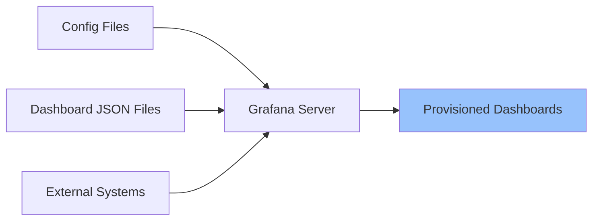

# Dashboard Provisioning

## Introduction

Dashboard provisioning in Grafana allows you to automatically create and update dashboards from configuration files or external sources. Instead of manually creating dashboards through the UI, you can define them as code, enabling version control, automation, and consistent deployment across multiple Grafana instances.

This approach follows the "Infrastructure as Code" philosophy, where configurations are managed in text files rather than through graphical interfaces. Dashboard provisioning is particularly valuable for:

- Maintaining consistent dashboards across multiple environments (development, staging, production)
- Implementing version control for dashboards
- Automating dashboard deployment as part of CI/CD pipelines
- Scaling Grafana deployments across large organizations

## How Dashboard Provisioning Works

Dashboard provisioning in Grafana works through configuration files and folder structures that tell Grafana where and how to find dashboard definitions.



The process typically involves:

1. Creating dashboard JSON definitions
2. Setting up provisioning configuration files
3. Configuring Grafana to read from these sources
4. Restarting or reloading Grafana to apply changes

## Setting Up Dashboard Provisioning

### Step 1: Prepare Your Directory Structure

First, you need to create directories to store your provisioning configurations and dashboard definitions:

```bash
# Example directory structure for Grafana provisioning
grafana/
├── provisioning/
│   ├── dashboards/
│   │   ├── default.yaml
│   │   └── team-dashboards.yaml
│   └── datasources/
│       └── datasources.yaml
└── dashboards/
    ├── system/
    │   ├── cpu-metrics.json
    │   └── memory-usage.json
    └── application/
        └── service-monitoring.json
```

### Step 2: Configure Dashboard Providers

Create a YAML configuration file in the `provisioning/dashboards/` directory to tell Grafana where to find your dashboard JSON files:

```yaml
# provisioning/dashboards/default.yaml
apiVersion: 1

providers:
  - name: 'Default Dashboards'
    orgId: 1
    folder: 'System Monitoring'
    type: file
    disableDeletion: false
    updateIntervalSeconds: 30
    allowUiUpdates: false
    options:
      path: /etc/grafana/dashboards/system
      foldersFromFilesStructure: true
```

Let's break down this configuration:

- `name`: A human-readable name for this provider
- `orgId`: The organization ID in Grafana (default is 1)
- `folder`: The folder where these dashboards will appear in the Grafana UI
- `type`: The provider type (usually 'file' for file-based provisioning)
- `disableDeletion`: If true, dashboards removed from files won't be deleted from Grafana
- `updateIntervalSeconds`: How often Grafana should check for updates
- `allowUiUpdates`: If false, provisioned dashboards can't be saved from the UI
- `options.path`: The path to dashboard JSON files
- `foldersFromFilesStructure`: If true, uses the file system structure to create folders

### Step 3: Create Dashboard JSON Files

Save your dashboard definitions as JSON files in the configured path. You can export existing dashboards from the Grafana UI or create them from scratch:

```json
{
  "annotations": {
    "list": []
  },
  "editable": true,
  "fiscalYearStartMonth": 0,
  "graphTooltip": 0,
  "id": null,
  "links": [],
  "liveNow": false,
  "panels": [
    {
      "datasource": {
        "type": "prometheus",
        "uid": "${DS_PROMETHEUS}"
      },
      "fieldConfig": {
        "defaults": {
          "color": {
            "mode": "palette-classic"
          },
          "mappings": [],
          "thresholds": {
            "mode": "absolute",
            "steps": [
              {
                "color": "green",
                "value": null
              },
              {
                "color": "red",
                "value": 80
              }
            ]
          }
        },
        "overrides": []
      },
      "gridPos": {
        "h": 8,
        "w": 12,
        "x": 0,
        "y": 0
      },
      "id": 1,
      "options": {
        "orientation": "auto",
        "reduceOptions": {
          "calcs": [
            "lastNotNull"
          ],
          "fields": "",
          "values": false
        },
        "showThresholdLabels": false,
        "showThresholdMarkers": true
      },
      "pluginVersion": "9.3.6",
      "targets": [
        {
          "datasource": {
            "type": "prometheus",
            "uid": "${DS_PROMETHEUS}"
          },
          "expr": "100 - (avg by(instance) (irate(node_cpu_seconds_total{mode=\"idle\"}[1m])) * 100)",
          "refId": "A"
        }
      ],
      "title": "CPU Usage",
      "type": "gauge"
    }
  ],
  "refresh": "5s",
  "schemaVersion": 37,
  "style": "dark",
  "tags": ["system", "cpu"],
  "templating": {
    "list": []
  },
  "time": {
    "from": "now-6h",
    "to": "now"
  },
  "timepicker": {},
  "timezone": "browser",
  "title": "CPU Metrics",
  "uid": "cpu-metrics",
  "version": 1
}
```

:::tip
When exporting dashboards from the Grafana UI, remember to:
1. Remove the `id` field or set it to `null`
2. Update any hardcoded datasource UIDs to use variables like `${DS_PROMETHEUS}`
3. Set appropriate `uid` values for your dashboard
:::

### Step 4: Configure Grafana to Use Provisioning

Make sure your Grafana configuration points to the provisioning directory. In `grafana.ini`:

```ini
[paths]
provisioning = /etc/grafana/provisioning/
```

### Step 5: Restart or Reload Grafana

After setting up provisioning, restart Grafana or trigger a provisioning reload:

```bash
# Option 1: Restart Grafana service
sudo systemctl restart grafana-server

# Option 2: Use Grafana API to reload provisioning (if enabled)
curl -X POST -H "Authorization: Bearer YOUR_API_KEY" http://localhost:3000/api/admin/provisioning/dashboards/reload
```

## Advanced Provisioning Techniques

### Using Variables for Environment-Specific Settings

You can use Grafana's templating variables in your dashboard JSON to make them adaptable to different environments:

```json
{
  "templating": {
    "list": [
      {
        "current": {
          "selected": true,
          "text": "Production",
          "value": "production"
        },
        "name": "environment",
        "options": [
          {
            "selected": true,
            "text": "Production",
            "value": "production"
          },
          {
            "selected": false,
            "text": "Staging",
            "value": "staging"
          },
          {
            "selected": false,
            "text": "Development",
            "value": "development"
          }
        ],
        "query": "production,staging,development",
        "type": "custom"
      }
    ]
  }
}
```

### Provisioning from Multiple Sources

You can define multiple providers to load dashboards from different locations:

```yaml
# provisioning/dashboards/multiple-sources.yaml
apiVersion: 1

providers:
  - name: 'System Dashboards'
    orgId: 1
    folder: 'System'
    type: file
    disableDeletion: false
    updateIntervalSeconds: 30
    options:
      path: /etc/grafana/dashboards/system
  
  - name: 'Application Dashboards'
    orgId: 1
    folder: 'Applications'
    type: file
    disableDeletion: false
    updateIntervalSeconds: 30
    options:
      path: /etc/grafana/dashboards/application
```

### Provisioning from Git

For more advanced scenarios, you can set up a pipeline that pulls dashboard definitions from Git and updates your Grafana provisioning:

```bash
#!/bin/bash
# Example script to update dashboards from Git

# Pull the latest changes
cd /opt/grafana-dashboards
git pull

# Copy to Grafana provisioning location
cp -R dashboards/* /etc/grafana/dashboards/

# Reload provisioning (if API is enabled)
curl -X POST -H "Authorization: Bearer ${GRAFANA_API_KEY}" \
  http://localhost:3000/api/admin/provisioning/dashboards/reload
```

## Practical Example: Monitoring a Web Application

Let's create a complete example of provisioning a dashboard to monitor a web application:

1. First, define the dashboard provider:

```yaml
# provisioning/dashboards/web-app.yaml
apiVersion: 1

providers:
  - name: 'Web Application Monitoring'
    orgId: 1
    folder: 'Web Apps'
    type: file
    disableDeletion: false
    updateIntervalSeconds: 30
    allowUiUpdates: true
    options:
      path: /etc/grafana/dashboards/web-app
```

2. Create the dashboard JSON file:

```json
{
  "annotations": {
    "list": [
      {
        "builtIn": 1,
        "datasource": {
          "type": "grafana",
          "uid": "-- Grafana --"
        },
        "enable": true,
        "hide": true,
        "iconColor": "rgba(0, 211, 255, 1)",
        "name": "Annotations & Alerts",
        "type": "dashboard"
      }
    ]
  },
  "editable": true,
  "fiscalYearStartMonth": 0,
  "graphTooltip": 0,
  "id": null,
  "links": [],
  "liveNow": false,
  "panels": [
    {
      "datasource": {
        "type": "prometheus",
        "uid": "${DS_PROMETHEUS}"
      },
      "fieldConfig": {
        "defaults": {
          "color": {
            "mode": "palette-classic"
          },
          "custom": {
            "axisCenteredZero": false,
            "axisColorMode": "text",
            "axisLabel": "",
            "axisPlacement": "auto",
            "barAlignment": 0,
            "drawStyle": "line",
            "fillOpacity": 10,
            "gradientMode": "none",
            "hideFrom": {
              "legend": false,
              "tooltip": false,
              "viz": false
            },
            "lineInterpolation": "linear",
            "lineWidth": 1,
            "pointSize": 5,
            "scaleDistribution": {
              "type": "linear"
            },
            "showPoints": "never",
            "spanNulls": false,
            "stacking": {
              "group": "A",
              "mode": "none"
            },
            "thresholdsStyle": {
              "mode": "off"
            }
          },
          "mappings": [],
          "thresholds": {
            "mode": "absolute",
            "steps": [
              {
                "color": "green",
                "value": null
              },
              {
                "color": "red",
                "value": 80
              }
            ]
          },
          "unit": "short"
        },
        "overrides": []
      },
      "gridPos": {
        "h": 8,
        "w": 12,
        "x": 0,
        "y": 0
      },
      "id": 1,
      "options": {
        "legend": {
          "calcs": [],
          "displayMode": "list",
          "placement": "bottom",
          "showLegend": true
        },
        "tooltip": {
          "mode": "single",
          "sort": "none"
        }
      },
      "targets": [
        {
          "datasource": {
            "type": "prometheus",
            "uid": "${DS_PROMETHEUS}"
          },
          "expr": "sum(rate(http_requests_total{job=\"web-app\"}[5m])) by (status)",
          "refId": "A"
        }
      ],
      "title": "HTTP Request Rate",
      "type": "timeseries"
    },
    {
      "datasource": {
        "type": "prometheus",
        "uid": "${DS_PROMETHEUS}"
      },
      "fieldConfig": {
        "defaults": {
          "mappings": [],
          "thresholds": {
            "mode": "absolute",
            "steps": [
              {
                "color": "green",
                "value": null
              },
              {
                "color": "yellow",
                "value": 200
              },
              {
                "color": "red",
                "value": 500
              }
            ]
          },
          "unit": "ms"
        },
        "overrides": []
      },
      "gridPos": {
        "h": 8,
        "w": 12,
        "x": 12,
        "y": 0
      },
      "id": 2,
      "options": {
        "orientation": "auto",
        "reduceOptions": {
          "calcs": [
            "lastNotNull"
          ],
          "fields": "",
          "values": false
        },
        "showThresholdLabels": false,
        "showThresholdMarkers": true
      },
      "pluginVersion": "9.3.6",
      "targets": [
        {
          "datasource": {
            "type": "prometheus",
            "uid": "${DS_PROMETHEUS}"
          },
          "expr": "histogram_quantile(0.95, sum(rate(http_request_duration_seconds_bucket{job=\"web-app\"}[5m])) by (le)) * 1000",
          "refId": "A"
        }
      ],
      "title": "95th Percentile Response Time",
      "type": "gauge"
    }
  ],
  "refresh": "10s",
  "schemaVersion": 37,
  "style": "dark",
  "tags": [
    "web",
    "prometheus"
  ],
  "templating": {
    "list": []
  },
  "time": {
    "from": "now-1h",
    "to": "now"
  },
  "timepicker": {},
  "timezone": "",
  "title": "Web Application Dashboard",
  "uid": "web-app-dashboard",
  "version": 1,
  "weekStart": ""
}
```

3. Deploy these files to their respective locations and reload Grafana

## Best Practices for Dashboard Provisioning

### Version Control

Store your dashboard JSON files and provisioning configurations in a version control system like Git:

```bash
# Example git workflow
git init
git add provisioning/ dashboards/
git commit -m "Add initial Grafana dashboards"
git push origin main
```

### Validation

Validate your dashboard JSON files before deploying them:

```bash
# Using jq to validate JSON
cat dashboards/system/cpu-metrics.json | jq '.' > /dev/null && echo "Valid JSON" || echo "Invalid JSON"
```

### Documentation

Document your dashboards with README files:

```markdown
# System Monitoring Dashboards

This directory contains dashboards for system monitoring:

- `cpu-metrics.json`: Shows CPU usage across all instances
- `memory-usage.json`: Displays memory consumption and available memory

## Variables

These dashboards use the following variables:
- `$DS_PROMETHEUS`: Prometheus data source name
- `$instance`: Server instance selector
```

### Consistent Naming

Adopt a consistent naming convention for your dashboard UIDs and titles:

```
[team]-[application]-[metrics-type]
```

For example:
- `infra-system-cpu`
- `web-frontend-performance`
- `db-postgres-queries`

## Troubleshooting Dashboard Provisioning

### Common Issues and Solutions

#### Dashboards Not Appearing

If your dashboards aren't showing up after provisioning:

1. Check the Grafana logs:

```bash
grep "provisioning" /var/log/grafana/grafana.log
```

2. Verify file permissions:

```bash
ls -la /etc/grafana/dashboards/
ls -la /etc/grafana/provisioning/dashboards/
```

3. Validate your YAML configuration:

```bash
yamllint provisioning/dashboards/default.yaml
```

#### Dashboard JSON Errors

If your dashboard JSON has errors:

1. Export a working dashboard from the UI to use as a template
2. Compare your JSON structure with the exported version
3. Use a JSON validator to check for syntax errors

#### Changes Not Reflecting

If changes to your JSON files aren't reflected in Grafana:

1. Check if `updateIntervalSeconds` is set appropriately
2. Verify that `allowUiUpdates` is configured correctly
3. Check if you need to manually reload provisioning

## Summary

Dashboard provisioning is a powerful feature in Grafana that allows you to manage dashboards as code. By using provisioning, you can:

- Automate dashboard creation and updates
- Version control your dashboards
- Deploy consistent dashboards across multiple environments
- Integrate dashboard management into your CI/CD pipelines

Key components of dashboard provisioning include:
- Dashboard JSON files that define the dashboard content
- Provider configuration files that tell Grafana where to find dashboards
- Directory structures for organizing dashboards by team or function

By following the steps and best practices outlined in this guide, you can implement an efficient dashboard provisioning workflow that scales with your organization's monitoring needs.

## Additional Resources

- [Official Grafana Provisioning Documentation](https://grafana.com/docs/grafana/latest/administration/provisioning/)
- [Grafana Dashboard JSON Model](https://grafana.com/docs/grafana/latest/dashboards/json-model/)
- [Grafana as Code with Terraform](https://grafana.com/blog/2022/02/16/how-to-manage-grafana-as-code-with-terraform/)

## Exercises

1. Create a basic dashboard provider configuration file for system monitoring dashboards.
2. Export an existing dashboard from your Grafana instance and modify it for provisioning.
3. Set up a Git repository to store your dashboard definitions and create a script to deploy changes to Grafana.
4. Create a dashboard that uses variables to dynamically change data source based on environment.
5. Implement a multi-team dashboard provisioning structure with separate folders for each team.